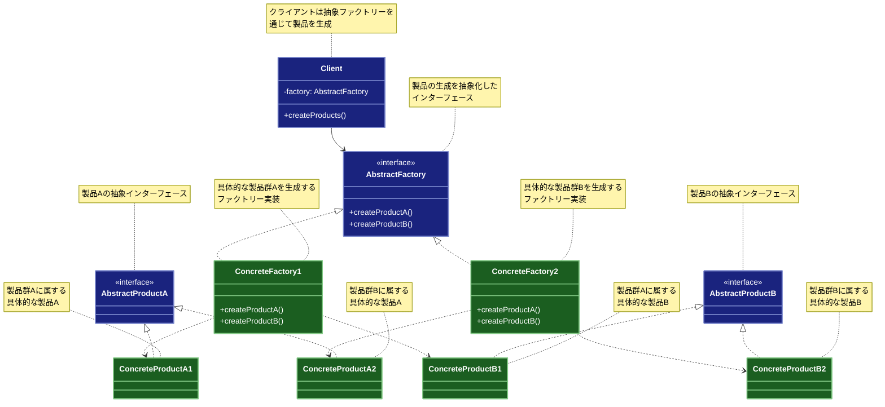

# Abstract Factory（抽象ファクトリー）パターン

## 目的

関連する一連のオブジェクト群を、その具体的なクラスを指定せずに生成するためのインターフェースを提供するパターンです。

## 価値・解決する問題

- 関連するオブジェクト群の一貫性を保証します
- 具象クラスへの依存を排除します
- 製品ファミリーの切り替えを容易にします
- コードの再利用性を高めます
- 拡張性を確保します

## 概要・特徴

### 概要

Abstract Factoryパターンは、関連する複数の製品（オブジェクト）をまとめて作成するためのインターフェースを提供する設計パターンです。例えば、UIコンポーネントを作成する場合、WindowsスタイルとMacスタイルのボタン、テキストボックス、チェックボックスなどを、それぞれのスタイルで一貫性を持って生成できます。このパターンにより、具体的な実装の詳細を隠蔽し、製品群の切り替えを容易にします。


### 特徴

#### 関連オブジェクトの一貫性

同じファミリーに属する製品群を確実に組み合わせて生成できます。例えば、WindowsのUIコンポーネントとMacのUIコンポーネントが混ざることを防ぎます。

#### 実装の隠蔽

クライアントコードは具体的な実装クラスを知る必要がなく、抽象インターフェースのみを通じて製品を生成できます。これにより実装の詳細から分離され、依存関係が減少します。

#### 製品ファミリーの管理

関連する製品群をファミリーとして一元管理できます。新しい製品ファミリーの追加も、既存のコードに影響を与えることなく行えます。

#### 柔軟な切り替え

実行時に異なる製品ファミリーへの切り替えが容易です。例えば、アプリケーションのテーマを動的に変更する際に有用です。

#### 高い拡張性

新しい種類の製品や製品ファミリーを追加する際に、既存のコードを変更することなく拡張できます。Open-Closed原則に従った設計が可能です。

### 概要図



## 類似パターンとの比較

- [Factory Method (ファクトリーメソッド)](factory-method.md): Abstract Factory は関連するオブジェクト群の生成を提供し、これに対して Factory Method は単一のオブジェクト生成に焦点を当てます。
- [Builder (ビルダー)](builder.md): Abstract Factory は関連するオブジェクト群の生成を提供し、これに対して Builder は複雑なオブジェクトの構築手順を定義します。
- [Prototype (プロトタイプ)](prototype.md): Abstract Factory は新しいインスタンスの生成を提供し、これに対して Prototype は既存のオブジェクトのクローンを作成します。

## 利用されているライブラリ／フレームワークの事例

- [Spring Framework](https://spring.io/): BeanFactory
- [Java AWT](https://docs.oracle.com/javase/8/docs/api/java/awt/package-summary.html): GUI Components
- [.NET Core](https://docs.microsoft.com/dotnet/core/): IServiceProvider

## 解説ページリンク

- [Refactoring Guru - Abstract Factory Pattern](https://refactoring.guru/design-patterns/abstract-factory)
- [SourceMaking - Abstract Factory Pattern](https://sourcemaking.com/design_patterns/abstract_factory)
- [Design Patterns - Abstract Factory Pattern](https://www.oodesign.com/abstract-factory-pattern.html)

## コード例

### Before:

直接的なUIコンポーネント生成による実装

```typescript
enum Theme {
  Light,
  Dark
}

class Button {
  constructor(private theme: Theme) {}

  render(): void {
    switch (this.theme) {
      case Theme.Light:
        console.log("ライトテーマのボタンを描画");
        break;
      case Theme.Dark:
        console.log("ダークテーマのボタンを描画");
        break;
    }
  }
}

class TextField {
  constructor(private theme: Theme) {}

  render(): void {
    switch (this.theme) {
      case Theme.Light:
        console.log("ライトテーマのテキストフィールドを描画");
        break;
      case Theme.Dark:
        console.log("ダークテーマのテキストフィールドを描画");
        break;
    }
  }
}

class Checkbox {
  constructor(private theme: Theme) {}

  render(): void {
    switch (this.theme) {
      case Theme.Light:
        console.log("ライトテーマのチェックボックスを描画");
        break;
      case Theme.Dark:
        console.log("ダークテーマのチェックボックスを描画");
        break;
    }
  }
}

// 使用例
const theme = Theme.Light;

const button = new Button(theme);
const textField = new TextField(theme);
const checkbox = new Checkbox(theme);

button.render();
textField.render();
checkbox.render();
```

### After:

Abstract Factoryパターンを適用した実装

```typescript
// 抽象製品インターフェース
interface Button {
  render(): void;
  onClick(handler: () => void): void;
}

interface TextField {
  render(): void;
  onInput(handler: (value: string) => void): void;
}

interface Checkbox {
  render(): void;
  onToggle(handler: (checked: boolean) => void): void;
}

// 抽象ファクトリーインターフェース
interface UIFactory {
  createButton(): Button;
  createTextField(): TextField;
  createCheckbox(): Checkbox;
}

// ライトテーマの具象製品
class LightButton implements Button {
  render(): void {
    console.log("ライトテーマのボタンを描画");
    console.log("- 背景色: 白");
    console.log("- テキスト色: 黒");
    console.log("- ボーダー: 薄いグレー");
  }

  onClick(handler: () => void): void {
    console.log("ライトテーマのボタンのクリックイベントを設定");
    handler();
  }
}

class LightTextField implements TextField {
  render(): void {
    console.log("ライトテーマのテキストフィールドを描画");
    console.log("- 背景色: 白");
    console.log("- テキスト色: 黒");
    console.log("- プレースホルダー色: グレー");
  }

  onInput(handler: (value: string) => void): void {
    console.log("ライトテーマのテキストフィールドの入力イベントを設定");
    handler("サンプルテキスト");
  }
}

class LightCheckbox implements Checkbox {
  render(): void {
    console.log("ライトテーマのチェックボックスを描画");
    console.log("- チェックマーク色: 黒");
    console.log("- ボックス背景: 白");
    console.log("- ボーダー: グレー");
  }

  onToggle(handler: (checked: boolean) => void): void {
    console.log("ライトテーマのチェックボックスのトグルイベントを設定");
    handler(true);
  }
}

// ダークテーマの具象製品
class DarkButton implements Button {
  render(): void {
    console.log("ダークテーマのボタンを描画");
    console.log("- 背景色: 濃いグレー");
    console.log("- テキスト色: 白");
    console.log("- ボーダー: 黒");
  }

  onClick(handler: () => void): void {
    console.log("ダークテーマのボタンのクリックイベントを設定");
    handler();
  }
}

class DarkTextField implements TextField {
  render(): void {
    console.log("ダークテーマのテキストフィールドを描画");
    console.log("- 背景色: 濃いグレー");
    console.log("- テキスト色: 白");
    console.log("- プレースホルダー色: 薄いグレー");
  }

  onInput(handler: (value: string) => void): void {
    console.log("ダークテーマのテキストフィールドの入力イベントを設定");
    handler("サンプルテキスト");
  }
}

class DarkCheckbox implements Checkbox {
  render(): void {
    console.log("ダークテーマのチェックボックスを描画");
    console.log("- チェックマーク色: 白");
    console.log("- ボックス背景: 濃いグレー");
    console.log("- ボーダー: 黒");
  }

  onToggle(handler: (checked: boolean) => void): void {
    console.log("ダークテーマのチェックボックスのトグルイベントを設定");
    handler(true);
  }
}

// 具象ファクトリー
class LightThemeFactory implements UIFactory {
  createButton(): Button {
    return new LightButton();
  }

  createTextField(): TextField {
    return new LightTextField();
  }

  createCheckbox(): Checkbox {
    return new LightCheckbox();
  }
}

class DarkThemeFactory implements UIFactory {
  createButton(): Button {
    return new DarkButton();
  }

  createTextField(): TextField {
    return new DarkTextField();
  }

  createCheckbox(): Checkbox {
    return new DarkCheckbox();
  }
}

// UIコンポーネントのクライアント
class Form {
  private button: Button;
  private textField: TextField;
  private checkbox: Checkbox;

  constructor(factory: UIFactory) {
    this.button = factory.createButton();
    this.textField = factory.createTextField();
    this.checkbox = factory.createCheckbox();
  }

  render(): void {
    console.log("=== フォームの描画を開始 ===");
    
    console.log("\n【ボタン】");
    this.button.render();
    this.button.onClick(() => {
      console.log("ボタンがクリックされました");
    });

    console.log("\n【テキストフィールド】");
    this.textField.render();
    this.textField.onInput((value) => {
      console.log(`入力値: ${value}`);
    });

    console.log("\n【チェックボックス】");
    this.checkbox.render();
    this.checkbox.onToggle((checked) => {
      console.log(`チェック状態: ${checked}`);
    });

    console.log("\n=== フォームの描画を完了 ===");
  }
}

// テーマ管理
class ThemeManager {
  private static instance: ThemeManager;
  private currentFactory: UIFactory;

  private constructor() {
    this.currentFactory = new LightThemeFactory();
  }

  static getInstance(): ThemeManager {
    if (!ThemeManager.instance) {
      ThemeManager.instance = new ThemeManager();
    }
    return ThemeManager.instance;
  }

  setTheme(isDark: boolean): void {
    this.currentFactory = isDark ? 
      new DarkThemeFactory() : 
      new LightThemeFactory();
    
    console.log(`テーマを${isDark ? 'ダーク' : 'ライト'}に変更しました`);
  }

  getFactory(): UIFactory {
    return this.currentFactory;
  }
}

// 使用例
async function example() {
  const themeManager = ThemeManager.getInstance();

  console.log("=== ライトテーマのテスト ===");
  themeManager.setTheme(false);
  const lightForm = new Form(themeManager.getFactory());
  lightForm.render();

  console.log("\n=== ダークテーマのテスト ===");
  themeManager.setTheme(true);
  const darkForm = new Form(themeManager.getFactory());
  darkForm.render();
}

// 実行
example().catch(console.error);
```

### 関数型プログラミングスタイルでのAbstract Factory実装:

```typescript
// 関数型プログラミングアプローチでのAbstract Factoryパターン

// 製品の型定義
type ButtonProps = {
  text: string
  isPrimary?: boolean
}

type TextFieldProps = {
  placeholder: string
  value: string
}

type CheckboxProps = {
  label: string
  checked: boolean
}

// UIコンポーネント関数型定義
type RenderFunction<T> = (props: T) => string
type EventHandler<T, R> = (props: T, callback: () => R) => R

// コンポーネントの型定義
type Button = {
  render: RenderFunction<ButtonProps>
  onClick: EventHandler<ButtonProps, void>
}

type TextField = {
  render: RenderFunction<TextFieldProps>
  onInput: EventHandler<TextFieldProps, string>
}

type Checkbox = {
  render: RenderFunction<CheckboxProps>
  onToggle: EventHandler<CheckboxProps, boolean>
}

// テーマの型定義
type ThemeColors = {
  primary: string
  secondary: string
  background: string
  text: string
  border: string
}

// UIファクトリの型定義
type UIFactory = {
  createButton: () => Button
  createTextField: () => TextField
  createCheckbox: () => Checkbox
  getThemeColors: () => ThemeColors
}

// テーマ固有のファクトリ関数

// ライトテーマのファクトリ関数
const createLightThemeFactory = (): UIFactory => {
  // テーマ固有の色
  const themeColors: ThemeColors = {
    primary: '#0077cc',
    secondary: '#e0e0e0',
    background: '#ffffff',
    text: '#222222',
    border: '#cccccc'
  }
  
  // ライトテーマのボタン
  const createButton = (): Button => ({
    render: (props) => {
      const style = props.isPrimary 
        ? `背景色: ${themeColors.primary}; テキスト色: 白` 
        : `背景色: ${themeColors.secondary}; テキスト色: ${themeColors.text}`
      return `ライトテーマのボタン[${props.text}] (${style})`
    },
    onClick: (props, callback) => {
      console.log(`ライトテーマのボタン[${props.text}]がクリックされました`)
      return callback()
    }
  })
  
  // ライトテーマのテキストフィールド
  const createTextField = (): TextField => ({
    render: (props) => {
      return `ライトテーマのテキストフィールド[${props.placeholder}] (値: ${props.value}) (背景色: ${themeColors.background}; テキスト色: ${themeColors.text})`
    },
    onInput: (props, callback) => {
      console.log(`ライトテーマのテキストフィールド[${props.placeholder}]に入力がありました`)
      return callback()
    }
  })
  
  // ライトテーマのチェックボックス
  const createCheckbox = (): Checkbox => ({
    render: (props) => {
      return `ライトテーマのチェックボックス[${props.label}] (${props.checked ? '✓' : '□'}) (背景色: ${themeColors.background}; ボーダー色: ${themeColors.border})`
    },
    onToggle: (props, callback) => {
      console.log(`ライトテーマのチェックボックス[${props.label}]が${props.checked ? 'チェック' : 'アンチェック'}されました`)
      return callback()
    }
  })
  
  // ファクトリオブジェクトを返却
  return {
    createButton,
    createTextField,
    createCheckbox,
    getThemeColors: () => ({ ...themeColors }) // イミュータブルにするため、コピーを返す
  }
}

// ダークテーマのファクトリ関数
const createDarkThemeFactory = (): UIFactory => {
  // テーマ固有の色
  const themeColors: ThemeColors = {
    primary: '#3390ff',
    secondary: '#444444',
    background: '#222222',
    text: '#ffffff',
    border: '#555555'
  }
  
  // ダークテーマのボタン
  const createButton = (): Button => ({
    render: (props) => {
      const style = props.isPrimary 
        ? `背景色: ${themeColors.primary}; テキスト色: 白` 
        : `背景色: ${themeColors.secondary}; テキスト色: ${themeColors.text}`
      return `ダークテーマのボタン[${props.text}] (${style})`
    },
    onClick: (props, callback) => {
      console.log(`ダークテーマのボタン[${props.text}]がクリックされました`)
      return callback()
    }
  })
  
  // ダークテーマのテキストフィールド
  const createTextField = (): TextField => ({
    render: (props) => {
      return `ダークテーマのテキストフィールド[${props.placeholder}] (値: ${props.value}) (背景色: ${themeColors.background}; テキスト色: ${themeColors.text})`
    },
    onInput: (props, callback) => {
      console.log(`ダークテーマのテキストフィールド[${props.placeholder}]に入力がありました`)
      return callback()
    }
  })
  
  // ダークテーマのチェックボックス
  const createCheckbox = (): Checkbox => ({
    render: (props) => {
      return `ダークテーマのチェックボックス[${props.label}] (${props.checked ? '✓' : '□'}) (背景色: ${themeColors.background}; ボーダー色: ${themeColors.border})`
    },
    onToggle: (props, callback) => {
      console.log(`ダークテーマのチェックボックス[${props.label}]が${props.checked ? 'チェック' : 'アンチェック'}されました`)
      return callback()
    }
  })
  
  // ファクトリオブジェクトを返却
  return {
    createButton,
    createTextField,
    createCheckbox,
    getThemeColors: () => ({ ...themeColors }) // イミュータブルにするため、コピーを返す
  }
}

// テーマの作成
const createThemeFactory = (isDark: boolean): UIFactory => {
  return isDark ? createDarkThemeFactory() : createLightThemeFactory()
}

// フォームを作成する関数
const createForm = (factory: UIFactory) => {
  // コンポーネントの作成
  const button = factory.createButton()
  const textField = factory.createTextField()
  const checkbox = factory.createCheckbox()
  const themeColors = factory.getThemeColors()
  
  // フォームの描画関数
  const renderForm = () => {
    console.log(`=== フォーム (テーマ色: ${themeColors.primary}) ===`)
    
    // ボタンの描画と操作
    const submitButtonProps: ButtonProps = { text: '送信', isPrimary: true }
    const cancelButtonProps: ButtonProps = { text: 'キャンセル', isPrimary: false }
    
    console.log(button.render(submitButtonProps))
    button.onClick(submitButtonProps, () => {
      console.log('フォームを送信します')
    })
    
    console.log(button.render(cancelButtonProps))
    button.onClick(cancelButtonProps, () => {
      console.log('キャンセルしました')
    })
    
    // テキストフィールドの描画と操作
    const nameFieldProps: TextFieldProps = { placeholder: '名前を入力', value: 'ユーザー1' }
    const emailFieldProps: TextFieldProps = { placeholder: 'メールアドレスを入力', value: 'user1@example.com' }
    
    console.log(textField.render(nameFieldProps))
    textField.onInput(nameFieldProps, () => '新しい名前')
    
    console.log(textField.render(emailFieldProps))
    textField.onInput(emailFieldProps, () => 'new.email@example.com')
    
    // チェックボックスの描画と操作
    const tosCheckboxProps: CheckboxProps = { label: '利用規約に同意する', checked: false }
    const newsletterCheckboxProps: CheckboxProps = { label: 'ニュースレターを受け取る', checked: true }
    
    console.log(checkbox.render(tosCheckboxProps))
    checkbox.onToggle(tosCheckboxProps, () => true)
    
    console.log(checkbox.render(newsletterCheckboxProps))
    checkbox.onToggle(newsletterCheckboxProps, () => false)
    
    console.log('=== フォーム終了 ===')
  }
  
  // フォームオブジェクトを返却
  return {
    render: renderForm
  }
}

// 関数型プログラミングスタイルでのサンプル
const functionalExample = () => {
  console.log('\n=== 関数型プログラミングスタイルでのAbstract Factoryパターン ===\n')
  
  // ライトテーマでのフォーム表示
  console.log('--- ライトテーマ ---')
  const lightFactory = createThemeFactory(false)
  const lightForm = createForm(lightFactory)
  lightForm.render()
  
  // ダークテーマでのフォーム表示
  console.log('\n--- ダークテーマ ---')
  const darkFactory = createThemeFactory(true)
  const darkForm = createForm(darkFactory)
  darkForm.render()
  
  // 動的なテーマ変更の例
  const userPreference = { darkMode: true }
  
  const renderUserInterface = (preferences: { darkMode: boolean }) => {
    console.log('\n--- ユーザー設定に基づいたテーマ ---')
    const themeFactory = createThemeFactory(preferences.darkMode)
    const userForm = createForm(themeFactory)
    userForm.render()
  }
  
  renderUserInterface(userPreference)
  
  // 設定変更
  userPreference.darkMode = false
  renderUserInterface(userPreference)
}

// 実行
functionalExample()
```
