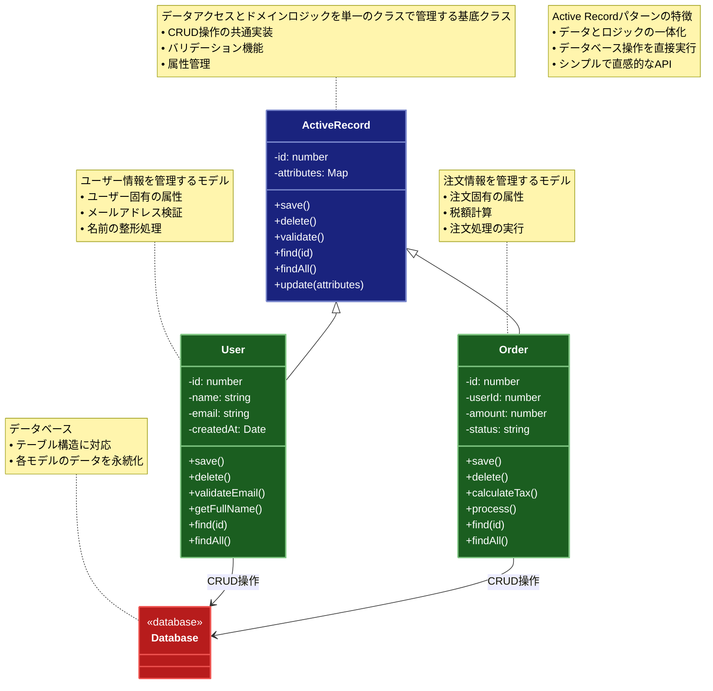

# Active Record

## 目的

データベースのテーブルやビューを、オブジェクト指向のクラスとしてカプセル化します。このパターンでは、データアクセスロジックとドメインロジックを同じクラスに統合します。

## 価値・解決する問題

- データベースの操作をオブジェクト指向的に扱える
- データアクセスとドメインロジックの統合による簡潔な実装
- CRUD 操作の標準化
- シンプルなドメインモデルに適した実装方法の提供

## 概要・特徴

### 概要

Active Record パターンは、データベースのテーブルやビューの各レコードをオブジェクトとして表現する設計パターンです。各モデルは自らの状態（データ）と振る舞い（ビジネスロジックおよび CRUD 操作）を内包しており、データアクセスとドメインロジックを単一のクラスで統合することにより、直感的な実装と迅速な開発を実現します。

### 特徴

#### データとロジックの統合

各モデルが対象テーブルのレコードに対応し、データの状態管理と振る舞いを一括して扱うため、コードの一貫性が保たれます。これにより、データとそれに関連する操作が密接に結びついた、求心的な設計が可能になります。

#### 標準化された CRUD 操作

CRUD 操作が統一されたインタフェースで実装されるため、データ操作がシンプルかつ標準化されます。これにより、開発者は共通のパターンでデータ操作を行うことができ、コードの可読性と保守性が向上します。

#### 迅速な開発と理解しやすさ

シンプルなビジネスロジックや小規模システムにおいては、迅速な開発と理解しやすい構造を提供します。データベースとオブジェクトの対応関係が明確で、直感的なAPIを通じてデータ操作が可能です。

#### 設計上の注意点

複雑なドメインロジックを扱う場合、モデルが肥大化しやすく、単一責任の原則から逸脱するリスクがあります。そのため、モデルの責務を適切に分割し、必要に応じて他のパターンと組み合わせることを検討する必要があります。
### 概要図



## 類似パターンとの比較

- [DAO (データアクセスオブジェクト)](dao.md): Active Record はデータアクセスとドメインロジックを統合し、これに対して DAO はデータアクセスロジックを分離します。
- [Repository (リポジトリ)](repository.md): Active Record は単一のテーブルに対する操作を統合し、これに対して Repository は複数のテーブルやデータソースを抽象化します。

## 利用されているライブラリ／フレームワークの事例

- [Ruby on Rails](https://rubyonrails.org/): Active Record パターンを採用した代表的な Web フレームワーク
- [Laravel](https://laravel.com/): PHP フレームワークで、Eloquent ORM として Active Record パターンを実装
- [Sequelize](https://sequelize.org/): Node.js の ORM で、Active Record パターンを採用
- [Django](https://www.djangoproject.com/): Python の Web フレームワークで、モデルクラスに Active Record パターンを採用

## 解説ページリンク

- [Refactoring Guru: Active Record パターン](https://refactoring.guru/design-patterns/active-record)  
  - 図解と実例を用いて、アクティブレコードパターンの基本構造や利用方法を丁寧に解説しています。

- [Wikipedia: アクティブレコード](https://ja.wikipedia.org/wiki/Active_Record)  
  - パターンの定義、歴史的背景、および他のデザインパターンとの比較がシンプルにまとめられています。

- [SourceMaking: Active Record](https://sourcemaking.com/design_patterns/active_record)  
  - アクティブレコードパターンの実装例、メリット・デメリット、利用ケースについて具体的に解説しています。

- [Ruby on Rails Guides: Active Record Basics](https://guides.rubyonrails.org/active_record_basics.html)  
  - Ruby on Railsの公式ガイドで、Active Recordの基本概念と具体的な使用例が詳しく紹介されています。

- [Laravel: Eloquent ORM](https://laravel.com/docs/8.x/eloquent)  
  - Laravelの公式ドキュメントにより、Eloquent ORMとしてのActive Record実装の概要や利用方法が学べます。

## コード例

### Before:

単純なデータベース操作の実装

```typescript
"use strict";

async function createUser(name: string, email: string): Promise<void> {
  const connection = await database.connect();
  try {
    await connection.query("INSERT INTO users (name, email) VALUES (?, ?)", [
      name,
      email,
    ]);
  } finally {
    await connection.close();
  }
}

async function findUser(id: number): Promise<any> {
  const connection = await database.connect();
  try {
    const result = await connection.query("SELECT * FROM users WHERE id = ?", [
      id,
    ]);
    return result.rows[0];
  } finally {
    await connection.close();
  }
}
```

### After:

Active Record パターンを利用した実装

```typescript
"use strict";

class User {
  id: number;
  name: string;
  email: string;
  private static tableName = "users";

  constructor(data: {id?: number; name: string; email: string}) {
    this.id = data.id;
    this.name = data.name;
    this.email = data.email;
  }

  // データベースからの取得メソッド
  static async find(id: number): Promise<User | null> {
    const connection = await database.connect();
    try {
      const result = await connection.query(
        `SELECT * FROM ${this.tableName} WHERE id = ?`,
        [id]
      );
      if (result.rows.length === 0) return null;
      return new User(result.rows[0]);
    } finally {
      await connection.close();
    }
  }

  static async findAll(): Promise<User[]> {
    const connection = await database.connect();
    try {
      const result = await connection.query(`SELECT * FROM ${this.tableName}`);
      return result.rows.map((row) => new User(row));
    } finally {
      await connection.close();
    }
  }

  // インスタンスメソッド
  async save(): Promise<void> {
    const connection = await database.connect();
    try {
      if (this.id) {
        // 更新
        await connection.query(
          `UPDATE ${User.tableName} SET name = ?, email = ? WHERE id = ?`,
          [this.name, this.email, this.id]
        );
      } else {
        // 新規作成
        const result = await connection.query(
          `INSERT INTO ${User.tableName} (name, email) VALUES (?, ?)`,
          [this.name, this.email]
        );
        this.id = result.insertId;
      }
    } finally {
      await connection.close();
    }
  }

  async delete(): Promise<void> {
    if (!this.id) return;

    const connection = await database.connect();
    try {
      await connection.query(`DELETE FROM ${User.tableName} WHERE id = ?`, [
        this.id,
      ]);
    } finally {
      await connection.close();
    }
  }

  // ドメインロジック
  isValidEmail(): boolean {
    return /^[^\s@]+@[^\s@]+\.[^\s@]+$/.test(this.email);
  }

  getFullDetails(): string {
    return `${this.name} (${this.email})`;
  }
}

// 使用例
async function example() {
  // 新規ユーザーの作成と保存
  const user = new User({
    name: "John Doe",
    email: "john@example.com",
  });

  if (user.isValidEmail()) {
    await user.save();
    console.log("ユーザーを保存しました:", user.getFullDetails());
  }

  // ユーザーの検索
  const foundUser = await User.find(1);
  if (foundUser) {
    console.log("ユーザーが見つかりました:", foundUser.getFullDetails());

    // ユーザー情報の更新
    foundUser.name = "John Smith";
    await foundUser.save();

    // ユーザーの削除
    await foundUser.delete();
  }

  // 全ユーザーの取得
  const allUsers = await User.findAll();
  console.log("全ユーザー数:", allUsers.length);
}
```

