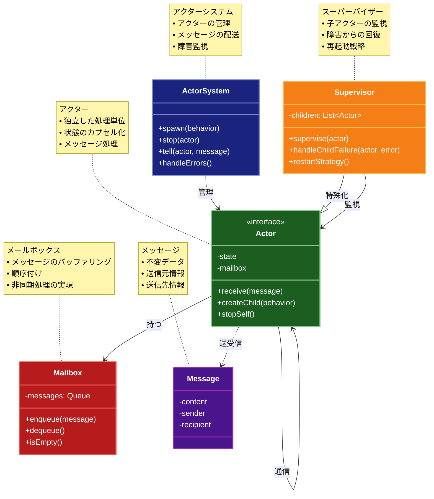

# Actor Model（アクターモデル）

## 目的

Actor Model は、並行処理を効率的に扱うためのモデルであり、状態を持たない小さな計算単位（アクター）同士がメッセージパッシングによって通信することで、並列・非同期処理を実現するパターンです。

## 価値・解決する問題

- 各アクターが独立して状態を管理するため、競合状態やロックの問題を回避できる
- 並行処理の複雑性をシンプルなメッセージパッシングにより解消
- 柔軟なスケーラビリティと高い障害耐性を実現

## 概要・特徴

### 概要

アクターモデルは、並行計算を行うための数学的モデルであり、「アクター」と呼ばれる独立した計算単位がメッセージ交換を通じて通信する設計パターンです。各アクターは独自の状態を持ち、外部からは直接アクセスできません。

### 特徴

#### メッセージパッシングに基づく通信
アクターモデルの基本原則として、アクター間の直接的な状態共有は行わず、すべての通信はメッセージパッシングを通じて実行されます。これにより、各アクターは完全に独立して動作し、共有状態に起因する競合状態やデッドロックなどの並行処理の問題を根本的に回避できます。メッセージは不変オブジェクト（イミュータブル）として実装されることが多く、送信側アクターから受信側アクターへの片方向通信として処理されます。この非同期通信モデルにより、システム全体のスケーラビリティが向上し、異なるマシンやネットワークにまたがるアクター間の透過的な通信が可能になります。例えば、分散システムにおいても同じメッセージングパターンを使用できるため、アプリケーションの拡張性と柔軟性が大幅に向上します。

#### アクターごとの独立した状態管理
各アクターは自身の状態を完全に管理し、外部からの直接アクセスを許可しません。アクターの内部状態は、受信したメッセージに応じてのみ変更され、常に一度に1つのメッセージのみを処理するため、状態の一貫性が自然に保たれます。これにより、複数のスレッドやプロセスから同時にアクセスされる共有メモリの問題が解消され、並行処理のシステムでも堅牢な状態管理が実現します。また、この独立した状態管理は、アクター単位でのテストを容易にし、システム全体の保守性を向上させます。障害が発生した場合も、影響は個々のアクターに限定されるため、システム全体の耐障害性が高まります。

#### 非同期処理モデル
アクターモデルは本質的に非同期処理を前提としており、メッセージの送信はノンブロッキング操作です。送信側アクターはメッセージを送信した後、即座に次の処理に移ることができます。各アクターは独自のメールボックス（メッセージキュー）を持ち、受信したメッセージを順次処理します。この非同期処理モデルにより、システムのスループットとレスポンス性が向上し、限られたリソースで効率的な並行処理が可能になります。また、非同期処理はバックプレッシャーの実装や負荷分散などの高度な並行処理パターンの基盤となり、大規模なシステムでも安定したパフォーマンスを維持できるようになります。

#### 位置透過性（Location Transparency）
アクターモデルの重要な特性として、アクターの物理的な配置に関係なく同じ方法で通信できる位置透過性があります。アクターが同じプロセス内、異なるプロセス、あるいは全く別のマシン上にあっても、アクターへのメッセージ送信は同じインターフェースを通じて行われます。これにより、分散システムの複雑さを隠蔽し、システムのスケールアウトやデプロイメント構成の変更が容易になります。また、位置透過性は障害シナリオでのアクター再配置やロードバランシングなどの運用管理を簡素化し、クラウド環境や大規模分散システムでの弾力的な運用を可能にします。

#### 障害の局所化と回復
アクターモデルには「監視（Supervision）」という概念があり、親アクターが子アクターの障害を検出して対応する階層的な障害管理メカニズムを提供します。これにより、障害の影響を局所化し、システム全体に波及するのを防ぎます。障害が発生した場合、監視アクターは子アクターの再起動、停止、あるいは他の戦略を適用して回復を試みることができます。この「失敗を想定した設計（Design for Failure）」の考え方は、特に長時間稼働する分散システムにおいて重要であり、部分的な障害が発生しても全体のサービスを継続できる高い可用性を実現します。さらに、障害の伝播パターンを明示的に設計できるため、システムの挙動をより予測可能にします。

### 概要図



## コード例

### Before:

従来の同期的な関数呼び出しや共有状態を用いた処理例

```typescript
"use strict";

class Counter {
  private count: number = 0;

  increment(): void {
    this.count += 1;
    console.log("カウント: " + this.count);
  }
}

const counter = new Counter();
counter.increment();
counter.increment();
```

### After:

Actor Model を利用して並行処理とメッセージパッシングを実現した例。各アクターは独自の状態を持ち、メッセージに基づいて動作する。

```typescript
"use strict";

type Message =
  | {type: "increment"}
  | {type: "getCount"; replyTo: (count: number) => void};

class Actor {
  private mailbox: Message[] = [];
  private processing: boolean = false;

  // 受信したメッセージをMailboxに追加
  send(message: Message): void {
    this.mailbox.push(message);
    this.processMessages();
  }

  // メッセージを処理する
  private async processMessages(): Promise<void> {
    if (this.processing) return;
    this.processing = true;
    while (this.mailbox.length > 0) {
      const message = this.mailbox.shift();
      if (message) {
        await this.receive(message);
      }
    }
    this.processing = false;
  }

  // 各アクターはこのメソッドをオーバーライドして動作を定義する
  protected async receive(message: Message): Promise<void> {
    // デフォルトは何も行わない
  }
}

class CounterActor extends Actor {
  private count: number = 0;

  protected async receive(message: Message): Promise<void> {
    switch (message.type) {
      case "increment":
        this.count += 1;
        console.log("カウント: " + this.count);
        break;
      case "getCount":
        message.replyTo(this.count);
        break;
    }
  }
}

const counterActor = new CounterActor();
counterActor.send({type: "increment"});
counterActor.send({type: "increment"});
counterActor.send({
  type: "getCount",
  replyTo: (count) => console.log("最終カウント: " + count),
});
```

## 類似パターンとの比較

- スレッドやプロセスベースの並行処理と比べ、Actor Model はメッセージパッシングによりシンプルな並行処理を実現します。

## 利用されているライブラリ／フレームワークの事例

- [Akka](https://akka.io/): Scala/Java 向けの Actor Model 実装フレームワーク
- [Microsoft Orleans](https://learn.microsoft.com/ja-jp/dotnet/orleans/): .NET プラットフォーム向けの分散アプリケーションフレームワーク
- [Erlang/OTP](https://www.erlang.org/): Actor Model を基本とした並行処理プログラミング言語とフレームワーク
