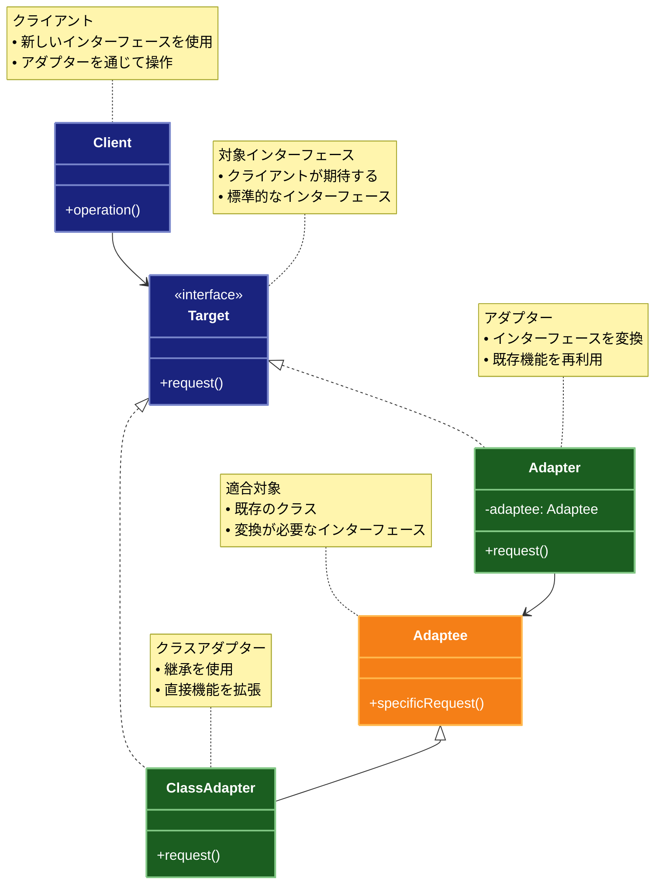

# Adapter（アダプター）パターン

## 目的

互換性のないインターフェースを持つクラス同士を協調動作させることを可能にします。

## 価値・解決する問題

- 既存のクラスを修正せずに新しいインターフェースで利用できます
- 互換性のないシステム間の連携を実現します
- レガシーコードの再利用を促進します
- インターフェースの変換を透過的に行います
- システムの結合度を低減します

## 概要・特徴

### 概要

アダプターパターンは、既存のクラスのインターフェースを、クライアントが期待する別のインターフェースに変換する設計パターンです。このパターンを使用することで、互換性のないインターフェースを持つクラス同士が連携して動作することが可能になり、既存のコードを変更せずに新しいシステムと統合できます。

アダプターパターンは、GOF（Gang of Four）の構造パターンの一つで、実世界の電源アダプターや言語翻訳者の概念に似ています。このパターンは特にシステム統合、レガシーシステムのモダナイゼーション、サードパーティライブラリの統合などの文脈で広く使用されています。ソフトウェア開発において、まったく新しいコードを書くよりも既存のコードを活用する方が効率的であるという原則に基づいており、「車輪の再発明」を避けることを可能にします。

アダプターパターンには主に2つの実装バリエーションがあります：
1. **オブジェクトアダプター**: コンポジション（委譲）を使用して既存のクラスを新しいインターフェースに適合させる方法
2. **クラスアダプター**: 多重継承（言語がサポートする場合）を使用して既存のクラスと新しいインターフェースの両方を継承する方法

実際の業界では、オブジェクトアダプターがより一般的に使用されています。これは柔軟性が高く、多くのプログラミング言語で実装できるためです。

### 特徴

#### インターフェースの変換

互換性のないインターフェース間の橋渡しをします。クライアントが期待するインターフェースと既存のクラスが提供するインターフェースの違いを吸収し、両者を接続します。これにより、元々一緒に動作するよう設計されていないクラス同士を連携させることができます。

インターフェース変換の主要な技術には以下があります：

- **メソッド名の変換**: 単純な場合、メソッド名を変換するだけで適合可能です（例：`pushData()` → `sendInfo()`）
- **パラメータの変換**: パラメータの型や順序、数が異なる場合に変換を行います
- **戻り値の変換**: 異なる戻り値の型や形式を期待される形式に変換します
- **例外処理の変換**: 異なる例外体系を統一された形式に変換します
- **非同期モデルの変換**: コールバックベースの処理をPromise/Future/Taskベースに変換するなど

特に外部APIやレガシーシステムとの統合では、単純なメソッド名の変換だけでなく、データ構造全体の変換やプロトコルレベルの変換が必要になることもあります。これらの複雑な変換も、アダプターパターンの応用として実装できます。

#### 既存コードの再利用

レガシーコードや外部ライブラリなど、変更が難しい既存のコードをそのまま活用できます。アダプターが中間層として機能することで、既存のコードを修正することなく新しいシステムに統合できます。これにより開発コストとリスクを低減できます。

コード再利用の典型的なシナリオ：

- **レガシーシステムの統合**: 古いシステムを修正せずに新しいシステムと連携させる
- **サードパーティライブラリの活用**: 外部ライブラリを自社の標準インターフェースに適合させる
- **異なるバージョン間の互換性確保**: APIの新旧バージョン間の互換性を維持する
- **テスト容易性の向上**: テスト困難なコードの前にアダプターを置くことでテスト可能にする
- **ドメイン固有インターフェースの提供**: 汎用的なコンポーネントをドメイン固有の用語で操作できるようにする

特に複雑なレガシーシステムとの統合では、アダプターパターンはしばしば「Anti-Corruption Layer（腐敗防止層）」として実装され、新旧システム間の明確な境界と変換を提供します。

#### 透過的な連携

クライアントが異なるインターフェースや実装の詳細を意識する必要がなくなります。アダプターはインターフェースの差異を隠蔽し、クライアントが一貫した方法でさまざまなクラスとやり取りすることを可能にします。これにより、クライアントコードの単純化と保守性の向上を実現します。

透過的連携がもたらすメリット：

- **クライアントコードの単純化**: 複雑な変換ロジックをクライアントから分離
- **関心の分離**: インターフェース変換の責任を明確に分離
- **一貫性のある操作**: 異なる実装に対して同じインターフェースを提供
- **将来の変更への対応**: 実装が変わっても、クライアントコードは変更不要
- **スムーズな移行**: 古いシステムから新しいシステムへの段階的な移行を可能に

大規模システムでは、この透過性によりシステム全体の理解が容易になり、開発者が頭の中でモデル化しなければならない複雑さが減少します。

#### 柔軟な拡張性

システムの拡張性が高まります。新しいアダプターを追加することで、互換性のない新しいクラスやライブラリを既存のシステムに統合できます。これにより、将来的な要件変更や技術更新に柔軟に対応できるようになります。

拡張性を高める実践：

- **アダプターファミリーの作成**: 共通インターフェースに適合する複数のアダプターを用意
- **アダプター自動選択メカニズム**: 状況に応じて適切なアダプターを選択するファクトリを実装
- **拡張点の明確化**: 新しいアダプターを追加すべき箇所を設計上明確にする
- **設定駆動アダプター**: 設定ファイルなどから動的にアダプターを構成可能にする
- **プラグインアーキテクチャ**: アダプターをプラグインとして動的に読み込み可能にする

複数のデータソースや外部システムと連携するアプリケーションでは、各連携先ごとに専用のアダプターを実装することで、メインロジックを変更せずにサポート対象を拡大できます。

#### 結合度の低減

システムコンポーネント間の直接的な依存関係を減らします。アダプターが仲介役となることで、コンポーネント間の結合度が低下し、各部分の独立性が高まります。これにより、コードの保守性と再利用性が向上します。

結合度低減の効果：

- **モジュール間の独立性向上**: 一方のモジュール変更が他方に影響しにくくなる
- **テスト容易性の向上**: モジュールを個別にテスト可能になる
- **並行開発の促進**: 異なるチームが独立して開発できる
- **変更の局所化**: システム変更の影響範囲を限定できる
- **部分的な置き換え**: システムの一部だけを安全に置き換え可能になる

マイクロサービスアーキテクチャなど、分散システムにおいても、サービス間の直接依存を減らすためにアダプターパターンが活用されます。

#### 実装バリエーションの詳細

アダプターパターンには主に2つの実装アプローチがあり、それぞれに長所と短所があります：

**1. オブジェクトアダプター（コンポジションベース）**
- **メカニズム**: 適合対象オブジェクトをアダプター内にフィールドとして保持
- **長所**: 単一継承言語でも実装可能、実行時に適合対象を変更可能
- **短所**: すべてのリクエストが転送されるため、若干のオーバーヘッドが生じる
- **適用場面**: 柔軟性が求められる場合、適合対象が動的に変わる可能性がある場合

**2. クラスアダプター（継承ベース）**
- **メカニズム**: アダプターが目標インターフェースと適合対象クラスの両方を継承
- **長所**: 適合対象のメソッドを直接オーバーライド可能、委譲のオーバーヘッドなし
- **短所**: 多重継承をサポートする言語でのみ実装可能、静的な関係しか表現できない
- **適用場面**: パフォーマンスが重要な場合、適合対象の振る舞いを一部変更したい場合

**3. デフォルトアダプター（Default Adapter）**
- **メカニズム**: インターフェースのデフォルト実装を提供し、必要なメソッドだけをオーバーライド
- **長所**: 大きなインターフェースの一部だけを実装する際の労力削減
- **適用場面**: 多くのメソッドを持つインターフェースで、一部のメソッドしか使用しない場合

#### 使用時の注意点

アダプターパターンは非常に有用ですが、適切に使用しないと問題を引き起こす可能性があります：

- **複雑性の増加**: アダプターの導入自体がシステムに新たな層を追加するため、適切なドキュメント化が必要
- **パフォーマンスへの影響**: 追加の間接レイヤーによる性能低下の可能性があり、クリティカルパスでは注意が必要
- **変換時の情報損失**: インターフェース間で完全な1対1マッピングができないケースへの対処が必要
- **アダプターの過剰使用**: 本来設計を見直すべき場合にアダプターで対処してしまい、技術的負債の増加を招く可能性
- **テスト戦略**: アダプター自体と、アダプターを介した統合の両方をテストする必要がある

これらの問題を軽減するためには、アダプターの責任を明確に定義し、単一責任の原則に従って設計すること、また適切なテストカバレッジを確保することが重要です。

### 概要図



## 類似パターンとの比較

- [Bridge (ブリッジ)](bridge.md): Adapter は既存のインターフェースを変換し、これに対して Bridge は実装を抽象化から分離します。
- [Decorator (デコレーター)](decorator.md): Adapter はインターフェースを変換し、これに対して Decorator は機能を追加します。
- [Proxy (プロキシ)](proxy.md): Adapter はインターフェースを変換し、これに対して Proxy はアクセスを制御します。

## 利用されているライブラリ／フレームワークの事例

- [TypeScript Type Definitions](https://www.typescriptlang.org/docs/handbook/declaration-files/introduction.html): JavaScript ライブラリの型定義
- [Java Database Connectivity](https://docs.oracle.com/javase/8/docs/technotes/guides/jdbc/): データベース接続の抽象化
- [React Adapters](https://reactjs.org/docs/test-utils.html): テストユーティリティ

## 解説ページリンク

- [Refactoring Guru - Adapter Pattern](https://refactoring.guru/design-patterns/adapter)
- [SourceMaking - Adapter Pattern](https://sourcemaking.com/design_patterns/adapter)
- [Design Patterns - Adapter Pattern](https://www.oodesign.com/adapter-pattern.html)

## コード例

### Before:

互換性のないインターフェースを直接使用する実装

```typescript
// レガシーな支払い処理システム
class LegacyPaymentProcessor {
  processPayment(amount: number, currency: string): void {
    console.log(`レガシーシステムで${currency}${amount}の支払いを処理`);
  }

  validatePayment(amount: number): boolean {
    return amount > 0 && amount < 1000000;
  }
}

// 新しい支払い処理システム
interface ModernPaymentGateway {
  pay(paymentData: {
    amount: number;
    currency: string;
    description: string;
  }): void;
}

// クライアントコード
class PaymentService {
  private legacyProcessor = new LegacyPaymentProcessor();

  processPayment(amount: number, currency: string): void {
    if (this.legacyProcessor.validatePayment(amount)) {
      this.legacyProcessor.processPayment(amount, currency);
    } else {
      throw new Error("無効な支払い金額です");
    }
  }
}

// 使用例
const paymentService = new PaymentService();
paymentService.processPayment(100, "USD");
```

### After:

アダプターパターンを適用した実装

```typescript
// 既存のレガシーシステム
class LegacyPaymentProcessor {
  processPayment(amount: number, currency: string): void {
    console.log(`レガシーシステムで${currency}${amount}の支払いを処理`);
  }

  validatePayment(amount: number): boolean {
    return amount > 0 && amount < 1000000;
  }

  getTransactionFee(amount: number): number {
    return amount * 0.02; // 2%の手数料
  }
}

// 新しい決済システムのインターフェース
interface ModernPaymentGateway {
  pay(paymentData: PaymentData): PaymentResult;
  validateTransaction(paymentData: PaymentData): ValidationResult;
  calculateFees(paymentData: PaymentData): FeeStructure;
}

// データ型の定義
interface PaymentData {
  amount: number;
  currency: string;
  description?: string;
  metadata?: Record<string, unknown>;
}

interface PaymentResult {
  success: boolean;
  transactionId: string;
  timestamp: Date;
  error?: string;
}

interface ValidationResult {
  isValid: boolean;
  errors: string[];
}

interface FeeStructure {
  baseFee: number;
  processingFee: number;
  totalFee: number;
}

// クラスアダプター（継承を使用）
class PaymentProcessorAdapter extends LegacyPaymentProcessor implements ModernPaymentGateway {
  pay(paymentData: PaymentData): PaymentResult {
    try {
      if (this.validateTransaction(paymentData).isValid) {
        this.processPayment(paymentData.amount, paymentData.currency);
        return {
          success: true,
          transactionId: this.generateTransactionId(),
          timestamp: new Date()
        };
      } else {
        return {
          success: false,
          transactionId: "",
          timestamp: new Date(),
          error: "支払いの検証に失敗しました"
        };
      }
    } catch (error) {
      return {
        success: false,
        transactionId: "",
        timestamp: new Date(),
        error: error instanceof Error ? error.message : "不明なエラーが発生しました"
      };
    }
  }

  validateTransaction(paymentData: PaymentData): ValidationResult {
    const errors: string[] = [];

    if (!this.validatePayment(paymentData.amount)) {
      errors.push("無効な支払い金額です");
    }

    if (!this.validateCurrency(paymentData.currency)) {
      errors.push("無効な通貨です");
    }

    return {
      isValid: errors.length === 0,
      errors
    };
  }

  calculateFees(paymentData: PaymentData): FeeStructure {
    const baseFee = this.getTransactionFee(paymentData.amount);
    const processingFee = this.calculateProcessingFee(paymentData);

    return {
      baseFee,
      processingFee,
      totalFee: baseFee + processingFee
    };
  }

  private validateCurrency(currency: string): boolean {
    const supportedCurrencies = ["USD", "EUR", "JPY"];
    return supportedCurrencies.includes(currency);
  }

  private calculateProcessingFee(paymentData: PaymentData): number {
    // 通貨によって異なる処理手数料を計算
    switch (paymentData.currency) {
      case "USD":
        return 1.0;
      case "EUR":
        return 0.8;
      case "JPY":
        return 100;
      default:
        return 0;
    }
  }

  private generateTransactionId(): string {
    return `TXN-${Date.now()}-${Math.random().toString(36).substr(2, 9)}`;
  }
}

// オブジェクトアダプター（委譲を使用）
class PaymentGatewayAdapter implements ModernPaymentGateway {
  constructor(private legacyProcessor: LegacyPaymentProcessor) {}

  pay(paymentData: PaymentData): PaymentResult {
    try {
      if (this.validateTransaction(paymentData).isValid) {
        this.legacyProcessor.processPayment(paymentData.amount, paymentData.currency);
        return {
          success: true,
          transactionId: this.generateTransactionId(),
          timestamp: new Date()
        };
      } else {
        return {
          success: false,
          transactionId: "",
          timestamp: new Date(),
          error: "支払いの検証に失敗しました"
        };
      }
    } catch (error) {
      return {
        success: false,
        transactionId: "",
        timestamp: new Date(),
        error: error instanceof Error ? error.message : "不明なエラーが発生しました"
      };
    }
  }

  validateTransaction(paymentData: PaymentData): ValidationResult {
    const errors: string[] = [];

    if (!this.legacyProcessor.validatePayment(paymentData.amount)) {
      errors.push("無効な支払い金額です");
    }

    if (!this.validateCurrency(paymentData.currency)) {
      errors.push("無効な通貨です");
    }

    return {
      isValid: errors.length === 0,
      errors
    };
  }

  calculateFees(paymentData: PaymentData): FeeStructure {
    const baseFee = this.legacyProcessor.getTransactionFee(paymentData.amount);
    const processingFee = this.calculateProcessingFee(paymentData);

    return {
      baseFee,
      processingFee,
      totalFee: baseFee + processingFee
    };
  }

  private validateCurrency(currency: string): boolean {
    const supportedCurrencies = ["USD", "EUR", "JPY"];
    return supportedCurrencies.includes(currency);
  }

  private calculateProcessingFee(paymentData: PaymentData): number {
    switch (paymentData.currency) {
      case "USD":
        return 1.0;
      case "EUR":
        return 0.8;
      case "JPY":
        return 100;
      default:
        return 0;
    }
  }

  private generateTransactionId(): string {
    return `TXN-${Date.now()}-${Math.random().toString(36).substr(2, 9)}`;
  }
}

// 新しい決済サービス
class ModernPaymentService {
  constructor(private paymentGateway: ModernPaymentGateway) {}

  async processPayment(amount: number, currency: string, description?: string): Promise<void> {
    const paymentData: PaymentData = {
      amount,
      currency,
      description,
      metadata: {
        processedAt: new Date(),
        source: "ModernPaymentService"
      }
    };

    // 手数料の計算
    const fees = this.paymentGateway.calculateFees(paymentData);
    console.log("手数料構造:", fees);

    // 取引の検証
    const validation = this.paymentGateway.validateTransaction(paymentData);
    if (!validation.isValid) {
      throw new Error(`支払いの検証に失敗しました: ${validation.errors.join(", ")}`);
    }

    // 支払いの実行
    const result = this.paymentGateway.pay(paymentData);
    if (!result.success) {
      throw new Error(`支払い処理に失敗しました: ${result.error}`);
    }

    console.log(`取引成功 - ID: ${result.transactionId}`);
  }
}

// 使用例
function example() {
  console.log("=== クラスアダプターの使用 ===");
  const classAdapter = new PaymentProcessorAdapter();
  const modernService1 = new ModernPaymentService(classAdapter);

  console.log("\n--- 正常な取引 ---");
  modernService1.processPayment(100, "USD", "テスト決済1")
    .catch(error => console.error("エラー:", error.message));

  console.log("\n--- 無効な取引 ---");
  modernService1.processPayment(-50, "EUR", "テスト決済2")
    .catch(error => console.error("エラー:", error.message));

  console.log("\n=== オブジェクトアダプターの使用 ===");
  const legacyProcessor = new LegacyPaymentProcessor();
  const objectAdapter = new PaymentGatewayAdapter(legacyProcessor);
  const modernService2 = new ModernPaymentService(objectAdapter);

  console.log("\n--- 正常な取引 ---");
  modernService2.processPayment(200, "JPY", "テスト決済3")
    .catch(error => console.error("エラー:", error.message));

  console.log("\n--- 無効な通貨での取引 ---");
  modernService2.processPayment(150, "GBP", "テスト決済4")
    .catch(error => console.error("エラー:", error.message));
}

// 実行
example();
```

```typescript
// Adapterパターンを関数型プログラミングスタイルで適用した実装

// レガシーなシステムの関数群
type LegacyPaymentSystem = {
  processPayment: (amount: number, currency: string) => void
  validatePayment: (amount: number) => boolean
  getTransactionFee: (amount: number) => number
}

// 新しいシステムが期待するインターフェースの型定義
type PaymentData = Readonly<{
  amount: number
  currency: string
  description?: string
  metadata?: Readonly<Record<string, unknown>>
}>

type PaymentResult = Readonly<{
  success: boolean
  transactionId: string
  timestamp: Date
  error?: string
}>

type ValidationResult = Readonly<{
  isValid: boolean
  errors: ReadonlyArray<string>
}>

type FeeStructure = Readonly<{
  baseFee: number
  processingFee: number
  totalFee: number
}>

type ModernPaymentSystem = {
  pay: (paymentData: PaymentData) => PaymentResult
  validateTransaction: (paymentData: PaymentData) => ValidationResult
  calculateFees: (paymentData: PaymentData) => FeeStructure
}

// レガシーシステムの実装
const createLegacyPaymentSystem = (): LegacyPaymentSystem => ({
  processPayment: (amount: number, currency: string): void => {
    console.log(`レガシーシステムで${currency}${amount}の支払いを処理`)
  },
  
  validatePayment: (amount: number): boolean => {
    return amount > 0 && amount < 1000000
  },
  
  getTransactionFee: (amount: number): number => {
    return amount * 0.02 // 2%の手数料
  }
})

// 関数型アダプターの作成
const createPaymentSystemAdapter = (legacySystem: LegacyPaymentSystem): ModernPaymentSystem => {
  // 通貨の検証
  const validateCurrency = (currency: string): boolean => {
    const supportedCurrencies = ['USD', 'EUR', 'JPY']
    return supportedCurrencies.includes(currency)
  }
  
  // 処理手数料の計算
  const calculateProcessingFee = (currency: string): number => {
    switch (currency) {
      case 'USD':
        return 1.0
      case 'EUR':
        return 0.8
      case 'JPY':
        return 100
      default:
        return 0
    }
  }
  
  // トランザクションIDの生成
  const generateTransactionId = (): string => {
    return `TXN-${Date.now()}-${Math.random().toString(36).substr(2, 9)}`
  }
  
  // 現代的なシステムのインターフェースを実装
  return {
    // 支払い処理
    pay: (paymentData: PaymentData): PaymentResult => {
      try {
        const validation = validateTransaction(paymentData)
        
        if (!validation.isValid) {
          return {
            success: false,
            transactionId: '',
            timestamp: new Date(),
            error: '支払いの検証に失敗しました'
          }
        }
        
        // レガシーシステムに処理を委譲
        legacySystem.processPayment(paymentData.amount, paymentData.currency)
        
        return {
          success: true,
          transactionId: generateTransactionId(),
          timestamp: new Date()
        }
      } catch (error) {
        return {
          success: false,
          transactionId: '',
          timestamp: new Date(),
          error: error instanceof Error ? error.message : '不明なエラーが発生しました'
        }
      }
    },
    
    // 取引の検証
    validateTransaction: validateTransaction,
    
    // 手数料の計算
    calculateFees: (paymentData: PaymentData): FeeStructure => {
      const baseFee = legacySystem.getTransactionFee(paymentData.amount)
      const processingFee = calculateProcessingFee(paymentData.currency)
      
      return {
        baseFee,
        processingFee,
        totalFee: baseFee + processingFee
      }
    }
  }
  
  // 取引の検証（クロージャを利用）
  function validateTransaction(paymentData: PaymentData): ValidationResult {
    const errors: string[] = []
    
    if (!legacySystem.validatePayment(paymentData.amount)) {
      errors.push('無効な支払い金額です')
    }
    
    if (!validateCurrency(paymentData.currency)) {
      errors.push('無効な通貨です')
    }
    
    return {
      isValid: errors.length === 0,
      errors
    }
  }
}

// 決済処理サービス（純粋関数）
const processPayment = async (
  paymentSystem: ModernPaymentSystem,
  amount: number,
  currency: string,
  description?: string
): Promise<string> => {
  // 不変のデータオブジェクトを作成
  const paymentData: PaymentData = Object.freeze({
    amount,
    currency,
    description,
    metadata: Object.freeze({
      processedAt: new Date(),
      source: 'FunctionalPaymentService'
    })
  })
  
  // 手数料の計算
  const fees = paymentSystem.calculateFees(paymentData)
  console.log('手数料構造:', fees)
  
  // 取引の検証
  const validation = paymentSystem.validateTransaction(paymentData)
  if (!validation.isValid) {
    throw new Error(`支払いの検証に失敗しました: ${validation.errors.join(', ')}`)
  }
  
  // 支払いの実行
  const result = paymentSystem.pay(paymentData)
  if (!result.success) {
    throw new Error(`支払い処理に失敗しました: ${result.error}`)
  }
  
  return `取引成功 - ID: ${result.transactionId}`
}

// パイプライン処理関数
const pipe = <T>(...fns: Array<(arg: T) => T>) => 
  (value: T): T => 
    fns.reduce((acc, fn) => fn(acc), value)

// ログ出力関数
const logPayment = (message: string) => {
  console.log(message)
  return message
}

// 一連の処理をまとめる関数
const handlePaymentProcess = async (
  paymentSystem: ModernPaymentSystem,
  amount: number,
  currency: string,
  description: string
): Promise<void> => {
  try {
    const result = await processPayment(paymentSystem, amount, currency, description)
    logPayment(result)
  } catch (error) {
    console.error('エラー:', error instanceof Error ? error.message : '不明なエラー')
  }
}

// 使用例
const functionalExample = async (): Promise<void> => {
  console.log('=== 関数型アダプターの使用 ===')
  
  // レガシーシステムの作成
  const legacySystem = createLegacyPaymentSystem()
  
  // アダプターの作成
  const modernPaymentSystem = createPaymentSystemAdapter(legacySystem)
  
  console.log('\n--- 正常な取引 ---')
  await handlePaymentProcess(modernPaymentSystem, 100, 'USD', 'テスト決済1')
  
  console.log('\n--- 無効な取引 ---')
  await handlePaymentProcess(modernPaymentSystem, -50, 'EUR', 'テスト決済2')
  
  console.log('\n--- 無効な通貨での取引 ---')
  await handlePaymentProcess(modernPaymentSystem, 150, 'GBP', 'テスト決済3')
  
  // 複数の支払い処理を連続して行う例
  console.log('\n--- 複数の支払い処理 ---')
  const payments = [
    { amount: 200, currency: 'JPY', description: 'テスト決済4' },
    { amount: 50, currency: 'USD', description: 'テスト決済5' },
    { amount: 75, currency: 'EUR', description: 'テスト決済6' }
  ]
  
  // Promise.allを使用して並行処理
  await Promise.all(
    payments.map(payment => 
      handlePaymentProcess(
        modernPaymentSystem,
        payment.amount,
        payment.currency,
        payment.description
      )
    )
  )
}

// 実行
functionalExample()
```
