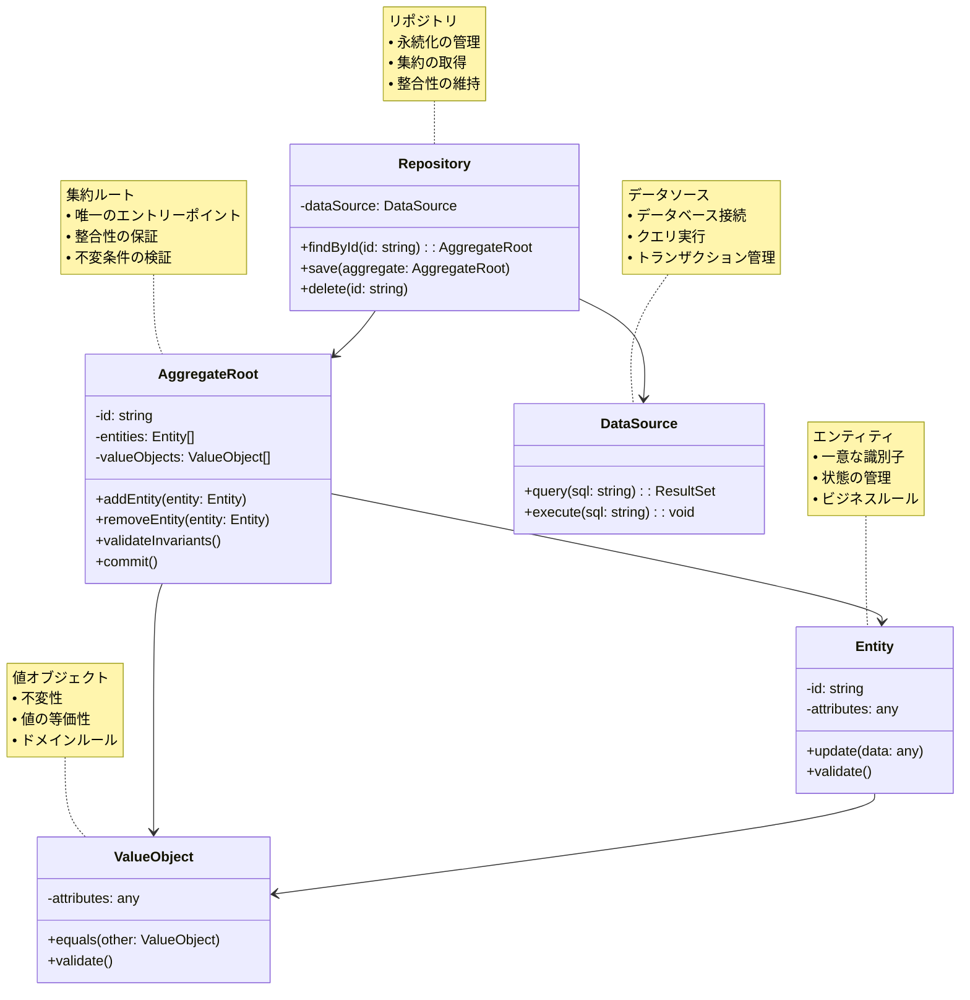

# Aggregate（集約）パターン

## 目的

関連するエンティティとバリューオブジェクトをグループ化し、一貫性と整合性を維持するための境界を定義するパターンです。

## 価値・解決する問題

- エンティティ間の整合性を確保
- ドメインルールの集中管理
- データ操作の単位を明確化
- 複雑なオブジェクト関係の管理を簡素化
- トランザクション境界の明確化

## 概要・特徴

### 概要

Aggregateパターンは、ドメイン駆動設計（DDD）の中核的な概念であり、密接に関連するオブジェクトのクラスターを一つの単位として扱います。各集約は「集約ルート」と呼ばれる単一のエンティティによって管理され、外部からのアクセスはこの集約ルートを通してのみ行われます。

### 特徴

#### 集約ルート
- 集約の唯一のエントリーポイント
- 集約内のオブジェクトへのアクセスを制御
- 不変条件の保証
- トランザクション境界の定義

#### 整合性の保証
- 集約内のオブジェクト間の整合性を維持
- 不変条件の検証
- ビジネスルールの適用
- トランザクションの一貫性確保

#### 境界の定義
- 集約の範囲を明確に定義
- 外部からのアクセス制御
- 参照の制限
- 変更の伝播範囲の制限

#### 永続化の単位
- データベース操作の単位
- トランザクション管理
- 同時実行制御
- 整合性の維持

### 概要図



## 類似パターンとの比較

- [Entity (エンティティ)](entity.md): 集約は複数のエンティティをグループ化し、エンティティは一意な識別子を持つドメインオブジェクトです。
- [Value Object (値オブジェクト)](value-object.md): 集約は値オブジェクトを含むことができ、値オブジェクトは不変性と値の等価性を持つドメインオブジェクトです。
- [Repository (リポジトリ)](repository.md): 集約はリポジトリを通じて永続化され、リポジトリは集約の取得と保存を担当します。
- [Unit of Work (ユニットオブワーク)](unit-of-work.md): 集約はユニットオブワークと組み合わせて使用され、トランザクションの一貫性を保証します。

## 利用されているライブラリ／フレームワークの事例

- [Spring Data JPA](https://github.com/spring-projects/spring-data-jpa): エンティティとリポジトリの管理
- [TypeORM](https://github.com/typeorm/typeorm): エンティティとリレーションの管理
- [Hibernate](https://github.com/hibernate/hibernate-orm): エンティティとマッピングの管理
- [Entity Framework](https://github.com/dotnet/efcore): エンティティとリポジトリの管理

## 解説ページリンク

- [Martin Fowler - Aggregate](https://martinfowler.com/bliki/AggregateRoot.html)
- [Microsoft - Aggregate Pattern](https://docs.microsoft.com/en-us/azure/architecture/patterns/cqrs)
- [DDD Reference - Aggregate](https://domainlanguage.com/ddd/reference/)
- [Understanding Aggregate Roots](https://martinfowler.com/bliki/AggregateRoot.html)

## コード例

### Before:

整合性が保証されていない実装

```typescript
// 注文クラス
class Order {
  constructor(
    public readonly id: string,
    public items: OrderItem[],
    public status: OrderStatus,
    public totalAmount: number
  ) {}

  addItem(productId: string, quantity: number, price: number): void {
    this.items.push(new OrderItem(productId, quantity, price));
    this.calculateTotal();
  }

  removeItem(productId: string): void {
    this.items = this.items.filter(item => item.productId !== productId);
    this.calculateTotal();
  }

  private calculateTotal(): void {
    this.totalAmount = this.items.reduce(
      (sum, item) => sum + item.quantity * item.price,
      0
    );
  }
}

// 注文アイテムクラス
class OrderItem {
  constructor(
    public readonly productId: string,
    public quantity: number,
    public price: number
  ) {}
}

// 在庫管理クラス
class Inventory {
  constructor(private stock: Map<string, number>) {}

  checkStock(productId: string): number {
    return this.stock.get(productId) || 0;
  }

  updateStock(productId: string, quantity: number): void {
    const currentStock = this.stock.get(productId) || 0;
    this.stock.set(productId, currentStock + quantity);
  }
}

// 注文処理サービス
class OrderService {
  private orders: Map<string, Order> = new Map();
  private inventory: Inventory;

  constructor() {
    this.inventory = new Inventory(new Map());
  }

  async createOrder(orderId: string, items: Array<{ productId: string; quantity: number; price: number }>): Promise<void> {
    // 在庫チェック
    for (const item of items) {
      const stock = this.inventory.checkStock(item.productId);
      if (stock < item.quantity) {
        throw new Error(`Insufficient stock for product ${item.productId}`);
      }
    }

    // 注文作成
    const order = new Order(orderId, [], OrderStatus.CREATED, 0);
    for (const item of items) {
      order.addItem(item.productId, item.quantity, item.price);
    }

    // 在庫更新
    for (const item of items) {
      this.inventory.updateStock(item.productId, -item.quantity);
    }

    this.orders.set(orderId, order);
  }

  async cancelOrder(orderId: string): Promise<void> {
    const order = this.orders.get(orderId);
    if (!order) {
      throw new Error(`Order ${orderId} not found`);
    }

    // 在庫を戻す
    for (const item of order.items) {
      this.inventory.updateStock(item.productId, item.quantity);
    }

    order.status = OrderStatus.CANCELLED;
  }
}

// 使用例
async function example() {
  const orderService = new OrderService();

  try {
    // 注文作成
    await orderService.createOrder('order-1', [
      { productId: 'product-1', quantity: 2, price: 1000 },
      { productId: 'product-2', quantity: 1, price: 2000 }
    ]);

    // 注文キャンセル
    await orderService.cancelOrder('order-1');
  } catch (error) {
    console.error('Order processing failed:', error);
  }
}
```

### After:

集約パターンを適用した実装

```typescript
// 注文ステータス
enum OrderStatus {
  CREATED = 'CREATED',
  PAID = 'PAID',
  SHIPPED = 'SHIPPED',
  DELIVERED = 'DELIVERED',
  CANCELLED = 'CANCELLED'
}

// 注文アイテム（値オブジェクト）
class OrderItem {
  constructor(
    public readonly productId: string,
    public readonly quantity: number,
    public readonly price: number
  ) {
    this.validate();
  }

  private validate(): void {
    if (this.quantity <= 0) {
      throw new Error('Quantity must be positive');
    }
    if (this.price < 0) {
      throw new Error('Price cannot be negative');
    }
  }

  equals(other: OrderItem): boolean {
    return (
      this.productId === other.productId &&
      this.quantity === other.quantity &&
      this.price === other.price
    );
  }
}

// 在庫（値オブジェクト）
class Stock {
  constructor(private readonly quantity: number) {
    this.validate();
  }

  private validate(): void {
    if (this.quantity < 0) {
      throw new Error('Stock cannot be negative');
    }
  }

  decrease(amount: number): Stock {
    if (amount > this.quantity) {
      throw new Error('Insufficient stock');
    }
    return new Stock(this.quantity - amount);
  }

  increase(amount: number): Stock {
    return new Stock(this.quantity + amount);
  }

  equals(other: Stock): boolean {
    return this.quantity === other.quantity;
  }
}

// 商品（エンティティ）
class Product {
  constructor(
    public readonly id: string,
    private stock: Stock,
    public readonly name: string,
    public readonly price: number
  ) {}

  decreaseStock(quantity: number): void {
    this.stock = this.stock.decrease(quantity);
  }

  increaseStock(quantity: number): void {
    this.stock = this.stock.increase(quantity);
  }

  hasEnoughStock(quantity: number): boolean {
    return this.stock.quantity >= quantity;
  }
}

// 注文（集約ルート）
class Order {
  private readonly items: OrderItem[] = [];
  private status: OrderStatus = OrderStatus.CREATED;
  private totalAmount: number = 0;

  constructor(
    public readonly id: string,
    private readonly products: Map<string, Product>
  ) {}

  addItem(productId: string, quantity: number): void {
    const product = this.products.get(productId);
    if (!product) {
      throw new Error(`Product ${productId} not found`);
    }

    if (!product.hasEnoughStock(quantity)) {
      throw new Error(`Insufficient stock for product ${productId}`);
    }

    const item = new OrderItem(productId, quantity, product.price);
    this.items.push(item);
    product.decreaseStock(quantity);
    this.calculateTotal();
    this.validateInvariants();
  }

  removeItem(productId: string): void {
    const item = this.items.find(i => i.productId === productId);
    if (!item) {
      throw new Error(`Item ${productId} not found in order`);
    }

    const product = this.products.get(productId);
    if (!product) {
      throw new Error(`Product ${productId} not found`);
    }

    this.items = this.items.filter(i => i.productId !== productId);
    product.increaseStock(item.quantity);
    this.calculateTotal();
    this.validateInvariants();
  }

  cancel(): void {
    if (this.status !== OrderStatus.CREATED) {
      throw new Error('Only created orders can be cancelled');
    }

    // 在庫を戻す
    for (const item of this.items) {
      const product = this.products.get(item.productId);
      if (product) {
        product.increaseStock(item.quantity);
      }
    }

    this.status = OrderStatus.CANCELLED;
    this.validateInvariants();
  }

  private calculateTotal(): void {
    this.totalAmount = this.items.reduce(
      (sum, item) => sum + item.quantity * item.price,
      0
    );
  }

  private validateInvariants(): void {
    if (this.totalAmount < 0) {
      throw new Error('Total amount cannot be negative');
    }
    if (this.items.length === 0 && this.status !== OrderStatus.CANCELLED) {
      throw new Error('Order must have at least one item');
    }
  }
}

// 注文リポジトリ
class OrderRepository {
  private orders: Map<string, Order> = new Map();

  async findById(id: string): Promise<Order | undefined> {
    return this.orders.get(id);
  }

  async save(order: Order): Promise<void> {
    this.orders.set(order.id, order);
  }

  async delete(id: string): Promise<void> {
    this.orders.delete(id);
  }
}

// 商品リポジトリ
class ProductRepository {
  private products: Map<string, Product> = new Map();

  async findById(id: string): Promise<Product | undefined> {
    return this.products.get(id);
  }

  async save(product: Product): Promise<void> {
    this.products.set(product.id, product);
  }
}

// 注文サービス
class OrderService {
  constructor(
    private orderRepository: OrderRepository,
    private productRepository: ProductRepository
  ) {}

  async createOrder(orderId: string, items: Array<{ productId: string; quantity: number }>): Promise<void> {
    // 商品の取得
    const products = new Map<string, Product>();
    for (const item of items) {
      const product = await this.productRepository.findById(item.productId);
      if (!product) {
        throw new Error(`Product ${item.productId} not found`);
      }
      products.set(item.productId, product);
    }

    // 注文の作成
    const order = new Order(orderId, products);
    for (const item of items) {
      order.addItem(item.productId, item.quantity);
    }

    // 注文の保存
    await this.orderRepository.save(order);
  }

  async cancelOrder(orderId: string): Promise<void> {
    const order = await this.orderRepository.findById(orderId);
    if (!order) {
      throw new Error(`Order ${orderId} not found`);
    }

    order.cancel();
    await this.orderRepository.save(order);
  }
}

// 使用例
async function example() {
  const orderRepository = new OrderRepository();
  const productRepository = new ProductRepository();

  // 商品の初期化
  await productRepository.save(
    new Product('product-1', new Stock(10), 'Product 1', 1000)
  );
  await productRepository.save(
    new Product('product-2', new Stock(5), 'Product 2', 2000)
  );

  const orderService = new OrderService(orderRepository, productRepository);

  try {
    // 注文作成
    await orderService.createOrder('order-1', [
      { productId: 'product-1', quantity: 2 },
      { productId: 'product-2', quantity: 1 }
    ]);

    // 注文キャンセル
    await orderService.cancelOrder('order-1');
  } catch (error) {
    console.error('Order processing failed:', error);
  }
}