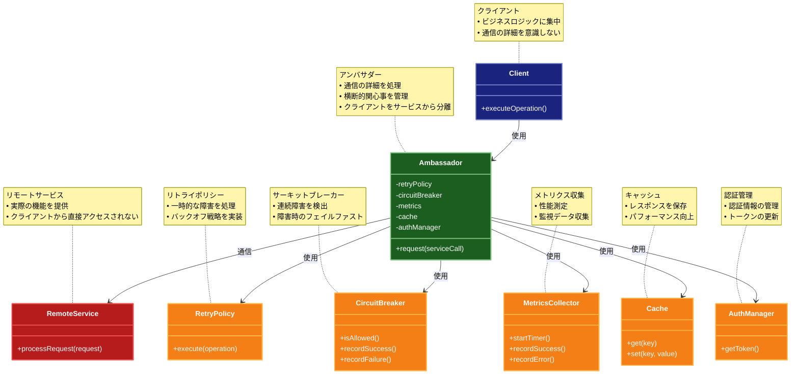

# Ambassador Pattern（アンバサダーパターン）

## 目的

クライアントアプリケーションから複雑なネットワーク通信やサービス間通信の詳細を隠蔽し、共通の機能（ロギング、モニタリング、リトライ、セキュリティなど）を提供する補助サービスを実装します。

## 価値・解決する問題

- クライアントコードの単純化
- 共通機能の一元管理
- プラットフォーム固有の詳細の抽象化
- クロスカッティングコンサーンの分離
- サービスの回復力と信頼性の向上
- 監視とデバッグの容易化

## 概要・特徴

### 概要

Ambassadorパターンは、クライアントとリモートサービス間に配置される「大使」のような補助サービスを提供します。このパターンは、サービス間の通信に関連する共通の課題（再試行、認証、ロギング、監視など）をクライアントコードから分離し、専用のコンポーネントに委譲します。マイクロサービスアーキテクチャやクラウドネイティブ環境で特に有効です。

### 特徴

- プロキシ機能: クライアントの代わりにリモートサービスと通信
- 横断的関心事の管理: 認証、ロギング、モニタリングなどを一元化
- 再試行と回復力: 一時的な障害からの回復メカニズムを提供
- プラットフォーム抽象化: 異なるプラットフォームやプロトコルへの適応
- サーキットブレーカー: 障害時のフェイルファスト機能を実装
- キャッシング: パフォーマンス向上のためのレスポンスキャッシュ
- 負荷分散: 複数のサービスインスタンスへのトラフィック分散
- 接続プール: ネットワーク接続の効率的な管理
- 非同期通信: 非ブロッキング通信の実装

### 概要図



## 解説ページリンク

- [Martin Fowler - Ambassador Pattern](https://martinfowler.com/articles/patterns-of-distributed-systems/ambassador.html)  
  - 分散システムにおけるAmbassadorパターンの実装方法と利点について、詳細な解説と実例を提供しています。

- [Microsoft - Ambassador pattern](https://learn.microsoft.com/ja-jp/azure/architecture/patterns/ambassador)  
  - クラウドアプリケーションにおけるAmbassadorパターンの実装ガイドと、Azure上での具体的な実装例を紹介しています。

- [Kubernetes - Ambassador pattern](https://kubernetes.io/docs/concepts/extend-kubernetes/service-catalog/)  
  - Kubernetesにおけるサービスメッシュとの統合方法や、コンテナ環境での実践的な使用例を説明しています。

- [NGINX Blog - Ambassador Pattern](https://www.nginx.com/blog/microservices-reference-architecture-nginx-ambassador-pattern/)  
  - マイクロサービスアーキテクチャにおけるAmbassadorパターンの実装方法と、NGINXを使用した具体的な設定例を提供しています。

## コード例

### Before:

```typescript
// クライアントが直接リモートサービスと通信する実装
class RemoteServiceClient {
  private retryCount = 3;
  private timeout = 5000;

  async callRemoteService(data: any) {
    let lastError: Error;

    for (let i = 0; i < this.retryCount; i++) {
      try {
        // タイムアウト設定
        const controller = new AbortController();
        const timeoutId = setTimeout(() => controller.abort(), this.timeout);

        // メトリクスの記録開始
        const startTime = Date.now();

        // リモートサービスの呼び出し
        const response = await fetch('http://remote-service/api', {
          method: 'POST',
          body: JSON.stringify(data),
          headers: {
            'Content-Type': 'application/json',
            'Authorization': `Bearer ${this.getAuthToken()}`,
          },
          signal: controller.signal
        });

        // メトリクスの記録
        const duration = Date.now() - startTime;
        console.log(`Remote service call took ${duration}ms`);

        clearTimeout(timeoutId);

        if (!response.ok) {
          throw new Error(`HTTP error! status: ${response.status}`);
        }

        // レスポンスのパース
        const result = await response.json();

        // キャッシュの更新
        this.updateCache(result);

        return result;
      } catch (error) {
        lastError = error;
        console.error(`Attempt ${i + 1} failed:`, error);
        await this.delay(Math.pow(2, i) * 1000); // 指数バックオフ
      }
    }

    throw lastError;
  }

  private getAuthToken(): string {
    // 認証トークンの取得ロジック
    return 'some-auth-token';
  }

  private updateCache(data: any): void {
    // キャッシュ更新ロジック
  }

  private delay(ms: number): Promise<void> {
    return new Promise(resolve => setTimeout(resolve, ms));
  }
}
```

### After:

```typescript
// Ambassador（共通機能を提供する補助サービス）
class ServiceAmbassador {
  constructor(
    private retryPolicy: RetryPolicy,
    private circuitBreaker: CircuitBreaker,
    private metrics: MetricsCollector,
    private cache: Cache,
    private authManager: AuthenticationManager
  ) {}

  async request<T>(serviceCall: ServiceCall<T>): Promise<T> {
    // サーキットブレーカーのチェック
    if (!this.circuitBreaker.isAllowed()) {
      throw new Error('Circuit breaker is open');
    }

    // キャッシュのチェック
    const cachedResult = await this.cache.get(serviceCall.getCacheKey());
    if (cachedResult) {
      return cachedResult;
    }

    return this.retryPolicy.execute(async () => {
      try {
        // メトリクス収集の開始
        const timer = this.metrics.startTimer();

        // 認証トークンの取得
        const token = await this.authManager.getToken();

        // サービスコールの実行
        const result = await serviceCall.execute({
          headers: {
            'Authorization': `Bearer ${token}`,
            'Content-Type': 'application/json'
          }
        });

        // メトリクスの記録
        this.metrics.recordSuccess(timer.stop());

        // キャッシュの更新
        await this.cache.set(serviceCall.getCacheKey(), result);

        // サーキットブレーカーの成功を記録
        this.circuitBreaker.recordSuccess();

        return result;
      } catch (error) {
        // メトリクスの記録
        this.metrics.recordError();

        // サーキットブレーカーの失敗を記録
        this.circuitBreaker.recordFailure();

        throw error;
      }
    });
  }
}

// リトライポリシーの実装
class RetryPolicy {
  constructor(
    private maxAttempts: number = 3,
    private backoffMultiplier: number = 2
  ) {}

  async execute<T>(operation: () => Promise<T>): Promise<T> {
    let lastError: Error;

    for (let attempt = 1; attempt <= this.maxAttempts; attempt++) {
      try {
        return await operation();
      } catch (error) {
        lastError = error;
        if (attempt === this.maxAttempts) {
          throw error;
        }
        await this.delay(Math.pow(this.backoffMultiplier, attempt - 1) * 1000);
      }
    }

    throw lastError;
  }

  private delay(ms: number): Promise<void> {
    return new Promise(resolve => setTimeout(resolve, ms));
  }
}

// サーキットブレーカーの実装
class CircuitBreaker {
  private failures = 0;
  private lastFailureTime?: number;
  private readonly threshold = 5;
  private readonly resetTimeout = 60000; // 1分

  isAllowed(): boolean {
    if (this.failures >= this.threshold) {
      const now = Date.now();
      if (this.lastFailureTime && (now - this.lastFailureTime) > this.resetTimeout) {
        this.reset();
        return true;
      }
      return false;
    }
    return true;
  }

  recordSuccess(): void {
    this.reset();
  }

  recordFailure(): void {
    this.failures++;
    this.lastFailureTime = Date.now();
  }

  private reset(): void {
    this.failures = 0;
    this.lastFailureTime = undefined;
  }
}

// クライアントコード
class RemoteServiceClient {
  constructor(private ambassador: ServiceAmbassador) {}

  async callRemoteService(data: any) {
    const serviceCall = new RemoteServiceCall(data);
    return this.ambassador.request(serviceCall);
  }
}

// サービスコールの実装
class RemoteServiceCall implements ServiceCall<any> {
  constructor(private data: any) {}

  getCacheKey(): string {
    return `remote-service:${JSON.stringify(this.data)}`;
  }

  async execute(options: { headers: Record<string, string> }): Promise<any> {
    const response = await fetch('http://remote-service/api', {
      method: 'POST',
      body: JSON.stringify(this.data),
      headers: options.headers
    });

    if (!response.ok) {
      throw new Error(`HTTP error! status: ${response.status}`);
    }

    return response.json();
  }
}

// 使用例
const ambassador = new ServiceAmbassador(
  new RetryPolicy(),
  new CircuitBreaker(),
  new MetricsCollector(),
  new Cache(),
  new AuthenticationManager()
);

const client = new RemoteServiceClient(ambassador);
const result = await client.callRemoteService({ some: 'data' });
```

## 類似パターンとの比較

- [Sidecar（サイドカー）](sidecar.md): Ambassador は主にクライアントサイドでの共通機能の提供に焦点を当て、Sidecar はアプリケーションコンテナに付随する補助機能を提供します。
- [Proxy（プロキシ）](proxy.md): Ambassador は共通機能の提供に重点を置き、Proxy はアクセス制御や要求の前処理に焦点を当てます。
- [Gateway（ゲートウェイ）](gateway.md): Ambassador は単一のサービスに対する共通機能を提供し、Gateway は複数のサービスへのアクセスを制御します。

## 利用されているライブラリ／フレームワークの事例

- [Linkerd](https://github.com/linkerd/linkerd2): サービスメッシュの実装でAmbassadorパターンを活用
- [Envoy](https://github.com/envoyproxy/envoy): エッジプロキシとサービスプロキシの機能を提供
- [Istio](https://github.com/istio/istio): サービスメッシュでのサイドカープロキシとしてEnvoyを使用 