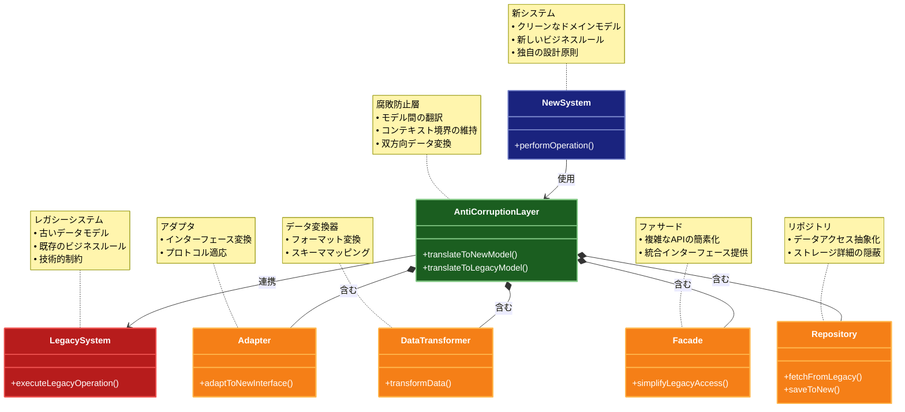

# Anti-Corruption Layer（腐敗防止層）

## 目的

レガシーシステムと新しいシステムの間に変換層を設け、異なるモデル間の翻訳を行うことで、新しいシステムのドメインモデルの純粋性を保ちながら、レガシーシステムとの統合を実現します。

## 価値・解決する問題

- 新しいシステムのドメインモデルの保護
- レガシーシステムとの互換性維持
- 段階的なシステム移行の実現
- 異なるドメインモデル間の翻訳
- 技術的負債の伝播防止
- システム間の依存関係の明確化

## 概要・特徴

### 概要

Anti-Corruption Layerは、異なるドメインモデルを持つシステム間の統合において、一方のシステムが他方のシステムの概念や制約に「汚染」されることを防ぐためのパターンです。特にレガシーシステムと新しいシステムの統合や、異なるバウンデッドコンテキスト間の連携において重要な役割を果たします。このパターンは、ドメイン駆動設計（DDD）の文脈で提唱されたものです。

### 特徴

- 翻訳層: 異なるドメインモデル間の変換を行う
- 隔離: 新しいシステムをレガシーコードの影響から保護
- アダプタ: 互換性のないインターフェース間の橋渡し
- 二方向変換: 双方向のデータ変換をサポート
- ファサード: 複雑なレガシーシステムを単純化して提示
- コンテキスト境界: 明確なバウンデッドコンテキスト間の関係定義
- 段階的移行: レガシーシステムから新システムへの段階的な移行をサポート
- データ整合性: 異なるデータモデル間の整合性を確保

### 概要図



## 解説ページリンク

- [Martin Fowler - Anti-Corruption Layer](https://martinfowler.com/bliki/AntiCorruptionLayer.html)  
  - ドメイン駆動設計におけるAnti-Corruption Layerの概念と、レガシーシステムとの統合における重要性を解説しています。

- [Microsoft - Anti-Corruption Layer pattern](https://learn.microsoft.com/ja-jp/azure/architecture/patterns/anti-corruption-layer)  
  - クラウドアプリケーションにおけるAnti-Corruption Layerの実装パターンと、具体的なユースケースを提供しています。

- [Domain-Driven Design - Anti-Corruption Layer](https://www.domainlanguage.com/ddd/reference/)  
  - Eric Evansによるドメイン駆動設計の文脈でのAnti-Corruption Layerの詳細な解説と実装戦略を提供しています。

- [ThoughtWorks - Anti-Corruption Layer Pattern](https://www.thoughtworks.com/insights/blog/domain-driven-design-services-architecture)  
  - マイクロサービスアーキテクチャにおけるAnti-Corruption Layerの実践的な適用方法と、実装例を解説しています。

## コード例

### Before:

```typescript
// レガシーシステムのモデルが新しいシステムに直接漏れ出している状態
interface LegacyCustomer {
  customerNumber: string;
  firstName: string;
  lastName: string;
  dateOfBirth: string; // "DD-MM-YYYY" 形式
  addressLine1: string;
  addressLine2: string;
  city: string;
  state: string;
  zipCode: string;
  creditRating: number; // 1-5のスケール
}

// 新しいシステムでレガシーモデルを直接使用
class CustomerService {
  constructor(private legacySystemClient: LegacySystemClient) {}

  async getCustomerDetails(customerNumber: string): Promise<LegacyCustomer> {
    // レガシーシステムのモデルをそのまま使用
    return this.legacySystemClient.getCustomer(customerNumber);
  }

  async updateCustomer(customer: LegacyCustomer): Promise<void> {
    // レガシーシステムの制約に直接依存
    if (customer.creditRating < 1 || customer.creditRating > 5) {
      throw new Error('Invalid credit rating');
    }

    // 日付形式の変換を処理ロジック内で行う
    const [day, month, year] = customer.dateOfBirth.split('-');
    const dateOfBirth = new Date(`${year}-${month}-${day}`);

    if (isNaN(dateOfBirth.getTime())) {
      throw new Error('Invalid date format');
    }

    await this.legacySystemClient.updateCustomer(customer);
  }
}

// APIエンドポイント
class CustomerController {
  constructor(private customerService: CustomerService) {}

  @Post('/customers')
  async createCustomer(@Body() customerData: LegacyCustomer) {
    // レガシーシステムの制約がAPIレベルに漏れている
    return this.customerService.updateCustomer(customerData);
  }
}
```

### After:

```typescript
// 新しいシステムのドメインモデル
class Customer {
  constructor(
    private id: string,
    private name: PersonName,
    private birthDate: Date,
    private address: Address,
    private creditScore: CreditScore
  ) {}

  // ドメインロジックをカプセル化
  updateCreditScore(score: CreditScore): void {
    this.creditScore = score;
  }

  // ゲッター
  getId(): string { return this.id; }
  getName(): PersonName { return this.name; }
  getBirthDate(): Date { return this.birthDate; }
  getAddress(): Address { return this.address; }
  getCreditScore(): CreditScore { return this.creditScore; }
}

class PersonName {
  constructor(
    private firstName: string,
    private lastName: string
  ) {
    this.validateName(firstName, 'First name');
    this.validateName(lastName, 'Last name');
  }

  private validateName(name: string, field: string): void {
    if (!name || name.trim().length === 0) {
      throw new Error(`${field} cannot be empty`);
    }
  }

  getFullName(): string {
    return `${this.firstName} ${this.lastName}`;
  }
}

class Address {
  constructor(
    private street: string,
    private city: string,
    private state: string,
    private postalCode: string
  ) {
    this.validatePostalCode(postalCode);
  }

  private validatePostalCode(postalCode: string): void {
    if (!/^\d{5}(-\d{4})?$/.test(postalCode)) {
      throw new Error('Invalid postal code format');
    }
  }
}

class CreditScore {
  private static readonly MIN_SCORE = 300;
  private static readonly MAX_SCORE = 850;

  constructor(private score: number) {
    this.validateScore(score);
  }

  private validateScore(score: number): void {
    if (score < CreditScore.MIN_SCORE || score > CreditScore.MAX_SCORE) {
      throw new Error(`Credit score must be between ${CreditScore.MIN_SCORE} and ${CreditScore.MAX_SCORE}`);
    }
  }

  getScore(): number {
    return this.score;
  }
}

// Anti-Corruption Layer
class LegacyCustomerAdapter {
  // レガシーシステムのモデルを新しいドメインモデルに変換
  toDomainModel(legacyCustomer: LegacyCustomer): Customer {
    return new Customer(
      legacyCustomer.customerNumber,
      new PersonName(
        legacyCustomer.firstName,
        legacyCustomer.lastName
      ),
      this.parseLegacyDate(legacyCustomer.dateOfBirth),
      new Address(
        this.combineAddressLines(
          legacyCustomer.addressLine1,
          legacyCustomer.addressLine2
        ),
        legacyCustomer.city,
        legacyCustomer.state,
        legacyCustomer.zipCode
      ),
      this.convertCreditRating(legacyCustomer.creditRating)
    );
  }

  // 新しいドメインモデルをレガシーシステムのモデルに変換
  toLegacyModel(customer: Customer): LegacyCustomer {
    const [addressLine1, addressLine2] = this.splitAddress(customer.getAddress());
    
    return {
      customerNumber: customer.getId(),
      firstName: customer.getName().getFirstName(),
      lastName: customer.getName().getLastName(),
      dateOfBirth: this.formatLegacyDate(customer.getBirthDate()),
      addressLine1,
      addressLine2,
      city: customer.getAddress().getCity(),
      state: customer.getAddress().getState(),
      zipCode: customer.getAddress().getPostalCode(),
      creditRating: this.convertCreditScore(customer.getCreditScore())
    };
  }

  private parseLegacyDate(dateStr: string): Date {
    const [day, month, year] = dateStr.split('-');
    const date = new Date(`${year}-${month}-${day}`);
    if (isNaN(date.getTime())) {
      throw new Error('Invalid legacy date format');
    }
    return date;
  }

  private formatLegacyDate(date: Date): string {
    return `${date.getDate().toString().padStart(2, '0')}-${(date.getMonth() + 1).toString().padStart(2, '0')}-${date.getFullYear()}`;
  }

  private convertCreditRating(rating: number): CreditScore {
    // レガシーシステムの1-5スケールを300-850スケールに変換
    const score = 300 + (rating - 1) * 137.5;
    return new CreditScore(Math.round(score));
  }

  private convertCreditScore(score: CreditScore): number {
    // 300-850スケールを1-5スケールに変換
    const rating = 1 + (score.getScore() - 300) / 137.5;
    return Math.round(rating);
  }

  private combineAddressLines(line1: string, line2: string): string {
    return line2 ? `${line1}, ${line2}` : line1;
  }

  private splitAddress(address: Address): [string, string] {
    const parts = address.getStreet().split(', ', 2);
    return [parts[0], parts[1] || ''];
  }
}

// アプリケーションサービス
class CustomerService {
  constructor(
    private legacySystemClient: LegacySystemClient,
    private customerAdapter: LegacyCustomerAdapter
  ) {}

  async getCustomer(customerId: string): Promise<Customer> {
    const legacyCustomer = await this.legacySystemClient.getCustomer(customerId);
    return this.customerAdapter.toDomainModel(legacyCustomer);
  }

  async updateCustomer(customer: Customer): Promise<void> {
    const legacyCustomer = this.customerAdapter.toLegacyModel(customer);
    await this.legacySystemClient.updateCustomer(legacyCustomer);
  }
}

// APIエンドポイント
class CustomerController {
  constructor(private customerService: CustomerService) {}

  @Post('/customers')
  async createCustomer(@Body() customerData: CreateCustomerDTO) {
    // DTOから新しいドメインモデルを作成
    const customer = new Customer(
      generateId(),
      new PersonName(customerData.firstName, customerData.lastName),
      new Date(customerData.birthDate),
      new Address(
        customerData.street,
        customerData.city,
        customerData.state,
        customerData.postalCode
      ),
      new CreditScore(customerData.creditScore)
    );

    await this.customerService.updateCustomer(customer);
    return customer;
  }
}
```

## 類似パターンとの比較

- [Adapter（アダプター）](adapter.md): Anti-Corruption Layer はレガシーシステムとの統合に特化し、ドメインモデルの保護を重視します。Adapter はより一般的なインターフェース変換を目的とします。
- [Facade（ファサード）](facade.md): Anti-Corruption Layer は双方向の変換と保護を提供し、Facade は単純化されたインターフェースの提供に焦点を当てます。
- [Gateway（ゲートウェイ）](gateway.md): Anti-Corruption Layer はドメインモデルの保護に重点を置き、Gateway は外部システムへのアクセスの抽象化に焦点を当てます。

## 利用されているライブラリ／フレームワークの事例

- [Spring Framework](https://github.com/spring-projects/spring-framework/tree/main/spring-integration): 統合レイヤーでのAnti-Corruption Layerの実装をサポート
- [NestJS](https://github.com/nestjs/nest/tree/master/sample/14-mongoose-base): データベース統合でのモデル変換層の実装例を提供
- [Entity Framework Core](https://github.com/dotnet/efcore): レガシーデータベースと新しいドメインモデル間の変換をサポート 