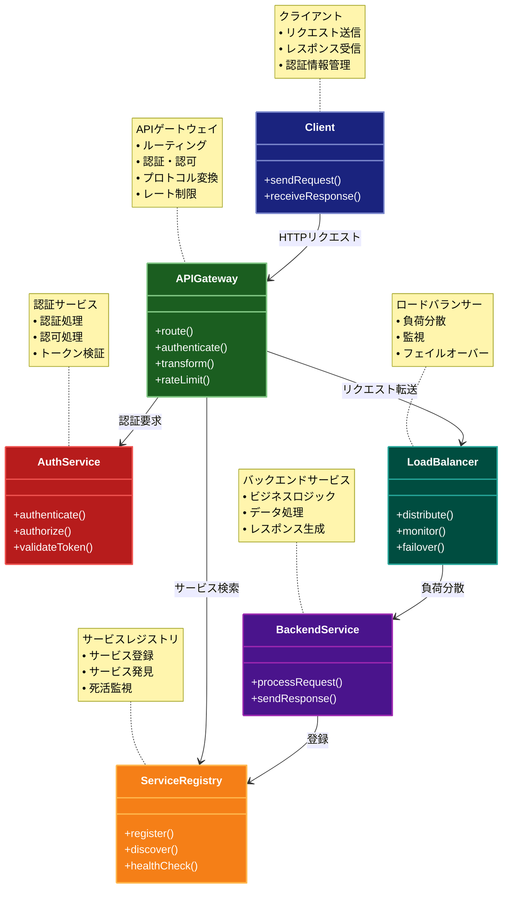

# API Gateway パターン

## 目的

マイクロサービスアーキテクチャにおいて、クライアントとバックエンドサービス間の通信を一元化し、認証、ルーティング、プロトコル変換などの共通機能を提供するパターン。

## 価値・解決する問題

- クライアントとサービス間の通信の一元化
- 共通機能の集約
- プロトコル変換の実現
- セキュリティの向上
- クライアントの簡素化

## 概要・特徴

### 概要

APIゲートウェイパターンは、マイクロサービスアーキテクチャにおいて、クライアントからのリクエストを受け付け、適切なバックエンドサービスにルーティングする中間層を提供します。また、認証、ロギング、レート制限などの共通機能も提供します。

### 特徴

#### リクエストのルーティング
API Gatewayの中核機能として、クライアントからのリクエストを適切なバックエンドサービスに転送する機能があります。クライアントは複数のマイクロサービスの存在を意識することなく、単一のエンドポイントに対してリクエストを送信するだけで済みます。ゲートウェイはURLパス、HTTPメソッド、ヘッダー情報などに基づいて、リクエストを適切なサービスにルーティングします。また、複数のサービスからのデータを集約して単一のレスポンスを返す機能（アグリゲーション）も提供できるため、クライアント側の実装が大幅に簡素化されます。これにより、フロントエンド開発とバックエンド開発の分離が促進され、それぞれのチームが独立して開発を進めることができます。

#### プロトコル変換
クライアントとバックエンドサービス間で使用されるプロトコルやデータ形式が異なる場合に、それらの変換を担当します。例えば、クライアントからのRESTfulリクエストをgRPCやGraphQLなど、バックエンドサービスが使用する別のプロトコルに変換することが可能です。また、レガシーシステムとの統合においても、SOAPやXMLベースのプロトコルとJSONベースのモダンなAPIの間の変換を実現できます。このプロトコル抽象化により、バックエンドサービスは最適なプロトコルを選択できる自由度を得ると同時に、クライアントは標準化されたインターフェースを利用できるようになります。さらに、新しいプロトコルやAPIバージョンの導入もAPI Gateway層で吸収することができ、下位互換性の維持が容易になります。

#### 認証・認可
セキュリティに関する共通機能を一元的に管理し、バックエンドサービスの負担を軽減します。クライアントからのリクエストに対して、トークン検証、APIキー確認、OAuth認証など、様々な認証メカニズムを適用することができます。また、ロールベースのアクセス制御（RBAC）やリソースベースの認可ポリシーを実装し、ユーザーやクライアントアプリケーションごとにアクセス権限を細かく制御することも可能です。バックエンドサービスは認証済みのリクエストのみを受け取るため、各サービスで認証ロジックを重複して実装する必要がなくなります。これにより、セキュリティの一貫性が向上し、脆弱性のリスクが低減されます。また、セキュリティポリシーの変更も一箇所で行えるため、システム全体のセキュリティ管理が効率化されます。

#### レート制限
システムの安定性と可用性を確保するため、クライアントからのリクエスト量を制御します。特定のクライアント、IPアドレス、またはAPIエンドポイントごとに、一定時間内のリクエスト数を制限することができます。これにより、DoS攻撃や悪意のあるクライアントからの過剰なリクエスト、あるいは誤って設計されたクライアントアプリケーションによる意図しない高負荷から、バックエンドサービスを保護します。また、有料APIサービスなど、利用量に応じた課金モデルを実装する場合にも、レート制限は重要な役割を果たします。さらに、優先度の高いクライアントに対しては制限を緩和するなど、柔軟なトラフィック管理ポリシーを実装することもできます。この機能により、システム全体のリソース使用を最適化し、すべてのユーザーに対して安定したサービス品質を提供することが可能になります。

#### ロギング・監視
APIゲートウェイは、すべてのAPIトラフィックの中央集約ポイントとして、包括的なロギングと監視機能を提供します。リクエスト/レスポンスの詳細、レイテンシ、エラー率などのメトリクスを記録し、システム全体の健全性とパフォーマンスを可視化します。これらのデータは、トラブルシューティング、性能最適化、セキュリティ監査などに活用できます。また、異常なトラフィックパターンやエラー増加などのイベントを検出して、自動アラートを発生させることも可能です。APIの使用状況や傾向を分析することで、どのAPIが最も利用されているか、どのクライアントが最もリソースを消費しているかなどの洞察を得ることができ、ビジネス戦略や開発優先順位の決定に役立てることができます。さらに、分散トレーシング機能と組み合わせることで、マイクロサービス間の依存関係やパフォーマンスボトルネックの特定も容易になります。

### 概要図



## 類似パターンとの比較

- [Backend for Frontend](backend-for-frontend.md)
  - BFFはクライアント特化型のAPIを提供するのに対して、APIゲートウェイは汎用的なAPIを提供する
  - BFFはクライアントごとに異なるバックエンドを持つのに対して、APIゲートウェイは共通のバックエンドを使用する

- [Facade](facade.md)
  - Facadeはシステムの内部複雑性を隠蔽するのに対して、APIゲートウェイはシステム間の通信を制御する
  - Facadeは単一のインターフェースを提供するのに対して、APIゲートウェイは複数のインターフェースを提供できる

## 利用されているライブラリ／フレームワークの事例

- [Kong](https://github.com/Kong/kong)
  - オープンソースのAPIゲートウェイ
  - プラグインによる機能拡張

- [Spring Cloud Gateway](https://github.com/spring-cloud/spring-cloud-gateway)
  - Spring Cloudの一部として提供されるAPIゲートウェイ
  - リアクティブな実装

## 解説ページリンク

- [Pattern: API Gateway / Backend for Front-End](https://microservices.io/patterns/apigateway.html)
- [Building Microservices: Using an API Gateway](https://www.nginx.com/blog/building-microservices-using-an-api-gateway/)

## コード例

### Before:

```typescript
// クライアントが直接各サービスにアクセス
class Client {
  private authUrl = 'http://auth-service'
  private userUrl = 'http://user-service'
  private orderUrl = 'http://order-service'

  async login(username: string, password: string) {
    const response = await fetch(`${this.authUrl}/login`, {
      method: 'POST',
      body: JSON.stringify({ username, password })
    })
    return await response.json()
  }

  async getUser(userId: string) {
    const response = await fetch(`${this.userUrl}/users/${userId}`)
    return await response.json()
  }

  async getOrders(userId: string) {
    const response = await fetch(`${this.orderUrl}/orders?userId=${userId}`)
    return await response.json()
  }
}
```

### After:

```typescript
// APIゲートウェイの実装
class APIGateway {
  private serviceRegistry: ServiceRegistry
  private authService: AuthService
  private loadBalancer: LoadBalancer

  constructor() {
    this.serviceRegistry = new ServiceRegistry()
    this.authService = new AuthService()
    this.loadBalancer = new LoadBalancer()
  }

  async handleRequest(req: Request, res: Response) {
    try {
      // 認証
      const token = req.headers.authorization
      if (!await this.authService.validateToken(token)) {
        res.status(401).json({ error: 'Unauthorized' })
        return
      }

      // レート制限
      if (this.isRateLimited(req)) {
        res.status(429).json({ error: 'Too Many Requests' })
        return
      }

      // サービス検出
      const service = await this.serviceRegistry.discover(req.path)
      if (!service) {
        res.status(404).json({ error: 'Service Not Found' })
        return
      }

      // リクエスト転送
      const backend = this.loadBalancer.getBackend(service)
      const response = await this.forwardRequest(req, backend)

      // レスポンス変換
      const transformedResponse = this.transformResponse(response)
      res.json(transformedResponse)

    } catch (error) {
      res.status(500).json({ error: 'Internal Server Error' })
    }
  }

  private isRateLimited(req: Request): boolean {
    // レート制限のロジック
    return false
  }

  private async forwardRequest(req: Request, backend: string) {
    // リクエスト転送のロジック
    return await fetch(backend + req.path)
  }

  private transformResponse(response: any) {
    // レスポンス変換のロジック
    return response
  }
}

// サービスレジストリ
class ServiceRegistry {
  private services: Map<string, string[]>

  constructor() {
    this.services = new Map()
  }

  register(serviceName: string, url: string) {
    const urls = this.services.get(serviceName) || []
    urls.push(url)
    this.services.set(serviceName, urls)
  }

  async discover(path: string): Promise<string | null> {
    // パスからサービスを特定
    const serviceName = this.getServiceFromPath(path)
    return this.services.get(serviceName)?.[0] || null
  }

  private getServiceFromPath(path: string): string {
    // パスからサービス名を抽出するロジック
    return path.split('/')[1]
  }
}

// 認証サービス
class AuthService {
  async validateToken(token: string): Promise<boolean> {
    // トークン検証のロジック
    return Boolean(token)
  }
}

// ロードバランサー
class LoadBalancer {
  getBackend(service: string): string {
    // 負荷分散のロジック
    return service
  }
}

// クライアント
class Client {
  private apiUrl = 'http://api-gateway'

  async login(username: string, password: string) {
    const response = await fetch(`${this.apiUrl}/auth/login`, {
      method: 'POST',
      body: JSON.stringify({ username, password })
    })
    return await response.json()
  }

  async getUser(userId: string) {
    const response = await fetch(`${this.apiUrl}/users/${userId}`)
    return await response.json()
  }

  async getOrders(userId: string) {
    const response = await fetch(`${this.apiUrl}/orders?userId=${userId}`)
    return await response.json()
  }
}

// 使用例
const gateway = new APIGateway()
const app = express()

app.use(express.json())
app.use((req, res) => gateway.handleRequest(req, res))

const registry = new ServiceRegistry()
registry.register('auth', 'http://auth-service')
registry.register('users', 'http://user-service')
registry.register('orders', 'http://order-service')
``` 