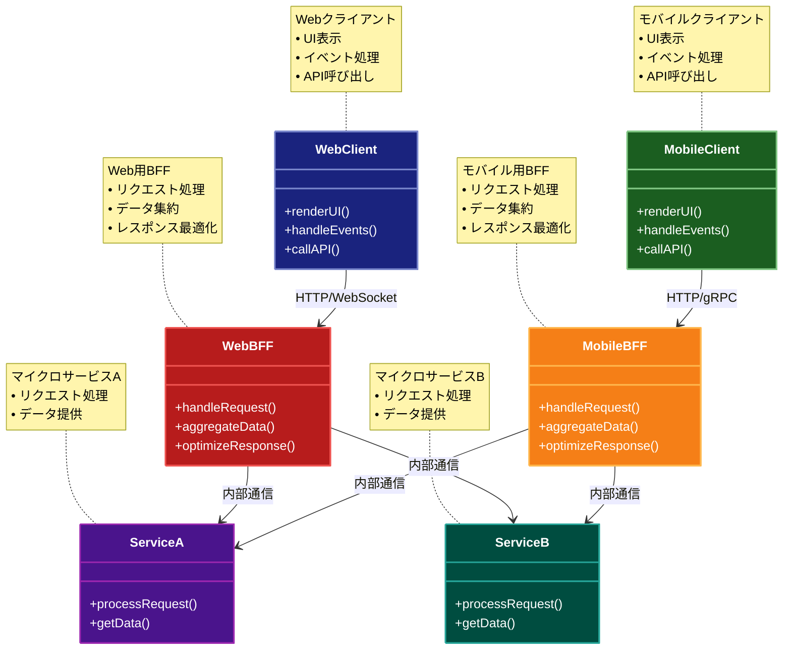

# Backend for Frontend (BFF) パターン

## 目的

異なるクライアントタイプ（Web、モバイル、IoTなど）ごとに最適化されたバックエンドAPIを提供し、クライアント固有の要件に効率的に対応するパターン。

## 価値・解決する問題

- クライアント固有の要件への対応
- データ変換の最適化
- ネットワーク通信の効率化
- クライアントの簡素化
- 開発チームの自律性向上

## 概要・特徴

### 概要

Backend for Frontendパターンは、各クライアントタイプに特化したバックエンドサービスを提供します。これにより、クライアントの要件に合わせたデータ形式、通信プロトコル、APIインターフェースを実現できます。

### 特徴

#### クライアント特化型API
BFFパターンの最も顕著な特徴は、各クライアントタイプ（Webブラウザ、モバイルアプリ、スマートTV、IoTデバイスなど）に最適化された専用のバックエンドサービスを提供することです。これにより、それぞれのクライアントの特性、制約、ユーザーエクスペリエンス要件に合わせたAPIデザインが可能になります。例えば、画面サイズの小さいモバイルデバイス向けには必要最小限のデータを返し、帯域幅を節約できます。また、Webブラウザ向けには、レンダリングに必要なより詳細なデータを含めることができます。このクライアント特化アプローチにより、一般的な「ワンサイズフィッツオール」のAPIの限界を克服し、各クライアントプラットフォームの能力を最大限に活用できるインターフェースを設計できます。さらに、クライアント特有の認証メカニズムやセキュリティ要件にも対応しやすくなります。

#### データ集約と変換
BFFは、複数のバックエンドマイクロサービスからデータを収集し、クライアントに最適な形式に変換・集約する役割を担います。これにより、クライアントは単一のAPIコールで必要なすべての情報を取得できるため、複数のリクエストを送信する必要がなく、ネットワーク通信のオーバーヘッドが削減されます。例えば、Eコマースアプリケーションの製品詳細ページでは、製品情報、在庫状況、価格、レビュー、関連商品などの情報が必要ですが、これらは通常、異なるマイクロサービスから提供されます。BFFはこれらのデータを集約し、クライアントが必要とする形式に整形してから返送します。また、レガシーシステムやサードパーティAPIからのデータ形式の変換も担当し、クライアントが一貫した現代的なデータ形式を扱えるようにします。これにより、フロントエンド開発が大幅に簡素化され、開発速度の向上につながります。

#### 最適化された通信
クライアントの特性に合わせて通信プロトコルや方式を最適化することで、パフォーマンスと効率を向上させます。例えば、Webアプリケーション向けにはGraphQLを使用してクライアントが必要なデータのみをリクエストできるようにしたり、モバイルアプリ向けには帯域幅とバッテリー消費を抑えるために最適化されたプロトコルを採用したりできます。また、特定のクライアントにとって重要なレスポンスタイムの最適化（キャッシュ戦略の実装など）や、断続的な接続環境でも機能するオフライン対応なども実現できます。さらに、クライアントのネットワーク条件に応じて、データ圧縮レベルやペイロードサイズを動的に調整する機能も実装可能です。これらの通信最適化により、ユーザーエクスペリエンスが向上し、特に低速なネットワーク環境や制約のあるデバイスでの使用において大きな効果を発揮します。

#### 独立したデプロイ
各BFFは独立してデプロイ可能なサービスであり、これによりクライアントアプリケーションとバックエンドサービスの変更サイクルを分離できます。例えば、モバイルアプリのリリースサイクルが月次である一方、WebアプリはCI/CDパイプラインで週次更新されるような場合でも、それぞれのBFFは対応するクライアントのリリースサイクルに合わせて独立して更新できます。これにより、特定のクライアントに必要な変更が他のクライアントのリリースサイクルによってブロックされることがなくなります。また、クライアント特有の機能追加や問題修正を迅速に行うことが可能になり、各クライアントプラットフォームの進化に合わせて柔軟に対応できます。さらに、特定のクライアントの負荷に応じて個別にスケールする能力も得られるため、リソース利用の効率化にもつながります。

#### チーム単位の開発
BFFパターンは、組織構造と技術アーキテクチャの整合性を高め、開発チームの自律性を向上させます。同一のチームがクライアントアプリケーションとそれに対応するBFFの両方を担当することで、エンドツーエンドの機能開発が効率化されます。これはConway's Lawの原則（「システムの設計は、それを設計する組織のコミュニケーション構造を反映する」）に基づいており、チームのコミュニケーションパターンとシステムアーキテクチャを一致させることで、開発プロセスの摩擦を減らすことができます。例えば、Webチーム、iOSチーム、Androidチームがそれぞれ独自のBFFを持つことで、各チームは他のチームとの調整や依存関係を最小限に抑えながら開発を進めることができます。また、各チームが自身の担当領域の技術スタックを最適化できるため、例えばWebチームはNode.jsベースのBFF、モバイルチームはKotlinベースのBFFというように、チームの専門知識を最大限に活かした実装が可能になります。これにより、開発スピードの向上とイノベーションの促進が実現します。

### 概要図



## 類似パターンとの比較

- [API Gateway](api-gateway.md): BFFはクライアント特化型のAPIを提供するのに対して、APIゲートウェイは汎用的なAPIを提供します。
- [Facade](facade.md): BFFはクライアント固有の要件に対応するのに対して、Facadeはシステムの内部複雑性を隠蔽します。
- [Gateway Offloading](gateway-offloading.md): BFFはクライアント固有の機能を提供するのに対して、Gateway Offloadingは共通機能の実装を担います。
- [Gateway Routing](gateway-routing.md): BFFはクライアント固有の要件に対応するのに対して、Gateway Routingはリクエストの転送に特化します。
- [Gateway Aggregation](gateway-aggregation.md): BFFはクライアント固有のデータ集約を行うのに対して、Gateway Aggregationは汎用的なデータ集約を行います。

## 利用されているライブラリ／フレームワークの事例

- [Netflix](https://github.com/Netflix)
  - デバイス特化型のAPIサーバー
  - クライアントごとの最適化

- [SoundCloud](https://github.com/soundcloud)
  - モバイルアプリケーション向けBFF
  - パフォーマンス最適化

## 解説ページリンク

- [Pattern: Backends For Frontends](https://samnewman.io/patterns/architectural/bff/)
- [The BFF Pattern (Backend for Frontend)](https://blog.bitsrc.io/bff-pattern-backend-for-frontend-an-introduction-e4fa965128bf)

## コード例

### Before:

```typescript
// 汎用的なAPIサーバー
class GenericAPIServer {
  async getUser(userId: string) {
    const user = await this.userService.getUser(userId)
    const orders = await this.orderService.getOrders(userId)
    const notifications = await this.notificationService.getNotifications(userId)

    return {
      user,
      orders,
      notifications
    }
  }

  async getProduct(productId: string) {
    const product = await this.productService.getProduct(productId)
    const reviews = await this.reviewService.getReviews(productId)
    const relatedProducts = await this.productService.getRelatedProducts(productId)

    return {
      product,
      reviews,
      relatedProducts
    }
  }
}

// クライアント側で必要なデータを加工
class WebClient {
  async getUserProfile(userId: string) {
    const response = await fetch(`/api/users/${userId}`)
    const data = await response.json()

    // Webに必要なデータのみを抽出
    return {
      name: data.user.name,
      email: data.user.email,
      recentOrders: data.orders.slice(0, 5),
      unreadNotifications: data.notifications.filter(n => !n.read)
    }
  }
}

class MobileClient {
  async getUserProfile(userId: string) {
    const response = await fetch(`/api/users/${userId}`)
    const data = await response.json()

    // モバイルに必要なデータのみを抽出
    return {
      name: data.user.name,
      avatar: data.user.avatar,
      orderCount: data.orders.length,
      notificationCount: data.notifications.filter(n => !n.read).length
    }
  }
}
```

### After:

```typescript
// Web用BFF
class WebBFF {
  private userService: UserService
  private orderService: OrderService
  private notificationService: NotificationService

  constructor() {
    this.userService = new UserService()
    this.orderService = new OrderService()
    this.notificationService = new NotificationService()
  }

  async getUserProfile(userId: string) {
    // Web向けに最適化されたデータ取得と集約
    const [user, orders, notifications] = await Promise.all([
      this.userService.getUser(userId),
      this.orderService.getRecentOrders(userId, 5),
      this.notificationService.getUnreadNotifications(userId)
    ])

    return {
      name: user.name,
      email: user.email,
      recentOrders: orders.map(order => ({
        id: order.id,
        date: order.date,
        total: order.total,
        status: order.status
      })),
      notifications: notifications.map(notification => ({
        id: notification.id,
        message: notification.message,
        type: notification.type
      }))
    }
  }

  async getProduct(productId: string) {
    // Web向けに最適化された商品情報
    const [product, reviews] = await Promise.all([
      this.productService.getProduct(productId),
      this.reviewService.getTopReviews(productId, 3)
    ])

    return {
      id: product.id,
      name: product.name,
      description: product.description,
      price: product.price,
      images: product.images,
      reviews: reviews.map(review => ({
        rating: review.rating,
        comment: review.comment,
        userName: review.userName
      }))
    }
  }
}

// モバイル用BFF
class MobileBFF {
  private userService: UserService
  private orderService: OrderService
  private notificationService: NotificationService

  constructor() {
    this.userService = new UserService()
    this.orderService = new OrderService()
    this.notificationService = new NotificationService()
  }

  async getUserProfile(userId: string) {
    // モバイル向けに最適化されたデータ取得と集約
    const [user, orderCount, notificationCount] = await Promise.all([
      this.userService.getUserBasicInfo(userId),
      this.orderService.getOrderCount(userId),
      this.notificationService.getUnreadCount(userId)
    ])

    return {
      name: user.name,
      avatar: user.avatar,
      orderCount,
      notificationCount
    }
  }

  async getProduct(productId: string) {
    // モバイル向けに最適化された商品情報
    const product = await this.productService.getProductBasicInfo(productId)

    return {
      id: product.id,
      name: product.name,
      price: product.price,
      mainImage: product.mainImage,
      rating: product.averageRating
    }
  }
}

// Webクライアント
class WebClient {
  private api = new WebBFF()

  async getUserProfile(userId: string) {
    // Web向けに最適化されたAPIを直接使用
    return await this.api.getUserProfile(userId)
  }
}

// モバイルクライアント
class MobileClient {
  private api = new MobileBFF()

  async getUserProfile(userId: string) {
    // モバイル向けに最適化されたAPIを直接使用
    return await this.api.getUserProfile(userId)
  }
}

// 使用例
const webClient = new WebClient()
const mobileClient = new MobileClient()

// Web向けの詳細な情報を取得
const webProfile = await webClient.getUserProfile('user123')
console.log('Web Profile:', webProfile)
// {
//   name: 'John Doe',
//   email: 'john@example.com',
//   recentOrders: [...],
//   notifications: [...]
// }

// モバイル向けの最小限の情報を取得
const mobileProfile = await mobileClient.getUserProfile('user123')
console.log('Mobile Profile:', mobileProfile)
// {
//   name: 'John Doe',
//   avatar: 'avatar.jpg',
//   orderCount: 10,
//   notificationCount: 5
// }
``` 