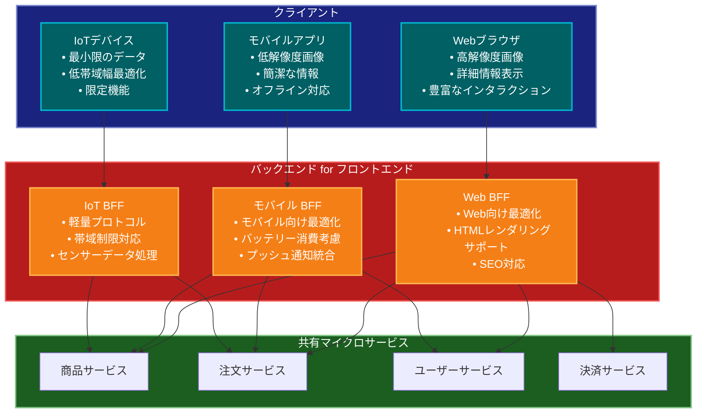

# Backends for Frontends（BFF）パターン

## 目的

異なるフロントエンドクライアント（Web、モバイル、IoTデバイスなど）のニーズに特化したバックエンドAPIを提供することで、クライアント固有の要件に最適化された通信を実現します。

## 解説ページリンク

- [Sam Newman - BFF Pattern](https://samnewman.io/patterns/architectural/bff/)  
  - BFFパターンの考案者による解説で、パターンの誕生背景や設計原則、実装のベストプラクティスを詳しく説明しています。

- [Microsoft - Backends for Frontends pattern](https://learn.microsoft.com/ja-jp/azure/architecture/patterns/backends-for-frontends)  
  - クラウドアプリケーションにおけるBFFパターンの実装ガイドと、Azure上での具体的な実装例を提供しています。

- [ThoughtWorks - BFF Pattern](https://www.thoughtworks.com/insights/blog/bff-soundcloud)  
  - SoundCloudでの実際の適用事例を基に、BFFパターンの実践的な実装方法と得られた知見を解説しています。

- [Netflix Tech Blog - BFF Architecture](https://netflixtechblog.com/how-we-build-micro-frontends-with-lattice-22b8635f77ea)  
  - Netflixにおける大規模なマイクロフロントエンド環境でのBFFパターンの活用事例と実装アプローチを紹介しています。

## 価値・解決する問題

- クライアント固有の要件への最適化
- 通信の効率化とレイテンシの削減
- フロントエンド開発の生産性向上
- バックエンドサービスの複雑性の隠蔽
- クライアント固有の認証・認可の実装
- デバイス固有の制約への対応

## 概要・特徴

### 概要

BFF（Backends for Frontends）パターンは、異なるクライアントタイプごとに専用のバックエンドサービスを提供するアーキテクチャパターンです。各BFFは特定のフロントエンドの要件に合わせて最適化され、必要なデータの集約、変換、フィルタリングを行います。

### 特徴

#### クライアント専用API設計
BFFパターンの中核的な特徴は、特定のクライアントタイプに最適化されたAPIを提供することです。各フロントエンド（Web、モバイル、スマートTV、IoTデバイスなど）には固有の要件、制約、ユースケースがあり、これらに特化したAPIを設計することで、クライアントの開発効率とパフォーマンスが向上します。例えば、モバイルアプリケーション向けのBFFでは、帯域幅やバッテリー消費を考慮して、軽量化されたペイロードや効率的なエンドポイント構造を提供し、ページネーションやデータのプリフェッチなどの最適化も組み込むことができます。一方、Webアプリケーション向けのBFFでは、より詳細なデータや、SEO対策のためのメタデータを含めることができます。このようなクライアント特化のアプローチにより、各フロントエンドは必要なデータだけを効率的に取得でき、不要なデータをフィルタリングする処理も最小限に抑えられます。

#### データ集約と変換の最適化
BFFはバックエンドマイクロサービスからのデータを集約し、クライアント固有のニーズに合わせて変換する責務を持ちます。これにより、クライアント側の処理負荷が軽減され、フロントエンド開発が効率化されます。例えば、Eコマースアプリケーションでは、商品詳細ページを表示するために、商品情報、価格、在庫状況、レビュー、関連商品などの情報が必要ですが、これらは複数のマイクロサービスに分散している可能性があります。Webアプリ向けBFFでは、これらすべての情報を一度のAPIコールで取得できるように集約し、豊富なメタデータや高解像度画像を含めることができます。一方、モバイルアプリ向けBFFでは、同じデータをより軽量なフォーマットに変換し、低解像度画像や短縮されたテキストを提供することで、モバイルネットワークでの転送効率とレスポンス時間を最適化できます。このようなクライアント別の最適化により、各デバイスの特性を最大限に活かしたユーザー体験を提供できます。

#### チーム編成との整合性
BFFパターンは、組織構造や開発チームの編成と自然に整合します。特にマイクロフロントエンドアプローチと組み合わせることで、クロスファンクショナルチームが特定のクライアントプラットフォームやビジネス機能に集中できるようになります。例えば、WebアプリとモバイルアプリがそれぞれESAチーム（Embedded Specialテテチーム）によって開発される場合、各チームは自身のBFFを管理し、必要なAPIとフロントエンド機能を並行して進化させることができます。これにより、チーム間の依存関係が減少し、変更のサイクルが短縮されます。特定のプラットフォームに機能を追加する場合、そのプラットフォームを担当するチームがフロントエンドとBFFの両方を一貫して更新できるため、開発プロセスがスムーズになります。このアプローチは「コンウェイの法則」にも沿っており、システムアーキテクチャが組織構造を反映することで、より効率的な開発が可能になります。

#### 独立したデプロイとスケーリング
各BFFは独立してデプロイおよびスケーリングできるため、特定のクライアントの需要に応じてリソースを最適化できます。例えば、営業時間中はWebアプリケーションのトラフィックが多く、夕方から夜にかけてはモバイルアプリの使用率が高いという傾向がある場合、それぞれのBFFを時間帯に応じて異なるスケーリングポリシーで運用できます。また、キャンペーンやセールなどの特定のイベント中に予想されるトラフィック増加に対して、影響を受けるクライアントタイプのBFFのみをスケールアップすることも可能です。さらに、新機能のリリースやバグ修正も、他のクライアントに影響を与えることなく特定のBFFにのみデプロイできるため、リスクを最小限に抑えながら迅速なイテレーションが可能になります。この独立性により、サービスの安定性が向上し、各クライアントタイプに最適なパフォーマンスを提供できます。

#### クライアント固有の機能と認証
BFFパターンでは、特定のクライアントにのみ関連する機能や認証メカニズムを実装することが容易になります。例えば、モバイルアプリではプッシュ通知機能、位置情報の活用、オフラインモードのサポートなど、モバイル特有の機能が必要ですが、これらはWebアプリケーションには不要または実装方法が異なる場合があります。BFFアプローチでは、こうしたクライアント固有の要件を各BFFに閉じ込めることができ、他のクライアント向けのコードを複雑にすることなく実装できます。また、認証に関しても、Webアプリケーションではクッキーベースのセッション管理を使用し、モバイルアプリではJWTトークンやOAuth2.0を使用するなど、クライアントごとに最適な方法を選択できます。この柔軟性により、セキュリティポリシーやUXの要件に応じた最適なソリューションを各クライアントに提供できます。

#### エンドツーエンドの責任と監視
BFFは特定のクライアントとバックエンドサービス間の橋渡しとして機能し、エンドツーエンドの責任範囲を明確にします。各BFFはそのクライアントのパフォーマンス、エラー率、ユーザー体験に直接的な影響を持つため、クライアント固有の監視とテレメトリを実装できます。例えば、モバイルBFFでは、モバイルネットワークの特性を考慮したレスポンスタイムの閾値やキャッシング戦略を設定し、それに基づいたアラートやダッシュボードを構築できます。また、特定のユーザージャーニーやビジネスフローについて、クライアントの種類ごとに異なる成功指標を定義し、それらを測定するための専用のログ記録やメトリクス収集を各BFFに実装することも可能です。この詳細な監視により、各クライアントタイプのユーザー体験を継続的に最適化し、問題が発生した場合も迅速に特定・解決することができます。さらに、A/Bテストやフィーチャーフラグのような実験機能も、クライアントタイプごとに独立して実装・管理できるため、ユーザー体験の継続的な改善が容易になります。

### 概要図



## コード例

### Before:

```typescript
// 汎用的なバックエンドAPIを全クライアントで共有
@Controller('products')
class ProductController {
  constructor(
    private productService: ProductService,
    private reviewService: ReviewService,
    private imageService: ImageService,
    private priceService: PriceService
  ) {}

  @Get(':id')
  async getProduct(@Param('id') id: string) {
    // すべてのクライアントに同じ詳細なデータを返す
    const product = await this.productService.getProduct(id);
    const reviews = await this.reviewService.getReviews(id);
    const images = await this.imageService.getImages(id);
    const price = await this.priceService.getPrice(id);

    return {
      id: product.id,
      name: product.name,
      description: product.description,
      specifications: product.specifications,
      images: images.map(img => ({
        original: img.url,
        thumbnail: img.thumbnailUrl,
        highRes: img.highResUrl,
        lowRes: img.lowResUrl
      })),
      reviews: reviews.map(review => ({
        id: review.id,
        rating: review.rating,
        comment: review.comment,
        user: review.user,
        date: review.date,
        likes: review.likes,
        responses: review.responses
      })),
      price: {
        amount: price.amount,
        currency: price.currency,
        discounts: price.discounts,
        taxRate: price.taxRate,
        taxAmount: price.taxAmount
      }
    };
  }
}

// フロントエンドでの使用例（Webクライアント）
class ProductPage {
  async loadProduct(id: string) {
    const response = await fetch(`/api/products/${id}`);
    const data = await response.json();

    // 必要なデータのみを使用
    this.renderProduct({
      name: data.name,
      description: data.description,
      image: data.images[0].original,
      price: `${data.price.amount} ${data.price.currency}`,
      rating: this.calculateAverageRating(data.reviews)
    });
  }
}

// フロントエンドでの使用例（モバイルクライアント）
class ProductScreen {
  async loadProduct(id: string) {
    const response = await fetch(`/api/products/${id}`);
    const data = await response.json();

    // 帯域幅の制約により、高解像度画像は使用しない
    // 不要なデータも取得してしまっている
    this.displayProduct({
      name: data.name,
      description: data.description.substring(0, 100), // 切り詰め
      image: data.images[0].lowRes, // 低解像度画像を使用
      price: `${data.price.amount} ${data.price.currency}`,
      rating: this.calculateAverageRating(data.reviews)
    });
  }
}
```

### After:

```typescript
// Web向けBFF
@Controller('web/products')
class WebProductController {
  constructor(
    private productService: ProductService,
    private reviewService: ReviewService,
    private imageService: ImageService,
    private priceService: PriceService
  ) {}

  @Get(':id')
  async getProduct(@Param('id') id: string) {
    const [product, reviews, images, price] = await Promise.all([
      this.productService.getProduct(id),
      this.reviewService.getReviews(id),
      this.imageService.getImages(id),
      this.priceService.getPrice(id)
    ]);

    // Web向けに最適化されたレスポンス
    return {
      id: product.id,
      name: product.name,
      description: product.description,
      specifications: product.specifications,
      images: images.map(img => ({
        main: img.url,
        thumbnail: img.thumbnailUrl
      })),
      reviews: this.formatReviewsForWeb(reviews),
      price: this.formatPriceForWeb(price),
      rating: this.calculateAverageRating(reviews)
    };
  }

  private formatReviewsForWeb(reviews: Review[]) {
    return reviews.map(review => ({
      id: review.id,
      rating: review.rating,
      comment: review.comment,
      userName: review.user.name,
      date: review.date,
      likes: review.likes
    }));
  }

  private formatPriceForWeb(price: Price) {
    return {
      amount: price.amount,
      currency: price.currency,
      formattedPrice: `${price.amount} ${price.currency}`,
      discountedPrice: price.discounts.length > 0
        ? this.calculateDiscountedPrice(price)
        : null
    };
  }
}

// モバイル向けBFF
@Controller('mobile/products')
class MobileProductController {
  constructor(
    private productService: ProductService,
    private reviewService: ReviewService,
    private imageService: ImageService,
    private priceService: PriceService
  ) {}

  @Get(':id')
  async getProduct(@Param('id') id: string) {
    const [product, reviews, images, price] = await Promise.all([
      this.productService.getProduct(id),
      this.reviewService.getReviews(id, {limit: 3}), // 最新3件のみ
      this.imageService.getImages(id),
      this.priceService.getPrice(id)
    ]);

    // モバイル向けに最適化されたレスポンス
    return {
      id: product.id,
      name: product.name,
      shortDescription: this.truncateDescription(product.description),
      images: images.map(img => ({
        url: img.lowResUrl, // 低解像度画像のみ
        thumbnail: img.thumbnailUrl
      })),
      reviews: this.formatReviewsForMobile(reviews),
      price: this.formatPriceForMobile(price),
      rating: this.calculateAverageRating(reviews)
    };
  }

  private truncateDescription(description: string): string {
    return description.length > 100
      ? `${description.substring(0, 97)}...`
      : description;
  }

  private formatReviewsForMobile(reviews: Review[]) {
    return reviews.map(review => ({
      rating: review.rating,
      comment: this.truncateDescription(review.comment),
      userName: review.user.name,
      date: this.formatRelativeDate(review.date)
    }));
  }

  private formatPriceForMobile(price: Price) {
    return {
      formattedPrice: `${price.amount} ${price.currency}`,
      hasDiscount: price.discounts.length > 0,
      discountedPrice: price.discounts.length > 0
        ? this.calculateDiscountedPrice(price)
        : null
    };
  }
}

// IoTデバイス向けBFF
@Controller('iot/products')
class IoTProductController {
  constructor(
    private productService: ProductService,
    private priceService: PriceService
  ) {}

  @Get(':id')
  async getProduct(@Param('id') id: string) {
    const [product, price] = await Promise.all([
      this.productService.getProduct(id),
      this.priceService.getPrice(id)
    ]);

    // IoTデバイス向けに最小限のデータを返す
    return {
      id: product.id,
      name: product.name,
      price: price.amount,
      currency: price.currency,
      inStock: product.stockLevel > 0
    };
  }
}

// フロントエンドでの使用例（Webクライアント）
class ProductPage {
  async loadProduct(id: string) {
    const response = await fetch(`/api/web/products/${id}`);
    const data = await response.json();

    // 最適化されたデータ構造により、変換が不要
    this.renderProduct(data);
  }
}

// フロントエンドでの使用例（モバイルクライアント）
class ProductScreen {
  async loadProduct(id: string) {
    const response = await fetch(`/api/mobile/products/${id}`);
    const data = await response.json();

    // モバイルに最適化されたデータをそのまま使用可能
    this.displayProduct(data);
  }
}

// IoTデバイスでの使用例
class SmartShelfDisplay {
  async updateDisplay(productId: string) {
    const response = await fetch(`/api/iot/products/${productId}`);
    const data = await response.json();

    // 最小限のデータで表示を更新
    this.updatePriceDisplay(data.price, data.currency);
    this.updateStockIndicator(data.inStock);
  }
}
```

## 類似パターンとの比較

- [API Gateway（APIゲートウェイ）](gateway.md): BFFはクライアント固有の要件に特化し、API Gatewayは一般的なAPI管理機能を提供します。
- [Facade（ファサード）](facade.md): BFFはクライアント固有の最適化を行い、Facadeは単純な統合インターフェースを提供します。
- [Adapter（アダプター）](adapter.md): BFFは新しいインターフェースを作成し、Adapterは既存のインターフェースを変換します。

## 利用されているライブラリ／フレームワークの事例

- [Next.js API Routes](https://github.com/vercel/next.js/tree/canary/examples/api-routes): Webアプリケーション向けのBFFを実装
- [NestJS](https://github.com/nestjs/nest/tree/master/sample/32-graphql-federation): GraphQLを使用したBFFの実装例を提供
- [Spring Cloud Gateway](https://github.com/spring-cloud/spring-cloud-gateway): BFFパターンの実装に使用可能なAPIゲートウェイ 