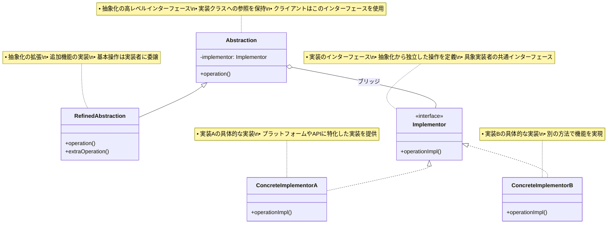

# Bridge（ブリッジ）パターン

## 目的

抽象化を実装から分離し、両者を独立して変更できるようにします。

## 価値・解決する問題

- 抽象化と実装の分離を実現します
- 実装の詳細を隠蔽します
- インターフェースと実装の独立した拡張が可能です
- 実行時の実装の切り替えが可能です
- 単一継承の制限を克服します

## 概要・特徴

### 概要

ブリッジパターンは、抽象化と実装を分離し、それぞれを独立して変更できるようにする設計パターンです。このパターンでは、抽象化（インターフェースや抽象クラス）と実装（具体的な実装クラス）を別々のクラス階層として設計し、抽象化が実装へのリファレンスを保持することで両者をつなぎます。これにより、クライアントコードは抽象化されたインターフェースのみを使用し、具体的な実装の詳細から切り離されます。

ブリッジパターンは、GOF（Gang of Four）の構造パターンの一つで、「抽象と実装の分離」という設計原則を実現するための重要な手段です。この概念は、ソフトウェア工学において「依存関係逆転の原則」（Dependency Inversion Principle, DIP）とも密接に関連しています。物理的な橋が二つの場所を結びつけるように、このパターンは抽象化と実装という二つの側面を結びつけます。

ブリッジパターンは特に次のような状況で有効です：

1. **複数の実装バリエーションがある場合**: 異なるプラットフォーム、データベース、グラフィックシステムなど
2. **抽象化に複数の変形がある場合**: 基本機能に加えて拡張機能が必要な場合
3. **実装の詳細を隠蔽したい場合**: クライアントに実装の詳細を見せたくない場合
4. **継承による階層の爆発を避けたい場合**: 複数の軸で変化する要素がある場合

多くの現代的なフレームワークやライブラリでは、この原則を応用した設計が見られます。例えば、ORMフレームワークは、データアクセスの抽象化と具体的なデータベース実装を分離しています。また、クロスプラットフォームUIフレームワークは、共通のUIコンポーネント（抽象化）と各プラットフォーム固有の描画機能（実装）を分離しています。

### 特徴

#### 抽象化と実装の分離

ブリッジパターンの中核となる特徴は、抽象化と実装を明確に分離することです。これにより、それぞれが独立して変更や拡張が可能になります。例えば、グラフィックシステムにおいて、「形状」の抽象化（円、四角形、三角形など）と「描画方法」の実装（ベクターレンダリング、ラスターレンダリングなど）を分離することで、新しい形状の追加や描画方法の変更が互いに影響せずに行えます。この分離により、システムの柔軟性が向上し、変更に対する耐性が高まります。

抽象化と実装の分離には、以下のようなメカニズムが使用されます：

- **インターフェース定義**: 明確な契約を通じて抽象化と実装の間の関係を定義
- **委譲**: 抽象化クラスが実装クラスのメソッドを呼び出す形で機能を実現
- **カプセル化**: 実装の詳細を抽象化の背後に隠蔽

この分離により、抽象化と実装それぞれのクラス階層が独立して進化できるため、システム全体の柔軟性と保守性が大幅に向上します。例えば、データベースアクセスレイヤーでは、クエリロジック（抽象化）とデータベースドライバー（実装）を分離することで、新しいデータベースエンジンへの移行やクエリロジックの改善が互いに干渉せずに行えます。

#### 継承の爆発を防止

ブリッジパターンは「継承の爆発」問題を効果的に解決します。複数の独立した次元で変化する側面を持つクラスを単一の継承階層で表現しようとすると、組み合わせの数だけクラスが必要となり、爆発的に増加します。例えば、3種類の形状（円、四角形、三角形）と3種類の描画方法（ベクター、ラスター、3D）があると、単純な継承だけでは9つのクラスが必要になります。さらに形状や描画方法が増えると、クラス数は掛け算で増えていきます。

ブリッジパターンでは、この問題を「抽象化」と「実装」という2つの独立した階層に分割することで解決します：

- 形状の階層：円、四角形、三角形（3クラス）
- 描画方法の階層：ベクター、ラスター、3D（3クラス）

この構造により、新しい形状や描画方法を追加する際にも、既存のコードへの影響を最小限に抑えながら拡張が可能です。例えば、新しい形状「六角形」を追加する場合、描画方法のクラスには一切手を加える必要がなく、抽象化階層に1つのクラスを追加するだけで済みます。同様に、新しい描画方法「モバイル向け最適化レンダリング」を追加する場合も、形状クラスには影響せず、実装階層に1つのクラスを追加するだけです。

このアプローチにより、n個の抽象化とm個の実装があるシステムで、n×mのクラスではなく、n+mのクラスで済むようになり、クラス階層の複雑さと保守コストが大幅に削減されます。これは特に、多様なプラットフォームやデバイスをサポートする必要があるクロスプラットフォームアプリケーションや、複数のバックエンドシステムと連携するミドルウェアで重要な利点となります。

#### 実行時の柔軟性

ブリッジパターンは実行時に抽象化と実装の組み合わせを動的に変更できる柔軟性を提供します。これは、依存性注入やファクトリーパターンと組み合わせることで、アプリケーションの動作を実行時に設定できることを意味します。例えば、メディアプレーヤーアプリケーションでは、再生コントロール（抽象化）と具体的なメディア形式のデコーダー（実装）の組み合わせを、ユーザーが選択したファイル形式に基づいて動的に決定できます。

この実行時の柔軟性は以下のような場面で特に価値を発揮します：

- **コンテキストに応じた実装の選択**: システムリソースの状況やユーザー設定に基づいて最適な実装を選択
- **A/Bテスト**: 異なる実装を同時に提供し、パフォーマンスや使用感を比較
- **プラグインアーキテクチャ**: 動的にロードされるプラグインを抽象化の実装として使用
- **グレイスフルデグラデーション**: 高機能な実装が利用できない場合に、基本的な実装へのフォールバックを提供

例えば、グラフィックを多用するゲームアプリケーションでは、ユーザーのハードウェア性能に応じて高品質レンダリングエンジンか低品質レンダリングエンジンかを実行時に選択できます。また、エンタープライズアプリケーションでは、開発環境ではインメモリデータベース、本番環境では実際のデータベースサーバーを使用するといった切り替えが容易になります。この柔軟性により、アプリケーションはより適応力が高く、様々な環境や要件に対応できるようになります。

#### 実装の詳細の隠蔽

ブリッジパターンは、実装の詳細をクライアントコードから効果的に隠蔽します。クライアントは抽象化インターフェースのみを通じて操作を行うため、背後にある実装の複雑さや変更から保護されます。これはカプセル化の原則を強化し、クライアントコードをより堅牢で保守しやすいものにします。

この隠蔽メカニズムには以下のような利点があります：

- **依存性の低減**: クライアントは具体的な実装の詳細を知る必要がない
- **テストの容易さ**: 実際の実装の代わりにモックやスタブを使用してテスト可能
- **セキュリティの向上**: 機密性の高い実装詳細を外部から隠蔽
- **API設計の自由度**: 内部実装を変更せずに、抽象化レイヤーのAPIを改善可能

例えば、クラウドストレージサービスのクライアントライブラリでは、ファイル操作のための一貫したインターフェース（抽象化）を提供しながら、異なるストレージプロバイダー（AWS S3、Google Cloud Storage、Azureなど）との通信の詳細（実装）を隠蔽できます。ユーザーはシンプルな「ファイルアップロード」操作を呼び出すだけで、背後では認証、リトライロジック、暗号化などの複雑な処理が行われます。また、セキュリティクリティカルなアプリケーションでは、暗号化アルゴリズムの実装詳細を隠蔽しながら、簡潔な暗号化/復号化インターフェースを提供することが可能です。この隠蔽により、将来的に脆弱性が発見された場合にも、クライアントコードに影響を与えることなく実装を更新できます。

#### 独立した進化と再利用性

ブリッジパターンの重要な特徴は、抽象化と実装の各階層が独立して進化し、再利用できることです。一度定義された実装クラスは、複数の異なる抽象化クラスで再利用できます。同様に、抽象化クラスも複数の実装と組み合わせることができます。この独立性により、コードの再利用性が高まり、開発効率が向上します。

この特徴は以下のような状況で特に価値を発揮します：

- **クロスプラットフォーム開発**: 共通のビジネスロジック（抽象化）を、異なるプラットフォーム（実装）で再利用
- **レガシーシステムの段階的な更新**: 新しい抽象化インターフェースを導入しながら、古い実装を徐々に置き換え
- **ライブラリやフレームワークの設計**: 一貫したAPIを提供しながら、様々な環境やバックエンドをサポート
- **チーム間の分業**: インターフェース設計チームと実装チームが並行して作業可能

例えば、UIフレームワークでは、共通のUIコンポーネント定義（抽象化）を複数のプラットフォーム（Web、デスクトップ、モバイルなど）の実装と組み合わせることで、見た目と操作感が一貫したクロスプラットフォームアプリケーションを効率的に開発できます。また、データアクセスレイヤーでは、統一されたデータ操作インターフェース（抽象化）を様々なデータソース（リレーショナルデータベース、NoSQLデータベース、REST API、ファイルシステムなど）の実装と組み合わせることで、データソースに依存しないビジネスロジックを構築できます。この独立した進化と再利用性により、ソフトウェアシステムの柔軟性、保守性、スケーラビリティが向上します。

### 概要図



## 類似パターンとの比較

- [Adapter (アダプター)](adapter.md): Bridge は実装を抽象化から分離し、これに対して Adapter は既存のインターフェースを変換します。
- [Strategy (ストラテジー)](strategy.md): Bridge は実装を抽象化から分離し、これに対して Strategy はアルゴリズムを切り替えます。
- [Abstract Factory (アブストラクトファクトリー)](abstract-factory.md): Bridge は実装を抽象化から分離し、これに対して Abstract Factory は関連オブジェクトの生成を抽象化します。

## 利用されているライブラリ／フレームワークの事例

- [JDBC](https://docs.oracle.com/javase/8/docs/technotes/guides/jdbc/): データベースドライバーの抽象化
- [Java AWT](https://docs.oracle.com/javase/8/docs/api/java/awt/package-summary.html): プラットフォーム依存のGUI実装
- [Logging Frameworks](https://logging.apache.org/log4j/2.x/): ロギング実装の抽象化

## 解説ページリンク

- [Refactoring Guru - Bridge Pattern](https://refactoring.guru/design-patterns/bridge)
- [SourceMaking - Bridge Pattern](https://sourcemaking.com/design_patterns/bridge)
- [Design Patterns - Bridge Pattern](https://www.oodesign.com/bridge-pattern.html)

## コード例

### Before:

継承を使用した実装の例

```typescript
abstract class Shape {
  abstract draw(): void;
}

class RedCircle extends Shape {
  draw(): void {
    console.log("赤い円を描画");
  }
}

class BlueCircle extends Shape {
  draw(): void {
    console.log("青い円を描画");
  }
}

class RedSquare extends Shape {
  draw(): void {
    console.log("赤い四角を描画");
  }
}

class BlueSquare extends Shape {
  draw(): void {
    console.log("青い四角を描画");
  }
}

// 使用例
const shapes: Shape[] = [
  new RedCircle(),
  new BlueCircle(),
  new RedSquare(),
  new BlueSquare()
];

shapes.forEach(shape => shape.draw());
```

### After:

ブリッジパターンを適用した実装

```typescript
// 実装のインターフェース
interface DrawingAPI {
  drawCircle(x: number, y: number, radius: number): void;
  drawSquare(x: number, y: number, side: number): void;
  setColor(color: string): void;
  getColor(): string;
  setOpacity(opacity: number): void;
  getOpacity(): number;
  clear(): void;
  save(): void;
  restore(): void;
}

// 具象実装クラス: Canvas API
class CanvasAPI implements DrawingAPI {
  private color: string = "#000000";
  private opacity: number = 1.0;
  private stateStack: { color: string; opacity: number }[] = [];

  drawCircle(x: number, y: number, radius: number): void {
    console.log(`Canvas: 円を描画 (x: ${x}, y: ${y}, radius: ${radius}, color: ${this.color}, opacity: ${this.opacity})`);
  }

  drawSquare(x: number, y: number, side: number): void {
    console.log(`Canvas: 四角を描画 (x: ${x}, y: ${y}, side: ${side}, color: ${this.color}, opacity: ${this.opacity})`);
  }

  setColor(color: string): void {
    this.color = color;
  }

  getColor(): string {
    return this.color;
  }

  setOpacity(opacity: number): void {
    this.opacity = Math.max(0, Math.min(1, opacity));
  }

  getOpacity(): number {
    return this.opacity;
  }

  clear(): void {
    console.log("Canvas: 描画をクリア");
  }

  save(): void {
    this.stateStack.push({ color: this.color, opacity: this.opacity });
    console.log("Canvas: 状態を保存");
  }

  restore(): void {
    const state = this.stateStack.pop();
    if (state) {
      this.color = state.color;
      this.opacity = state.opacity;
      console.log("Canvas: 状態を復元");
    }
  }
}

// 具象実装クラス: SVG API
class SVGAPI implements DrawingAPI {
  private color: string = "#000000";
  private opacity: number = 1.0;
  private stateStack: { color: string; opacity: number }[] = [];

  drawCircle(x: number, y: number, radius: number): void {
    console.log(`SVG: <circle cx="${x}" cy="${y}" r="${radius}" fill="${this.color}" opacity="${this.opacity}" />`);
  }

  drawSquare(x: number, y: number, side: number): void {
    console.log(`SVG: <rect x="${x}" y="${y}" width="${side}" height="${side}" fill="${this.color}" opacity="${this.opacity}" />`);
  }

  setColor(color: string): void {
    this.color = color;
  }

  getColor(): string {
    return this.color;
  }

  setOpacity(opacity: number): void {
    this.opacity = Math.max(0, Math.min(1, opacity));
  }

  getOpacity(): number {
    return this.opacity;
  }

  clear(): void {
    console.log("SVG: 描画をクリア");
  }

  save(): void {
    this.stateStack.push({ color: this.color, opacity: this.opacity });
    console.log("SVG: 状態を保存");
  }

  restore(): void {
    const state = this.stateStack.pop();
    if (state) {
      this.color = state.color;
      this.opacity = state.opacity;
      console.log("SVG: 状態を復元");
    }
  }
}

// 抽象化クラス
abstract class Shape {
  constructor(protected api: DrawingAPI) {}

  abstract draw(): void;
  abstract move(x: number, y: number): void;
  abstract getArea(): number;

  setColor(color: string): void {
    this.api.setColor(color);
  }

  setOpacity(opacity: number): void {
    this.api.setOpacity(opacity);
  }
}

// 精緻化された抽象クラス: 円
class Circle extends Shape {
  constructor(
    api: DrawingAPI,
    private x: number,
    private y: number,
    private radius: number
  ) {
    super(api);
  }

  draw(): void {
    this.api.drawCircle(this.x, this.y, this.radius);
  }

  move(x: number, y: number): void {
    this.x = x;
    this.y = y;
  }

  getArea(): number {
    return Math.PI * this.radius * this.radius;
  }
}

// 精緻化された抽象クラス: 四角形
class Square extends Shape {
  constructor(
    api: DrawingAPI,
    private x: number,
    private y: number,
    private side: number
  ) {
    super(api);
  }

  draw(): void {
    this.api.drawSquare(this.x, this.y, this.side);
  }

  move(x: number, y: number): void {
    this.x = x;
    this.y = y;
  }

  getArea(): number {
    return this.side * this.side;
  }
}

// 図形グループ（Composite パターンとの組み合わせ）
class ShapeGroup extends Shape {
  private shapes: Shape[] = [];

  constructor(api: DrawingAPI) {
    super(api);
  }

  addShape(shape: Shape): void {
    this.shapes.push(shape);
  }

  draw(): void {
    this.api.save();
    this.shapes.forEach(shape => shape.draw());
    this.api.restore();
  }

  move(x: number, y: number): void {
    this.shapes.forEach(shape => shape.move(x, y));
  }

  getArea(): number {
    return this.shapes.reduce((total, shape) => total + shape.getArea(), 0);
  }

  setColor(color: string): void {
    this.shapes.forEach(shape => shape.setColor(color));
  }

  setOpacity(opacity: number): void {
    this.shapes.forEach(shape => shape.setOpacity(opacity));
  }
}

// 使用例
function example() {
  // 描画APIの作成
  const canvasAPI = new CanvasAPI();
  const svgAPI = new SVGAPI();

  console.log("=== Canvas APIを使用した描画 ===");
  
  // 個別の図形の描画
  const circle1 = new Circle(canvasAPI, 100, 100, 50);
  circle1.setColor("#FF0000");
  circle1.setOpacity(0.8);
  circle1.draw();

  const square1 = new Square(canvasAPI, 200, 200, 100);
  square1.setColor("#0000FF");
  square1.setOpacity(0.6);
  square1.draw();

  console.log("\n=== SVG APIを使用した描画 ===");

  // 図形グループの作成と描画
  const group = new ShapeGroup(svgAPI);
  
  const circle2 = new Circle(svgAPI, 150, 150, 75);
  circle2.setColor("#00FF00");
  
  const square2 = new Square(svgAPI, 300, 300, 150);
  square2.setColor("#FF00FF");
  
  group.addShape(circle2);
  group.addShape(square2);
  
  // グループ全体の透明度を設定
  group.setOpacity(0.7);
  group.draw();

  // 図形の移動
  console.log("\n=== 図形の移動 ===");
  circle1.move(120, 120);
  circle1.draw();

  // 面積の計算
  console.log("\n=== 面積の計算 ===");
  console.log(`Circle1の面積: ${circle1.getArea()}`);
  console.log(`Square1の面積: ${square1.getArea()}`);
  console.log(`グループ全体の面積: ${group.getArea()}`);
}

// 実行
example();
```

### 関数型プログラミングスタイルでのBridge実装:

```typescript
// 関数型プログラミングアプローチでのBridgeパターン

// =========== 実装部分（Implementation） ===========

// DrawingAPIの型定義
type DrawingAPI = {
  // 基本描画関数
  drawCircle: (x: number, y: number, radius: number, style: DrawingStyle) => void
  drawSquare: (x: number, y: number, side: number, style: DrawingStyle) => void
  
  // ユーティリティ関数
  clear: () => void
  getApiName: () => string
}

// 描画スタイルの型定義
type DrawingStyle = Readonly<{
  color: string
  opacity: number
}>

// 標準のスタイル
const defaultStyle: DrawingStyle = Object.freeze({
  color: '#000000',
  opacity: 1.0
})

// スタイルを作成する関数
const createStyle = (
  options: Partial<DrawingStyle> = {}
): DrawingStyle => Object.freeze({
  ...defaultStyle,
  ...options
})

// Canvas API の実装
const createCanvasAPI = (): DrawingAPI => {
  return {
    drawCircle: (x, y, radius, style) => {
      console.log(`Canvas: 円を描画 (x: ${x}, y: ${y}, radius: ${radius}, color: ${style.color}, opacity: ${style.opacity})`)
    },
    
    drawSquare: (x, y, side, style) => {
      console.log(`Canvas: 四角を描画 (x: ${x}, y: ${y}, side: ${side}, color: ${style.color}, opacity: ${style.opacity})`)
    },
    
    clear: () => {
      console.log('Canvas: 描画をクリア')
    },
    
    getApiName: () => 'Canvas API'
  }
}

// SVG API の実装
const createSvgAPI = (): DrawingAPI => {
  return {
    drawCircle: (x, y, radius, style) => {
      console.log(`SVG: <circle cx="${x}" cy="${y}" r="${radius}" fill="${style.color}" opacity="${style.opacity}" />`)
    },
    
    drawSquare: (x, y, side, style) => {
      console.log(`SVG: <rect x="${x}" y="${y}" width="${side}" height="${side}" fill="${style.color}" opacity="${style.opacity}" />`)
    },
    
    clear: () => {
      console.log('SVG: 描画をクリア')
    },
    
    getApiName: () => 'SVG API'
  }
}

// =========== 抽象化部分（Abstraction） ===========

// Shape（図形）の型定義
type Shape = {
  // 基本プロパティ
  readonly type: string
  position: { x: number, y: number }
  style: DrawingStyle
  
  // 操作
  draw: (api: DrawingAPI) => void
  move: (x: number, y: number) => Shape
  withStyle: (newStyle: Partial<DrawingStyle>) => Shape
  getArea: () => number
}

// 円を作成する関数
const createCircle = (
  x: number,
  y: number,
  radius: number,
  style: DrawingStyle = defaultStyle
): Shape => {
  // イミュータブルなオブジェクトとプロパティ
  const position = { x, y }
  
  // インスタンス
  const circle: Shape = {
    type: 'circle',
    position,
    style,
    
    draw: (api) => {
      api.drawCircle(position.x, position.y, radius, style)
    },
    
    move: (newX, newY) => {
      return createCircle(newX, newY, radius, style)
    },
    
    withStyle: (newStyleProps) => {
      const newStyle = createStyle({ ...style, ...newStyleProps })
      return createCircle(position.x, position.y, radius, newStyle)
    },
    
    getArea: () => Math.PI * radius * radius
  }
  
  return circle
}

// 四角形を作成する関数
const createSquare = (
  x: number,
  y: number,
  side: number,
  style: DrawingStyle = defaultStyle
): Shape => {
  // イミュータブルなオブジェクトとプロパティ
  const position = { x, y }
  
  // インスタンス
  const square: Shape = {
    type: 'square',
    position,
    style,
    
    draw: (api) => {
      api.drawSquare(position.x, position.y, side, style)
    },
    
    move: (newX, newY) => {
      return createSquare(newX, newY, side, style)
    },
    
    withStyle: (newStyleProps) => {
      const newStyle = createStyle({ ...style, ...newStyleProps })
      return createSquare(position.x, position.y, side, newStyle)
    },
    
    getArea: () => side * side
  }
  
  return square
}

// 図形グループを作成する関数
const createShapeGroup = (
  shapes: Shape[] = [],
  style: DrawingStyle = defaultStyle
): Shape & { addShape: (shape: Shape) => Shape & { addShape: any } } => {
  // インスタンス
  const group = {
    type: 'group',
    position: { x: 0, y: 0 }, // グループの位置は内部の図形に委譲
    style,
    
    draw: (api) => {
      console.log(`${api.getApiName()}: グループの描画を開始 (要素数: ${shapes.length})`)
      shapes.forEach(shape => shape.draw(api))
      console.log(`${api.getApiName()}: グループの描画を終了`)
    },
    
    move: (newX, newY) => {
      // 各図形の相対位置を維持したまま移動
      const offsetX = newX - group.position.x
      const offsetY = newY - group.position.y
      
      const movedShapes = shapes.map(shape => 
        shape.move(shape.position.x + offsetX, shape.position.y + offsetY)
      )
      
      return createShapeGroup(movedShapes, style)
    },
    
    withStyle: (newStyleProps) => {
      const newStyle = createStyle({ ...style, ...newStyleProps })
      
      // グループ内の全ての図形にスタイルを適用
      const styledShapes = shapes.map(shape => 
        shape.withStyle(newStyleProps)
      )
      
      return createShapeGroup(styledShapes, newStyle)
    },
    
    getArea: () => {
      return shapes.reduce((total, shape) => total + shape.getArea(), 0)
    },
    
    // グループ固有の操作
    addShape: (shape) => {
      return createShapeGroup([...shapes, shape], style)
    }
  }
  
  return group
}

// =========== 操作関数（Operations） ===========

// 図形の描画をラップする関数
const drawShape = (api: DrawingAPI) => (shape: Shape): void => {
  shape.draw(api)
}

// スタイル適用をラップする関数
const withColor = (color: string) => (shape: Shape): Shape => {
  return shape.withStyle({ color })
}

const withOpacity = (opacity: number) => (shape: Shape): Shape => {
  return shape.withStyle({ opacity })
}

// 関数合成ユーティリティ
const pipe = <T>(...fns: Array<(arg: T) => T>) => 
  (value: T): T => fns.reduce((acc, fn) => fn(acc), value)

// =========== クライアントコード（Client） ===========

// 関数型プログラミングスタイルでのサンプル
const functionalExample = (): void => {
  console.log('\n=== 関数型プログラミングスタイルでのBridgeパターン ===\n')
  
  // APIの作成
  const canvasAPI = createCanvasAPI()
  const svgAPI = createSvgAPI()
  
  // 図形の作成
  const redCircle = pipe(
    withColor('#FF0000'),
    withOpacity(0.8)
  )(createCircle(100, 100, 50))
  
  const blueSquare = pipe(
    withColor('#0000FF'),
    withOpacity(0.6)
  )(createSquare(200, 200, 100))

  console.log('=== Canvas APIを使用した描画（関数型） ===')
  
  // 描画関数の作成
  const drawOnCanvas = drawShape(canvasAPI)
  
  // 個別の図形の描画
  drawOnCanvas(redCircle)
  drawOnCanvas(blueSquare)
  
  console.log('\n=== SVG APIを使用した描画（関数型） ===')
  
  // 描画関数の作成
  const drawOnSVG = drawShape(svgAPI)
  
  // 図形グループの作成
  const greenCircle = pipe(
    withColor('#00FF00')
  )(createCircle(150, 150, 75))
  
  const purpleSquare = pipe(
    withColor('#FF00FF')
  )(createSquare(300, 300, 150))
  
  // イミュータブルな方法でグループを構築
  const group = pipe(
    group => group.addShape(greenCircle),
    group => group.addShape(purpleSquare),
    withOpacity(0.7)
  )(createShapeGroup())
  
  // グループの描画
  drawOnSVG(group)
  
  // 図形の移動 (イミュータブル)
  console.log('\n=== 図形の移動（関数型） ===')
  const movedCircle = redCircle.move(120, 120)
  drawOnCanvas(movedCircle)
  
  // 面積の計算
  console.log('\n=== 面積の計算（関数型） ===')
  console.log(`元の円の面積: ${redCircle.getArea()}`)
  console.log(`青い四角形の面積: ${blueSquare.getArea()}`)
  console.log(`グループ全体の面積: ${group.getArea()}`)
  
  // 関数型アプローチを活用した操作
  console.log('\n=== 高度な操作（関数型） ===')
  
  // マップ操作: 全ての図形の面積を計算
  const shapes = [redCircle, blueSquare, greenCircle, purpleSquare]
  const areas = shapes.map(shape => shape.getArea())
  console.log('全ての図形の面積:', areas)
  
  // フィルター操作: 特定の条件の図形だけを抽出
  const largeShapes = shapes.filter(shape => shape.getArea() > 10000)
  console.log(`大きな図形の数: ${largeShapes.length}`)
  
  // リデュース操作: 全ての図形の面積の合計
  const totalArea = shapes.reduce((sum, shape) => sum + shape.getArea(), 0)
  console.log(`全ての図形の面積の合計: ${totalArea}`)
}

// 実行
functionalExample()
```
