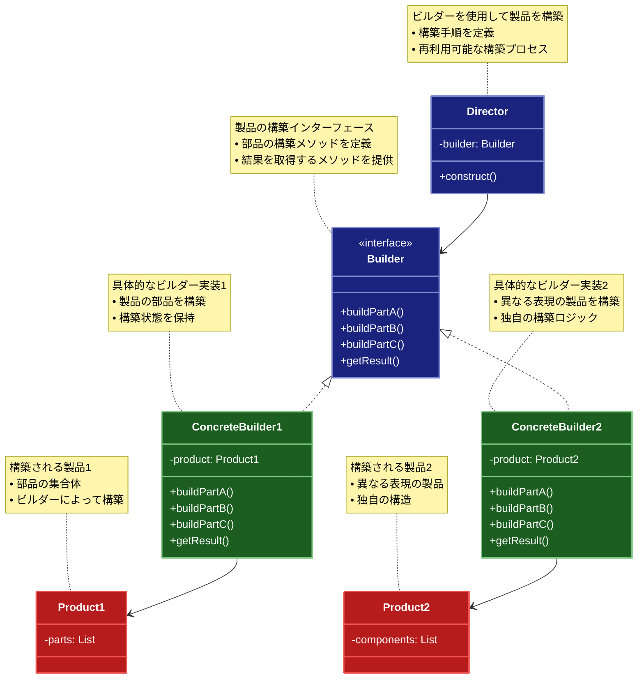

# Builder（ビルダー）パターン

## 目的

複雑なオブジェクトの生成過程を段階的に実行し、同じ生成過程で異なる表現のオブジェクトを生成可能にするパターンです。

## 価値・解決する問題

- 複雑なオブジェクトの生成を簡素化します
- 生成過程と表現を分離します
- 段階的な構築を可能にします
- コードの可読性を向上させます
- 不変性を確保します

## 概要・特徴

### 概要

Builderパターンは、複雑なオブジェクトの生成過程を段階的に実行できるようにする設計パターンです。オブジェクトの構築と表現を分離し、同じ構築過程で異なる表現のオブジェクトを生成することができます。このパターンは特に複雑な初期化プロセスを持つオブジェクトや、様々な設定オプションを持つオブジェクトの生成に適しています。

### 特徴

#### 段階的な構築

複雑なオブジェクトを一度に作成するのではなく、複数のステップに分けて段階的に構築します。各ステップでオブジェクトの特定の部分を設定することで、構築プロセスを管理しやすくし、エラーを減らすことができます。これにより、コンストラクタの肥大化や複雑化を防ぎ、より整理された構築プロセスを実現できます。

#### 表現の分離

オブジェクトの構築プロセスとその表現（生成されるオブジェクト）を分離します。同じ構築プロセスを使用して、異なる表現のオブジェクトを生成できるようになります。これにより、構築ロジックを再利用しながら、多様なオブジェクト形式に対応できます。

#### 柔軟な構成

必要な部分だけを選択的に構築でき、構築順序を制御できます。オブジェクトのすべてのプロパティを設定する必要はなく、特定のユースケースに合わせて必要な部分のみを設定することが可能です。これにより、様々な構成の製品を柔軟に生成できます。

#### 不変性の確保

完全に構築されるまでオブジェクトを公開せず、不完全な状態のオブジェクトが使用されることを防止します。特に不変オブジェクト（イミュータブルオブジェクト）を作成する際に有用で、一度生成されたオブジェクトの状態が変更されないことを保証できます。

#### コードの整理

Builderパターンは、大量のパラメータを持つコンストラクタ（テレスコーピング・コンストラクタ）やセッターメソッドの乱用による問題を効果的に解決します。複雑なオブジェクト生成において、10個以上のパラメータを持つコンストラクタは可読性が低下し、パラメータの順序を間違えるリスクが高まります。また、セッターメソッドを使用した方法では、オブジェクトが不完全な状態で使用される可能性があります。例えば、Webアプリケーションの設定オブジェクトやネットワークリクエストの構築では、多数のオプションパラメータが存在することが一般的です。Builderパターンでは、メソッドチェーンを使用した宣言的なスタイルでオブジェクトを構築でき、`new NetworkRequest().withTimeout(30).withRetries(3).withHeaders(headers).build()`のような直感的なコードになります。これにより、コードの意図が明確になり、IDE補完機能の恩恵も受けやすくなります。また、必須パラメータはコンストラクタで、オプションパラメータはビルダーメソッドで設定するといった区別も可能になり、API設計の観点からも優れた手法となります。複雑なオブジェクト構築ロジックが一箇所にまとまるため、テストも容易になり、コードベース全体の保守性が向上します。

#### 検証とエラー処理

Builderパターンは、オブジェクト生成時のバリデーション（検証）とエラー処理を統合するのに適しています。各ビルダーメソッドでパラメータの妥当性を検証し、不正な値が設定された場合は例外をスローするか、エラーフラグを設定できます。また、最終的な`build()`メソッドでオブジェクト全体の整合性を検証することも可能です。例えば、日付範囲を表すオブジェクトでは「開始日が終了日より前であること」などの複雑な検証ルールを適用できます。データベース接続設定を構築する場合、ホスト名、ポート、認証情報などの組み合わせが有効かどうかを検証し、問題があれば明確なエラーメッセージを提供できます。これにより、オブジェクト生成時のエラーが早期に発見され、デバッグが容易になります。さらに、エラー原因の特定も簡単になり、ユーザーに対して具体的なフィードバックを提供できるため、特にAPIやライブラリの設計において重要な利点となります。

### 概要図



## 類似パターンとの比較

- [Abstract Factory (抽象ファクトリー)](abstract-factory.md): Builder は複雑なオブジェクトの構築手順を定義し、これに対して Abstract Factory は関連するオブジェクト群の生成を提供します。
- [Factory Method (ファクトリーメソッド)](factory-method.md): Builder は複雑なオブジェクトの構築手順を定義し、これに対して Factory Method は単一のオブジェクト生成に焦点を当てます。
- [Prototype (プロトタイプ)](prototype.md): Builder は新しいオブジェクトの構築手順を定義し、これに対して Prototype は既存のオブジェクトのクローンを作成します。

## 利用されているライブラリ／フレームワークの事例

- [StringBuilder](https://docs.oracle.com/javase/8/docs/api/java/lang/StringBuilder.html): Java
- [Retrofit](https://square.github.io/retrofit/): API Client Builder
- [Lombok](https://projectlombok.org/): @Builder Annotation

## 解説ページリンク

- [Refactoring Guru - Builder Pattern](https://refactoring.guru/design-patterns/builder)
- [SourceMaking - Builder Pattern](https://sourcemaking.com/design_patterns/builder)
- [Design Patterns - Builder Pattern](https://www.oodesign.com/builder-pattern.html)

## コード例

### Before:

複雑なコンストラクタによる実装

```typescript
class Pizza {
  constructor(
    public size: "small" | "medium" | "large",
    public cheese: boolean = false,
    public pepperoni: boolean = false,
    public mushrooms: boolean = false,
    public onions: boolean = false,
    public peppers: boolean = false,
    public sauce: "tomato" | "bbq" | "garlic" = "tomato",
    public extraCheese: boolean = false,
    public stuffedCrust: boolean = false,
    public thinCrust: boolean = false
  ) {}

  describe(): void {
    console.log(`${this.size}サイズのピザ:`);
    if (this.cheese) console.log("- チーズ");
    if (this.pepperoni) console.log("- ペパロニ");
    if (this.mushrooms) console.log("- マッシュルーム");
    if (this.onions) console.log("- オニオン");
    if (this.peppers) console.log("- ピーマン");
    console.log(`- ${this.sauce}ソース`);
    if (this.extraCheese) console.log("- エクストラチーズ");
    if (this.stuffedCrust) console.log("- スタッフドクラスト");
    if (this.thinCrust) console.log("- 薄焼き");
  }
}

// 使用例
const pizza1 = new Pizza(
  "large",
  true,
  true,
  false,
  true,
  false,
  "tomato",
  true,
  false,
  true
);

const pizza2 = new Pizza(
  "medium",
  true,
  false,
  true,
  true,
  true,
  "bbq",
  false,
  true,
  false
);

pizza1.describe();
console.log("---");
pizza2.describe();
```

### After:

Builderパターンを適用した実装

```typescript
// ピザの製品クラス
class Pizza {
  constructor(private builder: PizzaBuilder) {}

  describe(): void {
    console.log(`${this.builder.size}サイズのピザ:`);
    
    // トッピング
    this.builder.toppings.forEach(topping => {
      console.log(`- ${topping}`);
    });

    // ソース
    console.log(`- ${this.builder.sauce}ソース`);

    // 特別オプション
    this.builder.options.forEach(option => {
      console.log(`- ${option}`);
    });

    // 価格
    console.log(`価格: ${this.builder.calculatePrice()}円`);
  }

  getSize(): string {
    return this.builder.size;
  }

  getToppings(): string[] {
    return [...this.builder.toppings];
  }

  getSauce(): string {
    return this.builder.sauce;
  }

  getOptions(): string[] {
    return [...this.builder.options];
  }
}

// ピザビルダー
class PizzaBuilder {
  size: "small" | "medium" | "large" = "medium";
  toppings: string[] = [];
  sauce: "tomato" | "bbq" | "garlic" = "tomato";
  options: string[] = [];

  // サイズの設定
  setSize(size: "small" | "medium" | "large"): this {
    this.size = size;
    return this;
  }

  // トッピングの追加
  addTopping(topping: string): this {
    if (!this.toppings.includes(topping)) {
      this.toppings.push(topping);
    }
    return this;
  }

  // ソースの設定
  setSauce(sauce: "tomato" | "bbq" | "garlic"): this {
    this.sauce = sauce;
    return this;
  }

  // オプションの追加
  addOption(option: string): this {
    if (!this.options.includes(option)) {
      this.options.push(option);
    }
    return this;
  }

  // 価格の計算
  calculatePrice(): number {
    let price = 0;

    // サイズによる基本価格
    switch (this.size) {
      case "small":
        price = 1000;
        break;
      case "medium":
        price = 1500;
        break;
      case "large":
        price = 2000;
        break;
    }

    // トッピング料金
    price += this.toppings.length * 200;

    // 特別オプション料金
    price += this.options.length * 300;

    return price;
  }

  // ピザの生成
  build(): Pizza {
    return new Pizza(this);
  }
}

// ピザディレクター
class PizzaDirector {
  private builder: PizzaBuilder;

  constructor(builder: PizzaBuilder) {
    this.builder = builder;
  }

  // マルゲリータピザの作成
  createMargherita(): Pizza {
    return this.builder
      .setSize("medium")
      .setSauce("tomato")
      .addTopping("モッツァレラチーズ")
      .addTopping("バジル")
      .build();
  }

  // ペパロニピザの作成
  createPepperoni(): Pizza {
    return this.builder
      .setSize("large")
      .setSauce("tomato")
      .addTopping("モッツァレラチーズ")
      .addTopping("ペパロニ")
      .addOption("エクストラチーズ")
      .build();
  }

  // ベジタリアンピザの作成
  createVegetarian(): Pizza {
    return this.builder
      .setSize("medium")
      .setSauce("garlic")
      .addTopping("マッシュルーム")
      .addTopping("ピーマン")
      .addTopping("オニオン")
      .addTopping("トマト")
      .addOption("薄焼き")
      .build();
  }

  // BBQチキンピザの作成
  createBBQChicken(): Pizza {
    return this.builder
      .setSize("large")
      .setSauce("bbq")
      .addTopping("グリルドチキン")
      .addTopping("オニオン")
      .addTopping("モッツァレラチーズ")
      .addOption("スタッフドクラスト")
      .build();
  }
}

// 使用例
async function example() {
  // ビルダーとディレクターの準備
  const builder = new PizzaBuilder();
  const director = new PizzaDirector(builder);

  console.log("=== 定番ピザの注文 ===");

  // マルゲリータ
  console.log("\n【マルゲリータ】");
  const margherita = director.createMargherita();
  margherita.describe();

  // ペパロニ
  console.log("\n【ペパロニ】");
  const pepperoni = director.createPepperoni();
  pepperoni.describe();

  // ベジタリアン
  console.log("\n【ベジタリアン】");
  const vegetarian = director.createVegetarian();
  vegetarian.describe();

  // BBQチキン
  console.log("\n【BBQチキン】");
  const bbqChicken = director.createBBQChicken();
  bbqChicken.describe();

  console.log("\n=== カスタムピザの注文 ===");

  // カスタムピザの作成
  const customPizza = new PizzaBuilder()
    .setSize("large")
    .setSauce("garlic")
    .addTopping("モッツァレラチーズ")
    .addTopping("ゴルゴンゾーラチーズ")
    .addTopping("パルメザンチーズ")
    .addTopping("マッシュルーム")
    .addOption("エクストラチーズ")
    .addOption("スタッフドクラスト")
    .build();

  console.log("\n【4種のチーズピザ】");
  customPizza.describe();
}

// 実行
example().catch(console.error);
```

### 関数型プログラミングスタイルでのBuilder実装:

```typescript
// 関数型プログラミングアプローチでのBuilderパターン

// ピザの型定義
type PizzaSize = 'small' | 'medium' | 'large'
type SauceType = 'tomato' | 'bbq' | 'garlic'

// イミュータブルなピザの状態を表す型
type PizzaState = Readonly<{
  size: PizzaSize
  toppings: ReadonlyArray<string>
  sauce: SauceType
  options: ReadonlyArray<string>
}>

// デフォルトのピザ状態
const defaultPizzaState: PizzaState = Object.freeze({
  size: 'medium',
  toppings: Object.freeze([]),
  sauce: 'tomato',
  options: Object.freeze([])
})

// ピザを作成する関数型ビルダー
const createPizza = (overrides: Partial<PizzaState> = {}): PizzaState => {
  return Object.freeze({
    ...defaultPizzaState,
    ...overrides,
    // 配列は新しいイミュータブルな配列として作成
    toppings: overrides.toppings || defaultPizzaState.toppings,
    options: overrides.options || defaultPizzaState.options
  })
}

// 変換関数（ピザの状態を変更する純粋関数）
const withSize = (size: PizzaSize) => (pizza: PizzaState): PizzaState => {
  return Object.freeze({
    ...pizza,
    size
  })
}

const withSauce = (sauce: SauceType) => (pizza: PizzaState): PizzaState => {
  return Object.freeze({
    ...pizza,
    sauce
  })
}

const withTopping = (topping: string) => (pizza: PizzaState): PizzaState => {
  // トッピングがすでに存在する場合は追加しない
  if (pizza.toppings.includes(topping)) {
    return pizza
  }
  
  return Object.freeze({
    ...pizza,
    toppings: Object.freeze([...pizza.toppings, topping])
  })
}

const withOption = (option: string) => (pizza: PizzaState): PizzaState => {
  // オプションがすでに存在する場合は追加しない
  if (pizza.options.includes(option)) {
    return pizza
  }
  
  return Object.freeze({
    ...pizza,
    options: Object.freeze([...pizza.options, option])
  })
}

// 関数合成用のユーティリティ
const pipe = <T>(...fns: Array<(arg: T) => T>) => 
  (value: T) => fns.reduce((acc, fn) => fn(acc), value)

// ピザの価格を計算する関数
const calculatePrice = (pizza: PizzaState): number => {
  let price = 0

  // サイズによる基本価格
  switch (pizza.size) {
    case 'small':
      price = 1000
      break
    case 'medium':
      price = 1500
      break
    case 'large':
      price = 2000
      break
  }

  // トッピング料金
  price += pizza.toppings.length * 200

  // 特別オプション料金
  price += pizza.options.length * 300

  return price
}

// ピザの情報を表示する関数
const describePizza = (pizza: PizzaState): void => {
  console.log(`${pizza.size}サイズのピザ:`)
  
  // トッピング
  pizza.toppings.forEach(topping => {
    console.log(`- ${topping}`)
  })

  // ソース
  console.log(`- ${pizza.sauce}ソース`)

  // 特別オプション
  pizza.options.forEach(option => {
    console.log(`- ${option}`)
  })

  // 価格
  console.log(`価格: ${calculatePrice(pizza)}円`)
}

// ピザレシピを定義する関数（ディレクターに相当）
const createMargherita = (): PizzaState => {
  return pipe(
    withSize('medium'),
    withSauce('tomato'),
    withTopping('モッツァレラチーズ'),
    withTopping('バジル')
  )(createPizza())
}

const createPepperoni = (): PizzaState => {
  return pipe(
    withSize('large'),
    withSauce('tomato'),
    withTopping('モッツァレラチーズ'),
    withTopping('ペパロニ'),
    withOption('エクストラチーズ')
  )(createPizza())
}

const createVegetarian = (): PizzaState => {
  return pipe(
    withSize('medium'),
    withSauce('garlic'),
    withTopping('マッシュルーム'),
    withTopping('ピーマン'),
    withTopping('オニオン'),
    withTopping('トマト'),
    withOption('薄焼き')
  )(createPizza())
}

const createBBQChicken = (): PizzaState => {
  return pipe(
    withSize('large'),
    withSauce('bbq'),
    withTopping('グリルドチキン'),
    withTopping('オニオン'),
    withTopping('モッツァレラチーズ'),
    withOption('スタッフドクラスト')
  )(createPizza())
}

// カスタムピザを作成するヘルパー関数
const createCustomPizza = (
  size: PizzaSize,
  sauce: SauceType,
  toppings: string[] = [],
  options: string[] = []
): PizzaState => {
  // 初期状態から始める
  let pizza = createPizza()
  
  // サイズとソースを設定
  pizza = withSize(size)(pizza)
  pizza = withSauce(sauce)(pizza)
  
  // トッピングを追加
  for (const topping of toppings) {
    pizza = withTopping(topping)(pizza)
  }
  
  // オプションを追加
  for (const option of options) {
    pizza = withOption(option)(pizza)
  }
  
  return pizza
}

// チェーンなしで関数を直接使用する方法
const createCustomPizzaAlt = (
  size: PizzaSize,
  sauce: SauceType,
  toppings: string[] = [],
  options: string[] = []
): PizzaState => {
  // 関数合成を使用してピザを作成
  return pipe(
    withSize(size),
    withSauce(sauce),
    ...toppings.map(topping => withTopping(topping)),
    ...options.map(option => withOption(option))
  )(createPizza())
}

// 関数型プログラミングスタイルでのサンプル
const functionalExample = (): void => {
  console.log('\n=== 関数型プログラミングスタイルでのBuilderパターン ===\n')
  
  // 定番ピザ
  console.log('=== 定番ピザの注文（関数型） ===')
  
  console.log('\n【マルゲリータ】')
  const margherita = createMargherita()
  describePizza(margherita)
  
  console.log('\n【ペパロニ】')
  const pepperoni = createPepperoni()
  describePizza(pepperoni)
  
  console.log('\n【ベジタリアン】')
  const vegetarian = createVegetarian()
  describePizza(vegetarian)
  
  console.log('\n【BBQチキン】')
  const bbqChicken = createBBQChicken()
  describePizza(bbqChicken)
  
  // カスタムピザ
  console.log('\n=== カスタムピザの注文（関数型） ===')
  
  // パイプを使ったカスタムピザ
  console.log('\n【4種のチーズピザ（パイプ使用）】')
  const fourCheesePizza = pipe(
    withSize('large'),
    withSauce('garlic'),
    withTopping('モッツァレラチーズ'),
    withTopping('ゴルゴンゾーラチーズ'),
    withTopping('パルメザンチーズ'),
    withTopping('リコッタチーズ'),
    withOption('エクストラチーズ'),
    withOption('スタッフドクラスト')
  )(createPizza())
  
  describePizza(fourCheesePizza)
  
  // ヘルパー関数を使ったカスタムピザ
  console.log('\n【シーフードピザ（ヘルパー関数使用）】')
  const seafoodPizza = createCustomPizza(
    'medium',
    'tomato',
    ['モッツァレラチーズ', 'エビ', 'イカ', 'アサリ', 'ムール貝'],
    ['薄焼き']
  )
  
  describePizza(seafoodPizza)
  
  // 部分適用と関数合成の例
  const createLargePizza = withSize('large')
  const withTomatoSauce = withSauce('tomato')
  const withCheese = withTopping('モッツァレラチーズ')
  
  console.log('\n【ミート・ラバーズ（関数合成使用）】')
  const meatLoversPizza = pipe(
    createLargePizza,
    withTomatoSauce,
    withCheese,
    withTopping('ベーコン'),
    withTopping('ソーセージ'),
    withTopping('ペパロニ'),
    withTopping('ハム'),
    withOption('エクストラチーズ')
  )(createPizza())
  
  describePizza(meatLoversPizza)
  
  // イミュータビリティのデモ
  console.log('\n=== イミュータビリティのデモ ===')
  
  const basePizza = createPizza()
  console.log('基本ピザ:', JSON.stringify(basePizza))
  
  const pizzaWithSize = withSize('large')(basePizza)
  console.log('サイズ変更後:', JSON.stringify(pizzaWithSize))
  console.log('元のピザは変更されていない:', JSON.stringify(basePizza))
  
  const pizzaWithTopping = withTopping('モッツァレラチーズ')(pizzaWithSize)
  console.log('トッピング追加後:', JSON.stringify(pizzaWithTopping))
  console.log('前のピザは変更されていない:', JSON.stringify(pizzaWithSize))
}

// 実行
functionalExample()
```
