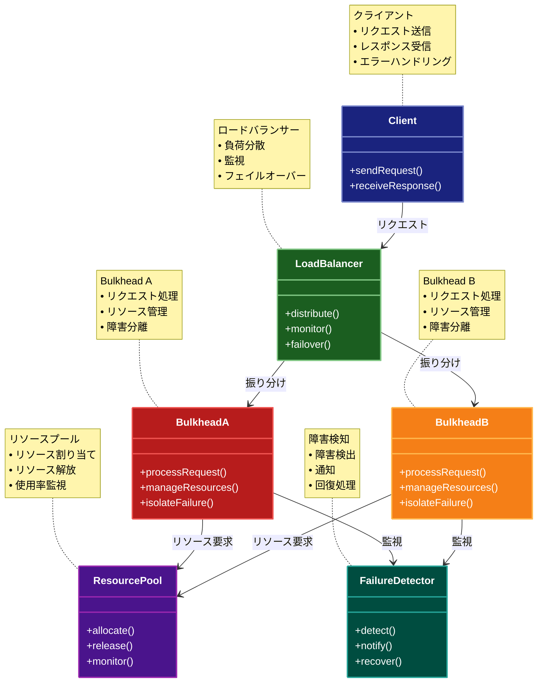

# Bulkhead（バルクヘッド）パターン

## 目的

アプリケーションの異なるコンポーネントを分離し、一部のコンポーネントの障害が他のコンポーネントに影響を与えないようにするパターンです。

## 価値・解決する問題

- 障害の影響を局所化します
- システムの安定性を向上させます
- リソースの分離を実現します
- スケーラビリティを向上させます
- 障害からの回復を容易にします

## 概要・特徴

### 概要

Bulkheadパターンは、船舶の水密区画にちなんで名付けられた設計パターンです。アプリケーションの異なるコンポーネントを分離し、一部のコンポーネントの障害が他のコンポーネントに影響を与えないようにします。

### 特徴

#### コンポーネントの分離
Bulkheadパターンの主要な特徴として、アプリケーションの異なるコンポーネントやサービスを論理的あるいは物理的に分離することが挙げられます。この分離は、マイクロサービスアーキテクチャでの別個のサービスとしての実装、スレッドプールの分離、異なるプロセスへの分割、あるいは完全に別のインフラストラクチャへのデプロイなど、様々なレベルで実現できます。例えば、Eコマースシステムでは、商品検索、在庫管理、決済処理、顧客管理など、機能ごとに独立したコンポーネントを設計し、それぞれが他のコンポーネントに依存せずに動作できるようにします。この分離により、あるコンポーネントで問題が発生しても、他のコンポーネントは引き続き正常に機能できるため、部分的な障害時でもシステム全体の稼働を維持できます。また、各コンポーネントが独立しているため、個別にスケーリング、更新、デプロイが可能になり、開発と運用の柔軟性が向上します。

#### リソースの隔離
各コンポーネントやサービスに専用のリソース（メモリ、CPU、接続プール、スレッドなど）を割り当てることで、リソースの競合を防ぎ、一部のコンポーネントのリソース枯渇が他のコンポーネントに影響しないようにします。例えば、データベース接続においては、重要度の高いトランザクション処理用と、重要度の低いレポート生成用に別々の接続プールを用意することで、レポート生成の負荷が高まってもトランザクション処理に影響を与えないようにできます。また、マルチテナントシステムでは、テナントごとに専用のリソースを割り当てることで、特定のテナントの過剰な使用が他のテナントのパフォーマンスに影響しないように設計できます。リソースの隔離は、静的な割り当て（固定サイズのスレッドプールなど）または動的な割り当て（需要に応じて自動的にスケーリングする仕組み）を通じて実現できます。適切なリソース隔離を実装することで、ピーク時の負荷においても予測可能なパフォーマンスとサービス品質を維持することが可能になります。

#### 障害の局所化
Bulkheadパターンの最も重要な効果の一つは、システム内の障害が波及することを防ぎ、影響範囲を局所化できることです。例えば、メモリリーク、無限ループ、応答遅延などの問題が発生しても、それは該当するコンポーネント内に封じ込められ、システム全体がダウンするのを防ぎます。特に分散システムでは、ネットワーク障害、サードパーティサービスの応答遅延、データベースの過負荷などの問題が常に発生する可能性がありますが、Bulkheadパターンを適用することで、これらの障害の影響を最小限に抑えることができます。例えば、支払い処理サービスに問題が発生しても、ユーザーは引き続き商品の閲覧や検索を行えるため、部分的な機能低下はあっても、サイト全体が使用不能になるような致命的な状況を回避できます。このような障害の局所化は、特に高可用性が求められるミッションクリティカルなシステムにおいて重要な価値を提供します。

#### スケーラビリティ
コンポーネントごとに独立してスケーリングできる能力は、Bulkheadパターンの重要な特徴です。各コンポーネントが明確に分離されているため、特定のコンポーネントに負荷が集中した場合でも、そのコンポーネントだけを個別にスケールアウトすることが可能になります。例えば、商品検索サービスは消費者の行動パターンにより日中の負荷が高くなる一方、バッチ処理サービスは夜間の負荷が高くなるといった場合、それぞれのピーク時に合わせて独立してリソースを割り当てることができます。また、クラウド環境では、コンテナやサーバーレス機能を使用して、需要に応じた自動スケーリングを実装することも可能です。この柔軟なスケーラビリティにより、システム全体のコスト効率が向上するとともに、特定の機能がボトルネックとなってシステム全体のパフォーマンスが低下するというリスクを軽減できます。さらに、新しい機能や要件に対応するための拡張も、既存のコンポーネントに影響を与えることなく実施できます。

#### 回復力の向上
Bulkheadパターンを適用することで、システム全体の回復力（レジリエンス）が大幅に向上します。障害が発生した際に、影響を受けるコンポーネントを再起動または修復している間も、他のコンポーネントは正常に機能し続けることができます。これにより、システム全体がダウンする時間を最小限に抑え、部分的な機能制限があったとしても、ユーザーに何らかのサービスを提供し続けることができます。また、障害検出と回復のメカニズムも各コンポーネントに特化して実装できるため、障害の種類や重要度に応じた適切な対応が可能になります。例えば、重要度の低いサービスでは単純な再試行、重要度の高いサービスではより洗練されたサーキットブレーカーパターンや冗長構成を適用するといった戦略を取ることができます。回復力の高いシステムは、予期せぬ障害やピーク負荷に対しても安定して動作し、ビジネスの継続性を確保するとともに、ユーザー体験の一貫性を維持することができます。

### 概要図



## 類似パターンとの比較

- [Circuit Breaker (サーキットブレーカー)](circuit-breaker.md): Bulkhead は分離による障害の局所化を行い、これに対して Circuit Breaker は障害検知による遮断を行います。
- [Rate Limiter (レートリミッター)](rate-limiter.md): Bulkhead はリソースの分離を行い、これに対して Rate Limiter はリクエストの制限を行います。
- [Retry (リトライ)](retry.md): Bulkhead は障害の影響を局所化し、これに対して Retry は障害時の再試行を行います。

## 利用されているライブラリ／フレームワークの事例

- [Resilience4j](https://resilience4j.readme.io/): Java用の障害耐性ライブラリ
- [Polly](https://github.com/App-vNext/Polly): .NET用の回復力パターンライブラリ
- [Hystrix](https://github.com/Netflix/Hystrix): Netflixの障害耐性ライブラリ

## 解説ページリンク

- [Microsoft Cloud Design Patterns: Bulkhead](https://docs.microsoft.com/en-us/azure/architecture/patterns/bulkhead)
- [Martin Fowler: Circuit Breaker](https://martinfowler.com/bliki/CircuitBreaker.html)
- [Implementing Bulkhead in Practice](https://blog.codecentric.de/en/2019/06/resilience-patterns-bulkhead-pattern/)

## コード例

### Before:

分離されていない実装

```typescript
class UserService {
  private db: Map<string, any>;
  private maxConcurrentRequests = 10;
  private currentRequests = 0;

  constructor() {
    this.db = new Map([
      ["1", { id: "1", name: "John Doe", email: "john@example.com" }],
      ["2", { id: "2", name: "Jane Smith", email: "jane@example.com" }]
    ]);
  }

  async getUser(id: string): Promise<any> {
    if (this.currentRequests >= this.maxConcurrentRequests) {
      throw new Error("Too many requests");
    }

    this.currentRequests++;
    try {
      // データベースアクセスを遅延させる
      await new Promise(resolve => setTimeout(resolve, 100));

      const user = this.db.get(id);
      if (!user) {
        throw new Error("User not found");
      }
      return user;
    } finally {
      this.currentRequests--;
    }
  }

  async updateUser(id: string, data: any): Promise<any> {
    if (this.currentRequests >= this.maxConcurrentRequests) {
      throw new Error("Too many requests");
    }

    this.currentRequests++;
    try {
      // データベースアクセスを遅延させる
      await new Promise(resolve => setTimeout(resolve, 100));

      if (!this.db.has(id)) {
        throw new Error("User not found");
      }
      const updatedUser = { ...this.db.get(id), ...data };
      this.db.set(id, updatedUser);
      return updatedUser;
    } finally {
      this.currentRequests--;
    }
  }
}

// 使用例
async function example() {
  const service = new UserService();

  try {
    // 同時に多数のリクエストを実行
    const promises = Array.from({ length: 20 }, (_, i) => 
      service.getUser(String(i % 2 + 1))
    );

    const results = await Promise.allSettled(promises);
    console.log("結果:", results);
  } catch (error) {
    console.error("エラー:", error);
  }
}

example();
```

### After:

Bulkheadパターンを適用した実装

```typescript
// バルクヘッドの設定
interface BulkheadConfig {
  maxConcurrentCalls: number;  // 最大同時実行数
  maxWaitDuration: number;     // 最大待機時間（ミリ秒）
  queueSize: number;           // キューサイズ
}

// バルクヘッドの状態
interface BulkheadMetrics {
  availablePermits: number;    // 利用可能な実行枠
  queueSize: number;           // 現在のキューサイズ
  queueCapacity: number;       // キューの最大容量
  rejectedCount: number;       // 拒否されたリクエスト数
}

// バルクヘッドの実装
class Bulkhead {
  private permits: number;
  private queue: Array<{
    resolve: (value: void) => void;
    reject: (reason: Error) => void;
    timeout: NodeJS.Timeout;
  }>;
  private rejectedCount: number;

  constructor(private config: BulkheadConfig) {
    this.permits = config.maxConcurrentCalls;
    this.queue = [];
    this.rejectedCount = 0;
  }

  // 実行権限を取得
  async acquirePermit(): Promise<void> {
    if (this.permits > 0) {
      this.permits--;
      return Promise.resolve();
    }

    if (this.queue.length >= this.config.queueSize) {
      this.rejectedCount++;
      throw new Error("Bulkhead is full");
    }

    return new Promise<void>((resolve, reject) => {
      const timeout = setTimeout(() => {
        const index = this.queue.findIndex(item => item.timeout === timeout);
        if (index !== -1) {
          this.queue.splice(index, 1);
          this.rejectedCount++;
          reject(new Error("Bulkhead timeout"));
        }
      }, this.config.maxWaitDuration);

      this.queue.push({ resolve, reject, timeout });
    });
  }

  // 実行権限を解放
  releasePermit(): void {
    if (this.queue.length > 0) {
      const { resolve, timeout } = this.queue.shift()!;
      clearTimeout(timeout);
      resolve();
    } else {
      this.permits++;
    }
  }

  // メトリクスを取得
  getMetrics(): BulkheadMetrics {
    return {
      availablePermits: this.permits,
      queueSize: this.queue.length,
      queueCapacity: this.config.queueSize,
      rejectedCount: this.rejectedCount
    };
  }
}

// ユーザーの型
interface User {
  id: string;
  name: string;
  email: string;
  updatedAt: number;
}

// データベースの実装
class Database {
  private db: Map<string, User>;

  constructor() {
    this.db = new Map([
      ["1", {
        id: "1",
        name: "John Doe",
        email: "john@example.com",
        updatedAt: Date.now()
      }],
      ["2", {
        id: "2",
        name: "Jane Smith",
        email: "jane@example.com",
        updatedAt: Date.now()
      }]
    ]);
  }

  async read(id: string): Promise<User> {
    // データベースアクセスを遅延させる
    await new Promise(resolve => setTimeout(resolve, 100));

    const user = this.db.get(id);
    if (!user) {
      throw new Error("User not found");
    }
    return user;
  }

  async write(id: string, user: User): Promise<void> {
    // データベースアクセスを遅延させる
    await new Promise(resolve => setTimeout(resolve, 100));

    this.db.set(id, {
      ...user,
      updatedAt: Date.now()
    });
  }
}

// バルクヘッドで保護されたユーザーサービス
class BulkheadUserService {
  private readBulkhead: Bulkhead;
  private writeBulkhead: Bulkhead;
  private db: Database;

  constructor(
    readConfig: BulkheadConfig = {
      maxConcurrentCalls: 10,
      maxWaitDuration: 1000,
      queueSize: 20
    },
    writeConfig: BulkheadConfig = {
      maxConcurrentCalls: 5,
      maxWaitDuration: 2000,
      queueSize: 10
    }
  ) {
    this.readBulkhead = new Bulkhead(readConfig);
    this.writeBulkhead = new Bulkhead(writeConfig);
    this.db = new Database();
  }

  // ユーザーを取得
  async getUser(id: string): Promise<User> {
    try {
      await this.readBulkhead.acquirePermit();
      try {
        return await this.db.read(id);
      } finally {
        this.readBulkhead.releasePermit();
      }
    } catch (error) {
      if (error instanceof Error) {
        throw new Error(`Failed to get user: ${error.message}`);
      }
      throw error;
    }
  }

  // ユーザーを更新
  async updateUser(id: string, data: Partial<User>): Promise<User> {
    try {
      await this.writeBulkhead.acquirePermit();
      try {
        const currentUser = await this.db.read(id);
        const updatedUser: User = {
          ...currentUser,
          ...data,
          id, // IDは変更不可
          updatedAt: Date.now()
        };
        await this.db.write(id, updatedUser);
        return updatedUser;
      } finally {
        this.writeBulkhead.releasePermit();
      }
    } catch (error) {
      if (error instanceof Error) {
        throw new Error(`Failed to update user: ${error.message}`);
      }
      throw error;
    }
  }

  // メトリクスを取得
  getMetrics(): {
    read: BulkheadMetrics;
    write: BulkheadMetrics;
  } {
    return {
      read: this.readBulkhead.getMetrics(),
      write: this.writeBulkhead.getMetrics()
    };
  }
}

// 使用例
async function example() {
  const service = new BulkheadUserService();

  try {
    console.log("=== 読み取り操作のバルクヘッドテスト ===");
    console.log("初期メトリクス:", service.getMetrics());

    // 同時に多数の読み取りリクエストを実行
    const readPromises = Array.from({ length: 20 }, (_, i) => {
      const id = String(i % 2 + 1);
      return service.getUser(id)
        .then(user => ({ status: "fulfilled", value: user }))
        .catch(error => ({ status: "rejected", reason: error.message }));
    });

    const readResults = await Promise.all(readPromises);
    console.log("\n読み取り結果:");
    console.log("成功:", readResults.filter(r => r.status === "fulfilled").length);
    console.log("失敗:", readResults.filter(r => r.status === "rejected").length);
    console.log("読み取りメトリクス:", service.getMetrics());

    console.log("\n=== 書き込み操作のバルクヘッドテスト ===");

    // 同時に多数の書き込みリクエストを実行
    const writePromises = Array.from({ length: 10 }, (_, i) => {
      const id = String(i % 2 + 1);
      return service.updateUser(id, { name: `Updated User ${i}` })
        .then(user => ({ status: "fulfilled", value: user }))
        .catch(error => ({ status: "rejected", reason: error.message }));
    });

    const writeResults = await Promise.all(writePromises);
    console.log("\n書き込み結果:");
    console.log("成功:", writeResults.filter(r => r.status === "fulfilled").length);
    console.log("失敗:", writeResults.filter(r => r.status === "rejected").length);
    console.log("最終メトリクス:", service.getMetrics());

  } catch (error) {
    console.error("エラー:", error);
  }
}

// 実行
example();
```
