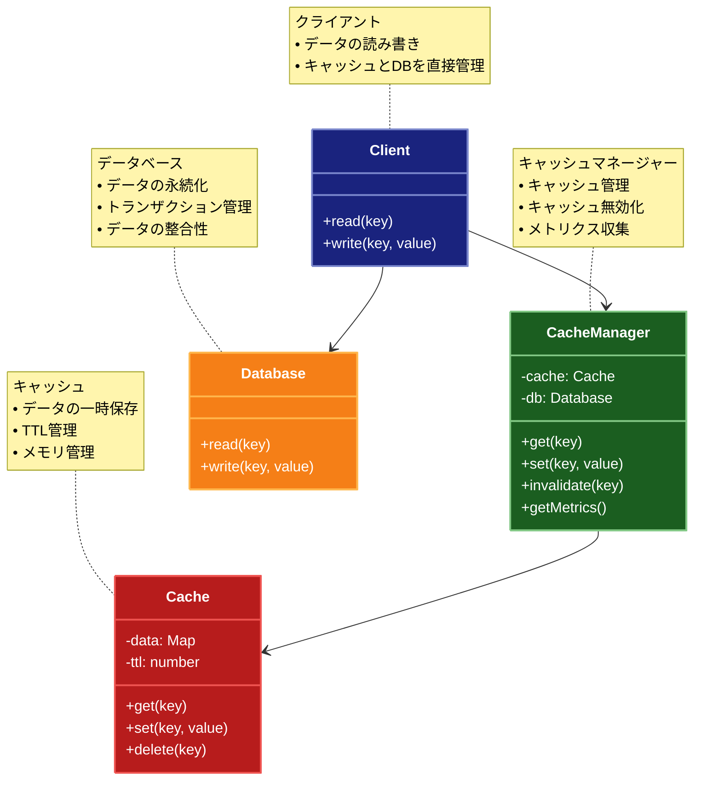

# Cache Aside（キャッシュアサイド）パターン

## 目的

アプリケーションがキャッシュとデータベースを直接管理し、データの読み書きを効率的に行うパターンです。

## 価値・解決する問題

- レスポンス時間を短縮します
- スケーラビリティを向上させます
- コストを削減します
- 可用性を向上させます

## 概要・特徴

### 概要

Cache Asideパターンは、データベースとキャッシュを組み合わせて使用する設計パターンです。アプリケーションは最初にキャッシュをチェックし、キャッシュミスの場合のみデータベースにアクセスします。データベースからのデータ取得後、そのデータはキャッシュに格納され、後続のリクエストを高速化します。このパターンでは、アプリケーションが直接キャッシュとデータベースの両方を管理し、キャッシュの一貫性を維持する責任を持ちます。

### 特徴

#### キャッシュ優先アクセス

データ読み取り時に最初にキャッシュをチェックし、存在する場合はそのデータを返します。キャッシュミスの場合のみデータベースからデータを取得します。この戦略により、頻繁にアクセスされるデータのレスポンス時間が大幅に短縮され、データベースの負荷が低減されます。例えば、ユーザープロファイルや商品カタログなど、読み取り頻度の高いデータに特に効果的です。キャッシュヒット率が高いほど、アプリケーション全体のパフォーマンスが向上します。

#### 遅延ロード戦略

データは最初にアクセスされるときにのみキャッシュにロードされ、事前に全データをロードすることはありません。これにより、メモリの効率的な使用が可能になり、実際に必要なデータのみがキャッシュに格納されます。大規模なデータセットや、アクセスパターンが予測できないシステムに適しています。例えば、Eコマースサイトでは、ユーザーが実際に閲覧した商品のみがキャッシュに格納され、全商品カタログをメモリに保持する必要がありません。

#### データ整合性の管理

データベースへの書き込み操作時に、関連するキャッシュエントリを無効化または更新することで、キャッシュとデータベース間の整合性を維持します。一般的な戦略としては、書き込み時にキャッシュエントリを削除（Cache Invalidation）するか、キャッシュも同時に更新（Write-Through）する方法があります。この選択はアプリケーションの整合性要件と性能トレードオフに基づいて行われます。例えば、SNSアプリケーションでは、投稿が更新されたときに関連するキャッシュエントリを無効化して、最新のコンテンツがユーザーに表示されるようにします。

#### キャッシュ寿命管理

Time-To-Live（TTL）メカニズムを使用してキャッシュエントリの有効期限を管理します。これにより、古いデータが長期間キャッシュに残ることを防ぎ、定期的にデータが更新される仕組みを提供します。TTLの設定は、データの変更頻度や鮮度の要件に基づいて調整できます。例えば、ニュースフィードのようなリアルタイム性が求められるデータには短いTTL、製品カテゴリのような比較的静的なデータには長いTTLを設定することで、キャッシュの効率を最適化できます。

#### スケーラビリティの向上

データベースへのアクセス頻度を減らすことで、システム全体のスケーラビリティが向上します。特に、読み取り操作が多いアプリケーションでは、キャッシュを導入することでデータベースの負荷を大幅に軽減し、より多くのユーザーリクエストを処理できるようになります。分散キャッシュを使用することで、さらに大規模なシステムでもパフォーマンスを維持できます。例えば、高トラフィックのウェブサイトでは、Cache Asideパターンを適用することで、同じハードウェアリソースでより多くのリクエストを処理できるようになります。

### 概要図



## 類似パターンとの比較

- [Read-Through (リードスルーキャッシュ)](read-through.md): Cache Aside はアプリケーションがキャッシュを管理し、これに対して Read-Through はキャッシュ自体がデータベースアクセスを管理します。
- [Write-Through (ライトスルーキャッシュ)](write-through.md): Cache Aside は書き込み時にキャッシュを無効化し、これに対して Write-Through は書き込み時にキャッシュを更新します。
- [Write-Behind (ライトビハインドキャッシュ)](write-behind.md): Cache Aside は書き込み時にキャッシュを無効化し、これに対して Write-Behind は書き込みを遅延させてバッチ処理します。

## 利用されているライブラリ／フレームワークの事例

- [Redis](https://redis.io/): 分散キャッシュシステム
- [Memcached](https://memcached.org/): 分散メモリキャッシュシステム
- [Spring Cache](https://docs.spring.io/spring-framework/docs/current/reference/html/integration.html#cache): Springのキャッシュ抽象化

## 解説ページリンク

- [Microsoft Cloud Design Patterns: Cache-Aside](https://docs.microsoft.com/en-us/azure/architecture/patterns/cache-aside)
- [AWS: Caching Overview](https://aws.amazon.com/caching/)
- [Redis: Caching Patterns](https://redis.com/redis-best-practices/caching-patterns/)

## コード例

### Before:

キャッシュ機能のない実装

```typescript
class UserService {
  private db: Map<string, any>;

  constructor() {
    this.db = new Map([
      ["1", { id: "1", name: "John Doe", email: "john@example.com" }],
      ["2", { id: "2", name: "Jane Smith", email: "jane@example.com" }]
    ]);
  }

  async getUser(id: string): Promise<any> {
    // データベースアクセスを遅延させる
    await new Promise(resolve => setTimeout(resolve, 100));

    const user = this.db.get(id);
    if (!user) {
      throw new Error("User not found");
    }
    return user;
  }

  async updateUser(id: string, data: any): Promise<any> {
    // データベースアクセスを遅延させる
    await new Promise(resolve => setTimeout(resolve, 100));

    if (!this.db.has(id)) {
      throw new Error("User not found");
    }
    const updatedUser = { ...this.db.get(id), ...data };
    this.db.set(id, updatedUser);
    return updatedUser;
  }
}

// 使用例
async function example() {
  const service = new UserService();

  try {
    // 同じユーザーを複数回取得
    console.log("=== ユーザー1を3回取得 ===");
    const startTime = Date.now();

    const results = await Promise.all([
      service.getUser("1"),
      service.getUser("1"),
      service.getUser("1")
    ]);

    const endTime = Date.now();
    console.log("結果:", results.length);
    console.log("実行時間:", endTime - startTime, "ms");
  } catch (error) {
    console.error("エラー:", error);
  }
}

example();
```

### After:

Cache Asideパターンを適用した実装

```typescript
// キャッシュのインターフェース
interface Cache<T> {
  get(key: string): Promise<T | undefined>;
  set(key: string, value: T, ttlMs?: number): Promise<void>;
  delete(key: string): Promise<void>;
  clear(): Promise<void>;
}

// インメモリキャッシュの実装
class InMemoryCache<T> implements Cache<T> {
  private cache: Map<string, { value: T; expiresAt: number }> = new Map();

  async get(key: string): Promise<T | undefined> {
    const item = this.cache.get(key);
    if (!item) {
      return undefined;
    }

    // TTLチェック
    if (item.expiresAt < Date.now()) {
      this.cache.delete(key);
      return undefined;
    }

    return item.value;
  }

  async set(key: string, value: T, ttlMs: number = 60000): Promise<void> {
    this.cache.set(key, {
      value,
      expiresAt: Date.now() + ttlMs
    });
  }

  async delete(key: string): Promise<void> {
    this.cache.delete(key);
  }

  async clear(): Promise<void> {
    this.cache.clear();
  }
}

// キャッシュメトリクス
interface CacheMetrics {
  hits: number;
  misses: number;
  hitRatio: number;
  size: number;
}

// キャッシュ管理クラス
class CacheManager<T> {
  private hits: number = 0;
  private misses: number = 0;

  constructor(private cache: Cache<T>) {}

  async get(key: string): Promise<T | undefined> {
    const value = await this.cache.get(key);
    if (value === undefined) {
      this.misses++;
    } else {
      this.hits++;
    }
    return value;
  }

  async set(key: string, value: T, ttlMs?: number): Promise<void> {
    await this.cache.set(key, value, ttlMs);
  }

  async delete(key: string): Promise<void> {
    await this.cache.delete(key);
  }

  async clear(): Promise<void> {
    await this.cache.clear();
    this.hits = 0;
    this.misses = 0;
  }

  getMetrics(): CacheMetrics {
    const total = this.hits + this.misses;
    return {
      hits: this.hits,
      misses: this.misses,
      hitRatio: total > 0 ? this.hits / total : 0,
      size: this.cache instanceof InMemoryCache
        ? (this.cache as any).cache.size
        : -1
    };
  }
}

// ユーザーの型
interface User {
  id: string;
  name: string;
  email: string;
  updatedAt: number;
}

// データベースの実装
class Database {
  private db: Map<string, User>;

  constructor() {
    this.db = new Map([
      ["1", {
        id: "1",
        name: "John Doe",
        email: "john@example.com",
        updatedAt: Date.now()
      }],
      ["2", {
        id: "2",
        name: "Jane Smith",
        email: "jane@example.com",
        updatedAt: Date.now()
      }]
    ]);
  }

  async read(id: string): Promise<User> {
    // データベースアクセスを遅延させる
    await new Promise(resolve => setTimeout(resolve, 100));

    const user = this.db.get(id);
    if (!user) {
      throw new Error("User not found");
    }
    return user;
  }

  async write(id: string, user: User): Promise<void> {
    // データベースアクセスを遅延させる
    await new Promise(resolve => setTimeout(resolve, 100));

    this.db.set(id, {
      ...user,
      updatedAt: Date.now()
    });
  }
}

// Cache Asideパターンを実装したユーザーサービス
class CacheAsideUserService {
  private cacheManager: CacheManager<User>;
  private db: Database;

  constructor(
    cache?: Cache<User>,
    private readonly cacheTtlMs: number = 60000 // デフォルトTTL: 1分
  ) {
    this.cacheManager = new CacheManager(cache || new InMemoryCache());
    this.db = new Database();
  }

  // ユーザーを取得
  async getUser(id: string): Promise<User> {
    // 1. キャッシュをチェック
    const cachedUser = await this.cacheManager.get(id);
    if (cachedUser) {
      return cachedUser;
    }

    // 2. キャッシュミスの場合、データベースから取得
    const user = await this.db.read(id);

    // 3. キャッシュを更新
    await this.cacheManager.set(id, user, this.cacheTtlMs);

    return user;
  }

  // ユーザーを更新
  async updateUser(id: string, data: Partial<User>): Promise<User> {
    // 1. データベースを更新
    const currentUser = await this.db.read(id);
    const updatedUser: User = {
      ...currentUser,
      ...data,
      id, // IDは変更不可
      updatedAt: Date.now()
    };
    await this.db.write(id, updatedUser);

    // 2. キャッシュを無効化
    await this.cacheManager.delete(id);

    return updatedUser;
  }

  // キャッシュをクリア
  async clearCache(): Promise<void> {
    await this.cacheManager.clear();
  }

  // メトリクスを取得
  getMetrics(): CacheMetrics {
    return this.cacheManager.getMetrics();
  }
}

// 使用例
async function example() {
  const service = new CacheAsideUserService(
    undefined, // デフォルトのインメモリキャッシュを使用
    5000      // TTL: 5秒
  );

  try {
    console.log("=== 同じユーザーを3回取得（キャッシュ効果の確認） ===");
    const startTime1 = Date.now();

    const results1 = await Promise.all([
      service.getUser("1"),
      service.getUser("1"),
      service.getUser("1")
    ]);

    const endTime1 = Date.now();
    console.log("結果1:", results1.length);
    console.log("実行時間1:", endTime1 - startTime1, "ms");
    console.log("メトリクス1:", service.getMetrics());

    console.log("\n=== ユーザーを更新（キャッシュ無効化の確認） ===");
    await service.updateUser("1", { name: "John Updated" });

    console.log("\n=== 更新後のユーザーを3回取得 ===");
    const startTime2 = Date.now();

    const results2 = await Promise.all([
      service.getUser("1"),
      service.getUser("1"),
      service.getUser("1")
    ]);

    const endTime2 = Date.now();
    console.log("結果2:", results2.length);
    console.log("実行時間2:", endTime2 - startTime2, "ms");
    console.log("メトリクス2:", service.getMetrics());

    console.log("\n=== キャッシュをクリアして再度取得 ===");
    await service.clearCache();

    const startTime3 = Date.now();
    const user = await service.getUser("1");
    const endTime3 = Date.now();

    console.log("結果3:", user);
    console.log("実行時間3:", endTime3 - startTime3, "ms");
    console.log("メトリクス3:", service.getMetrics());

  } catch (error) {
    console.error("エラー:", error);
  }
}

// 実行
example();
```
