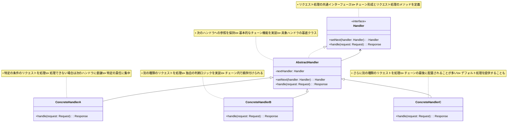

# Chain of Responsibility パターン

## 目的

リクエストの送信者と受信者を分離し、複数のオブジェクトにリクエストを処理する機会を与えることで、処理の柔軟性と拡張性を向上させます。

## 価値・解決する問題

- 送信者と受信者の分離
- 処理の柔軟な組み合わせ
- 責任の分散
- 処理順序の制御
- 条件分岐の簡素化

## 概要・特徴

### 概要

Chain of Responsibilityパターンは、リクエストを処理できるオブジェクトのチェーンを作成し、リクエストがチェーンを伝搬していく中で適切な処理者によって処理される設計パターンです。各処理者は、リクエストを処理するか、次の処理者に渡すかを決定します。このパターンにより、リクエストの送信者はどのオブジェクトが最終的に処理するかを事前に知る必要がなく、また処理オブジェクトの組み合わせや順序を動的に変更することができます。これによって、システムの結合度を低減し、コードの柔軟性と再利用性を高めることができます。

### 特徴

#### 処理の連鎖

複数の処理オブジェクトをチェーン（連鎖）として接続し、リクエストがチェーンに沿って順番に伝搬される仕組みを提供します。各処理オブジェクトは自身の責任範囲内でリクエストを処理し、処理できない場合は次の処理オブジェクトに転送します。例えば、ユーザー認証システムでは、「IPアドレス検証」→「認証情報確認」→「アクセス権限チェック」といった形で責任をチェーン状につなげることができます。これにより、処理ロジックが分散され、各処理オブジェクトは自身の担当範囲に集中することができます。

#### 動的な処理順序の変更

実行時にチェーンの構成を変更することで、リクエストの処理順序や処理オブジェクトの組み合わせを動的に調整できます。これは、システムの設定や状態に応じて処理フローを柔軟に変更したい場合に有用です。例えば、システムの負荷状況に応じて特定の処理を追加したり省略したりすることができます。また、テスト時には簡易的な処理オブジェクトで構成されるチェーンを使用し、本番環境では詳細な検証を行うチェーンを使用するといった使い分けも可能です。

#### 単一責任の原則

各処理オブジェクトは特定の責任だけを持ち、それ以外の処理については他の処理オブジェクトに委譲します。これにより、単一責任の原則（SRP）に従った設計が可能になり、コードの保守性と可読性が向上します。例えば、Webアプリケーションのミドルウェアでは、ロギング、認証、エラーハンドリングなどの責任をそれぞれ独立したミドルウェアに分離し、各ミドルウェアは自身の責任範囲のみを処理することができます。これにより、機能追加や変更が容易になり、コードの再利用性も高まります。

#### 処理の分離

リクエストの送信者と各処理者を分離することで、送信者は処理の詳細を知る必要がなくなります。送信者はリクエストをチェーンの最初の処理者に送信するだけで、どの処理者が最終的に処理するかを意識する必要はありません。例えば、イベント処理システムでは、イベント発生源はイベントを送信するだけで、どのリスナーが処理するかを知る必要はありません。これにより、システムの結合度が低下し、コンポーネント間の依存関係が減少します。

#### エラー処理の柔軟性

Chain of Responsibilityパターンはリクエスト処理におけるエラーや例外を柔軟に扱うメカニズムを提供します。各処理オブジェクトは自身の処理範囲内でエラーを検出した場合、それを適切に処理したり、エラー情報をチェーンに沿って伝播させたりすることができます。例えば、Webアプリケーションのフィルタチェーンでは、認証エラーを検出した認証フィルタがユーザーをログインページにリダイレクトさせ、データ検証エラーを検出した検証フィルタが適切なエラーメッセージを生成するといった形で、各フィルタが特定のエラー状況に対応できます。また、エラー処理専用のハンドラをチェーンの最後に配置し、前段のハンドラで処理されなかったすべてのエラーを捕捉して一括処理することも可能です。これは特に、予期しないエラーのロギングや、一貫したエラーレスポンスの生成に有用です。さらに、トランザクション処理やネットワーク通信のような複雑な操作では、エラー発生時に前の処理をロールバックするための復旧メカニズムもチェーンの中に組み込むことができます。この柔軟なエラー処理機能により、システムの堅牢性が向上し、ユーザー体験も改善されます。

#### デフォルト処理の実装

Chain of Responsibilityパターンでは、チェーン内のどの処理オブジェクトもリクエストを処理できない場合に備えて、デフォルトの処理メカニズムを実装することができます。これには主に二つのアプローチがあります。一つは、チェーンの最後に「キャッチオール」ハンドラを配置する方法です。このハンドラは、前段のハンドラでは処理されなかったすべてのリクエストを処理します。例えば、コマンドラインインターフェースでは、特定のコマンドに対応するハンドラがない場合に「コマンドが見つかりません」というメッセージを表示するデフォルトハンドラを使用できます。もう一つのアプローチは、リクエストオブジェクト自体にデフォルトの処理ロジックを持たせる方法です。チェーン内のどのハンドラも処理しなかった場合、リクエストオブジェクトのデフォルト処理が実行されます。例えば、イベント処理システムでは、イベントオブジェクトにデフォルトの処理メソッドを実装し、どのリスナーもイベントを処理しなかった場合に実行されるようにできます。このデフォルト処理メカニズムにより、システムの堅牢性が向上し、「処理されないリクエスト」による潜在的な問題を防ぐことができます。また、デバッグやモニタリングの観点からも、処理されなかったリクエストを把握できることは有益です。

### 概要図



## 類似パターンとの比較

- [Command パターン](command.md): Chain of Responsibility はリクエストの処理を連鎖させますが、Command はリクエストをオブジェクトとしてカプセル化します。
- [Decorator パターン](decorator.md): Chain of Responsibility は処理の連鎖を作りますが、Decorator は機能の追加を重視します。
- [Pipeline パターン](pipeline.md): Chain of Responsibility は条件に基づいて処理を選択しますが、Pipeline は全ての処理を順番に実行します。

## 利用されているライブラリ／フレームワークの事例

- [Express.js Middleware](https://github.com/expressjs/express): HTTPリクエストの処理チェーンを実現
- [ASP.NET Core Middleware](https://github.com/dotnet/aspnetcore): HTTPパイプラインの実装に使用
- [Spring Security Filter Chain](https://github.com/spring-projects/spring-security): セキュリティフィルターチェーンの実装

## コード例

### Before:

```typescript
// 単一の大きなクラスで全ての処理を行う
class AuthenticationService {
  async authenticate(request: Request): Promise<void> {
    // APIキーの検証
    if (!request.headers['api-key']) {
      throw new Error('API key is missing');
    }

    const apiKey = request.headers['api-key'];
    const isValidApiKey = await this.validateApiKey(apiKey);
    if (!isValidApiKey) {
      throw new Error('Invalid API key');
    }

    // JWTトークンの検証
    if (!request.headers['authorization']) {
      throw new Error('JWT token is missing');
    }

    const token = request.headers['authorization'].replace('Bearer ', '');
    const isValidToken = await this.validateJwtToken(token);
    if (!isValidToken) {
      throw new Error('Invalid JWT token');
    }

    // ロールの検証
    const userRole = await this.getUserRole(token);
    if (!this.hasRequiredRole(userRole, request.path)) {
      throw new Error('Insufficient permissions');
    }

    // レート制限の検証
    const clientIp = request.ip;
    const requestCount = await this.getRequestCount(clientIp);
    if (requestCount > 100) {
      throw new Error('Rate limit exceeded');
    }

    // ログの記録
    await this.logRequest(request);
  }

  private async validateApiKey(apiKey: string): Promise<boolean> {
    // APIキーの検証ロジック
    return true;
  }

  private async validateJwtToken(token: string): Promise<boolean> {
    // JWTトークンの検証ロジック
    return true;
  }

  private async getUserRole(token: string): Promise<string> {
    // ユーザーロールの取得ロジック
    return 'user';
  }

  private hasRequiredRole(role: string, path: string): boolean {
    // ロールの検証ロジック
    return true;
  }

  private async getRequestCount(ip: string): Promise<number> {
    // レート制限の検証ロジック
    return 0;
  }

  private async logRequest(request: Request): Promise<void> {
    // リクエストのログ記録
  }
}
```

### After:

```typescript
// ハンドラーインターフェース
interface AuthHandler {
  setNext(handler: AuthHandler): AuthHandler;
  handle(request: Request): Promise<void>;
}

// 基本ハンドラー
abstract class BaseAuthHandler implements AuthHandler {
  private nextHandler: AuthHandler | null = null;

  setNext(handler: AuthHandler): AuthHandler {
    this.nextHandler = handler;
    return handler;
  }

  async handle(request: Request): Promise<void> {
    if (this.nextHandler) {
      await this.nextHandler.handle(request);
    }
  }
}

// APIキー認証ハンドラー
class ApiKeyHandler extends BaseAuthHandler {
  async handle(request: Request): Promise<void> {
    if (!request.headers['api-key']) {
      throw new Error('API key is missing');
    }

    const apiKey = request.headers['api-key'];
    const isValid = await this.validateApiKey(apiKey);
    if (!isValid) {
      throw new Error('Invalid API key');
    }

    await super.handle(request);
  }

  private async validateApiKey(apiKey: string): Promise<boolean> {
    // APIキーの検証ロジック
    return true;
  }
}

// JWTトークン認証ハンドラー
class JwtAuthHandler extends BaseAuthHandler {
  async handle(request: Request): Promise<void> {
    if (!request.headers['authorization']) {
      throw new Error('JWT token is missing');
    }

    const token = request.headers['authorization'].replace('Bearer ', '');
    // トークンの検証ロジック（実際の実装ではJWTライブラリを使用）
    const isValidToken = token === 'valid-jwt-token';
    
    if (!isValidToken) {
      throw new Error('無効な認証トークンです');
    }
    
    // コンテキストにユーザー情報を追加
    request.context = {
      ...request.context,
      user: {
        id: 'user-123',
        roles: ['user']
      }
    };
    
    return true;
  }

  private async validateJwtToken(token: string): Promise<boolean> {
    // JWTトークンの検証ロジック
    return true;
  }
}

// ロール認証ハンドラー
class RoleAuthHandler extends BaseAuthHandler {
  async handle(request: Request): Promise<void> {
    const token = request.headers['authorization']?.replace('Bearer ', '');
    if (!token) {
      throw new Error('Token is required for role validation');
    }

    const userRole = await this.getUserRole(token);
    if (!this.hasRequiredRole(userRole, request.path)) {
      throw new Error('Insufficient permissions');
    }

    await super.handle(request);
  }

  private async getUserRole(token: string): Promise<string> {
    // ユーザーロールの取得ロジック
    return 'user';
  }

  private hasRequiredRole(role: string, path: string): boolean {
    // ロールの検証ロジック
    return true;
  }
}

// レート制限ハンドラー
class RateLimitHandler extends BaseAuthHandler {
  async handle(request: Request): Promise<void> {
    const clientIp = request.ip;
    const requestCount = await this.getRequestCount(clientIp);
    if (requestCount > 100) {
      throw new Error('リクエスト数の制限を超えました。しばらく待ってから再試行してください。');
    }

    await super.handle(request);
  }

  private async getRequestCount(ip: string): Promise<number> {
    // レート制限の検証ロジック
    return 0;
  }
}

// ロギングハンドラー
class LoggingHandler extends BaseAuthHandler {
  async handle(request: Request): Promise<void> {
    // リクエスト情報のログ記録
    await this.logRequest(request);
    await super.handle(request);
  }

  private async logRequest(request: Request): Promise<void> {
    // リクエストのログ記録ロジック
    console.log(`${new Date().toISOString()} - ${request.method} ${request.path}`);
  }
}

// 認証サービス
class AuthenticationService {
  private handler: AuthHandler;

  constructor() {
    // 認証チェーンの構築
    const apiKeyHandler = new ApiKeyHandler();
    const jwtHandler = new JwtAuthHandler();
    const roleHandler = new RoleAuthHandler();
    const rateLimitHandler = new RateLimitHandler();
    const loggingHandler = new LoggingHandler();

    apiKeyHandler
      .setNext(jwtHandler)
      .setNext(roleHandler)
      .setNext(rateLimitHandler)
      .setNext(loggingHandler);

    this.handler = apiKeyHandler;
  }

  async authenticate(request: Request): Promise<void> {
    await this.handler.handle(request);
  }
}

// 使用例
const authService = new AuthenticationService();

// ミドルウェアとして使用
app.use(async (req: Request, res: Response, next: NextFunction) => {
  try {
    await authService.authenticate(req);
    next();
  } catch (error) {
    res.status(401).json({ error: error.message });
  }
});
```

```typescript
// Chain of Responsibilityパターンを関数型プログラミングスタイルで適用した実装

// リクエストの型定義
type Request = {
  method: string
  path: string
  headers: Record<string, string>
  body?: any
  ip: string
  context?: Record<string, any> // ハンドラー間で共有するコンテキスト
}

// 処理結果の型定義
type HandlerResult = {
  success: boolean
  handled: boolean // リクエストが処理されたかどうか
  error?: Error
}

// ハンドラー関数の型定義
type Handler = (request: Request) => Promise<HandlerResult>

// チェーンの実行結果の型定義
type ChainResult = {
  success: boolean
  error?: Error
  handledBy?: string // どのハンドラーが処理したか
}

// ハンドラーを作成する高階関数
const createHandler = (
  name: string,
  predicate: (request: Request) => boolean,
  process: (request: Request) => Promise<boolean>
): Handler => {
  return async (request: Request): Promise<HandlerResult> => {
    console.log(`[${name}] 処理を試行中...`);
    
    try {
      // このハンドラーが処理すべきリクエストかどうかを判断
      if (!predicate(request)) {
        console.log(`[${name}] 処理をスキップしました`);
        return { success: true, handled: false };
      }
      
      // リクエスト処理
      const processResult = await process(request);
      console.log(`[${name}] 処理${processResult ? '成功' : '失敗'}`);
      
      return {
        success: processResult,
        handled: true,
        ...(processResult ? {} : { error: new Error(`${name}の処理に失敗しました`) })
      };
    } catch (error) {
      console.error(`[${name}] エラー発生:`, error instanceof Error ? error.message : 'Unknown error');
      return {
        success: false,
        handled: true,
        error: error instanceof Error ? error : new Error(`${name}の処理中に不明なエラーが発生しました`)
      };
    }
  };
};

// ハンドラーを連鎖させる関数
const chainHandlers = (handlers: Array<[string, Handler]>) => {
  return async (request: Request): Promise<ChainResult> => {
    // 深いコピーではなく、単にオブジェクトをコピーして変更可能にする
    const mutableRequest = { ...request, context: { ...request.context } };
    
    for (const [name, handler] of handlers) {
      const result = await handler(mutableRequest);
      
      // エラーが発生した場合、またはハンドラーが処理を完了した場合
      if (!result.success || result.handled) {
        return {
          success: result.success,
          handledBy: name,
          error: result.error
        };
      }
    }
    
    // すべてのハンドラーがスキップした場合
    return {
      success: true
    };
  };
};

// APIキー認証ハンドラー
const apiKeyHandler = createHandler(
  'APIキー認証',
  (request) => true, // 常に処理対象
  async (request) => {
    if (!request.headers['api-key']) {
      throw new Error('APIキーがありません');
    }

    const apiKey = request.headers['api-key'];
    // APIキーの検証ロジック（実際の実装ではデータベース検索などが入る）
    const isValidApiKey = apiKey === 'valid-api-key';
    
    if (!isValidApiKey) {
      throw new Error('無効なAPIキーです');
    }
    
    // コンテキストにAPIキー情報を追加
    request.context = {
      ...request.context,
      apiKeyValid: true
    };
    
    return true;
  }
);

// JWTトークン認証ハンドラー
const jwtAuthHandler = createHandler(
  'JWT認証',
  (request) => request.context?.apiKeyValid === true, // APIキーが有効な場合のみ処理
  async (request) => {
    if (!request.headers['authorization']) {
      throw new Error('認証トークンがありません');
    }

    const token = request.headers['authorization'].replace('Bearer ', '');
    // トークンの検証ロジック（実際の実装ではJWTライブラリを使用）
    const isValidToken = token === 'valid-jwt-token';
    
    if (!isValidToken) {
      throw new Error('無効な認証トークンです');
    }
    
    // コンテキストにユーザー情報を追加
    request.context = {
      ...request.context,
      user: {
        id: 'user-123',
        roles: ['user']
      }
    };
    
    return true;
  }
);

// ロール認証ハンドラー
const roleAuthHandler = createHandler(
  'ロール認証',
  (request) => request.context?.user !== undefined, // ユーザー情報がある場合のみ処理
  async (request) => {
    const user = request.context?.user;
    const path = request.path;
    
    // 管理者専用パスの場合
    if (path.startsWith('/admin') && !user.roles.includes('admin')) {
      throw new Error('このリソースにアクセスする権限がありません');
    }
    
    // APIパスの場合
    if (path.startsWith('/api/v1/protected') && !user.roles.includes('api-user')) {
      throw new Error('このAPIにアクセスする権限がありません');
    }
    
    return true;
  }
);

// レート制限ハンドラー
const rateLimitHandler = createHandler(
  'レート制限',
  (request) => true, // 常に処理対象
  async (request) => {
    const clientIp = request.ip;
    
    // レート制限のチェック（実際の実装ではRedisなどを使用）
    const requestCount = clientIp === '127.0.0.1' ? 50 : 0;
    const limit = 100;
    
    if (requestCount > limit) {
      throw new Error('リクエスト数の制限を超えました。しばらく待ってから再試行してください。');
    }
    
    return true;
  }
);

// ロギングハンドラー
const loggingHandler = createHandler(
  'ロギング',
  (request) => true, // 常に処理対象
  async (request) => {
    // ログ情報の作成
    const logEntry = {
      timestamp: new Date().toISOString(),
      method: request.method,
      path: request.path,
      ip: request.ip,
      userId: request.context?.user?.id || 'anonymous'
    };
    
    // ログの出力（実際の実装ではログファイルやデータベースに保存）
    console.log('リクエストログ:', logEntry);
    
    return true;
  }
);

// 認証チェーンの構築
const authChain = chainHandlers([
  ['APIキー認証', apiKeyHandler],
  ['JWT認証', jwtAuthHandler],
  ['ロール認証', roleAuthHandler],
  ['レート制限', rateLimitHandler],
  ['ロギング', loggingHandler]
]);

// ハンドラーをミドルウェアに変換するユーティリティ関数
const createMiddleware = (chain: (request: Request) => Promise<ChainResult>) => {
  return async (req: any, res: any, next: Function) => {
    // ExpressリクエストをHandler用のリクエスト形式に変換
    const request: Request = {
      method: req.method,
      path: req.path,
      headers: req.headers,
      body: req.body,
      ip: req.ip || req.connection.remoteAddress,
      context: {}
    };
    
    try {
      const result = await chain(request);
      
      if (!result.success) {
        // エラーレスポンスを返す
        return res.status(401).json({
          error: result.error?.message || 'Unauthorized',
          handler: result.handledBy
        });
      }
      
      // リクエストコンテキストをExpressリクエストに追加
      req.context = request.context;
      next();
    } catch (error) {
      // 予期しないエラーの処理
      console.error('ミドルウェアエラー:', error);
      res.status(500).json({
        error: 'Internal Server Error'
      });
    }
  };
};

// 条件付きハンドラー（特定のパスのみに適用）
const conditionalHandler = (pathPattern: RegExp, handler: Handler): Handler => {
  return async (request: Request): Promise<HandlerResult> => {
    if (pathPattern.test(request.path)) {
      return await handler(request);
    }
    return { success: true, handled: false };
  };
};

// コンポーズ関数（複数のハンドラーを合成）
const composeHandlers = (...handlers: Handler[]): Handler => {
  return async (request: Request): Promise<HandlerResult> => {
    for (const handler of handlers) {
      const result = await handler(request);
      if (result.handled) {
        return result;
      }
    }
    return { success: true, handled: false };
  };
};

// 使用例
const authMiddleware = createMiddleware(authChain);

// Express.jsアプリケーションの例
const app = {
  use: (middleware: Function) => {
    console.log('ミドルウェアが登録されました');
  },
  get: (path: string, ...handlers: Function[]) => {
    console.log(`ルート ${path} が登録されました`);
  }
};

// ミドルウェアを登録
app.use(authMiddleware);

// ルートの登録
app.get('/api/v1/public', (req: any, res: any) => {
  // パブリックAPIのハンドラー...
});

app.get('/api/v1/protected', (req: any, res: any) => {
  // 保護されたAPIのハンドラー...
});

app.get('/admin/dashboard', (req: any, res: any) => {
  // 管理者ダッシュボードのハンドラー...
});

// テスト用リクエストの作成
const testRequest = async (request: Request): Promise<void> => {
  console.log(`\n=== リクエストの処理: ${request.method} ${request.path} ===`);
  
  try {
    const result = await authChain(request);
    
    if (result.success) {
      console.log('認証成功!');
      console.log('コンテキスト:', request.context);
    } else {
      console.error('認証失敗:', result.error?.message);
      console.log('失敗したハンドラー:', result.handledBy);
    }
  } catch (error) {
    console.error('予期しないエラー:', error);
  }
};

// テスト実行
const runTests = async (): Promise<void> => {
  // 有効なリクエスト
  await testRequest({
    method: 'GET',
    path: '/api/v1/public',
    headers: {
      'api-key': 'valid-api-key',
      'authorization': 'Bearer valid-jwt-token'
    },
    ip: '192.168.1.1',
    context: {}
  });
  
  // 無効なAPIキー
  await testRequest({
    method: 'GET',
    path: '/api/v1/public',
    headers: {
      'api-key': 'invalid-api-key',
      'authorization': 'Bearer valid-jwt-token'
    },
    ip: '192.168.1.1',
    context: {}
  });
  
  // 管理者権限がない状態での管理者ページへのアクセス
  await testRequest({
    method: 'GET',
    path: '/admin/dashboard',
    headers: {
      'api-key': 'valid-api-key',
      'authorization': 'Bearer valid-jwt-token'
    },
    ip: '192.168.1.1',
    context: {}
  });
};

// テストの実行
runTests()
  .then(() => console.log('\nすべてのテストが完了しました'))
  .catch(error => console.error('テスト実行中のエラー:', error));
```
