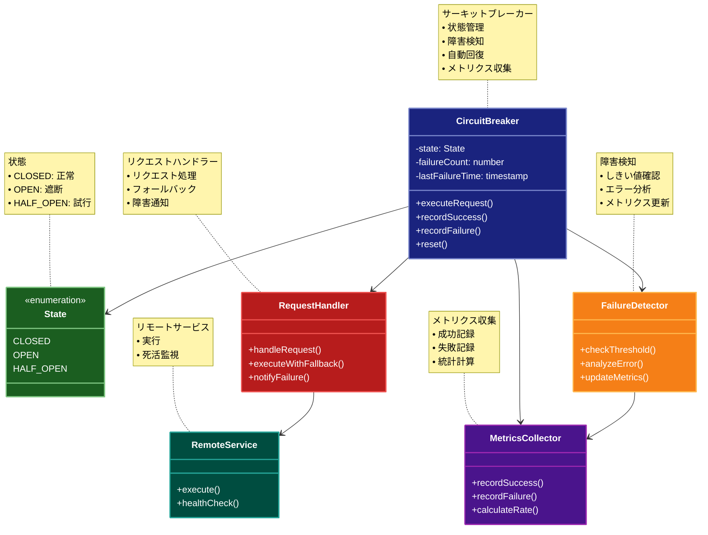

# Circuit Breaker パターン

## 目的

障害のあるサービスへのリクエストを一時的に遮断し、システム全体の安定性を保ちながら、障害からの回復を試みるパターン。

## 価値・解決する問題

- カスケード障害の防止
- システムの安定性向上
- リソースの保護
- 障害からの自動回復
- 監視とフィードバック

## 概要・特徴

### 概要

Circuit Breakerパターンは、電気回路のブレーカーと同様に、障害が発生したサービスへのリクエストを遮断し、システム全体への影響を最小限に抑えます。また、定期的に障害の回復を確認し、サービスが復旧したら自動的にリクエストを再開します。

### 特徴

#### 状態管理（Closed、Open、Half-Open）
サーキットブレーカーの核となる概念は、電気回路のブレーカーと同様の状態管理機構です。通常、サーキットブレーカーは「Closed（閉）」、「Open（開）」、「Half-Open（半開）」の3つの状態を持ちます。Closed状態では、すべてのリクエストが通常通りリモートサービスに転送されます。一定数以上の障害が検出されると、サーキットブレーカーはOpen状態に遷移し、すべてのリクエストを即座に拒否します。これにより、障害のあるシステムへの不要な呼び出しを防止し、システムの回復を促進します。一定時間経過後、サーキットブレーカーはHalf-Open状態に遷移し、限定的にリクエストを許可して、システムが回復したかどうかを確認します。この状態遷移メカニズムにより、障害の検出から回復までを自動的に管理し、システム全体の安定性を高めることができます。

#### 障害検知と遮断
サーキットブレーカーは、リモートサービスの障害を様々な方法で検知します。典型的には、タイムアウト、例外の発生、エラーコードの返却などがあります。障害が一定のしきい値（例えば、10秒間に5回以上の失敗）を超えた場合、サーキットブレーカーは回路を「開く」（Open状態に遷移する）ことで、以降のリクエストを即座に失敗させます。これにより、障害のあるサービスへの連続的なリクエストによるカスケード障害を防止し、クライアントアプリケーションへの応答時間の悪化を回避します。また、障害検知のパラメータ（しきい値、タイムアウト値、障害判定ロジックなど）を調整可能にすることで、様々なサービスの特性や運用環境に適応できる柔軟性を持たせることができます。この遮断機能は特に、マイクロサービスアーキテクチャのような複雑な依存関係を持つシステムにおいて重要な役割を果たします。

#### 自動回復
サーキットブレーカーの重要な特徴の一つは、障害からの自動回復メカニズムです。Open状態（遮断状態）になった後、一定時間（リセットタイムアウト）が経過すると、サーキットブレーカーはHalf-Open状態に遷移します。この状態では、限られた数のリクエストをリモートサービスに試験的に通過させ、そのレスポンスを監視します。これらのリクエストが成功した場合、サーキットブレーカーはClosed状態（正常状態）に戻り、通常のオペレーションを再開します。一方、リクエストが失敗し続ける場合は、再びOpen状態に戻ってリクエストを遮断します。この自動回復メカニズムにより、運用チームの手動介入なしに障害から回復することができ、システムの可用性と信頼性が向上します。また、リモートサービスの回復状況に応じて徐々にトラフィックを増加させる「グレースフル・リカバリー」戦略も実装できるため、回復途中のサービスへの過負荷を防ぐことができます。

#### 監視とメトリクス
効果的なサーキットブレーカーは、その動作と状態に関する包括的な監視とメトリクス収集機能を提供します。これには、リクエスト成功率、失敗率、レスポンスタイム、サーキットブレーカーの状態遷移回数、Open状態の継続時間などが含まれます。これらのメトリクスはリアルタイムで監視システムに送信され、ダッシュボードで可視化されることで、運用チームがシステムの健全性を把握し、潜在的な問題を早期に発見することができます。また、アラート機能と組み合わせることで、サーキットブレーカーの頻繁な遮断や長時間のOpen状態など、調査が必要な状況を自動的に通知することが可能です。これらの監視機能は、システムの継続的な改善と最適化に役立つだけでなく、障害発生時の根本原因分析を支援し、同様の問題の再発を防止するための貴重な情報源となります。

#### フォールバック処理
サーキットブレーカーが開いている（Open状態）場合や、リクエストが何らかの理由で失敗した場合に、代替の応答を提供するフォールバックメカニズムは重要な特徴です。フォールバック処理には、キャッシュされた古いデータの返却、デフォルト値の提供、代替サービスの使用、機能の縮退（degraded functionality）など、様々な戦略があります。これにより、リモートサービスが利用できない場合でも、クライアントに何らかの応答を返すことができ、ユーザーエクスペリエンスの完全な失敗を回避できます。フォールバック処理は、ビジネス要件や障害の性質に応じてカスタマイズされ、重要度の低い機能は無効化しつつ、コアとなる機能は維持するといった柔軟な対応が可能です。この機能は、「グレースフル・デグラデーション（優雅な機能縮退）」の原則を実現し、部分的な障害が発生してもシステム全体の機能を可能な限り維持することに貢献します。

### 概要図



## 類似パターンとの比較

- [Retry](retry.md)
  - Retryパターンは失敗したリクエストを再試行するのに対して、Circuit Breakerは障害を検知して一時的にリクエストを遮断する
  - Retryパターンは個々のリクエストに焦点を当てるのに対して、Circuit Breakerはシステム全体の安定性を重視する

- [Bulkhead](bulkhead.md)
  - Bulkheadパターンはリソースを分離して障害の影響を局所化するのに対して、Circuit Breakerは障害のあるサービスへのアクセスを制御する
  - Bulkheadパターンは静的な分離を提供するのに対して、Circuit Breakerは動的な制御を提供する

## 利用されているライブラリ／フレームワークの事例

- [Hystrix](https://github.com/Netflix/Hystrix)
  - Netflixが開発したCircuit Breaker実装
  - 豊富な設定オプション

- [resilience4j](https://github.com/resilience4j/resilience4j)
  - 軽量なCircuit Breaker実装
  - 関数型プログラミングスタイル

## 解説ページリンク

- [Circuit Breaker Pattern](https://martinfowler.com/bliki/CircuitBreaker.html)
- [Implementing the Circuit Breaker Pattern](https://docs.microsoft.com/en-us/azure/architecture/patterns/circuit-breaker)

## コード例

### Before:

```typescript
// 直接リモートサービスを呼び出す
class UserService {
  private apiClient: ApiClient

  constructor(apiClient: ApiClient) {
    this.apiClient = apiClient
  }

  async getUser(userId: string) {
    try {
      return await this.apiClient.get(`/users/${userId}`)
    } catch (error) {
      console.error('Failed to get user:', error)
      throw error
    }
  }

  async updateUser(userId: string, data: any) {
    try {
      return await this.apiClient.put(`/users/${userId}`, data)
    } catch (error) {
      console.error('Failed to update user:', error)
      throw error
    }
  }
}
```

### After:

```typescript
// サーキットブレーカーの状態
enum CircuitState {
  CLOSED,  // 正常
  OPEN,    // 遮断
  HALF_OPEN // 試行
}

// サーキットブレーカーの実装
class CircuitBreaker {
  private state: CircuitState = CircuitState.CLOSED
  private failureCount: number = 0
  private lastFailureTime: number = 0
  private readonly failureThreshold: number = 5
  private readonly resetTimeout: number = 60000 // 1分

  constructor(
    private readonly service: any,
    private readonly fallback: any
  ) {}

  async execute<T>(method: string, ...args: any[]): Promise<T> {
    if (this.isOpen()) {
      if (this.shouldAttemptReset()) {
        this.state = CircuitState.HALF_OPEN
      } else {
        return this.executeFallback(method, ...args)
      }
    }

    try {
      const result = await this.service[method](...args)
      this.onSuccess()
      return result
    } catch (error) {
      return this.onFailure(method, error, ...args)
    }
  }

  private isOpen(): boolean {
    return this.state === CircuitState.OPEN
  }

  private shouldAttemptReset(): boolean {
    return Date.now() - this.lastFailureTime > this.resetTimeout
  }

  private onSuccess(): void {
    this.failureCount = 0
    this.state = CircuitState.CLOSED
  }

  private async onFailure(method: string, error: Error, ...args: any[]): Promise<any> {
    this.failureCount++
    this.lastFailureTime = Date.now()

    if (this.failureCount >= this.failureThreshold) {
      this.state = CircuitState.OPEN
    }

    return this.executeFallback(method, ...args)
  }

  private async executeFallback(method: string, ...args: any[]): Promise<any> {
    if (this.fallback && typeof this.fallback[method] === 'function') {
      return await this.fallback[method](...args)
    }
    throw new Error(`Service is unavailable and no fallback available for ${method}`)
  }
}

// メトリクス収集
class MetricsCollector {
  private successCount: number = 0
  private failureCount: number = 0

  recordSuccess(): void {
    this.successCount++
  }

  recordFailure(): void {
    this.failureCount++
  }

  getMetrics() {
    return {
      success: this.successCount,
      failure: this.failureCount,
      total: this.successCount + this.failureCount,
      failureRate: this.failureCount / (this.successCount + this.failureCount)
    }
  }
}

// フォールバックサービス
class UserServiceFallback {
  private cache: Map<string, any> = new Map()

  async getUser(userId: string) {
    // キャッシュからユーザー情報を返す
    if (this.cache.has(userId)) {
      return this.cache.get(userId)
    }
    return { id: userId, name: 'Unknown', isCache: true }
  }

  async updateUser(userId: string, data: any) {
    // 更新をキャッシュに保存
    this.cache.set(userId, { ...data, id: userId, isPending: true })
    return { success: false, message: 'Update queued' }
  }
}

// サーキットブレーカーを使用するサービス
class UserService {
  private circuitBreaker: CircuitBreaker
  private metrics: MetricsCollector

  constructor(apiClient: ApiClient) {
    const service = {
      getUser: async (userId: string) => apiClient.get(`/users/${userId}`),
      updateUser: async (userId: string, data: any) => apiClient.put(`/users/${userId}`, data)
    }
    const fallback = new UserServiceFallback()
    
    this.circuitBreaker = new CircuitBreaker(service, fallback)
    this.metrics = new MetricsCollector()
  }

  async getUser(userId: string) {
    try {
      const result = await this.circuitBreaker.execute('getUser', userId)
      this.metrics.recordSuccess()
      return result
    } catch (error) {
      this.metrics.recordFailure()
      throw error
    }
  }

  async updateUser(userId: string, data: any) {
    try {
      const result = await this.circuitBreaker.execute('updateUser', userId, data)
      this.metrics.recordSuccess()
      return result
    } catch (error) {
      this.metrics.recordFailure()
      throw error
    }
  }

  getMetrics() {
    return this.metrics.getMetrics()
  }
}

// 使用例
async function example() {
  const apiClient = new ApiClient('https://api.example.com')
  const userService = new UserService(apiClient)

  try {
    // 正常なリクエスト
    const user = await userService.getUser('user123')
    console.log('User:', user)

    // サービスが停止している場合
    for (let i = 0; i < 10; i++) {
      try {
        await userService.getUser('user456')
      } catch (error) {
        console.log('Request failed:', error.message)
      }
    }

    // メトリクスの確認
    console.log('Metrics:', userService.getMetrics())
    // {
    //   success: 1,
    //   failure: 10,
    //   total: 11,
    //   failureRate: 0.91
    // }

  } catch (error) {
    console.error('Error:', error)
  }
}
```
