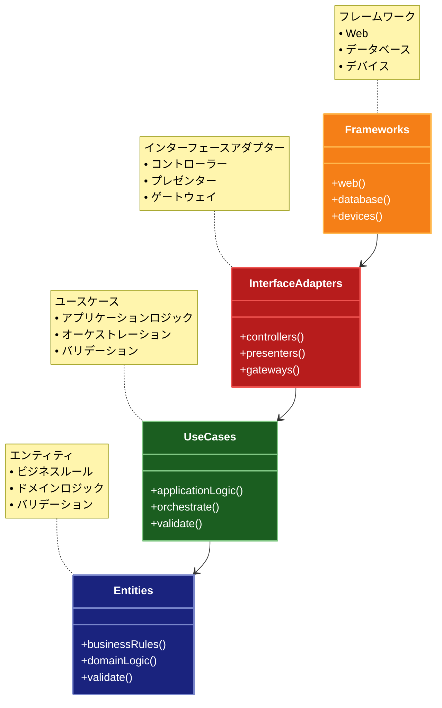

# Clean Architecture（クリーンアーキテクチャ）

## 目的

ビジネスロジックを外部の依存関係から完全に分離し、依存関係の方向を内側に向けることで、テスト容易性、保守性、および柔軟性を向上させます。

## 解説ページリンク

- [Robert C. Martin - The Clean Architecture](https://blog.cleancoder.com/uncle-bob/2012/08/13/the-clean-architecture.html)  
  - クリーンアーキテクチャの考案者による解説で、基本原則と設計思想を詳しく説明しています。

- [Microsoft - Clean Architecture with ASP.NET Core](https://learn.microsoft.com/ja-jp/dotnet/architecture/modern-web-apps-azure/common-web-application-architectures#clean-architecture)  
  - ASP.NET Coreを使用したクリーンアーキテクチャの実装方法と、具体的な実装例を提供しています。

- [Herberto Graça - DDD, Hexagonal, Onion, Clean, CQRS](https://herbertograca.com/2017/11/16/explicit-architecture-01-ddd-hexagonal-onion-clean-cqrs-how-i-put-it-all-together/)  
  - クリーンアーキテクチャと他のアーキテクチャパターンとの関係性を詳しく解説しています。

- [Tom Hombergs - Get Your Hands Dirty on Clean Architecture](https://reflectoring.io/book/)  
  - 実践的なクリーンアーキテクチャの実装方法と、具体的なユースケースを提供しています。

## 価値・解決する問題

- ビジネスロジックの独立性確保
- フレームワークやデータベースからの分離
- テスト容易性の向上
- 依存関係の制御と方向性の明確化
- 変更に強い設計の実現

## 概要・特徴

### 概要

クリーンアーキテクチャは、アプリケーションを同心円状の層に分割し、依存関係を内側に向けることで、ビジネスロジックを外部依存から完全に分離する設計パターンです。中心にはビジネスロジックが配置され、外側に行くほど具体的な実装が配置されます。

### 特徴

#### 依存関係の内向き制御
クリーンアーキテクチャでは、すべての依存関係が内側の層に向かって流れるという原則が厳格に適用されます。外側の層（フレームワークやUI、データベースなど）は内側の層に依存しますが、内側の層は外側の層を知りません。これにより、内側の層、特にビジネスロジックや業務ルールを含むコア部分は、外部の技術的な実装の詳細から完全に保護されます。この原則により、フレームワークやデータベースなどの外部技術を変更しても、ビジネスロジックに影響を与えないシステムを構築できます。

#### ビジネスロジックの中心配置
ビジネスロジックがアーキテクチャの中心に位置し、最も重要視されます。エンティティとユースケースがコアに配置され、それらはシステムの本質的な部分として扱われます。エンティティはビジネスルールとデータ構造を表現し、ユースケースはビジネスプロセスのフローを定義します。この中心的な位置づけにより、ビジネスロジックは技術的な懸念事項から分離され、ビジネスの要件に焦点を当てた開発が可能になります。また、ビジネスロジックが明確に分離されていることで、ドメイン駆動設計のような手法との親和性も高くなります。

#### インターフェースによる抽象化
層と層の間の通信はインターフェースを通じて抽象化され、具体的な実装の詳細は隠蔽されます。特に、内側の層が外側の層のサービスを利用する場合、内側の層はインターフェースを定義し、外側の層がそれを実装するという「依存性逆転の原則」が適用されます。これにより、内側の層は外側の層の具体的な実装に依存せず、抽象に依存することで、システム全体の結合度を低減し、テスト容易性と柔軟性を向上させます。このアプローチは、モジュール間の明確な境界を確立し、変更の影響範囲を限定するのに役立ちます。

#### ユースケース駆動の設計
クリーンアーキテクチャでは、ユースケース（アプリケーション特有のビジネスルール）がシステム設計の中心的な要素となります。各ユースケースは独立したユニットとして実装され、入力ポートとデータ構造、出力ポートを通じて外部とやり取りします。このアプローチにより、システムの機能が明確に分離され、各ユースケースの独立した開発、テスト、変更が可能になります。また、ユースケース駆動の設計は、開発プロセスをビジネスの目標や要件に直接関連付け、技術的な詳細より先にユーザーの目的を優先することを促進します。

#### フレームワーク独立性
クリーンアーキテクチャの主要な目標の一つは、フレームワークからの独立性を確保することです。フレームワークやライブラリはアーキテクチャの外側の層に配置され、内側のビジネスロジックから分離されます。これにより、フレームワークやライブラリの変更や置き換えが必要になった場合でも、システムのコア部分に影響を与えずに対応することができます。また、フレームワークの制約にとらわれず、ビジネスの要件に最適な設計を行う自由度が高まります。この独立性により、技術の進化や要件の変化に柔軟に対応できるシステムを構築できます。

### 概要図



## 類似パターンとの比較

- [Hexagonal Architecture（ヘキサゴナルアーキテクチャ）](hexagonal-architecture.md): Clean Architecture はレイヤーを同心円状に配置し、Hexagonal Architecture はポートとアダプターを六角形の境界に配置します。
- [Layered Architecture（レイヤードアーキテクチャ）](layered-architecture.md): Clean Architecture は依存関係の方向を明確に制御し、Layered Architecture は単純な階層構造を持ちます。
- [Onion Architecture（オニオンアーキテクチャ）](onion-architecture.md): Clean Architecture はユースケース層を明示的に定義し、Onion Architecture はドメインサービス層を中心に据えます。

## 利用されているライブラリ／フレームワークの事例

- [NestJS](https://github.com/nestjs/nest): Clean Architecture の原則に基づいたモジュール構造と DI システムを提供
- [Domain-Driven Design in .NET Core](https://github.com/dotnet-architecture/eShopOnContainers): マイクロサービスアーキテクチャで Clean Architecture を実践
- [Android Architecture Components](https://github.com/android/architecture-components-samples): Clean Architecture の原則に基づいたサンプルアプリケーションを提供

## コード例

### Before:

```typescript
// フレームワークやデータベースに強く依存した実装
class UserController {
  async createUser(req: Request, res: Response) {
    const {name, email, password} = req.body;

    // データベースに直接依存
    const user = await prisma.user.create({
      data: {
        name,
        email,
        password: await bcrypt.hash(password, 10),
      },
    });

    // メール送信ロジックが直接組み込まれている
    await sendgrid.send({
      to: email,
      subject: "Welcome!",
      text: `Welcome ${name}!`,
    });

    res.json(user);
  }

  async getUser(req: Request, res: Response) {
    const {id} = req.params;
    const user = await prisma.user.findUnique({where: {id}});

    if (!user) {
      res.status(404).json({error: "User not found"});
      return;
    }

    res.json(user);
  }
}
```

### After:

```typescript
// エンティティ（ビジネスルール）
class User {
  constructor(
    private id: string,
    private name: string,
    private email: string,
    private hashedPassword: string
  ) {}

  static async create(
    name: string,
    email: string,
    password: string,
    passwordHasher: PasswordHasher
  ): Promise<User> {
    if (!this.isValidEmail(email)) {
      throw new Error("Invalid email");
    }
    if (!this.isValidPassword(password)) {
      throw new Error("Invalid password");
    }

    const hashedPassword = await passwordHasher.hash(password);
    return new User(crypto.randomUUID(), name, email, hashedPassword);
  }

  private static isValidEmail(email: string): boolean {
    return /^[^\s@]+@[^\s@]+\.[^\s@]+$/.test(email);
  }

  private static isValidPassword(password: string): boolean {
    return password.length >= 8;
  }

  // ゲッター
  getId(): string {
    return this.id;
  }
  getName(): string {
    return this.name;
  }
  getEmail(): string {
    return this.email;
  }
}

// ユースケース（アプリケーションのビジネスロジック）
interface CreateUserUseCase {
  execute(request: CreateUserRequest): Promise<CreateUserResponse>;
}

class CreateUserInteractor implements CreateUserUseCase {
  constructor(
    private userRepository: UserRepository,
    private passwordHasher: PasswordHasher,
    private userNotifier: UserNotifier
  ) {}

  async execute(request: CreateUserRequest): Promise<CreateUserResponse> {
    // ユーザーの作成
    const user = await User.create(
      request.name,
      request.email,
      request.password,
      this.passwordHasher
    );

    // 永続化
    await this.userRepository.save(user);

    // 通知
    await this.userNotifier.notifyUserCreated(user);

    return {
      id: user.getId(),
      name: user.getName(),
      email: user.getEmail(),
    };
  }
}

// インターフェースアダプター（コントローラー）
class UserController {
  constructor(private createUserUseCase: CreateUserUseCase) {}

  async createUser(req: Request, res: Response) {
    try {
      const result = await this.createUserUseCase.execute({
        name: req.body.name,
        email: req.body.email,
        password: req.body.password,
      });

      res.status(201).json(result);
    } catch (error) {
      res.status(400).json({error: error.message});
    }
  }
}

// フレームワークと外部サービス（インフラストラクチャ層）
class BcryptPasswordHasher implements PasswordHasher {
  async hash(password: string): Promise<string> {
    return await bcrypt.hash(password, 10);
  }
}

class PrismaUserRepository implements UserRepository {
  async save(user: User): Promise<void> {
    await prisma.user.create({
      data: {
        id: user.getId(),
        name: user.getName(),
        email: user.getEmail(),
      },
    });
  }
}

class SendGridUserNotifier implements UserNotifier {
  async notifyUserCreated(user: User): Promise<void> {
    await sendgrid.send({
      to: user.getEmail(),
      subject: "Welcome!",
      text: `Welcome ${user.getName()}!`,
    });
  }
}

// 依存性の注入
const passwordHasher = new BcryptPasswordHasher();
const userRepository = new PrismaUserRepository();
const userNotifier = new SendGridUserNotifier();
const createUserUseCase = new CreateUserInteractor(
  userRepository,
  passwordHasher,
  userNotifier
);
const userController = new UserController(createUserUseCase);
```
