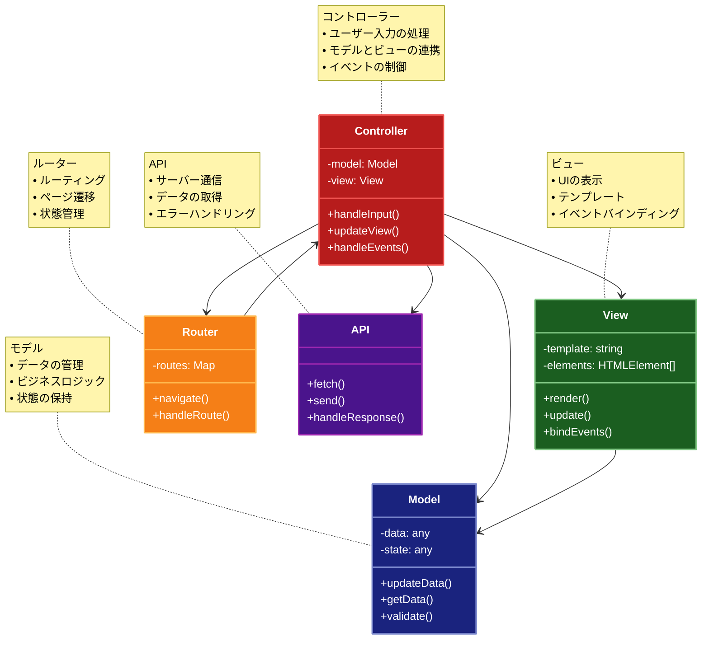

# Client-Side MVC (クライアントサイドMVC)

## 目的

クライアントサイド（ブラウザ）でMVCパターンを実装し、ユーザーインターフェースの構築と管理を効率的に行うパターンです。

## 価値・解決する問題

- クライアントサイドの状態管理の改善
- UIとビジネスロジックの分離
- コードの再利用性の向上
- テスト容易性の向上
- ユーザー体験の向上

## 概要・特徴

### 概要

Client-Side MVCは、ブラウザ上でMVCパターンを実装するアーキテクチャパターンです。Modelはデータとビジネスロジックを、ViewはUIの表示を、Controllerはユーザー入力の処理とModelとViewの連携を担当します。

### 特徴

#### クライアントサイドの状態管理
- ブラウザ上のデータ状態の管理
- リアルタイムなUI更新
- オフライン対応の可能性
- パフォーマンスの最適化

#### ユーザー体験の向上
- ページ遷移なしの操作
- 即時フィードバック
- スムーズなインタラクション
- レスポンシブな動作

#### 開発効率の向上
- コンポーネントベースの開発
- コードの再利用性
- テストの容易さ
- デバッグのしやすさ

#### サーバーとの連携
- APIとの通信
- データの同期
- エラーハンドリング
- セキュリティ対策

### 概要図



## 類似パターンとの比較

- [MVC (Model-View-Controller)](mvc.md): Client-Side MVCはMVCパターンのクライアントサイド実装です。
- [Server-Side MVC (サーバーサイドMVC)](server-side-mvc.md): サーバーサイドでMVCを実装するのに対し、Client-Side MVCはブラウザ上で実装します。
- [MVVM (Model-View-ViewModel)](mvvm.md): MVVMは双方向バインディングを特徴とし、Client-Side MVCはより直接的な制御を提供します。

## 利用されているライブラリ／フレームワークの事例

- [Angular](https://github.com/angular/angular): 完全なMVCフレームワーク
- [Backbone.js](https://github.com/jashkenas/backbone): 軽量なMVCフレームワーク
- [Ember.js](https://github.com/emberjs/ember.js): オピニオネイテッドなMVCフレームワーク
- [Meteor](https://github.com/meteor/meteor): リアルタイムMVCフレームワーク

## 解説ページリンク

- [MDN - Client-side MVC](https://developer.mozilla.org/en-US/docs/Web/JavaScript/MVC_architecture)
- [Angular - Architecture Overview](https://angular.io/guide/architecture)
- [Backbone.js - Getting Started](https://backbonejs.org/#Getting-started)
- [Ember.js - Core Concepts](https://guides.emberjs.com/release/getting-started/core-concepts/)

## コード例

### Before:

MVCパターンを使用しない実装

```typescript
// グローバルな状態管理
let todos: Todo[] = [];

// DOMの直接操作
function addTodo(text: string): void {
  const todo = { id: Date.now(), text, completed: false };
  todos.push(todo);
  
  // DOMを直接更新
  const todoList = document.getElementById('todo-list');
  if (todoList) {
    const li = document.createElement('li');
    li.innerHTML = `
      <input type="checkbox" ${todo.completed ? 'checked' : ''}>
      <span>${todo.text}</span>
      <button onclick="deleteTodo(${todo.id})">削除</button>
    `;
    todoList.appendChild(li);
  }
}

function deleteTodo(id: number): void {
  todos = todos.filter(todo => todo.id !== id);
  
  // DOMを直接更新
  const todoList = document.getElementById('todo-list');
  if (todoList) {
    todoList.innerHTML = '';
    todos.forEach(todo => {
      const li = document.createElement('li');
      li.innerHTML = `
        <input type="checkbox" ${todo.completed ? 'checked' : ''}>
        <span>${todo.text}</span>
        <button onclick="deleteTodo(${todo.id})">削除</button>
      `;
      todoList.appendChild(li);
    });
  }
}

// イベントリスナーの設定
document.getElementById('add-todo-form')?.addEventListener('submit', (e) => {
  e.preventDefault();
  const input = document.getElementById('todo-input') as HTMLInputElement;
  if (input.value.trim()) {
    addTodo(input.value.trim());
    input.value = '';
  }
});

// 初期表示
function renderTodos(): void {
  const todoList = document.getElementById('todo-list');
  if (todoList) {
    todoList.innerHTML = '';
    todos.forEach(todo => {
      const li = document.createElement('li');
      li.innerHTML = `
        <input type="checkbox" ${todo.completed ? 'checked' : ''}>
        <span>${todo.text}</span>
        <button onclick="deleteTodo(${todo.id})">削除</button>
      `;
      todoList.appendChild(li);
    });
  }
}

// 初期化
renderTodos();
```

### After:

Client-Side MVCパターンを適用した実装

```typescript
// モデル
class TodoModel {
  private todos: Todo[] = [];
  private listeners: ((todos: Todo[]) => void)[] = [];

  addTodo(text: string): void {
    const todo = { id: Date.now(), text, completed: false };
    this.todos.push(todo);
    this.notifyListeners();
  }

  deleteTodo(id: number): void {
    this.todos = this.todos.filter(todo => todo.id !== id);
    this.notifyListeners();
  }

  toggleTodo(id: number): void {
    this.todos = this.todos.map(todo =>
      todo.id === id ? { ...todo, completed: !todo.completed } : todo
    );
    this.notifyListeners();
  }

  getTodos(): Todo[] {
    return [...this.todos];
  }

  addListener(listener: (todos: Todo[]) => void): void {
    this.listeners.push(listener);
  }

  private notifyListeners(): void {
    this.listeners.forEach(listener => listener(this.getTodos()));
  }
}

// ビュー
class TodoView {
  private todoList: HTMLElement;
  private addForm: HTMLElement;
  private todoInput: HTMLInputElement;

  constructor() {
    this.todoList = document.getElementById('todo-list')!;
    this.addForm = document.getElementById('add-todo-form')!;
    this.todoInput = document.getElementById('todo-input') as HTMLInputElement;
  }

  render(todos: Todo[]): void {
    this.todoList.innerHTML = todos.map(todo => `
      <li data-id="${todo.id}">
        <input type="checkbox" ${todo.completed ? 'checked' : ''}>
        <span>${todo.text}</span>
        <button class="delete-btn">削除</button>
      </li>
    `).join('');
  }

  bindAddTodo(handler: (text: string) => void): void {
    this.addForm.addEventListener('submit', (e) => {
      e.preventDefault();
      const text = this.todoInput.value.trim();
      if (text) {
        handler(text);
        this.todoInput.value = '';
      }
    });
  }

  bindDeleteTodo(handler: (id: number) => void): void {
    this.todoList.addEventListener('click', (e) => {
      const target = e.target as HTMLElement;
      if (target.classList.contains('delete-btn')) {
        const id = Number(target.closest('li')?.dataset.id);
        handler(id);
      }
    });
  }

  bindToggleTodo(handler: (id: number) => void): void {
    this.todoList.addEventListener('change', (e) => {
      const target = e.target as HTMLInputElement;
      if (target.type === 'checkbox') {
        const id = Number(target.closest('li')?.dataset.id);
        handler(id);
      }
    });
  }
}

// コントローラー
class TodoController {
  constructor(
    private model: TodoModel,
    private view: TodoView
  ) {
    // ビューのイベントバインディング
    this.view.bindAddTodo(this.handleAddTodo.bind(this));
    this.view.bindDeleteTodo(this.handleDeleteTodo.bind(this));
    this.view.bindToggleTodo(this.handleToggleTodo.bind(this));

    // モデルの変更を監視
    this.model.addListener(this.handleModelChange.bind(this));

    // 初期表示
    this.handleModelChange(this.model.getTodos());
  }

  private handleAddTodo(text: string): void {
    this.model.addTodo(text);
  }

  private handleDeleteTodo(id: number): void {
    this.model.deleteTodo(id);
  }

  private handleToggleTodo(id: number): void {
    this.model.toggleTodo(id);
  }

  private handleModelChange(todos: Todo[]): void {
    this.view.render(todos);
  }
}

// ルーター
class TodoRouter {
  private routes: Map<string, () => void> = new Map();

  constructor() {
    this.routes.set('/', () => {
      // メインページの表示
      document.getElementById('app')!.style.display = 'block';
    });

    window.addEventListener('popstate', () => this.handleRoute());
  }

  navigate(path: string): void {
    window.history.pushState({}, '', path);
    this.handleRoute();
  }

  private handleRoute(): void {
    const path = window.location.pathname;
    const handler = this.routes.get(path);
    if (handler) {
      handler();
    }
  }
}

// アプリケーションの初期化
function initApp(): void {
  const model = new TodoModel();
  const view = new TodoView();
  const controller = new TodoController(model, view);
  const router = new TodoRouter();
}

// アプリケーションの起動
document.addEventListener('DOMContentLoaded', initApp);
``` 