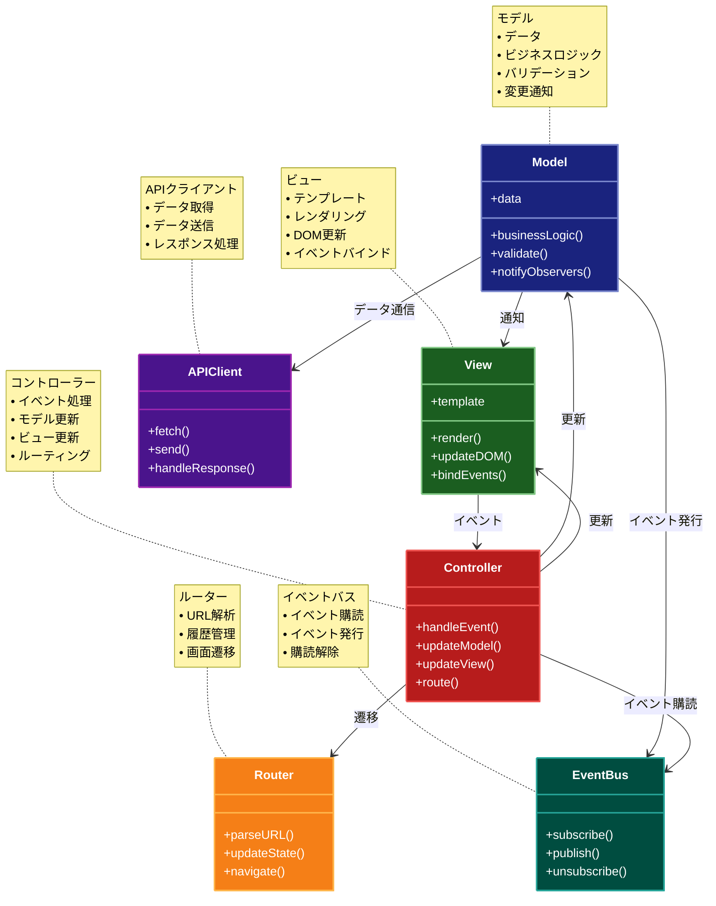

# Client-Side MVC パターン

## 目的

ブラウザ上でMVCパターンを適用し、UIコンポーネント、ビジネスロジック、データを分離することで、フロントエンドアプリケーションの保守性と再利用性を向上させるパターン。

## 価値・解決する問題

- UIとビジネスロジックの分離
- コードの再利用性の向上
- テストの容易性
- 関心事の分離
- 開発効率の向上

## 概要・特徴

### 概要

Client-Side MVCパターンは、従来のMVCパターンをブラウザ上で実行されるJavaScriptアプリケーションに適用したものです。モデル（データとビジネスロジック）、ビュー（DOM操作）、コントローラー（イベント処理）を分離し、それぞれの責務を明確にします。

### 特徴

#### ブラウザでの処理
クライアントサイドMVCの最も基本的な特徴は、従来はサーバーで行われていた処理の多くをブラウザ上で実行することです。JavaScriptエンジンの性能向上により、複雑なビジネスロジックやUI操作をクライアント側で処理できるようになりました。これにより、サーバーへのリクエスト回数が減少し、ユーザーの待ち時間が短縮されるため、より反応性の高いWebアプリケーションが実現します。また、サーバーの負荷も軽減されるため、スケーラビリティが向上します。特に、フォームのバリデーションやデータのフィルタリング、ソートなどのユーザーインタラクションに関わる処理をクライアント側で行うことで、即時のフィードバックが可能となり、ユーザーエクスペリエンスが大幅に向上します。さらに、オフライン対応やプログレッシブウェブアプリ（PWA）のような高度な機能も実装しやすくなります。

#### DOM操作の抽象化
クライアントサイドMVCフレームワークは、DOM（Document Object Model）操作を直接行うのではなく、抽象化されたAPIを提供します。これにより、開発者は低レベルのDOM操作について心配する必要がなく、アプリケーションのロジックに集中できるようになります。例えば、ReactのJSX、Vueのテンプレート、Angularのディレクティブなどは、宣言的なUI記述を可能にし、実際のDOM更新は内部的にフレームワークが最適化して行います。この抽象化により、コードの可読性と保守性が向上し、開発効率が高まります。また、仮想DOM（Virtual DOM）のような最適化技術を採用しているフレームワークでは、実際のDOM操作を最小限に抑えることで、パフォーマンスも向上します。これらの抽象化レイヤーは、ブラウザ間の互換性問題も隠蔽するため、クロスブラウザ対応も容易になります。

#### イベント処理
クライアントサイドMVCフレームワークは、ユーザーインタラクションを処理するための強力なイベント処理システムを提供します。従来のJavaScriptでは、イベントリスナーの追加と削除を手動で管理する必要がありましたが、MVCフレームワークでは、宣言的な方法でイベントハンドラーを定義できます。これにより、コードが整理され、イベントの流れを追跡しやすくなります。また、カスタムイベントの作成や、コンポーネント間のイベント通信メカニズムも提供されることが多く、複雑なユーザーインタラクションを効率的に実装できます。イベントデリゲーションのような最適化技術も自動的に適用され、大量のDOM要素があっても効率的なイベント処理が可能です。さらに、非同期イベント処理やデバウンス、スロットリングといった高度なパターンも、フレームワークによってサポートされることが多く、レスポンシブで効率的なUIの構築をサポートします。

#### 状態管理
クライアントサイドMVCにおける状態管理は、アプリケーション全体のデータフローを制御するための重要な機能です。単純なアプリケーションでは、コンポーネント内部で状態を管理するだけで十分ですが、複雑なアプリケーションでは、Fluxアーキテクチャ（Redux）やリアクティブプログラミング（RxJS）などの高度な状態管理パターンが採用されます。これらのパターンにより、データの流れが一方向になり、予測可能性が高まるため、デバッグや保守が容易になります。また、状態の変更を監視し、UIを自動的に更新する「リアクティブ」な仕組みにより、モデルとビューの同期が自動的に行われます。さらに、状態のスナップショットを作成して時間旅行デバッグ（time-travel debugging）を可能にしたり、サーバーとの状態同期を効率的に行うための仕組みも提供されます。これらの機能により、大規模で複雑なシングルページアプリケーション（SPA）の開発と保守が可能になります。

#### APIとの通信
クライアントサイドMVCアプリケーションは、通常、バックエンドサービスとRESTfulやGraphQLなどのAPIを通じて通信します。フレームワークは、このような通信を簡単に行うための機能を提供し、非同期リクエストの管理、エラーハンドリング、リトライロジックなどを抽象化します。また、Promiseやasync/awaitのような最新のJavaScript機能を活用して、非同期通信のコードを読みやすく保守しやすいものにします。データのキャッシュ機能や、オフライン時のデータ保存と同期機能を提供するフレームワークもあり、ネットワークの状態に依存しない堅牢なアプリケーション開発をサポートします。さらに、リアルタイム通信（WebSocketやServer-Sent Eventsなど）との統合も容易で、チャットアプリやライブ更新が必要なアプリケーションの開発も効率的に行えます。これらの通信機能により、バックエンドとフロントエンドの分離が促進され、マイクロサービスアーキテクチャとの親和性も高まります。

### 概要図



## 類似パターンとの比較

- [Server-Side MVC](server-side-mvc.md)
  - Server-Side MVCはサーバーで動作するのに対して、Client-Side MVCはブラウザで動作する
  - Server-Side MVCは各リクエストでページ全体を再描画するのに対して、Client-Side MVCは必要な部分のみを更新する

- [MVP](mvp.md)
  - MVPはプレゼンターを介してビューとモデルを完全に分離するのに対して、Client-Side MVCはモデルからビューへの直接の通知を許可する
  - MVPはビューがインターフェースを持つのに対して、Client-Side MVCはビューが直接DOMを操作する

## 利用されているライブラリ／フレームワークの事例

- [Backbone.js](https://github.com/jashkenas/backbone)
  - クライアントサイドMVCの先駆的フレームワーク
  - Model、View、Routerの実装

- [Angular](https://github.com/angular/angular)
  - コンポーネントベースのアーキテクチャ
  - 双方向データバインディング

## 解説ページリンク

- [Client-Side MVC Architecture](https://www.sitepoint.com/mvc-design-pattern-javascript-applications/)
- [Understanding Client-Side MVC](https://blog.codinghorror.com/understanding-model-view-controller/)

## コード例

### Before:

```typescript
// グローバルな状態とDOM操作が混在
let users = []
let currentFilter = 'all'

// データの取得
async function fetchUsers() {
  const response = await fetch('/api/users')
  users = await response.json()
  renderUsers()
}

// DOMの更新
function renderUsers() {
  const userList = document.getElementById('userList')
  userList.innerHTML = ''
  
  users
    .filter(user => {
      if (currentFilter === 'active') return user.isActive
      if (currentFilter === 'inactive') return !user.isActive
      return true
    })
    .forEach(user => {
      const li = document.createElement('li')
      li.textContent = `${user.name} (${user.email})`
      li.onclick = () => toggleUserStatus(user.id)
      userList.appendChild(li)
    })
}

// イベント処理
function toggleUserStatus(userId) {
  const user = users.find(u => u.id === userId)
  user.isActive = !user.isActive
  renderUsers()
}

// フィルター処理
document.getElementById('filter').onchange = (e) => {
  currentFilter = e.target.value
  renderUsers()
}

// 初期化
fetchUsers()
```

### After:

```typescript
// モデル
class UserModel {
  private users: User[] = []
  private observers: ((users: User[]) => void)[] = []

  async fetchUsers() {
    const response = await fetch('/api/users')
    this.users = await response.json()
    this.notifyObservers()
  }

  toggleUserStatus(userId: number) {
    const user = this.users.find(u => u.id === userId)
    if (user) {
      user.isActive = !user.isActive
      this.notifyObservers()
    }
  }

  getFilteredUsers(filter: string): User[] {
    return this.users.filter(user => {
      if (filter === 'active') return user.isActive
      if (filter === 'inactive') return !user.isActive
      return true
    })
  }

  addObserver(callback: (users: User[]) => void) {
    this.observers.push(callback)
  }

  private notifyObservers() {
    this.observers.forEach(callback => callback(this.users))
  }
}

// ビュー
class UserView {
  private element: HTMLElement
  private template: (users: User[]) => string

  constructor(element: HTMLElement) {
    this.element = element
    this.template = (users: User[]) => `
      <ul>
        ${users.map(user => `
          <li data-user-id="${user.id}">
            ${this.escape(user.name)} (${this.escape(user.email)})
            [${user.isActive ? 'Active' : 'Inactive'}]
          </li>
        `).join('')}
      </ul>
    `
  }

  render(users: User[]) {
    this.element.innerHTML = this.template(users)
  }

  bindUserClick(handler: (userId: number) => void) {
    this.element.addEventListener('click', (e) => {
      const li = (e.target as HTMLElement).closest('li')
      if (li) {
        const userId = parseInt(li.dataset.userId || '0', 10)
        handler(userId)
      }
    })
  }

  private escape(str: string): string {
    return str
      .replace(/&/g, '&amp;')
      .replace(/</g, '&lt;')
      .replace(/>/g, '&gt;')
      .replace(/"/g, '&quot;')
      .replace(/'/g, '&#039;')
  }
}

// コントローラー
class UserController {
  private model: UserModel
  private view: UserView
  private currentFilter: string = 'all'

  constructor(model: UserModel, view: UserView) {
    this.model = model
    this.view = view

    // モデルの変更を監視
    this.model.addObserver(() => this.updateView())

    // ビューのイベントをバインド
    this.view.bindUserClick((userId) => this.handleUserClick(userId))

    // フィルターの変更を監視
    document.getElementById('filter')?.addEventListener('change', (e) => {
      this.currentFilter = (e.target as HTMLSelectElement).value
      this.updateView()
    })
  }

  async initialize() {
    await this.model.fetchUsers()
  }

  private handleUserClick(userId: number) {
    this.model.toggleUserStatus(userId)
  }

  private updateView() {
    const filteredUsers = this.model.getFilteredUsers(this.currentFilter)
    this.view.render(filteredUsers)
  }
}

// アプリケーションの初期化
const userList = document.getElementById('userList')
if (userList) {
  const model = new UserModel()
  const view = new UserView(userList)
  const controller = new UserController(model, view)
  controller.initialize()
}
``` 