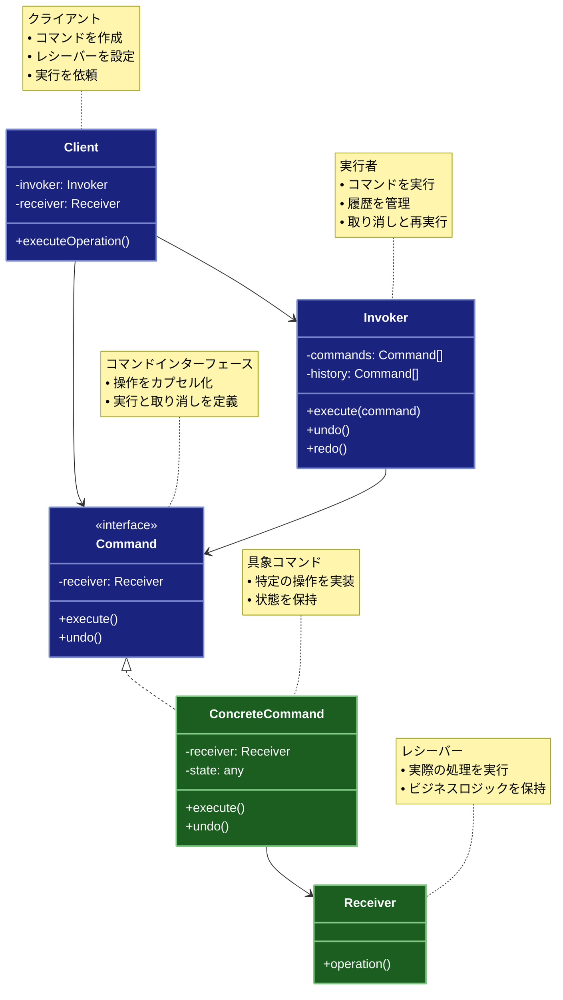

# Command（コマンド）パターン

## 目的

リクエストをオブジェクトとしてカプセル化し、異なるリクエストを持つクライアントをパラメータ化し、リクエストのキューイングや記録、取り消し可能な操作をサポートします。

## 価値・解決する問題

- 操作をオブジェクトとして扱えます
- 操作の履歴管理が可能になります
- 操作の取り消しと再実行が可能になります
- 操作のキューイングと遅延実行が可能になります
- 操作の組み合わせが容易になります

## 概要・特徴

### 概要

Commandパターンは、操作をオブジェクトとしてカプセル化し、その操作の実行、取り消し、記録などを柔軟に管理できるようにする設計パターンです。このパターンでは、リクエストの送信者（クライアント）とその受信者（実際の処理を行うオブジェクト）を分離し、操作に関する情報をコマンドオブジェクトに格納します。これにより、操作の実行を遅延させたり、履歴として記録したり、取り消し機能を実装したりすることが可能になります。特にGUIアプリケーション、トランザクション処理、マクロ機能など、操作の履歴管理や柔軟な実行制御が必要なシステムで広く利用されています。

### 特徴

#### 操作のカプセル化

リクエストや操作を独立したオブジェクトとしてカプセル化します。これにより、操作に関連するすべての情報（パラメータ、実行方法、実行対象など）が一つのオブジェクトに集約され、操作を一級オブジェクトとして扱うことができます。例えば、テキストエディタのカット、コピー、ペーストなどの操作をそれぞれ独立したコマンドクラスとして実装できます。これにより、操作をより柔軟に管理し、様々なコンテキストで再利用することが可能になります。

#### 実行の遅延

操作の作成と実行を分離することで、操作の遅延実行やスケジューリングが可能になります。コマンドオブジェクトは作成時点ではなく、必要なタイミングで実行できるため、バッチ処理やタスクスケジューリングなどの実装に適しています。例えば、ユーザーの一連のアクションをキューに格納しておき、後で一括処理するような機能を簡単に実装できます。また、リモート実行や非同期処理においても、操作を一旦保存してから適切なタイミングで実行することが可能です。

#### 履歴管理

実行されたコマンドを履歴として保存することで、操作のログ記録や監査証跡の実装が容易になります。これにより、システムで実行された全ての操作を追跡し、後で分析したり問題を診断したりすることができます。例えば、金融取引システムでは、各取引操作をコマンドとして記録することで、完全な監査証跡を維持できます。また、ユーザーの操作履歴を記録してパターンを分析し、ユーザーエクスペリエンスの改善に役立てることも可能です。

#### 取り消しと再実行

コマンドオブジェクトに取り消し（undo）機能を実装することで、操作の取り消しと再実行（redo）を簡単に実現できます。これはテキストエディタやグラフィックツールなど、ユーザーの操作を元に戻す機能が必要なアプリケーションで特に有用です。各コマンドがその操作を元に戻すために必要な情報も保持しているため、複雑な操作でも元の状態に戻すことが可能です。また、複数の操作の取り消しや再実行を履歴スタックを使って管理することで、任意の時点の状態に戻ることができます。

#### 操作の合成

複数のコマンドを組み合わせてマクロコマンド（複合コマンド）を作成することで、より複雑な操作を単一のコマンドとして扱うことができます。これにより、一連の操作をまとめて実行したり、繰り返し使用するための再利用可能なコマンドシーケンスを作成したりすることが可能になります。例えば、文書処理アプリケーションでは、「段落の書式設定」というマクロコマンドが、フォント変更、配置調整、間隔設定などの複数のコマンドで構成されることがあります。この機能により、ユーザーは複雑な操作を簡単に再利用できるようになります。

### 概要図



## 類似パターンとの比較

- [Memento (メメント)](memento.md): Command は操作のカプセル化に焦点を当て、これに対して Memento は状態のスナップショットの保存と復元に注力します。
- [Strategy (ストラテジー)](strategy.md): Command は操作の履歴管理と取り消しに焦点を当て、これに対して Strategy はアルゴリズムの切り替えに注力します。
- [Observer (オブザーバー)](observer.md): Command は操作のカプセル化と履歴管理に焦点を当て、これに対して Observer は状態変更の通知に注力します。

## 利用されているライブラリ／フレームワークの事例

- [Redux](https://redux.js.org/): アクションとリデューサーによる状態管理
- [Undo Manager](https://github.com/ArthurClemens/undo-manager): 操作の取り消しと再実行
- [Command Pattern in TypeScript](https://www.typescriptlang.org/docs/handbook/patterns/command.html)

## 解説ページリンク

- [Refactoring Guru - Command Pattern](https://refactoring.guru/design-patterns/command)
- [SourceMaking - Command Pattern](https://sourcemaking.com/design_patterns/command)
- [Design Patterns - Command Pattern](https://www.oodesign.com/command-pattern.html)

## コード例

### Before:

直接的な操作の実装

```typescript
class TextEditor {
  private content: string = "";

  insertText(text: string): void {
    this.content += text;
  }

  deleteText(length: number): void {
    this.content = this.content.slice(0, -length);
  }

  getContent(): string {
    return this.content;
  }
}

// 使用例
const editor = new TextEditor();
editor.insertText("Hello");
editor.insertText(" World");
editor.deleteText(5);
console.log(editor.getContent()); // "Hello"
```

### After:

Commandパターンを関数型プログラミングスタイルで適用した実装です。このアプローチでは以下の改善点があります：

1. **操作のカプセル化**: 各操作（挿入、削除、選択）が独立したコマンドオブジェクトとしてカプセル化されています。これにより操作を一級市民として扱うことができます。

2. **取り消しと再実行**: 各コマンドは `execute` と `undo` メソッドを持ち、操作の履歴を管理することで取り消しと再実行が可能になっています。

3. **イミュータブルな状態管理**: エディタの状態が不変オブジェクトとして管理され、各操作は新しい状態を返します。これにより副作用を最小限に抑え、予測可能な挙動を実現しています。

4. **操作の合成**: マクロコマンドによって複数の操作を一つの操作として扱うことができます。これにより複雑な操作を再利用可能な形で定義できます。

5. **状態の追跡**: 操作の実行履歴を管理することで、開発やデバッグ時の状態追跡が容易になります。

このコード例は、関数型プログラミングの原則に従いながらも、Commandパターンの本質的な特徴を維持しています。特に状態の変更を純粋関数として扱い、副作用を限定された範囲に閉じ込めている点が特徴的です。

```typescript
// テキストエディタの状態の型定義
type EditorState = Readonly<{
  content: string
  cursorPosition: number
  selections: ReadonlyArray<Readonly<{ start: number, end: number }>>
}>

// イミュータブルな状態更新のためのヘルパー関数
const createNewState = (
  state: EditorState, 
  updates: Partial<EditorState>
): EditorState => ({
  ...state,
  ...updates
})

// テキストエディタの操作を表す純粋関数（コマンド）
type CommandFunction = {
  // 状態を受け取って新しい状態を返す純粋関数
  execute: (state: EditorState) => EditorState
  // 実行前の状態に戻す純粋関数
  undo: (state: EditorState) => EditorState
}

// テキストエディタの初期状態
const initialEditorState: EditorState = {
  content: '',
  cursorPosition: 0,
  selections: []
}

// テキストの挿入コマンドを作成する関数
const createInsertTextCommand = (
  text: string, 
  position: number
): CommandFunction => {
  return {
    execute: (state: EditorState): EditorState => {
      const newContent = 
        state.content.slice(0, position) + 
        text + 
        state.content.slice(position)
      
      return createNewState(state, {
        content: newContent,
        cursorPosition: position + text.length
      })
    },
    
    undo: (state: EditorState): EditorState => {
      const newContent = 
        state.content.slice(0, position) + 
        state.content.slice(position + text.length)
      
      return createNewState(state, {
        content: newContent,
        cursorPosition: position
      })
    }
  }
}

// テキストの削除コマンドを作成する関数
const createDeleteTextCommand = (
  start: number, 
  end: number
): CommandFunction => {
  // 削除されるテキストを記憶するクロージャ変数
  let deletedText = ''
  
  return {
    execute: (state: EditorState): EditorState => {
      // 削除されるテキストを保存（副作用）
      deletedText = state.content.slice(start, end)
      
      const newContent = 
        state.content.slice(0, start) + 
        state.content.slice(end)
      
      return createNewState(state, {
        content: newContent,
        cursorPosition: start
      })
    },
    
    undo: (state: EditorState): EditorState => {
      const newContent = 
        state.content.slice(0, start) + 
        deletedText + 
        state.content.slice(start)
      
      return createNewState(state, {
        content: newContent,
        cursorPosition: start + deletedText.length
      })
    }
  }
}

// 選択範囲設定コマンドを作成する関数
const createSetSelectionCommand = (
  start: number, 
  end: number
): CommandFunction => {
  // 以前の選択範囲を記憶するクロージャ変数
  let previousSelections: ReadonlyArray<Readonly<{ start: number, end: number }>> = []
  
  return {
    execute: (state: EditorState): EditorState => {
      // 以前の選択範囲を保存（副作用）
      previousSelections = state.selections
      
      return createNewState(state, {
        selections: [{ start, end }]
      })
    },
    
    undo: (state: EditorState): EditorState => {
      return createNewState(state, {
        selections: previousSelections
      })
    }
  }
}

// コマンド履歴を管理する関数とその戻り値の型
type CommandHistory = {
  // 現在の状態を取得
  getState: () => EditorState
  // コマンドを実行して新しい状態を設定
  executeCommand: (command: CommandFunction) => void
  // 取り消し操作
  undo: () => void
  // やり直し操作
  redo: () => void
  // 履歴サイズの取得
  getHistoryInfo: () => { undoSize: number, redoSize: number }
}

// コマンド履歴を作成する関数
const createCommandHistory = (): CommandHistory => {
  // 内部状態
  let currentState = initialEditorState
  const undoStack: CommandFunction[] = []
  const redoStack: CommandFunction[] = []
  
  return {
    getState: () => currentState,
    
    executeCommand: (command: CommandFunction): void => {
      // 新しい状態を計算（純粋）
      const newState = command.execute(currentState)
      
      // 状態を更新（副作用）
      currentState = newState
      
      // 履歴に追加（副作用）
      undoStack.push(command)
      
      // Redoスタックをクリア（副作用）
      redoStack.length = 0
    },
    
    undo: (): void => {
      const command = undoStack.pop()
      if (command) {
        // 元の状態に戻す（純粋）
        const newState = command.undo(currentState)
        
        // 状態を更新（副作用）
        currentState = newState
        
        // Redoスタックに追加（副作用）
        redoStack.push(command)
      }
    },
    
    redo: (): void => {
      const command = redoStack.pop()
      if (command) {
        // 再度コマンドを実行（純粋）
        const newState = command.execute(currentState)
        
        // 状態を更新（副作用）
        currentState = newState
        
        // Undoスタックに追加（副作用）
        undoStack.push(command)
      }
    },
    
    getHistoryInfo: () => ({
      undoSize: undoStack.length,
      redoSize: redoStack.length
    })
  }
}

// マクロコマンド（複数のコマンドを組み合わせる）を作成する関数
const createMacroCommand = (
  commands: ReadonlyArray<CommandFunction>
): CommandFunction => {
  return {
    execute: (state: EditorState): EditorState => {
      // reduceを使用して各コマンドを順に適用（関数合成）
      return commands.reduce(
        (currentState, command) => command.execute(currentState),
        state
      )
    },
    
    undo: (state: EditorState): EditorState => {
      // 逆順でundoを適用
      return [...commands]
        .reverse()
        .reduce(
          (currentState, command) => command.undo(currentState),
          state
        )
    }
  }
}

// 補助関数：エディタ状態の表示用
const logEditorState = (state: EditorState, message: string): void => {
  console.log(`${message}:`, state.content)
  if (state.selections.length > 0) {
    console.log('選択範囲:', state.selections)
  }
}

// 使用例
const example = (): void => {
  // コマンド履歴を作成
  const history = createCommandHistory()
  
  console.log('=== 基本的な操作 ===')
  
  // テキストの挿入
  history.executeCommand(
    createInsertTextCommand('Hello', 0)
  )
  logEditorState(history.getState(), 'テキスト挿入後')
  
  history.executeCommand(
    createInsertTextCommand(' World', 5)
  )
  logEditorState(history.getState(), 'さらにテキスト挿入後')
  
  // テキストの削除
  history.executeCommand(
    createDeleteTextCommand(5, 11)
  )
  logEditorState(history.getState(), '削除後')
  
  // 取り消し操作
  console.log('\n=== 取り消しと再実行 ===')
  history.undo()
  logEditorState(history.getState(), '取り消し後')
  
  history.redo()
  logEditorState(history.getState(), '再実行後')
  
  // 選択操作
  console.log('\n=== テキストの選択 ===')
  history.executeCommand(
    createSetSelectionCommand(0, 5)
  )
  logEditorState(history.getState(), '選択後')
  
  // マクロコマンドの使用
  console.log('\n=== マクロコマンド ===')
  const macroCommand = createMacroCommand([
    createDeleteTextCommand(0, 5),
    createInsertTextCommand('TypeScript', 0)
  ])
  
  history.executeCommand(macroCommand)
  logEditorState(history.getState(), 'マクロ実行後')
  
  // 履歴の状態
  console.log('\n=== コマンド履歴 ===')
  const { undoSize, redoSize } = history.getHistoryInfo()
  console.log('取り消し可能な操作数:', undoSize)
  console.log('やり直し可能な操作数:', redoSize)
}

// 実行
example()
```

このCommandパターンの実装により、単純なテキストエディタが以下の高度な機能を持つようになりました：

- 複数の操作の履歴管理
- 任意の数のステップに対する取り消し/再実行
- テキスト選択機能
- 複合操作（マクロ）の作成と実行
- 一貫性のある予測可能な状態管理

これらの機能は、オリジナルの直接実装では実現が難しいか、実装するためにはかなりの追加コードが必要になるものです。Commandパターンを適用することで、機能拡張が容易で保守性の高いコードベースが実現できています。
