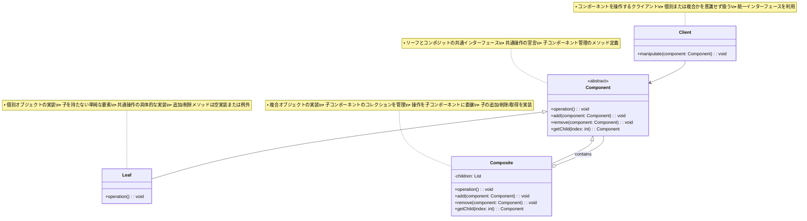

# Composite（コンポジット）パターン

## 目的

個々のオブジェクトと複合オブジェクトを同一視し、ツリー構造を表現するパターンです。

## 価値・解決する問題

- 個々のオブジェクトと複合オブジェクトを統一的に扱えます
- 階層構造を効果的に表現できます
- クライアントコードを単純化できます
- 再帰的な処理を容易に実装できます
- 柔軟な構造変更が可能です

## 概要・特徴

### 概要

Compositeパターンは、個々のオブジェクトと複合オブジェクトを同一のインターフェースで扱い、ツリー構造を表現する設計パターンです。このパターンでは、単一のオブジェクト（リーフ）と複数のオブジェクトからなるグループ（コンポジット）を同じ方法で操作できるようにします。これにより、複雑な階層構造を持つシステムでも、クライアントは対象が単一オブジェクトか複合オブジェクトかを区別せずに操作できるようになります。ファイルシステム、グラフィックシステム、メニュー構造など、階層的なデータ構造を扱う場面で特に有効です。

### 特徴

#### 統一的なインターフェース

個々のオブジェクト（リーフ）と複合オブジェクト（コンポジット）が同じインターフェースを実装するため、クライアントはどちらを扱っているのかを意識する必要がありません。この共通インターフェースにより、処理の一貫性が保たれ、コードの複雑さが軽減されます。例えば、描画操作やコスト計算など、階層全体に適用される操作を統一的に定義できます。

#### 階層構造の表現

ツリー構造を自然に表現できるため、複雑な階層関係を持つデータや構造を効果的にモデル化できます。ファイルシステム（ファイルとディレクトリ）、組織図（従業員と部署）、GUIコンポーネント（ボタンとパネル）など、現実世界の多くの階層的構造をそのままコードに落とし込むことができます。

#### 再帰的な処理

ツリー構造全体に対する操作を再帰的に適用できます。例えば、深さ優先探索や幅優先探索などのアルゴリズムを使って、ツリー全体を簡潔に処理できます。これにより、複雑なデータ構造に対する操作を、短くて読みやすいコードで実装できます。特に、合計値の計算や階層的な検索などの処理に適しています。

#### 柔軟な構造変更

実行時に階層構造を動的に変更できるため、システムの柔軟性が向上します。新しい要素（リーフやコンポジット）の追加や削除が容易で、構造の再編成も簡単に行えます。これにより、変化する要件に対応しやすくなり、システムの拡張性が高まります。

#### クライアントコードの単純化

Compositeパターンは、クライアントコードを大幅に単純化します。クライアントは個々のオブジェクト（リーフ）と複合オブジェクト（コンポジット）を区別する必要がなく、同じインターフェースを通じて統一的に扱うことができます。例えば、グラフィックエディタでは、単一の図形（円や四角形）とグループ化された図形に対して、同じ「描画」「移動」「サイズ変更」などの操作を一貫して適用できます。これにより、クライアントコードの条件分岐が減少し、「オブジェクトの種類に応じて異なる処理を行う」という複雑さが解消されます。また、新しい種類のコンポーネントが追加されても、クライアントコードを変更する必要がないため、システムの保守性が向上します。Webアプリケーションのコンポーネントシステムや、文書処理システムのドキュメント構造など、様々な階層的なシステムにおいて、この単純化の効果は大きな利点となります。さらに、テストの観点からも、クライアントコードのテストが簡素化され、より堅牢なシステムの構築につながります。

#### 型安全性との兼ね合い

Compositeパターンを実装する際の課題の一つは、型安全性とインターフェースの統一のバランスを取ることです。完全に統一されたインターフェースを提供するために、リーフノードには意味をなさない操作（例えば「子要素の追加」）も含める必要がある場合があります。例えば、ファイルシステムの実装では、ファイル（リーフ）に対する「子要素の追加」操作は本来意味を持ちませんが、インターフェースの統一のためにこうした操作が定義されることがあります。この問題に対処するアプローチとしては、①すべての操作をComponent基底クラスに定義し、リーフでは例外をスローする方法、②コンポジット専用の操作を別インターフェースに分離する方法、③型チェックと型キャストを使用する方法などがあります。例えば、Javaの`Swing`ライブラリでは、`Component`クラスと`Container`クラスを分離することで、この問題に対処しています。ただし、この分離はクライアントコードの複雑化を招く可能性があるため、アプリケーションの具体的な要件に応じて適切なバランスを見つける必要があります。また、最近の言語機能（ジェネリクスやオプショナル型など）を活用することで、この問題を軽減する手法も考案されています。

### 概要図



## 類似パターンとの比較

- [Decorator (デコレータ)](decorator.md): Composite は階層構造を扱い、これに対して Decorator は機能を動的に追加します。
- [Iterator (イテレータ)](iterator.md): Composite は階層構造を扱い、これに対して Iterator は要素へのアクセス方法を提供します。
- [Chain of Responsibility (責任連鎖)](chain-of-responsibility.md): Composite は階層構造を扱い、これに対して Chain of Responsibility は処理の連鎖を扱います。

## 利用されているライブラリ／フレームワークの事例

- [React](https://reactjs.org/): コンポーネントの構成
- [Java Swing](https://docs.oracle.com/javase/tutorial/uiswing/): UI要素の構成
- [DOM](https://developer.mozilla.org/en-US/docs/Web/API/Document_Object_Model): 文書構造の表現

## 解説ページリンク

- [Refactoring Guru - Composite](https://refactoring.guru/design-patterns/composite)
- [Microsoft - Composite Pattern](https://docs.microsoft.com/en-us/previous-versions/msp-n-p/ee658117(v=pandp.10))
- [SourceMaking - Composite](https://sourcemaking.com/design_patterns/composite)

## コード例

### Before:

階層構造を個別に処理する実装

```typescript
// ファイルクラス
class File {
  constructor(
    private name: string,
    private size: number
  ) {}

  getName(): string {
    return this.name;
  }

  getSize(): number {
    return this.size;
  }
}

// ディレクトリクラス
class Directory {
  private files: File[] = [];
  private subdirectories: Directory[] = [];

  constructor(private name: string) {}

  addFile(file: File): void {
    this.files.push(file);
  }

  addSubdirectory(directory: Directory): void {
    this.subdirectories.push(directory);
  }

  getName(): string {
    return this.name;
  }

  getFiles(): File[] {
    return this.files;
  }

  getSubdirectories(): Directory[] {
    return this.subdirectories;
  }
}

// 使用例
function example() {
  // ルートディレクトリの作成
  const root = new Directory("root");

  // ファイルの追加
  root.addFile(new File("file1.txt", 100));
  root.addFile(new File("file2.txt", 200));

  // サブディレクトリの作成と追加
  const subdir = new Directory("subdir");
  subdir.addFile(new File("file3.txt", 300));
  root.addSubdirectory(subdir);

  // ディレクトリ構造の表示（再帰的な処理が必要）
  function printDirectory(directory: Directory, indent: string = "") {
    console.log(`${indent}[${directory.getName()}]`);
    
    // ファイルの表示
    directory.getFiles().forEach(file => {
      console.log(`${indent}  ${file.getName()} (${file.getSize()}バイト)`);
    });
    
    // サブディレクトリの表示
    directory.getSubdirectories().forEach(subdir => {
      printDirectory(subdir, indent + "  ");
    });
  }

  // 合計サイズの計算（再帰的な処理が必要）
  function calculateTotalSize(directory: Directory): number {
    let totalSize = 0;
    
    // ファイルサイズの合計
    directory.getFiles().forEach(file => {
      totalSize += file.getSize();
    });
    
    // サブディレクトリのサイズを加算
    directory.getSubdirectories().forEach(subdir => {
      totalSize += calculateTotalSize(subdir);
    });
    
    return totalSize;
  }

  // 結果の表示
  console.log("=== ディレクトリ構造 ===");
  printDirectory(root);
  
  console.log("\n=== 合計サイズ ===");
  console.log(`${calculateTotalSize(root)}バイト`);
}

example();
```

### After:

Compositeパターンを関数型プログラミングスタイルで適用した実装

```typescript
// ファイルシステム要素の型定義
type FileSystemElementType = 'file' | 'directory'

// 共通プロパティの型定義
type FileSystemElementBase = Readonly<{
  name: string
  createdAt: Date
  modifiedAt: Date
  parent: string | null // 親ディレクトリのパス
}>

// ファイル型の定義
type FileElement = FileSystemElementBase & Readonly<{
  type: 'file'
  size: number
  content: string
}>

// ディレクトリ型の定義
type DirectoryElement = FileSystemElementBase & Readonly<{
  type: 'directory'
  children: ReadonlyArray<string> // 子要素のパス
}>

// ファイルシステム要素の共用型
type FileSystemElement = FileElement | DirectoryElement

// 全体のファイルシステムの状態を表す型
type FileSystem = Readonly<{
  // パスをキーとしたファイルシステム要素のマップ
  elements: Readonly<Record<string, FileSystemElement>>
}>

// 初期状態のファイルシステム
const createInitialFileSystem = (): FileSystem => ({
  elements: {}
})

// パスを構築するユーティリティ関数
const buildPath = (parent: string | null, name: string): string => 
  parent ? `${parent}/${name}` : name

// ファイルを作成する純粋関数
const createFile = (
  fs: FileSystem,
  parentPath: string | null,
  name: string,
  size: number,
  content: string = ''
): FileSystem => {
  const now = new Date()
  const path = buildPath(parentPath, name)
  
  // 新しいファイル要素を作成
  const file: FileElement = {
    type: 'file',
    name,
    size,
    content,
    createdAt: now,
    modifiedAt: now,
    parent: parentPath
  }
  
  // 親ディレクトリがある場合は親も更新する
  let updatedFs = {
    elements: {
      ...fs.elements,
      [path]: file
    }
  }
  
  if (parentPath && fs.elements[parentPath]) {
    const parent = fs.elements[parentPath] as DirectoryElement
    updatedFs = {
      elements: {
        ...updatedFs.elements,
        [parentPath]: {
          ...parent,
          modifiedAt: now,
          children: [...parent.children, path]
        }
      }
    }
  }
  
  return updatedFs
}

// ディレクトリを作成する純粋関数
const createDirectory = (
  fs: FileSystem,
  parentPath: string | null,
  name: string
): FileSystem => {
  const now = new Date()
  const path = buildPath(parentPath, name)
  
  // 新しいディレクトリ要素を作成
  const directory: DirectoryElement = {
    type: 'directory',
    name,
    createdAt: now,
    modifiedAt: now,
    parent: parentPath,
    children: []
  }
  
  // 親ディレクトリがある場合は親も更新する
  let updatedFs = {
    elements: {
      ...fs.elements,
      [path]: directory
    }
  }
  
  if (parentPath && fs.elements[parentPath]) {
    const parent = fs.elements[parentPath] as DirectoryElement
    updatedFs = {
      elements: {
        ...updatedFs.elements,
        [parentPath]: {
          ...parent,
          modifiedAt: now,
          children: [...parent.children, path]
        }
      }
    }
  }
  
  return updatedFs
}

// ファイルシステム要素のサイズを計算する純粋関数（再帰）
const calculateSize = (fs: FileSystem, path: string): number => {
  const element = fs.elements[path]
  if (!element) return 0
  
  if (element.type === 'file') {
    return element.size
  } else {
    // ディレクトリの場合は子要素のサイズを合計
    return element.children.reduce((total, childPath) => 
      total + calculateSize(fs, childPath), 0)
  }
}

// ファイルシステム要素を表示する関数
const printElement = (
  fs: FileSystem, 
  path: string, 
  indent: string = ''
): void => {
  const element = fs.elements[path]
  if (!element) return
  
  if (element.type === 'file') {
    console.log(
      `${indent}📄 ${element.name} ` +
      `(${element.size}バイト, ` +
      `更新: ${element.modifiedAt.toLocaleString()})`
    )
  } else {
    console.log(
      `${indent}📁 ${element.name} ` +
      `(${calculateSize(fs, path)}バイト, ` +
      `更新: ${element.modifiedAt.toLocaleString()})`
    )
    
    // 子要素を表示
    element.children.forEach(childPath => {
      printElement(fs, childPath, indent + '  ')
    })
  }
}

// 検索を行う純粋関数
const findElements = (
  fs: FileSystem,
  searchTerm: string,
  path: string | null = null
): ReadonlyArray<string> => {
  // パスが指定されていない場合はすべての要素から検索
  const elementsToSearch = path 
    ? [path] 
    : Object.keys(fs.elements)
  
  const results: string[] = []
  
  elementsToSearch.forEach(currentPath => {
    const element = fs.elements[currentPath]
    if (!element) return
    
    // 名前に検索語を含む場合は結果に追加
    if (element.name.includes(searchTerm)) {
      results.push(currentPath)
    }
    
    // ファイルの場合はコンテンツも検索
    if (element.type === 'file' && (element as FileElement).content.includes(searchTerm)) {
      if (!results.includes(currentPath)) {
        results.push(currentPath)
      }
    }
    
    // ディレクトリの場合は子要素も検索
    if (element.type === 'directory') {
      const childResults = (element as DirectoryElement).children.flatMap(childPath => 
        findElements(fs, searchTerm, childPath)
      )
      
      results.push(...childResults)
    }
  })
  
  return [...new Set(results)] // 重複を削除
}

// ファイルシステム統計を計算する純粋関数
const calculateStatistics = (
  fs: FileSystem,
  rootPath: string
): Readonly<{
  fileCount: number
  directoryCount: number
  totalSize: number
  largestFile: string | null
  deepestDirectory: string | null
  deepestLevel: number
}> => {
  let fileCount = 0
  let directoryCount = 0
  let totalSize = 0
  let largestFile: string | null = null
  let largestFileSize = 0
  let deepestDirectory: string | null = null
  let deepestLevel = 0
  
  // ファイルシステムをトラバースする再帰関数
  const traverse = (path: string): void => {
    const element = fs.elements[path]
    if (!element) return
    
    const level = path.split('/').length
    
    if (element.type === 'file') {
      fileCount++
      totalSize += element.size
      
      if (element.size > largestFileSize) {
        largestFileSize = element.size
        largestFile = path
      }
    } else {
      directoryCount++
      
      if (level > deepestLevel) {
        deepestLevel = level
        deepestDirectory = path
      }
      
      // 子要素を処理
      (element as DirectoryElement).children.forEach(traverse)
    }
  }
  
  // 処理開始
  traverse(rootPath)
  
  return {
    fileCount,
    directoryCount,
    totalSize,
    largestFile,
    deepestDirectory,
    deepestLevel
  }
}

// 使用例
const example = (): void => {
  // ファイルシステムの構築
  let fs = createInitialFileSystem()
  
  // ルートディレクトリの作成
  fs = createDirectory(fs, null, 'root')
  
  // documents ディレクトリ
  fs = createDirectory(fs, 'root', 'documents')
  fs = createFile(fs, 'root/documents', 'resume.txt', 1024, '職務経歴書の内容')
  fs = createFile(fs, 'root/documents', 'memo.txt', 512, 'メモの内容')
  
  // images ディレクトリ
  fs = createDirectory(fs, 'root', 'images')
  fs = createFile(fs, 'root/images', 'photo1.jpg', 2048)
  fs = createFile(fs, 'root/images', 'photo2.jpg', 3072)
  
  // projects ディレクトリ
  fs = createDirectory(fs, 'root', 'projects')
  fs = createDirectory(fs, 'root/projects', 'projectA')
  fs = createFile(fs, 'root/projects/projectA', 'readme.md', 256, 'プロジェクトAの説明')
  fs = createFile(fs, 'root/projects/projectA', 'main.ts', 1024, 'ソースコード')
  
  // ディレクトリ構造の表示
  console.log('=== ディレクトリ構造 ===')
  printElement(fs, 'root')
  
  // 統計情報の収集
  console.log('\n=== ファイルシステムの統計 ===')
  const stats = calculateStatistics(fs, 'root')
  
  console.log(`ファイル数: ${stats.fileCount}`)
  console.log(`ディレクトリ数: ${stats.directoryCount}`)
  console.log(`合計サイズ: ${stats.totalSize}バイト`)
  
  if (stats.largestFile) {
    const largestFile = fs.elements[stats.largestFile] as FileElement
    console.log(
      `最大のファイル: ${largestFile.name} ` +
      `(${largestFile.size}バイト)`
    )
  }
  
  if (stats.deepestDirectory) {
    const deepestDir = fs.elements[stats.deepestDirectory] as DirectoryElement
    console.log(
      `最も深いディレクトリ: ${stats.deepestDirectory} ` +
      `(レベル ${stats.deepestLevel})`
    )
  }
  
  // ファイルの検索
  console.log('\n=== ファイルの検索 ===')
  const searchResults = findElements(fs, 'project')
  
  console.log('検索結果 ("project" を含む要素):')
  searchResults.forEach(path => {
    const element = fs.elements[path]
    console.log(
      `- [${element.type}] ${path} ` +
      `(${element.type === 'file' ? 
        (element as FileElement).size : 
        calculateSize(fs, path)}バイト)`
    )
  })
  
  // 名前による要素の検索
  console.log('\n=== 名前による検索 ===')
  const nameResults = findElements(fs, 'main')
  nameResults.forEach(path => {
    const element = fs.elements[path]
    console.log(
      `${path} ` +
      `(${element.type}, ${element.type === 'file' ? 
        (element as FileElement).size : 
        calculateSize(fs, path)}バイト)`
    )
  })
}

// 実行
example()
```

