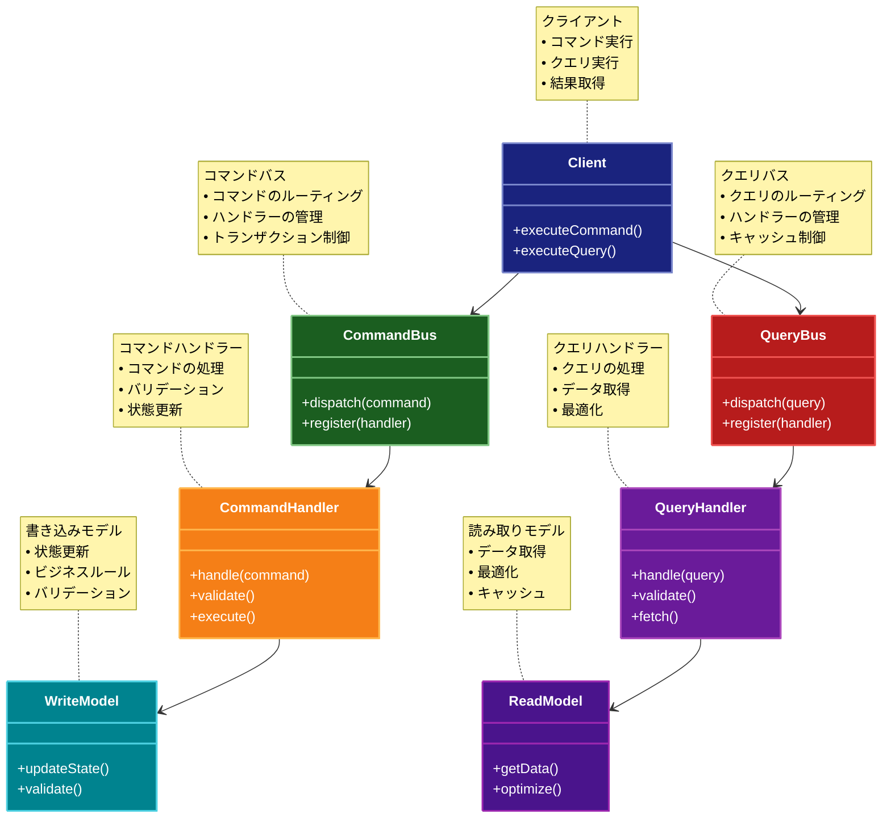

# CQRS（コマンドクエリ責務分離）パターン

## 目的

読み取り（クエリ）と書き込み（コマンド）の責務を分離し、それぞれを独立して最適化可能にします。

## 価値・解決する問題

- 読み取りと書き込みの独立したスケーリングが可能になります
- パフォーマンスの最適化が容易になります
- モデルの複雑性を軽減します
- セキュリティの制御が容易になります
- キャッシュの最適化が可能になります

## 概要・特徴

### 概要

CQRSは、システムの読み取り操作と書き込み操作を異なるモデルとして分離する設計パターンです。これにより、それぞれの操作を独立して最適化することが可能になります。

### 特徴

#### 読み取り/書き込みの分離
CQRSパターンの核心は、読み取り操作（クエリ）と書き込み操作（コマンド）を完全に分離することにあります。従来のCRUDベースのアプローチでは同じデータモデルを両方の操作に使用しますが、CQRSではそれぞれに最適化された別々のモデルを使用します。コマンドモデルはデータの整合性と業務ルールの適用に焦点を当て、ドメイン駆動設計の原則に従って実装されることが多いです。一方、クエリモデルは読み取り効率と表示に最適化され、必要に応じて非正規化されたビューやカスタムDTOを使用します。この分離により、それぞれのモデルが単一の責務に集中できるため、設計が明確になり、システムの理解と保守が容易になります。また、コマンド側とクエリ側のインターフェースが明確に分かれることで、API設計も一貫性を持ち、クライアント側との契約が明確になります。

#### 独立したスケーリング
CQRSの重要な利点の一つは、読み取り操作と書き込み操作を独立してスケーリングできることです。多くのシステムでは、読み取り操作の頻度が書き込み操作よりも大幅に高いのが一般的です（例えば、Eコマースサイトでは商品の閲覧が購入よりもはるかに多い）。CQRSでは、クエリ側とコマンド側のインフラを別々に構成できるため、負荷に応じて適切にリソースを配分できます。例えば、クエリサービスにはより多くのレプリカを配置し、コマンドサービスには少ないインスタンスで高い整合性を保証するといった構成が可能です。これにより、システム全体のコストパフォーマンスが向上し、資源の効率的な利用が実現します。また、一方のサービスに障害が発生した場合でも、もう一方のサービスは機能し続けることができるため、システムの可用性も向上します。

#### 最適化の柔軟性
読み取りと書き込みの操作を分離することで、それぞれに最適な技術やアーキテクチャを採用する柔軟性が生まれます。例えば、書き込み側ではトランザクションの整合性を重視したリレーショナルデータベースを使用し、読み取り側ではクエリパフォーマンスに優れたNoSQLデータベースや検索エンジンを採用することができます。この柔軟性により、各操作タイプの要件に最適な技術スタックを選択できるため、パフォーマンスとスケーラビリティが向上します。さらに、読み取り側では特定のユースケースに合わせて複数の特化したデータストアやビューを用意することも可能です。例えば、レポート生成用にデータウェアハウス、全文検索用にElasticsearch、高速アクセス用にRedisキャッシュなど、目的に応じた最適なデータストアを併用できます。この柔軟な最適化により、システム全体のレスポンス時間が短縮され、ユーザー体験が向上します。

#### モデルの単純化
従来のアプローチでは、読み取りと書き込みの両方に対応する単一のモデルを設計する必要があるため、複雑になりがちです。CQRSでは、それぞれの操作に特化したモデルを設計できるため、各モデルが単純化されます。書き込みモデルはビジネスルールとデータ整合性に注力し、複雑なドメインロジックを適切にカプセル化できます。一方、読み取りモデルはクライアントの表示要件に特化し、複雑なビジネスルールを考慮する必要がありません。この分離により、開発者はそれぞれのモデルで特定の問題に集中できるため、コードの品質が向上し、バグや副作用のリスクが減少します。また、モデルが単純化されることで、新しい開発者のオンボーディングも容易になり、チームの生産性が向上します。さらに、ドメインモデルの進化も容易になり、ビジネス要件の変化に対して迅速に対応できるようになります。

#### パフォーマンスの向上
CQRSパターンの採用により、システム全体のパフォーマンスが向上します。読み取り操作では、表示に必要な形式で直接データを取得できるため、複雑な変換や結合が不要になります。また、読み取り専用モデルでは非正規化したビューを使用できるため、複雑なクエリの実行時間が短縮されます。書き込み操作では、必要な検証とビジネスロジックのみに集中できるため、処理が効率化されます。さらに、コマンド側でのイベントソーシングと組み合わせることで、書き込みパフォーマンスも最適化できます。CQRSはキャッシュ戦略の実装も容易にします。読み取り側のデータは書き込み側から非同期に更新されるため、読み取りモデルのキャッシュライフサイクルを効果的に管理できます。これらのパフォーマンス最適化により、特に高負荷のシステムでユーザー体験が大幅に向上し、応答時間が短縮されるとともに、システム全体のスループットが向上します。

### 概要図



## 類似パターンとの比較

- [Event Sourcing (イベントソーシング)](event-sourcing.md): CQRS は読み取りと書き込みの分離に焦点を当て、これに対して Event Sourcing は状態変更の履歴管理に注力します。
- [Repository (リポジトリ)](repository.md): CQRS はモデルの分離に焦点を当て、これに対して Repository はデータアクセスの抽象化を提供します。
- [Command (コマンド)](command.md): CQRS は読み取り/書き込みの分離に焦点を当て、これに対して Command は操作のカプセル化に注力します。

## 利用されているライブラリ／フレームワークの事例

- [Axon Framework](https://axoniq.io/): Java向けのCQRSフレームワーク
- [NServiceBus](https://particular.net/nservicebus): .NET向けのメッセージングフレームワーク
- [Event Store](https://www.eventstore.com/): CQRSとEvent Sourcingの実装を提供

## 解説ページリンク

- [Martin Fowler - CQRS](https://martinfowler.com/bliki/CQRS.html)
- [Microsoft - CQRS Pattern](https://docs.microsoft.com/en-us/azure/architecture/patterns/cqrs)
- [Greg Young - CQRS Documents](https://cqrs.files.wordpress.com/2010/11/cqrs_documents.pdf)

## コード例

### Before:

単一モデルによる実装

```typescript
interface Product {
  id: string;
  name: string;
  description: string;
  price: number;
  stock: number;
  category: string;
  tags: string[];
}

class ProductService {
  private products: Map<string, Product> = new Map();

  // 商品の作成
  createProduct(product: Product): void {
    this.products.set(product.id, product);
  }

  // 商品の更新
  updateProduct(id: string, updates: Partial<Product>): void {
    const product = this.products.get(id);
    if (product) {
      Object.assign(product, updates);
    }
  }

  // 商品の取得
  getProduct(id: string): Product | undefined {
    return this.products.get(id);
  }

  // 商品の検索
  searchProducts(query: { category?: string; minPrice?: number; maxPrice?: number }): Product[] {
    return Array.from(this.products.values()).filter(product => {
      if (query.category && product.category !== query.category) return false;
      if (query.minPrice && product.price < query.minPrice) return false;
      if (query.maxPrice && product.price > query.maxPrice) return false;
      return true;
    });
  }
}

// 使用例
const service = new ProductService();

// 商品の作成
service.createProduct({
  id: "p1",
  name: "商品1",
  description: "商品1の説明",
  price: 1000,
  stock: 10,
  category: "電化製品",
  tags: ["家電", "新商品"]
});

// 商品の検索
const products = service.searchProducts({ category: "電化製品", minPrice: 500 });
```

### After:

CQRSパターンを適用した実装

```typescript
// コマンドモデル（書き込み用）
interface ProductWriteModel {
  id: string;
  name: string;
  price: number;
  stock: number;
  category: string;
}

// クエリモデル（読み取り用）
interface ProductReadModel {
  id: string;
  name: string;
  description: string;
  price: number;
  stock: number;
  category: string;
  tags: string[];
  lastUpdated: Date;
}

// コマンド（書き込み操作）の定義
interface CreateProductCommand {
  type: "CreateProduct";
  product: ProductWriteModel;
}

interface UpdateProductCommand {
  type: "UpdateProduct";
  id: string;
  updates: Partial<ProductWriteModel>;
}

interface UpdateStockCommand {
  type: "UpdateStock";
  id: string;
  quantity: number;
}

type ProductCommand = CreateProductCommand | UpdateProductCommand | UpdateStockCommand;

// クエリ（読み取り操作）の定義
interface GetProductQuery {
  id: string;
}

interface SearchProductsQuery {
  category?: string;
  minPrice?: number;
  maxPrice?: number;
  tags?: string[];
}

// コマンドハンドラ
class ProductCommandHandler {
  private products: Map<string, ProductWriteModel> = new Map();
  private eventBus: EventBus;

  constructor(eventBus: EventBus) {
    this.eventBus = eventBus;
  }

  async handle(command: ProductCommand): Promise<void> {
    switch (command.type) {
      case "CreateProduct":
        await this.handleCreateProduct(command);
        break;
      case "UpdateProduct":
        await this.handleUpdateProduct(command);
        break;
      case "UpdateStock":
        await this.handleUpdateStock(command);
        break;
    }
  }

  private async handleCreateProduct(command: CreateProductCommand): Promise<void> {
    const { product } = command;
    
    if (this.products.has(product.id)) {
      throw new Error("商品が既に存在します");
    }

    this.products.set(product.id, product);
    
    this.eventBus.publish({
      type: "ProductCreated",
      data: product
    });
  }

  private async handleUpdateProduct(command: UpdateProductCommand): Promise<void> {
    const { id, updates } = command;
    const product = this.products.get(id);
    
    if (!product) {
      throw new Error("商品が見つかりません");
    }

    Object.assign(product, updates);
    
    this.eventBus.publish({
      type: "ProductUpdated",
      data: { id, updates }
    });
  }

  private async handleUpdateStock(command: UpdateStockCommand): Promise<void> {
    const { id, quantity } = command;
    const product = this.products.get(id);
    
    if (!product) {
      throw new Error("商品が見つかりません");
    }

    product.stock = quantity;
    
    this.eventBus.publish({
      type: "StockUpdated",
      data: { id, quantity }
    });
  }
}

// クエリハンドラ
class ProductQueryHandler {
  private readModels: Map<string, ProductReadModel> = new Map();

  constructor(eventBus: EventBus) {
    // イベントの購読
    eventBus.subscribe("ProductCreated", event => this.handleProductCreated(event));
    eventBus.subscribe("ProductUpdated", event => this.handleProductUpdated(event));
    eventBus.subscribe("StockUpdated", event => this.handleStockUpdated(event));
  }

  // クエリハンドリング
  async getProduct(query: GetProductQuery): Promise<ProductReadModel | null> {
    return this.readModels.get(query.id) ?? null;
  }

  async searchProducts(query: SearchProductsQuery): Promise<ProductReadModel[]> {
    return Array.from(this.readModels.values()).filter(product => {
      if (query.category && product.category !== query.category) return false;
      if (query.minPrice && product.price < query.minPrice) return false;
      if (query.maxPrice && product.price > query.maxPrice) return false;
      if (query.tags && !query.tags.every(tag => product.tags.includes(tag))) return false;
      return true;
    });
  }

  // イベントハンドリング
  private handleProductCreated(event: any): void {
    const product = event.data;
    this.readModels.set(product.id, {
      ...product,
      description: "",
      tags: [],
      lastUpdated: new Date()
    });
  }

  private handleProductUpdated(event: any): void {
    const { id, updates } = event.data;
    const product = this.readModels.get(id);
    if (product) {
      Object.assign(product, updates, { lastUpdated: new Date() });
    }
  }

  private handleStockUpdated(event: any): void {
    const { id, quantity } = event.data;
    const product = this.readModels.get(id);
    if (product) {
      product.stock = quantity;
      product.lastUpdated = new Date();
    }
  }
}

// イベントバス
class EventBus {
  private subscribers: Map<string, ((event: any) => void)[]> = new Map();

  subscribe(eventType: string, callback: (event: any) => void): void {
    if (!this.subscribers.has(eventType)) {
      this.subscribers.set(eventType, []);
    }
    this.subscribers.get(eventType)?.push(callback);
  }

  publish(event: { type: string; data: any }): void {
    const callbacks = this.subscribers.get(event.type) || [];
    callbacks.forEach(callback => callback(event));
  }
}

// ファサード
class ProductService {
  private commandHandler: ProductCommandHandler;
  private queryHandler: ProductQueryHandler;

  constructor() {
    const eventBus = new EventBus();
    this.commandHandler = new ProductCommandHandler(eventBus);
    this.queryHandler = new ProductQueryHandler(eventBus);
  }

  // コマンド操作
  async createProduct(product: ProductWriteModel): Promise<void> {
    await this.commandHandler.handle({
      type: "CreateProduct",
      product
    });
  }

  async updateProduct(id: string, updates: Partial<ProductWriteModel>): Promise<void> {
    await this.commandHandler.handle({
      type: "UpdateProduct",
      id,
      updates
    });
  }

  async updateStock(id: string, quantity: number): Promise<void> {
    await this.commandHandler.handle({
      type: "UpdateStock",
      id,
      quantity
    });
  }

  // クエリ操作
  async getProduct(id: string): Promise<ProductReadModel | null> {
    return await this.queryHandler.getProduct({ id });
  }

  async searchProducts(query: SearchProductsQuery): Promise<ProductReadModel[]> {
    return await this.queryHandler.searchProducts(query);
  }
}

// 使用例
async function example() {
  const service = new ProductService();

  // 商品の作成（コマンド）
  await service.createProduct({
    id: "p1",
    name: "高性能ノートPC",
    price: 150000,
    stock: 10,
    category: "電化製品"
  });

  // 在庫の更新（コマンド）
  await service.updateStock("p1", 8);

  // 商品情報の取得（クエリ）
  const product = await service.getProduct("p1");
  console.log("商品情報:", product);

  // 商品の検索（クエリ）
  const products = await service.searchProducts({
    category: "電化製品",
    minPrice: 100000
  });
  console.log("検索結果:", products);
}

example();
```
