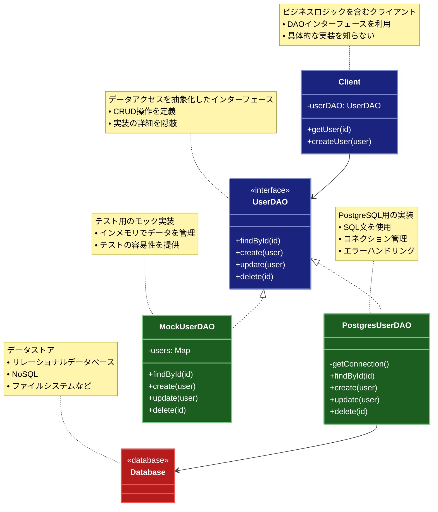

# DAO (Data Access Object)

## 目的

データの永続化層へのアクセスを抽象化し、データアクセスの詳細をビジネスロジックから分離します。これにより、データストアの実装の変更がアプリケーション全体に影響を与えることを防ぎます。

## 価値・解決する問題

- データアクセスロジックの集中管理
- データストアの実装詳細の隠蔽
- ビジネスロジックとデータアクセスの分離
- テスト容易性の向上

## 概要・特徴

### 概要

DAOパターンは、データアクセス層を抽象化し、ビジネスロジックからデータストアへのアクセスを分離するパターンです。これにより、データストアの実装の変更がアプリケーション全体に影響を与えることを防ぎます。

### 特徴

#### データアクセスロジックの集中管理
DAOパターンでは、特定のデータエンティティに関連するすべてのデータアクセス操作が単一のクラスに集約されます。これにより、同じSQLクエリやデータベース操作が複数の場所に重複して実装されることを防ぎ、コードの一貫性と保守性が向上します。データベースのスキーマ変更やクエリの最適化が必要になった場合も、修正箇所が限定されるため、変更の影響範囲を最小限に抑えることができます。また、パフォーマンス最適化やキャッシングなどの戦略も一元的に実装できるため、アプリケーション全体のデータアクセス効率を向上させることができます。

#### データストアの実装詳細の隠蔽
DAOは具体的なデータストア（リレーショナルデータベース、NoSQLデータベース、XMLファイル、Webサービスなど）の実装詳細を抽象化し、クライアントコードから隠蔽します。アプリケーションの他の部分は、DAOが提供する抽象インターフェースを通じてデータにアクセスするため、データストアの具体的な技術や実装が変更されても、クライアントコードを修正する必要がありません。例えば、MySQLからPostgreSQLへの移行や、リレーショナルデータベースからNoSQLデータベースへの移行などの大きな変更でも、DAOの実装のみを変更すれば対応できます。この抽象化により、システムの柔軟性と拡張性が向上します。

#### ビジネスロジックとデータアクセスの分離
DAOパターンはビジネスロジックとデータアクセスロジックを明確に分離します。ビジネスロジックを含むサービスやコントローラーは、データの取得や永続化の詳細を知らなくても、DAOインターフェースを通じてデータ操作を行うことができます。この分離により、それぞれのコンポーネントが単一責任の原則に従い、特定の役割に焦点を当てることができます。ビジネスロジックの開発者はデータベース操作の詳細を気にせず、ビジネスルールの実装に集中でき、同様にDAOの開発者はデータアクセスの効率化や最適化に専念できます。この明確な責務の分担により、コードの可読性、保守性、そして開発効率が向上します。

#### テスト容易性の向上
DAOパターンを採用することで、ビジネスロジックのテストが大幅に容易になります。DAOインターフェースをモック化することで、実際のデータベースに依存せずにビジネスロジックの単体テストを行うことができます。これにより、テストの実行速度が向上し、テスト環境のセットアップが簡略化されます。また、DAOそのもののテストも、ビジネスロジックから独立して行うことができるため、テストの焦点を絞りやすくなります。データアクセス層のテストは、実際のデータベースを使用するインテグレーションテストとして実装でき、ビジネスロジックのテストとは別に管理できます。このようなテスト戦略により、アプリケーション全体の品質と信頼性を効率的に向上させることができます。

### 概要図



## コード例

### Before:

直接的なデータベースアクセス

```typescript
"use strict";

class UserService {
  async getUser(id: string): Promise<any> {
    const connection = await database.connect();
    try {
      const result = await connection.query(
        "SELECT * FROM users WHERE id = ?",
        [id]
      );
      return result.rows[0];
    } finally {
      await connection.close();
    }
  }

  async createUser(user: any): Promise<void> {
    const connection = await database.connect();
    try {
      await connection.query(
        "INSERT INTO users (id, name, email) VALUES (?, ?, ?)",
        [user.id, user.name, user.email]
      );
    } finally {
      await connection.close();
    }
  }
}
```

### After:

DAO パターンを利用した実装

```typescript
"use strict";

// データモデル
interface User {
  id: string;
  name: string;
  email: string;
}

// DAOインターフェース
interface UserDAO {
  findById(id: string): Promise<User | null>;
  create(user: User): Promise<void>;
  update(user: User): Promise<void>;
  delete(id: string): Promise<void>;
}

// 具体的なDAO実装（PostgreSQL用）
class PostgresUserDAO implements UserDAO {
  private async getConnection() {
    return await database.connect();
  }

  async findById(id: string): Promise<User | null> {
    const connection = await this.getConnection();
    try {
      const result = await connection.query(
        "SELECT * FROM users WHERE id = $1",
        [id]
      );
      return result.rows[0] || null;
    } finally {
      await connection.close();
    }
  }

  async create(user: User): Promise<void> {
    const connection = await this.getConnection();
    try {
      await connection.query(
        "INSERT INTO users (id, name, email) VALUES ($1, $2, $3)",
        [user.id, user.name, user.email]
      );
    } finally {
      await connection.close();
    }
  }

  async update(user: User): Promise<void> {
    const connection = await this.getConnection();
    try {
      await connection.query(
        "UPDATE users SET name = $2, email = $3 WHERE id = $1",
        [user.id, user.name, user.email]
      );
    } finally {
      await connection.close();
    }
  }

  async delete(id: string): Promise<void> {
    const connection = await this.getConnection();
    try {
      await connection.query("DELETE FROM users WHERE id = $1", [id]);
    } finally {
      await connection.close();
    }
  }
}

// モックDAO実装（テスト用）
class MockUserDAO implements UserDAO {
  private users: Map<string, User> = new Map();

  async findById(id: string): Promise<User | null> {
    return this.users.get(id) || null;
  }

  async create(user: User): Promise<void> {
    this.users.set(user.id, user);
  }

  async update(user: User): Promise<void> {
    this.users.set(user.id, user);
  }

  async delete(id: string): Promise<void> {
    this.users.delete(id);
  }
}

// サービス層での使用例
class UserService {
  constructor(private userDAO: UserDAO) {}

  async getUser(id: string): Promise<User | null> {
    return await this.userDAO.findById(id);
  }

  async createUser(user: User): Promise<void> {
    await this.userDAO.create(user);
  }
}

// 使用例
async function example() {
  // 本番環境
  const prodUserService = new UserService(new PostgresUserDAO());
  await prodUserService.createUser({
    id: "1",
    name: "John Doe",
    email: "john@example.com",
  });

  // テスト環境
  const testUserService = new UserService(new MockUserDAO());
  await testUserService.createUser({
    id: "1",
    name: "Test User",
    email: "test@example.com",
  });
}
```

## 類似パターンとの比較

- [Repository (リポジトリ)](repository.md): DAO はデータアクセスの詳細を抽象化し、これに対して Repository はドメインオブジェクトのコレクション操作に焦点を当てます。
- [Active Record](active-record.md): DAO はデータアクセスロジックを分離し、これに対して Active Record はデータアクセスロジックをドメインオブジェクトに統合します。

## 利用されているライブラリ／フレームワークの事例

- [TypeORM](https://typeorm.io/): Repository パターンと DAO パターンの考え方を組み合わせたデータアクセス層を提供
- [Hibernate](https://hibernate.org/): Java の ORM フレームワークで、DAO パターンをサポート
- [MyBatis](https://mybatis.org/mybatis-3/): SQL マッパーフレームワークで、DAO パターンの実装を支援
