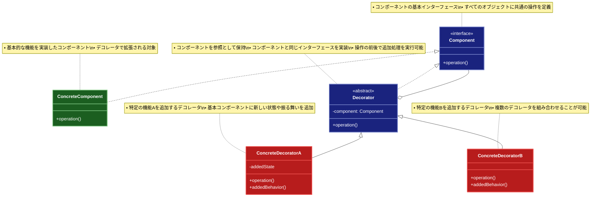

# Decorator（デコレータ）パターン

## 目的

オブジェクトに動的に新しい責務を追加することを可能にするパターンです。

## 価値・解決する問題

- 機能を動的に追加できます
- 単一責任の原則を守れます
- 継承の代替手段を提供します
- 柔軟な機能拡張が可能です
- 既存のコードを変更せずに機能を追加できます

## 概要・特徴

### 概要

Decoratorパターンは、オブジェクトに新しい振る舞いを動的に追加することを可能にし、サブクラス化の代替となる柔軟な設計を提供する設計パターンです。このパターンでは、元のオブジェクトを修正せずに、それをラップするデコレータオブジェクトを使って機能を拡張します。デコレータは元のオブジェクトと同じインターフェースを実装し、受け取ったリクエストを元のオブジェクトに転送した後、追加の振る舞いを実行します。複数のデコレータを重ねることで、柔軟に機能を組み合わせることができます。これにより、クラス爆発を避けつつ、実行時に機能を追加したり取り除いたりすることが可能になります。

### 特徴

#### 動的な機能追加

実行時にオブジェクトに新しい振る舞いや責務を動的に追加できます。これにより、静的な継承では難しい柔軟な機能拡張が可能になります。例えば、テキスト処理システムでは、基本的なテキストコンポーネントに対して、書式設定、暗号化、圧縮などの機能をユーザーの必要に応じて動的に追加できます。このような動的な性質により、アプリケーションの実行中でも機能構成を変更できる柔軟性が生まれます。

#### 単一責任の原則

各デコレータクラスは特定の機能追加に集中するため、単一責任の原則に従った設計が可能になります。例えば、ログ記録、キャッシュ、権限チェックなど、それぞれの横断的関心事を別々のデコレータとして実装できます。これにより、コードの保守性が向上し、特定の機能だけを修正する場合も影響範囲が限定されます。また、機能ごとに分離されたコードはテストも容易になります。

#### 柔軟な拡張性

デコレータを組み合わせることで、様々な機能の組み合わせを実現できます。これにより、事前に全ての組み合わせを想定したクラスを用意する必要がなく、クラス爆発を防ぐことができます。例えば、データストリームに対して圧縮、暗号化、バッファリングなどの機能を任意の順序で組み合わせることができます。この柔軟性により、将来の要件変更にも対応しやすいシステム設計が可能になります。

#### 既存コードの保護

オリジナルのオブジェクトを修正せずに機能を拡張できるため、既存コードを保護し、オープン・クローズドの原則に従った設計を実現できます。これは特に、変更できないライブラリの機能拡張や、チーム間で共有されるコアコンポーネントの拡張に役立ちます。元のコードに影響を与えずに新機能を追加できるため、リグレッションのリスクが減少し、安全な拡張が可能になります。

#### 機能の組み合わせ

デコレータパターンでは、複数のデコレータを重ねることで、機能を自由に組み合わせることができます。これにより、特定のユースケースや要件に合わせたカスタマイズが容易になります。例えば、Webアプリケーションのリクエスト処理において、認証チェック、ロギング、キャッシュ、レート制限などの機能を独立したデコレータとして実装し、それらを必要に応じて組み合わせることができます。APIエンドポイントによって異なるセキュリティ要件がある場合、一部のエンドポイントには認証デコレータを適用し、他のエンドポイントにはそれを省略することが可能です。また、高負荷が予想されるエンドポイントには、キャッシュデコレータとレート制限デコレータを組み合わせて適用することができます。この柔軟な組み合わせ能力により、アプリケーション全体で一貫したコンポーネントを維持しながらも、各部分に最適な機能セットを提供することができます。

#### 透過的な使用

デコレータは装飾対象と同じインターフェースを実装するため、クライアントコードは装飾されたオブジェクトを元のオブジェクトと同じように扱うことができます。これにより、クライアントコードを変更することなく、システムの振る舞いを拡張できます。例えば、データソースコンポーネントに対して、パフォーマンス測定デコレータを追加しても、そのデータソースを使用するクライアントコードは変更する必要がありません。この透過性は、レガシーシステムの拡張や、複雑なシステムの段階的な改善において特に価値があります。また、テスト環境では実際のサービスをモックデコレータでラップすることで、本番環境のコードを変更せずにテスト可能なシステムを構築できます。この特性により、デコレータパターンは依存性注入フレームワークやAOPツールとの相性が良く、横断的関心事の管理に効果的なアプローチを提供します。

### 概要図



## 類似パターンとの比較

- [Composite (コンポジット)](composite.md): Decorator は機能を動的に追加し、これに対して Composite は階層構造を扱います。
- [Strategy (ストラテジー)](strategy.md): Decorator は機能を動的に追加し、これに対して Strategy はアルゴリズムの切り替えを提供します。
- [Chain of Responsibility (責任連鎖)](chain-of-responsibility.md): Decorator は機能を動的に追加し、これに対して Chain of Responsibility は処理の連鎖を扱います。

## 利用されているライブラリ／フレームワークの事例

- [Java I/O Streams](https://docs.oracle.com/javase/8/docs/api/java/io/package-summary.html): 入出力処理
- [TypeScript Decorators](https://www.typescriptlang.org/docs/handbook/decorators.html): クラス拡張
- [Python Decorators](https://docs.python.org/3/glossary.html#term-decorator): 関数拡張

## 解説ページリンク

- [Refactoring Guru - Decorator](https://refactoring.guru/design-patterns/decorator)
- [Microsoft - Decorator Pattern](https://docs.microsoft.com/en-us/previous-versions/msp-n-p/ee658117(v=pandp.10))
- [SourceMaking - Decorator](https://sourcemaking.com/design_patterns/decorator)

## コード例

### Before:

継承を使用した機能追加の実装

```typescript
// 基本的なコーヒークラス
class Coffee {
  getDescription(): string {
    return "コーヒー";
  }

  getCost(): number {
    return 300;
  }
}

// ミルク入りコーヒー
class CoffeeWithMilk extends Coffee {
  getDescription(): string {
    return "ミルク入りコーヒー";
  }

  getCost(): number {
    return super.getCost() + 50;
  }
}

// シロップ入りコーヒー
class CoffeeWithSyrup extends Coffee {
  getDescription(): string {
    return "シロップ入りコーヒー";
  }

  getCost(): number {
    return super.getCost() + 100;
  }
}

// ミルクとシロップ入りコーヒー
class CoffeeWithMilkAndSyrup extends CoffeeWithMilk {
  getDescription(): string {
    return "ミルクとシロップ入りコーヒー";
  }

  getCost(): number {
    return super.getCost() + 100;
  }
}

// 使用例
function example() {
  const coffee = new Coffee();
  console.log(`${coffee.getDescription()}: ${coffee.getCost()}円`);

  const coffeeWithMilk = new CoffeeWithMilk();
  console.log(`${coffeeWithMilk.getDescription()}: ${coffeeWithMilk.getCost()}円`);

  const coffeeWithSyrup = new CoffeeWithSyrup();
  console.log(`${coffeeWithSyrup.getDescription()}: ${coffeeWithSyrup.getCost()}円`);

  const coffeeWithMilkAndSyrup = new CoffeeWithMilkAndSyrup();
  console.log(`${coffeeWithMilkAndSyrup.getDescription()}: ${coffeeWithMilkAndSyrup.getCost()}円`);
}

example();
```

### After:

Decoratorパターンを関数型プログラミングスタイルで適用した実装

```typescript
// 飲み物の型定義
type Beverage = Readonly<{
  description: string
  cost: number
  calories: number
  allergens: ReadonlyArray<string>
  preparationTime: number
}>

// 基本的なコーヒーを作成する関数
const createSimpleCoffee = (): Beverage => ({
  description: 'コーヒー',
  cost: 300,
  calories: 0,
  allergens: [],
  preparationTime: 180 // 3分
})

// デコレータ関数の型 - 既存の飲み物を受け取り新しい飲み物を返す
type BeverageDecorator = (beverage: Beverage) => Beverage

// ミルクデコレータ関数
const withMilk: BeverageDecorator = beverage => ({
  ...beverage,
  description: `${beverage.description}、ミルク追加`,
  cost: beverage.cost + 50,
  calories: beverage.calories + 50,
  allergens: [...beverage.allergens, '乳'],
  preparationTime: beverage.preparationTime + 30
})

// シロップデコレータを作成する関数
const withSyrup = (flavor: string): BeverageDecorator => beverage => ({
  ...beverage,
  description: `${beverage.description}、${flavor}シロップ追加`,
  cost: beverage.cost + 100,
  calories: beverage.calories + 100,
  preparationTime: beverage.preparationTime + 20
})

// ホイップクリームデコレータ関数
const withWhippedCream: BeverageDecorator = beverage => ({
  ...beverage,
  description: `${beverage.description}、ホイップクリーム追加`,
  cost: beverage.cost + 100,
  calories: beverage.calories + 120,
  allergens: [...beverage.allergens, '乳'],
  preparationTime: beverage.preparationTime + 60
})

// キャラメルソースデコレータ関数
const withCaramelSauce: BeverageDecorator = beverage => ({
  ...beverage,
  description: `${beverage.description}、キャラメルソース追加`,
  cost: beverage.cost + 80,
  calories: beverage.calories + 90,
  preparationTime: beverage.preparationTime + 25
})

// エクストラショットデコレータ関数
const withExtraShot: BeverageDecorator = beverage => ({
  ...beverage,
  description: `${beverage.description}、エクストラショット追加`,
  cost: beverage.cost + 150,
  calories: beverage.calories + 5,
  preparationTime: beverage.preparationTime + 90
})

// アイスデコレータ関数
const withIce: BeverageDecorator = beverage => ({
  ...beverage,
  description: `アイス${beverage.description}`,
  // 追加料金なし
  preparationTime: beverage.preparationTime + 15
})

// サイズデコレータを作成する関数
const withSize = (size: 'Small' | 'Regular' | 'Large'): BeverageDecorator => beverage => {
  const sizeFactors = {
    Small: { costAdjust: -50, caloriesFactor: 0.8, timeFactor: 1 },
    Regular: { costAdjust: 0, caloriesFactor: 1, timeFactor: 1 },
    Large: { costAdjust: 100, caloriesFactor: 1.3, timeFactor: 1.2 }
  }
  
  const { costAdjust, caloriesFactor, timeFactor } = sizeFactors[size]
  
  return {
    ...beverage,
    description: `${size} ${beverage.description}`,
    cost: beverage.cost + costAdjust,
    calories: Math.floor(beverage.calories * caloriesFactor),
    preparationTime: Math.floor(beverage.preparationTime * timeFactor)
  }
}

// 複数のデコレータを適用するユーティリティ関数
const pipe = <T>(...fns: Array<(arg: T) => T>) => (value: T): T =>
  fns.reduce((acc, fn) => fn(acc), value)

// 飲み物の情報を表示するユーティリティ関数
const displayBeverageInfo = (beverage: Beverage): void => {
  console.log('=== 飲み物の情報 ===')
  console.log(`商品名: ${beverage.description}`)
  console.log(`価格: ${beverage.cost}円`)
  console.log(`カロリー: ${beverage.calories}kcal`)
  
  if (beverage.allergens.length > 0) {
    console.log(`アレルギー物質: ${beverage.allergens.join(', ')}`)
  }
  
  const minutes = Math.floor(beverage.preparationTime / 60)
  const seconds = beverage.preparationTime % 60
  console.log(`準備時間: ${minutes}分${seconds}秒`)
  console.log()
}

// 使用例
const example = (): void => {
  // 基本的なコーヒー
  console.log('1. 基本的なコーヒー')
  const coffee = createSimpleCoffee()
  displayBeverageInfo(coffee)

  // カフェラテ（コーヒー + ミルク）
  console.log('2. カフェラテ')
  const latte = withMilk(createSimpleCoffee())
  displayBeverageInfo(latte)

  // キャラメルマキアート
  // （コーヒー + ミルク + キャラメルソース + ホイップクリーム）
  console.log('3. キャラメルマキアート')
  const caramelMacchiato = pipe(
    withMilk,
    withCaramelSauce,
    withWhippedCream
  )(createSimpleCoffee())
  displayBeverageInfo(caramelMacchiato)

  // アイスバニララテ
  // （コーヒー + ミルク + バニラシロップ + 氷）
  console.log('4. アイスバニララテ')
  const icedVanillaLatte = pipe(
    withMilk,
    withSyrup('バニラ'),
    withIce
  )(createSimpleCoffee())
  displayBeverageInfo(icedVanillaLatte)

  // ダブルショットキャラメルフラペチーノ
  // （コーヒー + ミルク + キャラメルソース + ホイップクリーム + エクストラショット + 氷）
  console.log('5. ダブルショットキャラメルフラペチーノ')
  const doubleCaramelFrappuccino = pipe(
    withMilk,
    withExtraShot,
    withExtraShot,
    withCaramelSauce,
    withWhippedCream,
    withIce,
    withSize('Large')
  )(createSimpleCoffee())
  displayBeverageInfo(doubleCaramelFrappuccino)
}

// 実行
example()
```
