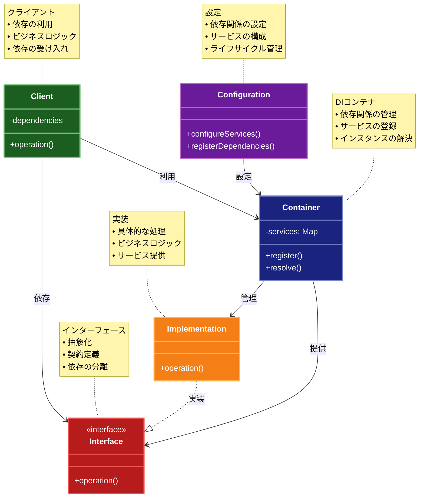

# Dependency Injection（依存性注入）パターン

## 目的

コンポーネント間の依存関係を外部から注入することで、結合度を低下させ、テスト容易性と再利用性を向上させるパターンです。

## 価値・解決する問題

- コンポーネント間の結合度の低減
- テスト容易性の向上
- コードの再利用性向上
- 依存関係の明確化
- 設定の柔軟性確保

## 概要・特徴

### 概要

Dependency Injectionパターンは、コンポーネントが必要とする依存オブジェクトを外部から注入することで、コンポーネント間の結合度を低下させ、テストや保守を容易にするパターンです。

### 特徴

#### 依存関係の外部化
コンポーネントが自身で依存オブジェクトを生成するのではなく、外部（DIコンテナやファクトリなど）から依存オブジェクトを受け取ります。これにより、コンポーネントは具体的な実装クラスではなく、インターフェースに依存するようになり、実装の詳細から分離されます。依存関係を外部化することで、システム設計の柔軟性が向上し、コンポーネントの入れ替えや拡張が容易になります。

#### インターフェースベース
依存性注入では、コンポーネントは通常、具体的な実装クラスではなく抽象インターフェースに依存します。これにより、依存先の実装を変更することなくコンポーネントを再利用できるようになります。また、インターフェースベースの設計により、プログラムの各部分が明確に分離され、責任範囲が明確になり、コードの可読性と保守性が向上します。

#### 設定の柔軟性
アプリケーションの実行時やビルド時に、異なる環境や条件に応じて依存関係を柔軟に変更することができます。例えば、開発環境ではモックオブジェクト、本番環境では実際のサービスを注入するといった使い分けが可能になります。この柔軟性により、同じコードベースを様々な環境やコンテキストで再利用できるようになります。

#### テスト容易性
依存するオブジェクトをモックやスタブに置き換えることで、コンポーネントを単体でテストすることが容易になります。外部システムやデータベースなどの複雑な依存関係を持つ場合でも、それらをシミュレートするテストダブルを注入することで、信頼性の高い単体テストを実現できます。これにより、開発サイクルの早い段階でバグを発見し修正することが可能になります。

#### 関心の分離
コンポーネントは自身の主要な責務に集中し、依存オブジェクトの生成や管理という副次的な責務から解放されます。この関心の分離により、各コンポーネントがより単一責任の原則に沿った設計になり、コードの理解しやすさと保守性が向上します。また、アプリケーションの構成管理と個々のコンポーネントの実装が分離されることで、それぞれを独立して発展させることができます。

### 概要図



## 類似パターンとの比較

- [Service Locator (サービスロケーター)](service-locator.md): DI は依存を外部から注入し、これに対して Service Locator は依存を内部で解決します。
- [Factory Method (ファクトリーメソッド)](factory-method.md): DI は依存を外部から注入し、これに対して Factory Method は依存の生成を専用のメソッドに委譲します。
- [Abstract Factory (抽象ファクトリー)](abstract-factory.md): DI は依存を外部から注入し、これに対して Abstract Factory は関連する依存の生成を抽象化します。

## 利用されているライブラリ／フレームワークの事例

- [InversifyJS](https://github.com/inversify/InversifyJS): TypeScript向けDIコンテナ
- [Spring Framework](https://spring.io/): JavaのDIフレームワーク
- [Angular](https://angular.io/guide/dependency-injection): フロントエンドフレームワークのDI機能

## 解説ページリンク

- [Martin Fowler - Inversion of Control Containers and the Dependency Injection pattern](https://martinfowler.com/articles/injection.html)
- [Microsoft - Dependency Injection](https://docs.microsoft.com/en-us/aspnet/core/fundamentals/dependency-injection)
- [Angular - Dependency Injection Guide](https://angular.io/guide/dependency-injection)

## コード例

### Before:

DIパターンなしの実装

```typescript
class UserRepository {
  async findUser(id: number): Promise<User> {
    // データベースからユーザーを取得
    return { id, name: "User " + id };
  }
}

class EmailService {
  async sendEmail(to: string, subject: string, body: string): Promise<void> {
    // メール送信のロジック
    console.log(`Sending email to ${to}: ${subject}`);
  }
}

class UserService {
  private repository = new UserRepository();
  private emailService = new EmailService();

  async notifyUser(userId: number): Promise<void> {
    const user = await this.repository.findUser(userId);
    await this.emailService.sendEmail(
      user.email,
      "Notification",
      "Hello " + user.name
    );
  }
}
```

### After:

Dependency Injectionパターンを適用した実装

```typescript
// インターフェースの定義
interface User {
  id: number;
  name: string;
  email: string;
}

interface IUserRepository {
  findUser(id: number): Promise<User>;
}

interface IEmailService {
  sendEmail(to: string, subject: string, body: string): Promise<void>;
}

interface ILogger {
  log(message: string): void;
  error(message: string, error?: Error): void;
}

// 実装クラス
class ConsoleLogger implements ILogger {
  log(message: string): void {
    console.log(`[LOG] ${message}`);
  }

  error(message: string, error?: Error): void {
    console.error(`[ERROR] ${message}`, error);
  }
}

class UserRepository implements IUserRepository {
  constructor(private readonly logger: ILogger) {}

  async findUser(id: number): Promise<User> {
    this.logger.log(`Finding user with ID: ${id}`);
    // データベースからユーザーを取得する処理
    return {
      id,
      name: `User ${id}`,
      email: `user${id}@example.com`
    };
  }
}

class EmailService implements IEmailService {
  constructor(private readonly logger: ILogger) {}

  async sendEmail(to: string, subject: string, body: string): Promise<void> {
    this.logger.log(`Sending email to ${to}`);
    // メール送信のロジック
    console.log(`To: ${to}`);
    console.log(`Subject: ${subject}`);
    console.log(`Body: ${body}`);
  }
}

// DIコンテナの実装
class Container {
  private readonly services: Map<string, any> = new Map();

  register<T>(token: string, instance: T): void {
    this.services.set(token, instance);
  }

  resolve<T>(token: string): T {
    const service = this.services.get(token);
    if (!service) {
      throw new Error(`Service not found: ${token}`);
    }
    return service;
  }
}

// ユーザーサービス（依存を注入される側）
class UserService {
  constructor(
    private readonly repository: IUserRepository,
    private readonly emailService: IEmailService,
    private readonly logger: ILogger
  ) {}

  async notifyUser(userId: number): Promise<void> {
    try {
      this.logger.log(`Notifying user: ${userId}`);
      
      const user = await this.repository.findUser(userId);
      
      await this.emailService.sendEmail(
        user.email,
        "Notification",
        `Hello ${user.name}!`
      );
      
      this.logger.log(`Successfully notified user: ${userId}`);
    } catch (error) {
      this.logger.error(`Failed to notify user: ${userId}`, error as Error);
      throw error;
    }
  }
}

// アプリケーションの設定
class Application {
  private readonly container: Container;

  constructor() {
    this.container = new Container();
    this.configureServices();
  }

  private configureServices(): void {
    // 基本サービスの登録
    const logger = new ConsoleLogger();
    this.container.register<ILogger>("logger", logger);

    // 依存関係のある各サービスの登録
    const repository = new UserRepository(logger);
    this.container.register<IUserRepository>("userRepository", repository);

    const emailService = new EmailService(logger);
    this.container.register<IEmailService>("emailService", emailService);

    // UserServiceの登録（依存関係を注入）
    const userService = new UserService(repository, emailService, logger);
    this.container.register<UserService>("userService", userService);
  }

  getService<T>(token: string): T {
    return this.container.resolve<T>(token);
  }
}

// テスト用のモック実装
class MockUserRepository implements IUserRepository {
  private readonly users: Map<number, User> = new Map();

  constructor() {
    // テストデータの設定
    this.users.set(1, {
      id: 1,
      name: "Test User",
      email: "test@example.com"
    });
  }

  async findUser(id: number): Promise<User> {
    const user = this.users.get(id);
    if (!user) {
      throw new Error(`User not found: ${id}`);
    }
    return user;
  }
}

class MockEmailService implements IEmailService {
  private readonly sentEmails: Array<{
    to: string;
    subject: string;
    body: string;
  }> = [];

  async sendEmail(to: string, subject: string, body: string): Promise<void> {
    this.sentEmails.push({ to, subject, body });
  }

  getSentEmails() {
    return this.sentEmails;
  }
}

// 使用例
async function example() {
  console.log("=== 本番環境での使用例 ===");
  const app = new Application();
  const userService = app.getService<UserService>("userService");

  try {
    await userService.notifyUser(1);
  } catch (error) {
    console.error("Error:", error);
  }

  console.log("\n=== テスト環境での使用例 ===");
  // テスト用のモックを使用
  const mockLogger = new ConsoleLogger();
  const mockRepository = new MockUserRepository();
  const mockEmailService = new MockEmailService();

  const testUserService = new UserService(
    mockRepository,
    mockEmailService,
    mockLogger
  );

  try {
    await testUserService.notifyUser(1);
    console.log("送信されたメール:", mockEmailService.getSentEmails());
  } catch (error) {
    console.error("Error:", error);
  }
}

example();
```
