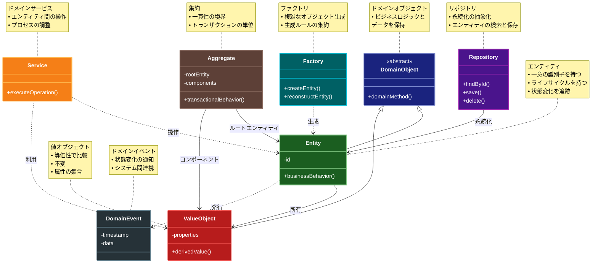

# Domain Model（ドメインモデル）パターン

## 目的

ビジネスロジックとデータを密接に結合したオブジェクトモデルを作成し、ドメイン（業務）の概念をコードで表現します。

## 解決する問題・価値

- 複雑なビジネスロジックを適切にカプセル化
- ドメインの概念とコードの一致による保守性の向上
- ビジネスルールの一貫性の確保
- オブジェクト指向の恩恵を最大限に活用
- テストのしやすさ

## 概要・特徴

### 概要

Domain Modelパターンは、ビジネスロジックとデータを密結合したオブジェクト指向モデルを構築し、ドメイン（業務領域）の概念やルールをコードで直接表現するアプローチです。各ビジネスエンティティはその振る舞いとデータを一緒に持ち、リッチなドメインモデルを形成します。

### 特徴

#### ビジネスルールとロジックをオブジェクトにカプセル化
ドメインモデルの最も重要な特徴は、ビジネスルールとロジックを適切なオブジェクトにカプセル化することです。これにより、データとそれに関連する振る舞いが一体となり、アニーミックモデル（ロジックを持たないデータ構造）を避けることができます。例えば、注文システムでは、注文のキャンセル条件や割引計算などのビジネスルールは、注文オブジェクト自体に実装されます。このアプローチにより、ビジネスロジックが分散することなく、関連するデータと共に集約され、一貫性が保たれます。また、複雑なビジネスルールもオブジェクト指向設計の原則に従って整理されるため、理解しやすく保守性の高いコードになります。適切にカプセル化されたドメインモデルは、システムのコアビジネスロジックを変更する際の影響範囲を限定し、長期的なシステム進化を支援します。

#### ドメイン専門家の知識をコードに反映
ドメインモデルは、単なる技術的な構造ではなく、ドメイン専門家（業務に詳しい非技術者）の知識と理解をコードに反映することを目指します。これはドメイン駆動設計（DDD）の中核的な考え方で、開発チームとドメイン専門家が密に協力して、業界の専門用語や概念をそのままコードに落とし込みます。例えば、保険業界のシステムでは「契約」「保険料」「リスク評価」といった業界用語がそのままクラス名やメソッド名として使用されます。この特徴により、コードを読むだけでビジネスの意図が明確に理解でき、技術者と非技術者のコミュニケーションギャップが縮まります。また、ドメインの暗黙知を形式化することで、組織の知識が個人に依存せず、ソフトウェアとして保存・共有される利点もあります。この「知識の転写」によって、システムはビジネスの実態をより正確に反映し、変化するビジネス要件にも柔軟に対応できるようになります。

#### 継承や多態性などのオブジェクト指向技術を活用
ドメインモデルはオブジェクト指向プログラミングの技術を最大限に活用し、複雑なビジネスドメインを表現します。継承を使用して共通の振る舞いを親クラスに定義し、特殊化された振る舞いを子クラスで拡張することで、コードの再利用性を高めます。例えば、顧客という基本概念から個人顧客と法人顧客を派生させる設計が可能です。また、インターフェースと多態性を利用することで、同じ操作を異なるドメインオブジェクトに適用し、実装の詳細を隠蔽しながら一貫した振る舞いを提供できます。例えば、様々な種類の支払い方法（クレジットカード、銀行振込、電子マネーなど）を共通のインターフェースで扱い、支払い処理ロジックを統一できます。コンポジションパターンも頻繁に使用され、複雑なオブジェクト構造（例えば、部品から構成される製品）を自然に表現します。これらのオブジェクト指向技術を駆使することで、ドメインの複雑さを管理しながら、拡張性と保守性の高いモデルを構築できます。

#### エンティティ間の関係性を自然に表現
ドメインモデルでは、現実世界のエンティティ間の関係性をソフトウェア内で自然に表現します。一対多、多対多、包含関係など、ビジネスドメイン内の様々な関係性がオブジェクト間の参照や集約として実装されます。例えば、注文と注文明細の関係、顧客と住所の関係、製品とカテゴリの関係などが、それぞれの実態に即した形でモデル化されます。特にドメイン駆動設計では、「集約」という概念を通じて関連するエンティティをグループ化し、一貫性の境界を定義します。これにより、複雑な関係性を持つエンティティでも、整合性を保ちながら操作することが可能になります。また、ナビゲーション可能な参照関係を設計することで、「顧客からその注文履歴を参照する」「製品からそのレビューを取得する」といった自然な操作が可能になります。このようなエンティティ間の関係性の適切なモデリングにより、ビジネス分析から得られた洞察がそのままコードに反映され、システムがよりビジネスの実態に即したものになります。

#### ドメイン言語(ユビキタス言語)との整合性
ドメインモデルの重要な特徴として、ソフトウェア内で使用される用語とビジネスドメインで使用される用語の一致、つまりユビキタス言語（普遍的な言語）との整合性があります。ユビキタス言語とは、ドメイン専門家と開発チームが共有する共通言語で、クラス名、メソッド名、変数名などのコード内の命名にもこれが反映されます。例えば、小売業のシステムでは「在庫」「仕入れ」「販売」といった業界用語がそのままコード内で使用され、「addToCart()」「calculateDiscount()」のようなメソッド名もビジネス操作を直接反映します。この整合性により、コードがそのままビジネスドキュメントとしての役割も果たし、技術者とビジネス担当者の間のコミュニケーションが円滑になります。また、新しいチームメンバーがシステムとビジネスドメインの両方を同時に学習できるため、知識の共有と移転が容易になります。ユビキタス言語の使用は、技術的な実装とビジネス要件の間のギャップを埋め、ソフトウェアがビジネスの実態と乖離することを防ぎます。

### 概要図



## コード例

### Before（ドメインモデルパターン適用前）

```typescript
// トランザクションスクリプトのような手続き的なコード
function processOrder(
  orderId: string,
  userId: string,
  items: Array<{id: string; quantity: number}>
) {
  // 在庫チェック
  const stockErrors = [];
  for (const item of items) {
    const stock = db.query("SELECT stock FROM items WHERE id = ?", [item.id]);
    if (stock < item.quantity) {
      stockErrors.push(`商品${item.id}の在庫が不足しています`);
    }
  }
  if (stockErrors.length > 0) {
    throw new Error(stockErrors.join("\n"));
  }

  // ユーザーの与信チェック
  const user = db.query("SELECT credit_limit FROM users WHERE id = ?", [
    userId,
  ]);
  const orderTotal = items.reduce((total, item) => {
    const price = db.query("SELECT price FROM items WHERE id = ?", [item.id]);
    return total + price * item.quantity;
  }, 0);
  if (orderTotal > user.credit_limit) {
    throw new Error("与信限度額を超えています");
  }

  // 注文処理
  db.transaction(() => {
    const orderId = db.insert("orders", {user_id: userId, total: orderTotal});
    for (const item of items) {
      db.insert("order_items", {
        order_id: orderId,
        item_id: item.id,
        quantity: item.quantity,
      });
      db.update("items", {id: item.id}, {stock: stock - item.quantity});
    }
  });
}
```

### After（ドメインモデルパターン適用後）

```typescript
// ドメインモデルを使用した実装
class Order {
  private id: string;
  private userId: string;
  private items: OrderItem[] = [];
  private status: OrderStatus = OrderStatus.DRAFT;

  constructor(userId: string) {
    this.userId = userId;
  }

  addItem(item: Item, quantity: number) {
    if (!item.hasEnoughStock(quantity)) {
      throw new InsufficientStockError(item.id);
    }
    this.items.push(new OrderItem(item, quantity));
  }

  async place() {
    if (this.status !== OrderStatus.DRAFT) {
      throw new InvalidOrderStateError();
    }

    const user = await User.findById(this.userId);
    if (!user.canAfford(this.calculateTotal())) {
      throw new InsufficientCreditError();
    }

    await this.reserveStock();
    this.status = OrderStatus.PLACED;
    await this.save();
  }

  private async reserveStock() {
    for (const orderItem of this.items) {
      await orderItem.reserveStock();
    }
  }

  private calculateTotal(): Money {
    return this.items.reduce(
      (total, item) => total.add(item.calculateSubtotal()),
      Money.zero()
    );
  }
}

class User {
  private id: string;
  private creditLimit: Money;

  canAfford(amount: Money): boolean {
    return amount.lessThanOrEqual(this.creditLimit);
  }

  // その他のメソッド...
}

class Item {
  private id: string;
  private stock: number;
  private price: Money;

  hasEnoughStock(quantity: number): boolean {
    return this.stock >= quantity;
  }

  reserveStock(quantity: number) {
    if (!this.hasEnoughStock(quantity)) {
      throw new InsufficientStockError(this.id);
    }
    this.stock -= quantity;
  }

  // その他のメソッド...
}

// 使用例
async function processOrder(
  userId: string,
  items: Array<{id: string; quantity: number}>
) {
  const order = new Order(userId);

  for (const {id, quantity} of items) {
    const item = await Item.findById(id);
    order.addItem(item, quantity);
  }

  await order.place();
}
```

## 類似パターンとの比較

- [Transaction Script（トランザクションスクリプト）](transaction-script.md): Domain Model はビジネスロジックをオブジェクトに分散させる方式を採用するのに対し、Transaction Script は手続き的なアプローチで単一トランザクションを 1 つの関数として実装します。
- [Table Module（テーブルモジュール）](table-module.md): Domain Model はビジネス概念ごとにクラスを作成し、より柔軟なモデリングが可能なのに対し、Table Module はデータベースのテーブルごとに 1 つのクラスを作成します。
- [Active Record（アクティブレコード）](active-record.md): Domain Model はデータアクセスを分離し、純粋なドメインロジックに集中する方式を採用するのに対し、Active Record はデータアクセスロジックとドメインロジックを 1 つのクラスに統合します。

## 利用されているフレームワーク/ライブラリの例

- Entity Framework Core（.NET）
- Hibernate（Java）
- Doctrine（PHP）
- SQLAlchemy（Python）
- TypeORM（TypeScript/JavaScript）
