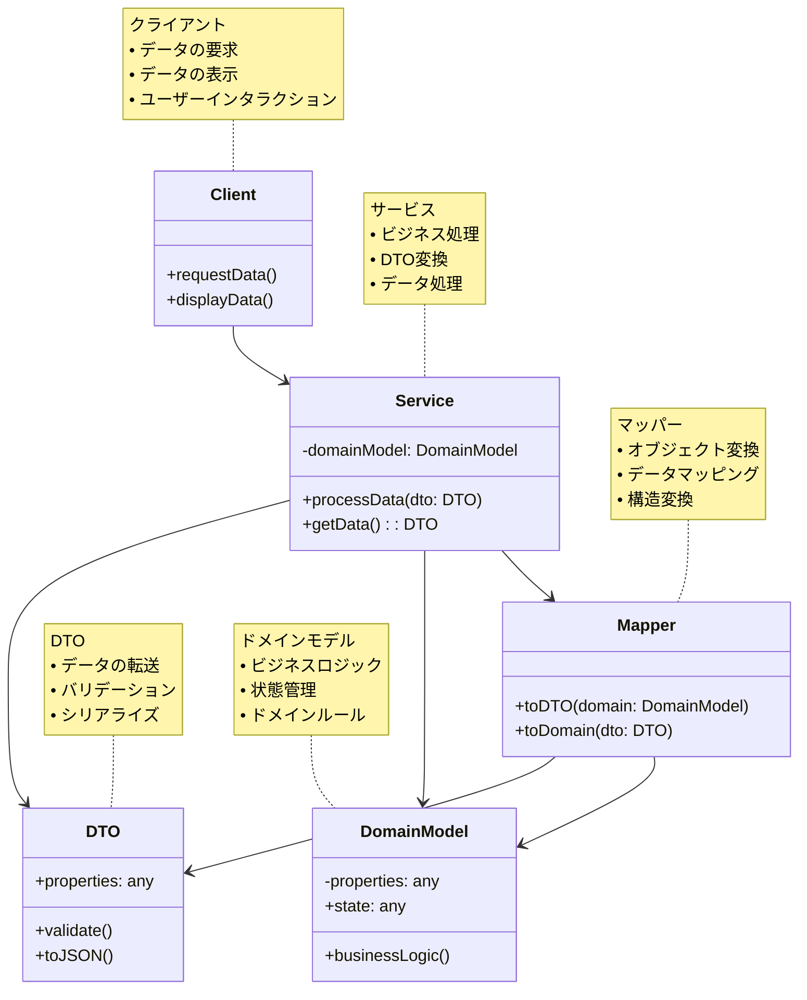

# DTO (Data Transfer Object)

## 目的

データの転送に特化したオブジェクトを提供し、ドメインモデルとプレゼンテーション層の間のデータ転送を効率的に行うパターンです。

## 価値・解決する問題

- ドメインモデルの保護
- データ転送の効率化
- レイヤー間の結合度の低減
- ネットワーク通信の最適化
- クライアントとサーバー間のデータ構造の分離

## 概要・特徴

### 概要

DTOパターンは、データの転送に特化したシンプルなオブジェクトを提供します。ドメインモデルを直接クライアントに公開する代わりに、DTOを使用して必要なデータのみを転送することで、ドメインモデルのカプセル化を維持し、ネットワーク通信を最適化します。

### 特徴

#### シンプルな構造
- プロパティのみを持つ
- ビジネスロジックを含まない
- シリアライズ可能
- フラットな構造

#### データの最適化
- 必要なデータのみを含む
- ネットワーク帯域の効率的な使用
- クライアントのニーズに合わせた構造
- バッチ処理のサポート

#### レイヤー間の分離
- ドメインモデルとの分離
- プレゼンテーション層との分離
- インフラストラクチャ層との分離
- バージョニングの容易さ

#### バリデーション
- 入力データの検証
- データ形式の変換
- エラーメッセージの提供
- 型安全性の確保

### 概要図



## 類似パターンとの比較

- [Value Object (値オブジェクト)](value-object.md): DTOはデータ転送に特化し、Value Objectはドメインの概念を表現します。
- [Entity (エンティティ)](entity.md): DTOはデータの転送に焦点を当て、Entityはドメインオブジェクトの同一性を管理します。
- [Command (コマンド)](command.md): DTOはデータの転送に特化し、Commandは操作の要求をカプセル化します。
- [Query (クエリ)](query.md): DTOはデータの転送に特化し、Queryはデータの取得要求をカプセル化します。

## 利用されているライブラリ／フレームワークの事例

- [NestJS DTOs](https://docs.nestjs.com/controllers#request-payloads): リクエスト/レスポンスの型定義
- [GraphQL Code Generator](https://github.com/dotansimha/graphql-code-generator): GraphQLスキーマからDTOの生成
- [AutoMapper](https://github.com/AutoMapper/AutoMapper): オブジェクト間のマッピング
- [MapStruct](https://mapstruct.org/): Javaのオブジェクトマッピング

## 解説ページリンク

- [Martin Fowler - DTO](https://martinfowler.com/eaaCatalog/dataTransferObject.html)
- [Microsoft - DTO Pattern](https://docs.microsoft.com/en-us/azure/architecture/patterns/data-transfer-object)
- [Spring - DTOs](https://docs.spring.io/spring-boot/docs/current/reference/html/features.html#features.developing-web-applications)
- [Clean Architecture - DTOs](https://blog.cleancoder.com/uncle-bob/2012/08/13/the-clean-architecture.html)

## コード例

### Before:

ドメインモデルを直接使用する実装

```typescript
// ドメインモデル
class User {
  constructor(
    private readonly id: string,
    private email: string,
    private password: string,
    private role: string,
    private lastLogin: Date,
    private preferences: Map<string, any>
  ) {}

  getEmail(): string {
    return this.email;
  }

  getRole(): string {
    return this.role;
  }

  getLastLogin(): Date {
    return this.lastLogin;
  }

  getPreferences(): Map<string, any> {
    return this.preferences;
  }

  // ビジネスロジック
  updateEmail(newEmail: string): void {
    if (!this.isValidEmail(newEmail)) {
      throw new Error('Invalid email format');
    }
    this.email = newEmail;
  }

  private isValidEmail(email: string): boolean {
    return /^[^\s@]+@[^\s@]+\.[^\s@]+$/.test(email);
  }
}

// ユーザーサービス
class UserService {
  private users: Map<string, User> = new Map();

  async getUser(id: string): Promise<User> {
    const user = this.users.get(id);
    if (!user) {
      throw new Error(`User ${id} not found`);
    }
    return user;
  }

  async updateUser(id: string, email: string): Promise<void> {
    const user = await this.getUser(id);
    user.updateEmail(email);
  }
}

// APIエンドポイント
class UserController {
  constructor(private userService: UserService) {}

  async getUser(req: Request, res: Response): Promise<void> {
    try {
      const user = await this.userService.getUser(req.params.id);
      
      // ドメインモデルを直接レスポンスとして返す
      res.json({
        id: user.getId(),
        email: user.getEmail(),
        role: user.getRole(),
        lastLogin: user.getLastLogin(),
        preferences: user.getPreferences()
      });
    } catch (error) {
      res.status(404).json({ error: error.message });
    }
  }

  async updateUser(req: Request, res: Response): Promise<void> {
    try {
      await this.userService.updateUser(req.params.id, req.body.email);
      res.json({ message: 'User updated successfully' });
    } catch (error) {
      res.status(400).json({ error: error.message });
    }
  }
}

// クライアントコード
async function example() {
  const userService = new UserService();
  const userController = new UserController(userService);

  // ユーザー情報の取得
  const response = await fetch('/api/users/123');
  const userData = await response.json();
  console.log('User data:', userData);

  // ユーザー情報の更新
  await fetch('/api/users/123', {
    method: 'PUT',
    headers: {
      'Content-Type': 'application/json'
    },
    body: JSON.stringify({
      email: 'newemail@example.com'
    })
  });
}
```

### After:

DTOパターンを適用した実装

```typescript
// DTOの定義
interface UserDTO {
  id: string;
  email: string;
  role: string;
  lastLogin: Date;
  preferences: Record<string, any>;
}

interface UpdateUserDTO {
  email: string;
}

// バリデーション用のクラス
class UserDTOValidator {
  static validateEmail(email: string): boolean {
    return /^[^\s@]+@[^\s@]+\.[^\s@]+$/.test(email);
  }

  static validateUpdateUserDTO(dto: UpdateUserDTO): string[] {
    const errors: string[] = [];
    
    if (!dto.email) {
      errors.push('Email is required');
    } else if (!this.validateEmail(dto.email)) {
      errors.push('Invalid email format');
    }

    return errors;
  }
}

// マッパーの実装
class UserMapper {
  static toDTO(user: User): UserDTO {
    return {
      id: user.getId(),
      email: user.getEmail(),
      role: user.getRole(),
      lastLogin: user.getLastLogin(),
      preferences: Object.fromEntries(user.getPreferences())
    };
  }

  static toDomain(dto: UpdateUserDTO): Partial<User> {
    return {
      email: dto.email
    };
  }
}

// ドメインモデル
class User {
  constructor(
    private readonly id: string,
    private email: string,
    private password: string,
    private role: string,
    private lastLogin: Date,
    private preferences: Map<string, any>
  ) {}

  getEmail(): string {
    return this.email;
  }

  getRole(): string {
    return this.role;
  }

  getLastLogin(): Date {
    return this.lastLogin;
  }

  getPreferences(): Map<string, any> {
    return this.preferences;
  }

  updateEmail(newEmail: string): void {
    if (!UserDTOValidator.validateEmail(newEmail)) {
      throw new Error('Invalid email format');
    }
    this.email = newEmail;
  }
}

// ユーザーサービス
class UserService {
  private users: Map<string, User> = new Map();

  async getUser(id: string): Promise<User> {
    const user = this.users.get(id);
    if (!user) {
      throw new Error(`User ${id} not found`);
    }
    return user;
  }

  async updateUser(id: string, updateData: UpdateUserDTO): Promise<void> {
    const user = await this.getUser(id);
    const errors = UserDTOValidator.validateUpdateUserDTO(updateData);
    if (errors.length > 0) {
      throw new Error(errors.join(', '));
    }
    user.updateEmail(updateData.email);
  }
}

// APIエンドポイント
class UserController {
  constructor(private userService: UserService) {}

  async getUser(req: Request, res: Response): Promise<void> {
    try {
      const user = await this.userService.getUser(req.params.id);
      const userDTO = UserMapper.toDTO(user);
      res.json(userDTO);
    } catch (error) {
      res.status(404).json({ error: error.message });
    }
  }

  async updateUser(req: Request, res: Response): Promise<void> {
    try {
      const updateDTO: UpdateUserDTO = req.body;
      await this.userService.updateUser(req.params.id, updateDTO);
      res.json({ message: 'User updated successfully' });
    } catch (error) {
      res.status(400).json({ error: error.message });
    }
  }
}

// クライアントコード
async function example() {
  const userService = new UserService();
  const userController = new UserController(userService);

  try {
    // ユーザー情報の取得
    const response = await fetch('/api/users/123');
    const userDTO: UserDTO = await response.json();
    console.log('User data:', userDTO);

    // ユーザー情報の更新
    const updateDTO: UpdateUserDTO = {
      email: 'newemail@example.com'
    };

    const updateResponse = await fetch('/api/users/123', {
      method: 'PUT',
      headers: {
        'Content-Type': 'application/json'
      },
      body: JSON.stringify(updateDTO)
    });

    if (!updateResponse.ok) {
      const error = await updateResponse.json();
      console.error('Update failed:', error);
    } else {
      console.log('User updated successfully');
    }
  } catch (error) {
    console.error('Error:', error);
  }
}
``` 