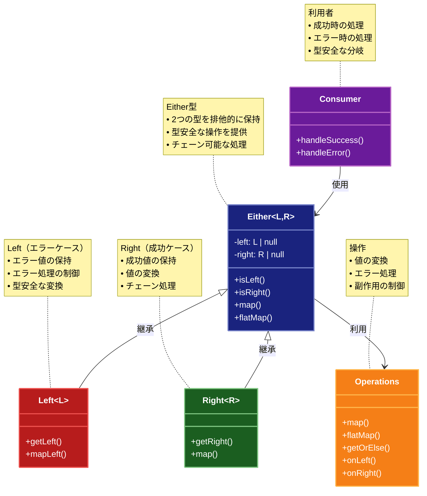

# Either（イーザー）パターン

## 目的

2つの異なる型の値のいずれかを型安全に扱うパターンです。

## 価値・解決する問題

- 2つの型の値を排他的に扱います
- 型安全性を確保します
- エラー処理を柔軟に行えます
- コードの可読性を向上させます
- 副作用を制御します

## 概要・特徴

### 概要

Eitherパターンは、2つの異なる型の値のうちいずれかを保持し、その値に応じた処理を安全に行えるようにする設計パターンです。一般的に左側（Left）をエラーケース、右側（Right）を成功ケースとして使用します。

### 特徴

#### 型安全性の保証
Eitherパターンは、2つの異なる型（通常は成功結果型とエラー型）のどちらかを保持する型安全な構造を提供します。この型安全性により、コンパイル時にデータの扱いに関する多くのバグや不整合を検出できます。型システムが、開発者に対してEitherの両方の可能性（Left値とRight値）を明示的に処理することを強制するため、特定のケースの処理忘れによるランタイムエラーが防止されます。また、コード内での型の伝播により、システム全体を通じて一貫したエラー処理が可能になります。例えば、関数チェーンの中で発生したエラーは、型情報とともに伝播されるため、後続の処理でそのエラーの性質に基づいた適切な対応が可能になります。この型安全性は特に大規模なアプリケーションやチーム開発において価値を発揮し、リファクタリングやコードベースの変更が行われた際にも、コンパイラが潜在的な問題を早期に検出できます。

#### 2つの型の排他的な扱い
Eitherパターンは、Left型とRight型という2つの異なる型の値を排他的に保持します。つまり、Eitherインスタンスは同時に両方の型の値を持つことはなく、常にどちらか一方のみを保持します。この排他性により、条件分岐をシンプルにし、各ケースを明確に分離して処理することができます。一般的な慣習として、Left側にはエラーや例外的な状態を、Right側には成功結果や期待される値を格納します（"Right is right"、つまり「Rightが正しい結果」という語呂合わせで覚えられることもあります）。この明確な区別により、コードの意図が読み手にとって明確になり、条件文やnullチェックが乱立する従来のエラー処理に比べて、コードの可読性が向上します。また、型パラメータにより、具体的なエラー型（例：ValidationError、NetworkError）と成功結果型（例：User、OrderConfirmation）を指定できるため、様々なコンテキストで再利用可能な柔軟な構造となっています。

#### チェーン可能な操作
Eitherパターンの強力な特徴は、map、flatMap、fold、bimap、recoverなどの関数型操作をチェーン（連鎖）できることです。これにより、複数の操作を連続して適用する際も、コードの可読性と保守性が高く保たれます。例えば、ユーザー入力の検証、データベースへの保存、通知の送信といった一連の処理を、途中でエラーが発生した場合の処理も含めて、明快な方法で表現できます。特にmapメソッドはRight値に対してのみ関数を適用し、Leftの場合はそのまま値を伝播するため、「ハッピーパス」（正常系）のロジックに集中して記述できます。また、flatMapを使用することで、Eitherを返す関数を連鎖させても入れ子構造にならず、平坦化された結果を得ることができます。これらのチェーン操作は、命令型プログラミングで頻出する深いネストや多くのif-elseブロックを避け、線形で理解しやすいコードフローを実現します。

#### エラー処理の柔軟性
Eitherパターンは、例外を投げる代わりにエラーを値として扱うことで、より柔軟でコントロール可能なエラー処理を実現します。例外とは異なり、Eitherでカプセル化されたエラーは型システムの一部として明示的に扱われるため、処理忘れや捕捉忘れのリスクが低減します。また、エラーの種類ごとに異なる処理を適用することや、特定のエラーを回復可能なものとして処理することが容易になります。例えば、fold関数を使用して、Left値（エラー）とRight値（成功）それぞれに異なる関数を適用し、統一された結果型に変換できます。また、recoverやrecoverWithといった関数を使用して、特定の条件に基づいてエラーを成功結果に変換することも可能です。このように、Eitherパターンはエラー処理をプログラムのフローの自然な一部として組み込み、try-catchブロックによる制御フローの分断を避けることができます。これは特に、複数のエラーソースがある複雑なアプリケーションや、エラーハンドリングの要件が厳格なドメインで価値を発揮します。

#### 関数型プログラミング
Eitherパターンは関数型プログラミングの原則に基づいており、不変性（イミュータビリティ）、副作用の制御、宣言的なスタイルを促進します。Eitherインスタンスは通常不変であり、map操作やその他の変換は元のインスタンスを変更せず、新しいインスタンスを返します。これにより、データの予期せぬ変更によるバグを防ぎ、並行処理の安全性も向上します。また、関数型プログラミングの合成能力を活かし、小さな関数を組み合わせて複雑な処理を構築できます。例えば、複数の検証関数をチェーンして複合的な検証ロジックを作成したり、データ変換関数を連鎖させて段階的なデータ処理パイプラインを構築したりできます。さらに、高階関数（関数を引数として受け取ったり、関数を返したりする関数）を活用することで、抽象化レベルを高め、再利用可能なエラー処理パターンを定義できます。これらの関数型アプローチにより、コードの予測可能性と堅牢性が向上し、テストが容易になるとともに、並行処理やキャッシング、遅延評価などの最適化も実装しやすくなります。

### 概要図



## 類似パターンとの比較

- [Result (リザルト)](result.md): Either はより汎用的な2つの型の扱いに焦点を当て、これに対して Result は成功/失敗に特化します。
- [Maybe (メイビー)](maybe.md): Either は2つの型の一方を扱い、これに対して Maybe は値の不確実性を扱います。
- [Optional (オプショナル)](optional.md): Either は2つの型の一方を扱い、これに対して Optional は値の存在を扱います。

## 利用されているライブラリ／フレームワークの事例

- [fp-ts Either](https://gcanti.github.io/fp-ts/modules/Either.ts.html): TypeScriptの関数型プログラミングライブラリ
- [Scala Either](https://www.scala-lang.org/api/current/scala/util/Either.html): Scalaの標準ライブラリ
- [Haskell Either](https://hackage.haskell.org/package/base-4.14.0.0/docs/Data-Either.html): Haskellの標準ライブラリ

## 解説ページリンク

- [Scala Either Documentation](https://www.scala-lang.org/api/current/scala/util/Either.html)
- [fp-ts Either Documentation](https://gcanti.github.io/fp-ts/modules/Either.ts.html)
- [Railway Oriented Programming](https://fsharpforfunandprofit.com/rop/)

## コード例

### Before:

条件分岐による実装

```typescript
type ValidationResult = {
  isValid: boolean;
  errors?: string[];
  value?: any;
};

class Validator {
  validate(input: any): ValidationResult {
    if (typeof input === "string") {
      if (input.length < 3) {
        return {
          isValid: false,
          errors: ["文字列が短すぎます"]
        };
      }
      return {
        isValid: true,
        value: input.toUpperCase()
      };
    }
    
    if (typeof input === "number") {
      if (input < 0) {
        return {
          isValid: false,
          errors: ["負の数は無効です"]
        };
      }
      return {
        isValid: true,
        value: input * 2
      };
    }
    
    return {
      isValid: false,
      errors: ["未対応の型です"]
    };
  }
}

// 使用例
const validator = new Validator();
const result = validator.validate("ab");
if (result.isValid) {
  console.log("検証成功:", result.value);
} else {
  console.log("検証失敗:", result.errors);
}
```

### After:

Eitherパターンを適用した実装

```typescript
// Either型の実装
class Either<L, R> {
  private constructor(
    private readonly left: L | null,
    private readonly right: R | null
  ) {}

  // 左側の値を生成
  static left<L, R>(value: L): Either<L, R> {
    return new Either<L, R>(value, null);
  }

  // 右側の値を生成
  static right<L, R>(value: R): Either<L, R> {
    return new Either<L, R>(null, value);
  }

  // 左側の値かチェック
  isLeft(): boolean {
    return this.left !== null;
  }

  // 右側の値かチェック
  isRight(): boolean {
    return this.right !== null;
  }

  // 左側の値を取得
  getLeft(): L {
    if (this.isRight()) {
      throw new Error("Cannot get left value from Right");
    }
    return this.left!;
  }

  // 右側の値を取得
  getRight(): R {
    if (this.isLeft()) {
      throw new Error("Cannot get right value from Left");
    }
    return this.right!;
  }

  // 右側の値を変換
  map<T>(f: (value: R) => T): Either<L, T> {
    return this.isRight()
      ? Either.right<L, T>(f(this.right!))
      : Either.left<L, T>(this.left!);
  }

  // 左側の値を変換
  mapLeft<T>(f: (value: L) => T): Either<T, R> {
    return this.isLeft()
      ? Either.left<T, R>(f(this.left!))
      : Either.right<T, R>(this.right!);
  }

  // Eitherを返す関数を適用
  flatMap<T>(f: (value: R) => Either<L, T>): Either<L, T> {
    return this.isRight()
      ? f(this.right!)
      : Either.left<L, T>(this.left!);
  }

  // 値を取得（左側の場合はデフォルト値）
  getOrElse(defaultValue: R): R {
    return this.isRight() ? this.right! : defaultValue;
  }

  // 値を取得（左側の場合は関数を実行）
  getOrElseGet(f: (left: L) => R): R {
    return this.isRight() ? this.right! : f(this.left!);
  }

  // 左側の場合に処理を実行
  onLeft(f: (value: L) => void): Either<L, R> {
    if (this.isLeft()) {
      f(this.left!);
    }
    return this;
  }

  // 右側の場合に処理を実行
  onRight(f: (value: R) => void): Either<L, R> {
    if (this.isRight()) {
      f(this.right!);
    }
    return this;
  }

  // 文字列表現を取得
  toString(): string {
    return this.isLeft()
      ? `Left(${this.left})`
      : `Right(${this.right})`;
  }
}

// バリデーションエラーの型
interface ValidationError {
  field: string;
  message: string;
}

// バリデーション関数の型
type Validator<T> = (value: T) => Either<ValidationError[], T>;

// 文字列バリデーションの実装
class StringValidator {
  // 最小長のバリデーション
  minLength(length: number): Validator<string> {
    return (value: string) => {
      if (value.length < length) {
        return Either.left([{
          field: "string",
          message: `文字列は${length}文字以上である必要があります`
        }]);
      }
      return Either.right(value);
    };
  }

  // 最大長のバリデーション
  maxLength(length: number): Validator<string> {
    return (value: string) => {
      if (value.length > length) {
        return Either.left([{
          field: "string",
          message: `文字列は${length}文字以下である必要があります`
        }]);
      }
      return Either.right(value);
    };
  }

  // メールアドレスのバリデーション
  email(): Validator<string> {
    return (value: string) => {
      if (!value.includes("@")) {
        return Either.left([{
          field: "email",
          message: "無効なメールアドレス形式です"
        }]);
      }
      return Either.right(value);
    };
  }

  // パスワードのバリデーション
  password(): Validator<string> {
    return (value: string) => {
      const errors: ValidationError[] = [];

      if (value.length < 8) {
        errors.push({
          field: "password",
          message: "パスワードは8文字以上である必要があります"
        });
      }

      if (!/[A-Z]/.test(value)) {
        errors.push({
          field: "password",
          message: "パスワードは少なくとも1つの大文字を含む必要があります"
        });
      }

      if (!/[0-9]/.test(value)) {
        errors.push({
          field: "password",
          message: "パスワードは少なくとも1つの数字を含む必要があります"
        });
      }

      return errors.length > 0
        ? Either.left(errors)
        : Either.right(value);
    };
  }
}

// 数値バリデーションの実装
class NumberValidator {
  // 最小値のバリデーション
  min(min: number): Validator<number> {
    return (value: number) => {
      if (value < min) {
        return Either.left([{
          field: "number",
          message: `値は${min}以上である必要があります`
        }]);
      }
      return Either.right(value);
    };
  }

  // 最大値のバリデーション
  max(max: number): Validator<number> {
    return (value: number) => {
      if (value > max) {
        return Either.left([{
          field: "number",
          message: `値は${max}以下である必要があります`
        }]);
      }
      return Either.right(value);
    };
  }

  // 整数のバリデーション
  integer(): Validator<number> {
    return (value: number) => {
      if (!Number.isInteger(value)) {
        return Either.left([{
          field: "number",
          message: "値は整数である必要があります"
        }]);
      }
      return Either.right(value);
    };
  }

  // 正の数のバリデーション
  positive(): Validator<number> {
    return (value: number) => {
      if (value <= 0) {
        return Either.left([{
          field: "number",
          message: "値は正の数である必要があります"
        }]);
      }
      return Either.right(value);
    };
  }
}

// ユーザー登録の例
interface User {
  name: string;
  email: string;
  password: string;
  age: number;
}

class UserRegistration {
  private stringValidator = new StringValidator();
  private numberValidator = new NumberValidator();

  // ユーザー登録のバリデーション
  validateUser(user: User): Either<ValidationError[], User> {
    const nameValidation = this.stringValidator.minLength(2)(user.name)
      .flatMap(name => this.stringValidator.maxLength(50)(name));

    const emailValidation = this.stringValidator.email()(user.email);

    const passwordValidation = this.stringValidator.password()(user.password);

    const ageValidation = this.numberValidator.positive()(user.age)
      .flatMap(age => this.numberValidator.integer()(age))
      .flatMap(age => this.numberValidator.max(150)(age));

    // すべてのバリデーション結果を集約
    if (nameValidation.isLeft()) return nameValidation;
    if (emailValidation.isLeft()) return emailValidation;
    if (passwordValidation.isLeft()) return passwordValidation;
    if (ageValidation.isLeft()) return ageValidation;

    return Either.right(user);
  }

  // ユーザー登録の処理
  register(user: User): Either<ValidationError[], User> {
    return this.validateUser(user)
      .map(validUser => {
        // ここでユーザー登録の処理を行う（例示のため省略）
        console.log("ユーザーを登録しました:", validUser);
        return validUser;
      });
  }
}

// 使用例
function example() {
  const registration = new UserRegistration();

  console.log("=== 有効なユーザーの登録 ===");
  const validUser: User = {
    name: "John Doe",
    email: "john@example.com",
    password: "Password123",
    age: 30
  };

  registration.register(validUser)
    .onRight(user => {
      console.log("登録成功:", user);
    })
    .onLeft(errors => {
      console.error("登録失敗:");
      errors.forEach(error => {
        console.error(`- ${error.field}: ${error.message}`);
      });
    });

  console.log("\n=== 無効なユーザーの登録 ===");
  const invalidUser: User = {
    name: "J",
    email: "invalid-email",
    password: "weak",
    age: -5
  };

  registration.register(invalidUser)
    .onRight(user => {
      console.log("登録成功:", user);
    })
    .onLeft(errors => {
      console.error("登録失敗:");
      errors.forEach(error => {
        console.error(`- ${error.field}: ${error.message}`);
      });
    });
}

example();
``` 