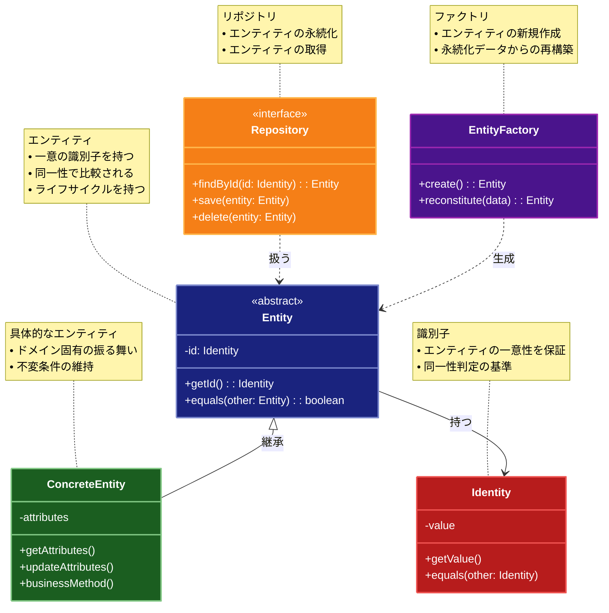

# Entity（エンティティ）パターン

## 目的

ビジネスドメインにおける実体を表現し、一意性と同一性を持つオブジェクトを定義するパターンです。

## 価値・解決する問題

- ビジネスドメインの実体を明確に表現します
- オブジェクトの一意性を保証します
- 同一性の判定を適切に行えます
- ドメインロジックをカプセル化します
- データの整合性を維持します

## 概要・特徴

### 概要

Entityパターンは、ビジネスドメインにおける実体をオブジェクトとして表現し、一意の識別子を持つことで同一性を保証する設計パターンです。

### 特徴

#### 一意の識別子
エンティティは、そのオブジェクトを一意に識別するための識別子（ID）を持ちます。この識別子は、オブジェクトの存在期間中に変更されることはなく、データベースの主キーや自然キーなどに対応します。識別子によって、同じ属性値を持つ複数のエンティティを区別することができ、システムの信頼性を確保する基盤となります。

#### 同一性の判定
エンティティは識別子に基づいて同一性を判断します。つまり、2つのエンティティオブジェクトが同じ識別子を持つ場合、それらは同一のエンティティを表していると見なされます。これは値オブジェクトが全ての属性値に基づいて等価性を判断するのとは対照的です。この特性により、エンティティの参照整合性を維持し、システム全体での一貫性を確保できます。

#### ドメインロジックの集約
エンティティは単なるデータコンテナではなく、ビジネスドメインに関連する振る舞いやルールをカプセル化します。属性の変更や関連エンティティとの相互作用に関するロジックをエンティティクラス内に実装することで、ドメインロジックを分散させることなく集約できます。これにより、ビジネスルールの一貫性が保証され、保守性が向上します。

#### 不変条件の保証
エンティティは自身の状態が常に有効であることを保証する責任を持ちます。属性の変更時には、ビジネスルールや制約に違反していないかを検証し、エンティティの整合性を維持します。この検証ロジックをエンティティ内に集約することで、どのクライアントがエンティティを操作しても、ドメインルールが確実に守られるようになります。

#### ライフサイクル管理
エンティティは生成、更新、削除などのライフサイクルを持ちます。これらの状態変化に関連するビジネスルールや制約を管理し、エンティティの一貫性のある状態遷移を保証します。例えば、特定の条件下でのみ削除を許可するといったルールを実装することで、ドメインの整合性を保護します。

### 概要図



## 類似パターンとの比較

- [Value Object (値オブジェクト)](value-object.md): Entity は一意性と同一性を持ち、これに対して Value Object は値の等価性に基づいて比較されます。
- [Aggregate (集約)](aggregate.md): Entity は個々のオブジェクトを表現し、これに対して Aggregate は関連するエンティティとバリューオブジェクトをまとめます。
- [Domain Model (ドメインモデル)](domain-model.md): Entity はドメインの個々の実体を表現し、これに対して Domain Model はドメイン全体の構造を表現します。

## 利用されているライブラリ／フレームワークの事例

- [Entity Framework Core](https://docs.microsoft.com/en-us/ef/core/): .NETのORMフレームワーク
- [Hibernate](https://hibernate.org/): JavaのORMフレームワーク
- [TypeORM](https://typeorm.io/): TypeScript/JavaScriptのORMフレームワーク

## 解説ページリンク

- [Martin Fowler - Entity](https://martinfowler.com/eaaCatalog/domainModel.html)
- [Domain-Driven Design - Entity](https://domainlanguage.com/ddd/reference/)
- [Microsoft - Entity Pattern](https://docs.microsoft.com/en-us/dotnet/architecture/microservices/microservice-ddd-cqrs-patterns/microservice-domain-model)

## コード例

### Before:

単純なデータ構造による実装

```typescript
interface User {
  id: string;
  name: string;
  email: string;
  age: number;
}

class UserService {
  private users: User[] = [];

  addUser(user: User): void {
    this.users.push(user);
  }

  updateUser(user: User): void {
    const index = this.users.findIndex(u => u.id === user.id);
    if (index !== -1) {
      this.users[index] = user;
    }
  }
}

// 使用例
const service = new UserService();
const user: User = {
  id: "1",
  name: "John",
  email: "john@example.com",
  age: 30
};

service.addUser(user);
user.age = 31;
service.updateUser(user);
```

### After:

Entityパターンを適用した実装

```typescript
// 基底エンティティクラス
abstract class Entity<T> {
  constructor(protected readonly id: T) {}

  equals(other: Entity<T>): boolean {
    if (other == null || !(other instanceof Entity)) {
      return false;
    }
    return this.id === other.id;
  }

  getId(): T {
    return this.id;
  }
}

// 値オブジェクト
class EmailAddress {
  private constructor(private readonly value: string) {
    this.validate(value);
  }

  static create(email: string): EmailAddress {
    return new EmailAddress(email);
  }

  private validate(email: string): void {
    if (!email.includes("@")) {
      throw new Error("Invalid email address");
    }
  }

  getValue(): string {
    return this.value;
  }

  equals(other: EmailAddress): boolean {
    return this.value === other.value;
  }
}

class Age {
  private constructor(private readonly value: number) {
    this.validate(value);
  }

  static create(age: number): Age {
    return new Age(age);
  }

  private validate(age: number): void {
    if (age < 0 || age > 150) {
      throw new Error("Invalid age");
    }
  }

  getValue(): number {
    return this.value;
  }

  equals(other: Age): boolean {
    return this.value === other.value;
  }

  isAdult(): boolean {
    return this.value >= 18;
  }
}

// ユーザーエンティティ
class User extends Entity<string> {
  private constructor(
    id: string,
    private name: string,
    private email: EmailAddress,
    private age: Age
  ) {
    super(id);
    this.validate();
  }

  static create(
    id: string,
    name: string,
    email: string,
    age: number
  ): User {
    return new User(
      id,
      name,
      EmailAddress.create(email),
      Age.create(age)
    );
  }

  private validate(): void {
    if (!this.name || this.name.trim().length === 0) {
      throw new Error("Name is required");
    }
  }

  getName(): string {
    return this.name;
  }

  getEmail(): EmailAddress {
    return this.email;
  }

  getAge(): Age {
    return this.age;
  }

  updateName(name: string): void {
    this.name = name;
    this.validate();
  }

  updateEmail(email: EmailAddress): void {
    this.email = email;
  }

  updateAge(age: Age): void {
    this.age = age;
  }

  isAdult(): boolean {
    return this.age.isAdult();
  }

  toDTO(): UserDTO {
    return {
      id: this.id,
      name: this.name,
      email: this.email.getValue(),
      age: this.age.getValue()
    };
  }
}

// DTOインターフェース
interface UserDTO {
  id: string;
  name: string;
  email: string;
  age: number;
}

// リポジトリ
interface UserRepository {
  save(user: User): Promise<void>;
  findById(id: string): Promise<User | null>;
  findAll(): Promise<User[]>;
  delete(id: string): Promise<void>;
}

// インメモリリポジトリの実装
class InMemoryUserRepository implements UserRepository {
  private users: Map<string, User> = new Map();

  async save(user: User): Promise<void> {
    this.users.set(user.getId(), user);
  }

  async findById(id: string): Promise<User | null> {
    return this.users.get(id) || null;
  }

  async findAll(): Promise<User[]> {
    return Array.from(this.users.values());
  }

  async delete(id: string): Promise<void> {
    this.users.delete(id);
  }
}

// ドメインサービス
class UserService {
  constructor(private repository: UserRepository) {}

  async createUser(
    id: string,
    name: string,
    email: string,
    age: number
  ): Promise<User> {
    const user = User.create(id, name, email, age);
    await this.repository.save(user);
    return user;
  }

  async updateUserName(id: string, name: string): Promise<User> {
    const user = await this.repository.findById(id);
    if (!user) {
      throw new Error("User not found");
    }
    user.updateName(name);
    await this.repository.save(user);
    return user;
  }

  async updateUserEmail(id: string, email: string): Promise<User> {
    const user = await this.repository.findById(id);
    if (!user) {
      throw new Error("User not found");
    }
    user.updateEmail(EmailAddress.create(email));
    await this.repository.save(user);
    return user;
  }

  async getAdultUsers(): Promise<User[]> {
    const users = await this.repository.findAll();
    return users.filter(user => user.isAdult());
  }
}

// 使用例
async function example() {
  const repository = new InMemoryUserRepository();
  const service = new UserService(repository);

  try {
    // ユーザーの作成
    console.log("=== ユーザーの作成 ===");
    const user1 = await service.createUser(
      "1",
      "John Doe",
      "john@example.com",
      25
    );
    console.log("Created user:", user1.toDTO());

    const user2 = await service.createUser(
      "2",
      "Jane Smith",
      "jane@example.com",
      17
    );
    console.log("Created user:", user2.toDTO());

    // ユーザー情報の更新
    console.log("\n=== ユーザー情報の更新 ===");
    const updatedUser = await service.updateUserName("1", "John Smith");
    console.log("Updated user:", updatedUser.toDTO());

    // 成人ユーザーの取得
    console.log("\n=== 成人ユーザーの取得 ===");
    const adultUsers = await service.getAdultUsers();
    console.log("Adult users:", adultUsers.map(u => u.toDTO()));

    // エラーケース
    console.log("\n=== エラーケース ===");
    try {
      await service.createUser("3", "Invalid", "invalid-email", -5);
    } catch (error) {
      console.error("Error creating user:", error.message);
    }

  } catch (error) {
    console.error("Error:", error.message);
  }
}

example();
```
