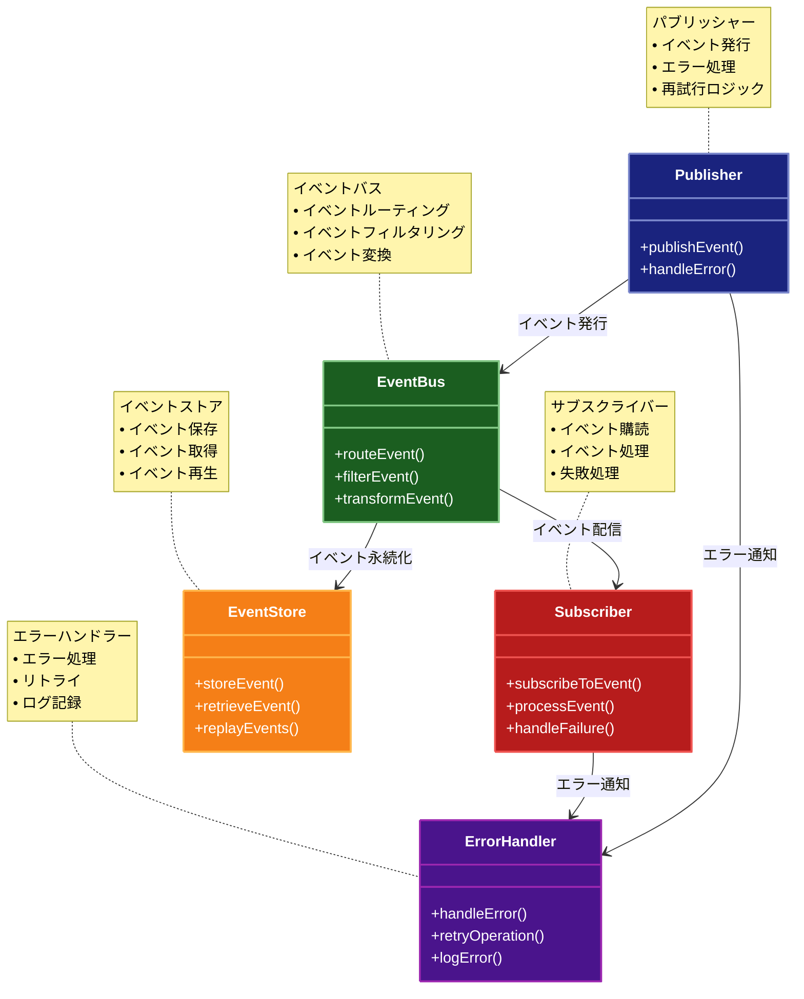

# Event-Driven Architecture（イベント駆動アーキテクチャ）パターン

## 目的

システムの各コンポーネントがイベントを介して疎結合に連携し、柔軟で拡張性の高いアーキテクチャを実現します。

## 価値・解決する問題

- コンポーネント間の疎結合を実現します
- システムの拡張性を向上させます
- 非同期処理を効率的に実現します
- スケーラビリティを向上させます
- 障害の影響を局所化します

## 概要・特徴

### 概要

イベント駆動アーキテクチャは、システムの状態変更をイベントとして発行し、それに関心を持つコンポーネントが自律的に反応する設計パターンです。

### 特徴

#### イベントベースの通信
イベント駆動アーキテクチャの中核となる特徴は、システム内のコンポーネント間の通信がイベントを媒介として行われることです。イベントとは、システム内で発生した重要な変化や出来事を表現するデータ構造で、通常は発生時間、イベントタイプ、関連データなどの情報を含みます。各コンポーネントはイベントを発行（パブリッシュ）することでシステムの他の部分に変更を知らせ、関心のあるコンポーネントはそれらのイベントを購読（サブスクライブ）して反応します。この通信モデルにより、コンポーネントは他のコンポーネントの内部実装や状態を直接参照する必要がなくなり、関心の分離が促進されます。例えば、Eコマースシステムでは「注文作成」イベントが発生すると、在庫管理、支払い処理、顧客通知など複数のサブシステムが独立して対応できます。また、イベントはしばしば永続化され、システムの状態変化の記録として利用されるため、監査証跡の作成や過去の状態の再構築にも役立ちます。

#### 非同期処理
イベント駆動アーキテクチャは本質的に非同期処理を採用しており、これにより高いスケーラビリティと応答性を実現します。イベントの発行者（パブリッシャー）は、イベントを発行した後、受信者（サブスクライバー）の処理を待つことなく次の操作に進むことができます。これにより、システムのスループットが向上し、リソースの効率的な利用が可能になります。また、負荷が高い時期には一時的にイベントをキューに蓄積し、処理能力に余裕がある時に順次処理することでシステムの安定性が向上します。さらに、メッセージブローカーやイベントバスを導入することで、イベントの信頼性の高い配信、再試行メカニズム、デッドレター処理などの高度な機能も実現できます。このような非同期アプローチは、特に長時間実行される処理や外部システムとの統合において価値を発揮し、一部のコンポーネントが遅延や障害を起こしても、システム全体の応答性が損なわれにくくなります。また、ユーザーインターフェースのレスポンシブネスも向上させることができます。

#### 疎結合な設計
イベント駆動アーキテクチャにおける最も大きな利点は、システムコンポーネント間の疎結合性の実現です。イベントをパブリッシュするコンポーネントは、そのイベントを誰が、どのように処理するかを知る必要がなく、同様にイベントを受信するコンポーネントも、イベントの発生源や他の受信者について知る必要がありません。この「知らなくても良い」原則により、コンポーネントは独立して開発、テスト、デプロイ、スケーリングが可能になります。例えば、新しい機能を追加する際に、既存のイベントを購読する新しいサービスを追加するだけで、既存のコードを変更することなくシステムを拡張できます。また、あるサービスの実装を完全に置き換えても、同じイベントインターフェースを維持する限り、システムの他の部分に影響を与えません。この疎結合性は、大規模な分散システムや、異なるチームが並行して開発を行うマイクロサービスアーキテクチャにおいて特に重要であり、システム全体の進化と保守を容易にします。

#### スケーラビリティ
イベント駆動アーキテクチャは優れたスケーラビリティ特性を持ち、システムの負荷に応じて柔軟に拡張できます。非同期処理とイベントキューイングにより、一時的な負荷のスパイクを吸収し、イベント処理を均一化することが可能です。また、個々のイベント処理コンポーネントを独立してスケールアウトできるため、システムのボトルネックとなる特定の処理だけを選択的に強化することができます。例えば、注文処理イベントの増加に対応するために、注文処理サービスのインスタンス数だけを増やすことができます。さらに、イベント処理の並列化も容易で、同じタイプのイベントを複数のワーカーが同時に処理することで、スループットを線形に向上させることができます。クラウド環境との相性も良く、オートスケーリングと組み合わせることで、需要の変動に応じて自動的にリソースを調整することも可能です。この柔軟なスケーラビリティにより、小規模なシステムから始めて、需要の成長に合わせて段階的に拡張していくアプローチが実現し、初期コストを抑えながらも将来の成長に対応できるアーキテクチャとなります。

#### 柔軟な拡張性
イベント駆動アーキテクチャの重要な特徴として、システムの柔軟な拡張性があります。新しい機能や要件が発生した場合、既存のイベントストリームを活用して新しいコンポーネントを追加するだけで対応できることが多く、既存のコードを変更するリスクを最小限に抑えられます。この「プラグアンドプレイ」のアプローチにより、ビジネス要件の変化に迅速に対応することが可能になります。例えば、顧客注文イベントに対して、新たに顧客行動分析や推奨システムなどの機能を後から追加することができます。また、イベントベースの通信は異なる技術スタックの統合も容易にするため、レガシーシステムと新しいマイクロサービスの共存や、異なるプログラミング言語で実装されたサービス間の連携も実現できます。さらに、サードパーティ製サービスや外部パートナーとの統合も、イベントゲートウェイやアダプターを通じて標準化された方法で行うことができます。このような拡張性により、システムは時間とともに進化し、新しいビジネスチャンスや技術トレンドに適応し続けることができます。

### 概要図



## 類似パターンとの比較

- [Pub-Sub (パブリッシャー・サブスクライバー)](pub-sub.md): Event-Driven Architecture はシステム全体のアーキテクチャに焦点を当て、これに対して Pub-Sub はメッセージング機能の実装に注力します。
- [CQRS (コマンドクエリ責務分離)](cqrs.md): Event-Driven Architecture はイベントベースの通信に焦点を当て、これに対して CQRS は読み取りと書き込みの分離に注力します。
- [Observer (オブザーバー)](observer.md): Event-Driven Architecture はシステム全体のイベント処理に焦点を当て、これに対して Observer はオブジェクト間の状態変更通知に注力します。

## 利用されているライブラリ／フレームワークの事例

- [Apache Kafka](https://kafka.apache.org/): 分散イベントストリーミングプラットフォーム
- [RabbitMQ](https://www.rabbitmq.com/): メッセージブローカー
- [AWS EventBridge](https://aws.amazon.com/eventbridge/): サーバーレスイベントバス

## 解説ページリンク

- [Martin Fowler - Event-Driven Architecture](https://martinfowler.com/articles/201701-event-driven.html)
- [Microsoft - Event-Driven Architecture](https://docs.microsoft.com/en-us/azure/architecture/guide/architecture-styles/event-driven)
- [AWS - Event-Driven Architecture](https://aws.amazon.com/event-driven-architecture/)

## コード例

### Before:

直接的な関数呼び出しによる実装

```typescript
class OrderService {
  createOrder(order: any): void {
    // 注文を作成
    console.log("注文を作成:", order);
    
    // 在庫を更新
    this.updateInventory(order);
    
    // 請求書を生成
    this.generateInvoice(order);
    
    // メール通知を送信
    this.sendNotification(order);
  }

  private updateInventory(order: any): void {
    console.log("在庫を更新:", order);
  }

  private generateInvoice(order: any): void {
    console.log("請求書を生成:", order);
  }

  private sendNotification(order: any): void {
    console.log("通知を送信:", order);
  }
}

// 使用例
const service = new OrderService();
service.createOrder({ id: "order1", items: ["item1", "item2"] });
```

### After:

イベント駆動アーキテクチャを適用した実装

```typescript
// イベントの定義
interface Event {
  type: string;
  data: any;
  timestamp: Date;
}

// イベントバス
class EventBus {
  private subscribers: Map<string, ((event: Event) => Promise<void>)[]> = new Map();

  subscribe(eventType: string, callback: (event: Event) => Promise<void>): void {
    if (!this.subscribers.has(eventType)) {
      this.subscribers.set(eventType, []);
    }
    this.subscribers.get(eventType)?.push(callback);
  }

  async publish(event: Event): Promise<void> {
    const subscribers = this.subscribers.get(event.type) || [];
    const promises = subscribers.map(callback => callback(event));
    await Promise.all(promises);
  }
}

// イベントの種類
interface OrderCreatedEvent extends Event {
  type: "OrderCreated";
  data: {
    orderId: string;
    items: string[];
    totalAmount: number;
    userId: string;
  };
}

interface InventoryUpdatedEvent extends Event {
  type: "InventoryUpdated";
  data: {
    orderId: string;
    items: string[];
    success: boolean;
  };
}

interface InvoiceGeneratedEvent extends Event {
  type: "InvoiceGenerated";
  data: {
    orderId: string;
    invoiceId: string;
    amount: number;
  };
}

// サービスの実装
class OrderService {
  constructor(private eventBus: EventBus) {}

  async createOrder(order: { items: string[]; userId: string }): Promise<void> {
    const orderId = Math.random().toString(36).substr(2, 9);
    const totalAmount = order.items.length * 1000; // 簡略化のため固定価格

    // 注文作成イベントを発行
    await this.eventBus.publish({
      type: "OrderCreated",
      data: {
        orderId,
        items: order.items,
        totalAmount,
        userId: order.userId
      },
      timestamp: new Date()
    });
  }
}

class InventoryService {
  constructor(private eventBus: EventBus) {
    // OrderCreatedイベントの購読
    this.eventBus.subscribe("OrderCreated", this.handleOrderCreated.bind(this));
  }

  private async handleOrderCreated(event: OrderCreatedEvent): Promise<void> {
    console.log("在庫の更新を開始:", event.data);

    // 在庫更新のロジック
    const success = Math.random() > 0.1; // 90%の確率で成功

    // 在庫更新イベントを発行
    await this.eventBus.publish({
      type: "InventoryUpdated",
      data: {
        orderId: event.data.orderId,
        items: event.data.items,
        success
      },
      timestamp: new Date()
    });
  }
}

class BillingService {
  constructor(private eventBus: EventBus) {
    // InventoryUpdatedイベントの購読
    this.eventBus.subscribe("InventoryUpdated", this.handleInventoryUpdated.bind(this));
  }

  private async handleInventoryUpdated(event: InventoryUpdatedEvent): Promise<void> {
    if (!event.data.success) {
      console.log("在庫更新が失敗したため、請求書は生成しません:", event.data.orderId);
      return;
    }

    console.log("請求書の生成を開始:", event.data);

    // 請求書生成のロジック
    const invoiceId = Math.random().toString(36).substr(2, 9);

    // 請求書生成イベントを発行
    await this.eventBus.publish({
      type: "InvoiceGenerated",
      data: {
        orderId: event.data.orderId,
        invoiceId,
        amount: event.data.items.length * 1000
      },
      timestamp: new Date()
    });
  }
}

class NotificationService {
  constructor(private eventBus: EventBus) {
    // 各種イベントの購読
    this.eventBus.subscribe("OrderCreated", this.handleOrderCreated.bind(this));
    this.eventBus.subscribe("InventoryUpdated", this.handleInventoryUpdated.bind(this));
    this.eventBus.subscribe("InvoiceGenerated", this.handleInvoiceGenerated.bind(this));
  }

  private async handleOrderCreated(event: OrderCreatedEvent): Promise<void> {
    console.log(`注文確認メールを送信: ${event.data.userId}様の注文${event.data.orderId}を受け付けました`);
  }

  private async handleInventoryUpdated(event: InventoryUpdatedEvent): Promise<void> {
    if (!event.data.success) {
      console.log(`在庫不足通知: 注文${event.data.orderId}の在庫が不足しています`);
    }
  }

  private async handleInvoiceGenerated(event: InvoiceGeneratedEvent): Promise<void> {
    console.log(`請求書送信: 注文${event.data.orderId}の請求書${event.data.invoiceId}を送信しました`);
  }
}

// エラーハンドリングとリトライ機能
class ErrorHandler {
  constructor(private eventBus: EventBus) {
    // すべてのイベントをモニタリング
    ["OrderCreated", "InventoryUpdated", "InvoiceGenerated"].forEach(eventType => {
      this.eventBus.subscribe(eventType, this.handleEvent.bind(this));
    });
  }

  private async handleEvent(event: Event): Promise<void> {
    try {
      console.log(`イベント処理開始: ${event.type}`);
      // ここで実際のイベント処理を行う
      console.log(`イベント処理完了: ${event.type}`);
    } catch (error) {
      console.error(`イベント処理エラー: ${event.type}`, error);
      // エラーログの記録やリトライロジックの実装
    }
  }
}

// 使用例
async function example() {
  // システムの初期化
  const eventBus = new EventBus();
  const orderService = new OrderService(eventBus);
  const inventoryService = new InventoryService(eventBus);
  const billingService = new BillingService(eventBus);
  const notificationService = new NotificationService(eventBus);
  const errorHandler = new ErrorHandler(eventBus);

  // 注文の作成
  console.log("=== 注文プロセスの開始 ===");
  await orderService.createOrder({
    items: ["商品A", "商品B", "商品C"],
    userId: "user123"
  });

  // 非同期処理の完了を待つ
  await new Promise(resolve => setTimeout(resolve, 1000));
  console.log("=== 注文プロセスの完了 ===");
}

example();
```
