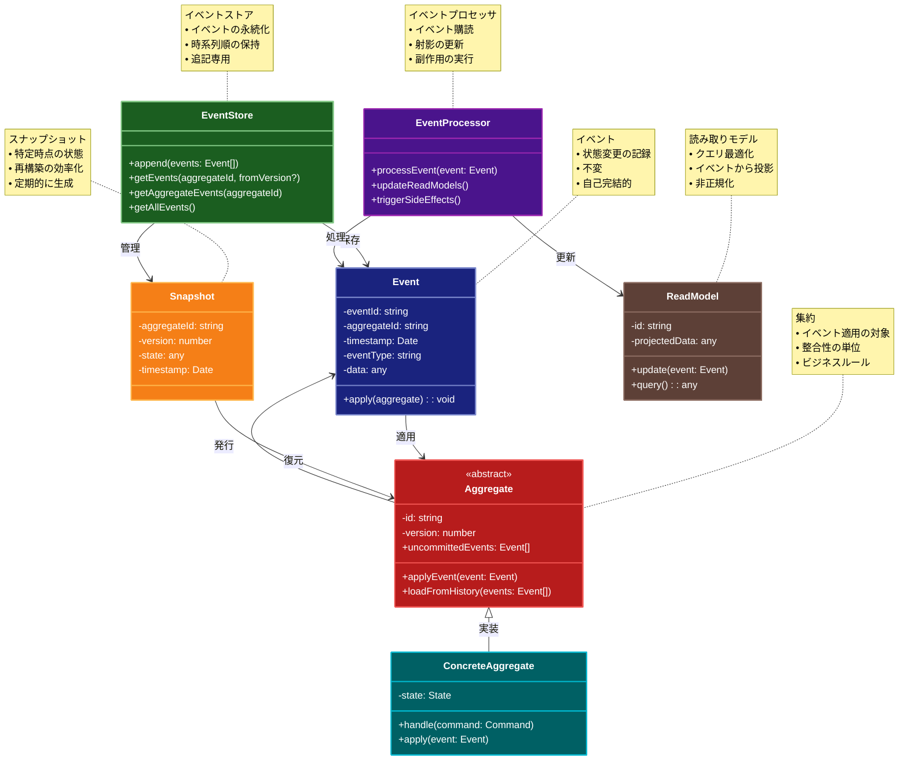

# Event Sourcing（イベントソーシング）パターン

## 目的

システムの状態変更を一連のイベントとして記録し、それらのイベントを再生することで任意の時点の状態を再現可能にします。

## 価値・解決する問題

- 完全な監査証跡を提供します
- 状態の時系列分析が可能になります
- デバッグと問題解決が容易になります
- システムの回復性が向上します
- イベントドリブンアーキテクチャとの親和性が高くなります

## 概要・特徴

### 概要

イベントソーシングは、システムの状態変更をイベントとして記録し、それらのイベントを順次適用することで任意の時点の状態を再現する設計パターンです。

### 特徴

#### イベントの永続化
イベントソーシングの基本原則は、システム内で発生したすべての状態変更をイベントとして記録し、それを永続的に保存することです。従来のシステムではデータの現在の状態のみを保存するのに対し、イベントソーシングでは状態変更をもたらした一連のイベントすべてを時系列で保存します。各イベントは不変（イミュータブル）であり、一度記録されたイベントは変更されません。これにより、システムの状態がどのように変化してきたかの完全な履歴が維持されます。例えば、銀行口座システムでは「口座開設」「入金」「出金」「利息計算」などのイベントが記録され、それらの集合が口座の現在残高を決定します。イベントの永続化には、特別なイベントストアデータベースや、追加専用の設計になっているデータベーステーブルが使用されることが多く、イベントの損失や改ざんを防ぐための冗長性と整合性チェックも組み込まれます。イベントストアは通常、高いスループットと大量のデータ保存に対応できるように最適化されており、システムの成長に伴って効率的にスケールできるように設計されています。

#### 状態の再構築
イベントソーシングでは、システムの現在の状態は永続化されたイベントの再生（リプレイ）によって再構築されます。特定のエンティティやアグリゲートの状態を取得する際には、そのエンティティに関連するすべてのイベントを時系列順に適用して最終状態を導出します。この再構築プロセスは、「プロジェクション」または「マテリアライズドビュー」を通じて最適化されることが多く、頻繁にアクセスされる状態のスナップショットを定期的に保存することで、再生が必要なイベント数を減らします。この状態再構築の性質により、システムは本質的に分散処理に適しており、異なるプロジェクションを並行して計算することが可能です。また、この仕組みにより、時間の任意の点での状態を再現することができるため、「タイムトラベルデバッギング」や過去の状態分析が可能になります。さらに、システムの振る舞いを変更する必要がある場合、既存のイベントを新しいロジックで再処理することで、過去のデータを新しい要件に合わせて変換することも可能です。

#### 完全な監査証跡
イベントソーシングの重要な利点の一つは、システム内で発生したすべての変更の完全かつ正確な監査証跡を自動的に生成することです。各イベントはタイムスタンプ、イベント発生者の情報、変更内容などのメタデータとともに記録されるため、「いつ、誰が、何を」変更したかを正確に追跡できます。この特性は、金融、医療、法律など、規制が厳しい業界でのコンプライアンス要件を満たすのに特に有用です。例えば、銀行取引や医療記録の変更履歴を完全に保持し、監査人や規制当局に提供することができます。また、セキュリティインシデント発生時の調査や、不正行為の検出にも役立ち、変更がいつ、どのように行われたかを詳細に分析することができます。従来のシステムでは事後的に監査ログを追加する必要がありましたが、イベントソーシングではこれが設計の本質的な部分であるため、監査機能の欠落や不完全な実装のリスクが低減します。さらに、イベントデータを元に高度な分析やパターン検出を行うことで、異常な活動や潜在的なセキュリティリスクを事前に特定することも可能になります。

#### 時間軸での分析
イベントソーシングは、時間軸に沿ったデータ分析と洞察を可能にします。すべての状態変更が時系列で保存されているため、時間的なパターン、傾向、異常を特定するための強力な基盤となります。これにより、ビジネスアナリストやデータサイエンティストは、「特定の期間にどのようなイベントが発生したか」「イベントの発生頻度はどのように変化しているか」「異なるイベント間の相関関係は何か」といった複雑な質問に答えることができます。例えば、Eコマースプラットフォームでは、顧客の購買行動の時間的変化を分析して、季節性や長期的なトレンドを特定できます。また、過去のデータに基づいて将来の状態を予測するための機械学習モデルの構築も容易になります。時系列データウェアハウスやBIツールと組み合わせることで、時間ベースのダッシュボードやレポートを作成し、ビジネスの動向をリアルタイムで把握することができます。さらに、A/Bテストやフィーチャーフラグの効果を時間軸で評価するなど、製品開発やマーケティング戦略の効果測定にも活用できます。

#### イベントストリーム処理
イベントソーシングは、リアルタイムのイベントストリーム処理と自然に統合されます。永続化されたイベントはイベントストリームとして公開され、様々なコンシューマーがこれらのイベントを購読して独自の処理を行うことができます。これにより、Command Query Responsibility Segregation（CQRS）パターンの実装が容易になり、読み取りモデルと書き込みモデルを分離して最適化することができます。例えば、トランザクション処理システムのイベントストリームから、検索最適化されたインデックス、分析用のデータウェアハウス、リアルタイムダッシュボード用のメトリクスなど、様々な目的に特化した派生データモデルを構築できます。また、Kafka、RabbitMQ、Amazon Kinesisなどのイベントストリーミングプラットフォームと統合することで、高スループット、障害耐性、および水平スケーラビリティを備えたシステムを構築できます。さらに、新しい要件が発生した場合、既存のイベントストリームに新しいコンシューマーを追加するだけで、既存のシステムに影響を与えることなく新機能を実装できるため、システムの拡張性と進化が促進されます。このイベントストリーム処理の特性は、マイクロサービスアーキテクチャやリアルタイム分析システムなど、現代的なシステム設計アプローチと非常に相性が良いものとなっています。

### 概要図



## 類似パターンとの比較

- [CQRS (コマンドクエリ責務分離)](cqrs.md): Event Sourcing は状態変更の履歴管理に焦点を当て、これに対して CQRS は読み取りと書き込みの分離に注力します。
- [Memento (メメント)](memento.md): Event Sourcing は全ての状態変更を記録し、これに対して Memento は特定時点のスナップショットを保存します。
- [Command (コマンド)](command.md): Event Sourcing はイベントの記録と再生に焦点を当て、これに対して Command は操作のカプセル化に注力します。

## 利用されているライブラリ／フレームワークの事例

- [Event Store](https://www.eventstore.com/): イベントソーシング専用のデータベース
- [Axon Framework](https://axoniq.io/): Java向けのイベントソーシングフレームワーク
- [Event Store DB](https://www.eventstore.com/): .NET向けのイベントソーシングデータベース

## 解説ページリンク

- [Martin Fowler - Event Sourcing](https://martinfowler.com/eaaDev/EventSourcing.html)
- [Microsoft - Event Sourcing Pattern](https://docs.microsoft.com/en-us/azure/architecture/patterns/event-sourcing)
- [Event Store - Event Sourcing Basics](https://eventstore.com/blog/event-sourcing-basics/)

## コード例

### Before:

直接的な状態管理による実装

```typescript
interface BankAccount {
  id: string;
  balance: number;
  owner: string;
}

class BankAccountService {
  private accounts: Map<string, BankAccount> = new Map();

  createAccount(id: string, owner: string): void {
    this.accounts.set(id, { id, owner, balance: 0 });
  }

  deposit(accountId: string, amount: number): void {
    const account = this.accounts.get(accountId);
    if (account) {
      account.balance += amount;
    }
  }

  withdraw(accountId: string, amount: number): void {
    const account = this.accounts.get(accountId);
    if (account && account.balance >= amount) {
      account.balance -= amount;
    }
  }

  getBalance(accountId: string): number {
    return this.accounts.get(accountId)?.balance ?? 0;
  }
}

// 使用例
const service = new BankAccountService();
service.createAccount("acc1", "John Doe");
service.deposit("acc1", 1000);
service.withdraw("acc1", 500);
console.log(service.getBalance("acc1")); // 500
```

### After:

イベントソーシングパターンを適用した実装

```typescript
// イベントの定義
interface Event {
  type: string;
  timestamp: number;
  aggregateId: string;
  version: number;
  data: any;
}

// 口座関連のイベント
interface AccountCreatedEvent extends Event {
  type: "AccountCreated";
  data: {
    owner: string;
    initialBalance: number;
  };
}

interface MoneyDepositedEvent extends Event {
  type: "MoneyDeposited";
  data: {
    amount: number;
  };
}

interface MoneyWithdrawnEvent extends Event {
  type: "MoneyWithdrawn";
  data: {
    amount: number;
  };
}

// イベントストアの実装
class EventStore {
  private events: Event[] = [];
  private subscribers: ((event: Event) => void)[] = [];

  append(event: Event): void {
    this.events.push(event);
    this.notifySubscribers(event);
  }

  getEvents(aggregateId: string): Event[] {
    return this.events.filter(event => event.aggregateId === aggregateId);
  }

  getAllEvents(): Event[] {
    return [...this.events];
  }

  subscribe(callback: (event: Event) => void): void {
    this.subscribers.push(callback);
  }

  private notifySubscribers(event: Event): void {
    this.subscribers.forEach(callback => callback(event));
  }
}

// 口座の集約ルート
class BankAccount {
  private id: string;
  private owner: string;
  private balance: number;
  private version: number;

  constructor(id: string) {
    this.id = id;
    this.owner = "";
    this.balance = 0;
    this.version = 0;
  }

  // イベントの適用
  applyEvent(event: Event): void {
    switch (event.type) {
      case "AccountCreated":
        this.applyAccountCreated(event as AccountCreatedEvent);
        break;
      case "MoneyDeposited":
        this.applyMoneyDeposited(event as MoneyDepositedEvent);
        break;
      case "MoneyWithdrawn":
        this.applyMoneyWithdrawn(event as MoneyWithdrawnEvent);
        break;
    }
    this.version = event.version;
  }

  private applyAccountCreated(event: AccountCreatedEvent): void {
    this.owner = event.data.owner;
    this.balance = event.data.initialBalance;
  }

  private applyMoneyDeposited(event: MoneyDepositedEvent): void {
    this.balance += event.data.amount;
  }

  private applyMoneyWithdrawn(event: MoneyWithdrawnEvent): void {
    this.balance -= event.data.amount;
  }

  // 状態の取得
  getState(): { id: string; owner: string; balance: number; version: number } {
    return {
      id: this.id,
      owner: this.owner,
      balance: this.balance,
      version: this.version
    };
  }
}

// イベントソーシングを使用した銀行口座サービス
class EventSourcedBankAccountService {
  private eventStore: EventStore;

  constructor() {
    this.eventStore = new EventStore();
    
    // イベントの購読（例：監査ログ）
    this.eventStore.subscribe(event => {
      console.log("イベント発生:", event);
    });
  }

  createAccount(id: string, owner: string): void {
    const event: AccountCreatedEvent = {
      type: "AccountCreated",
      timestamp: Date.now(),
      aggregateId: id,
      version: 1,
      data: {
        owner,
        initialBalance: 0
      }
    };
    this.eventStore.append(event);
  }

  deposit(accountId: string, amount: number): void {
    const account = this.loadAccount(accountId);
    const currentState = account.getState();

    const event: MoneyDepositedEvent = {
      type: "MoneyDeposited",
      timestamp: Date.now(),
      aggregateId: accountId,
      version: currentState.version + 1,
      data: {
        amount
      }
    };
    this.eventStore.append(event);
  }

  withdraw(accountId: string, amount: number): void {
    const account = this.loadAccount(accountId);
    const currentState = account.getState();

    if (currentState.balance < amount) {
      throw new Error("残高不足");
    }

    const event: MoneyWithdrawnEvent = {
      type: "MoneyWithdrawn",
      timestamp: Date.now(),
      aggregateId: accountId,
      version: currentState.version + 1,
      data: {
        amount
      }
    };
    this.eventStore.append(event);
  }

  getAccount(accountId: string): { id: string; owner: string; balance: number; version: number } {
    return this.loadAccount(accountId).getState();
  }

  getAccountHistory(accountId: string): Event[] {
    return this.eventStore.getEvents(accountId);
  }

  private loadAccount(accountId: string): BankAccount {
    const account = new BankAccount(accountId);
    const events = this.eventStore.getEvents(accountId);
    events.forEach(event => account.applyEvent(event));
    return account;
  }
}

// 使用例
async function example() {
  const service = new EventSourcedBankAccountService();

  // 口座の作成
  console.log("口座を作成");
  service.createAccount("acc1", "John Doe");

  // 預金
  console.log("\n1000円を預金");
  service.deposit("acc1", 1000);

  // 引き出し
  console.log("\n500円を引き出し");
  service.withdraw("acc1", 500);

  // 現在の状態を取得
  console.log("\n現在の口座状態:");
  console.log(service.getAccount("acc1"));

  // 履歴の取得
  console.log("\n口座の履歴:");
  const history = service.getAccountHistory("acc1");
  history.forEach(event => {
    console.log(`- ${event.type} at ${new Date(event.timestamp).toISOString()}`);
    console.log("  Data:", event.data);
  });

  // エラーケースの処理
  try {
    console.log("\n1000円の引き出しを試行（残高不足）");
    service.withdraw("acc1", 1000);
  } catch (error) {
    console.log("エラー:", error.message);
  }
}

example();
```
