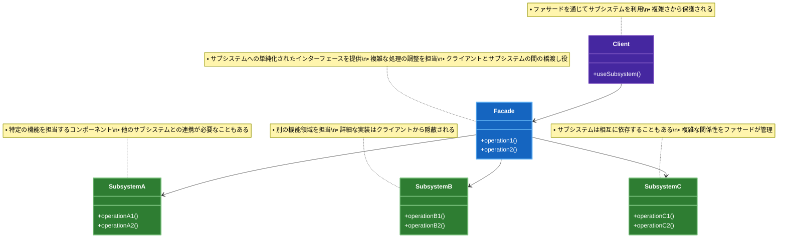

# Facade（ファサード）パターン

## 目的

複雑なサブシステムに対してシンプルなインターフェースを提供し、クライアントの利用を容易にするパターンです。

## 価値・解決する問題

- 複雑なサブシステムの利用を簡単にします
- サブシステムの詳細を隠蔽します
- 依存関係を最小限に抑えます
- システムの結合度を下げます
- 既存システムのリファクタリングを容易にします

## 概要・特徴

### 概要

Facadeパターンは、複雑なサブシステムに対してシンプルな統一インターフェースを提供することで、クライアントがサブシステムを容易に利用できるようにする設計パターンです。このパターンでは、複数のクラスやサブシステムの複雑な相互作用をファサードクラスによって抽象化し、クライアントから見えるインターフェースをシンプルにします。これにより、クライアントはサブシステムの内部構造や実装の詳細を知る必要がなくなり、使いやすくなります。特に、レガシーコードの改善、複雑なサードパーティライブラリのラッピング、システムの各レイヤー間のインターフェース設計などの場面で効果を発揮します。

Facadeパターンは、GoF（Gang of Four）による「Design Patterns: Elements of Reusable Object-Oriented Software」で定義された構造パターンの一つです。名前の「Facade（ファサード）」は建築用語で「建物の正面」を意味し、複雑な内部構造を隠蔽して外部に対してシンプルな「正面」だけを見せるという概念を表しています。このパターンは、複雑さを管理するための「最小知識の原則」（Law of Demeter）や「情報隠蔽の原則」といったオブジェクト指向設計の基本原則と密接に関連しています。

ソフトウェア開発の歴史の中で、システムの複雑さが増大するにつれてFacadeパターンの重要性は高まってきました。特に、マイクロサービスアーキテクチャやクラウドコンピューティングの普及により、異なるサービスやAPIを統合する必要性が生じた現代のソフトウェア開発において、Facadeパターンは以下のような状況で特に有用です：

1. **レガシーシステムの段階的なリファクタリング**: 古いコードベースを徐々に改善する際のインターフェースとして
2. **複雑なライブラリやサードパーティAPIの統合**: 外部サービスの複雑な操作を隠蔽するための層として
3. **マイクロサービス間の通信の簡素化**: 複数のマイクロサービスとの相互作用を単一のインターフェースに集約
4. **クロスカッティング関心事の管理**: ログ記録、エラー処理、認証など横断的な関心事を一元管理
5. **複雑なドメインロジックの抽象化**: ビジネスロジックの複雑な処理を単純なAPIで提供

Facadeパターンは単なる設計パターンを超えて、複雑なシステムを管理し、関心事を適切に分離するための重要な設計原則としての役割も果たしています。

### 特徴

#### シンプルなインターフェース提供

複雑なサブシステムに対して、単純化された統一的なインターフェースを提供します。これにより、クライアントは複数のサブシステムとの複雑な相互作用を意識せずに、単一のインターフェースを通じて必要な機能を利用できます。例えば、決済処理やメディア変換など、複数のステップや依存関係を持つ処理を、単一のメソッド呼び出しで実行できるようにします。

シンプルなインターフェースは以下のような特徴と利点を持ちます：

- **使いやすさの向上**: 複雑なサブシステムの使用方法を学ぶコストが大幅に削減されます
- **コード可読性の向上**: クライアントコードが簡潔かつ意図が明確になります
- **エラー発生率の低減**: 複雑な操作手順のミスが減少します
- **開発速度の向上**: 単純なインターフェースにより開発者の生産性が向上します
- **ドメイン言語との整合性**: ビジネス要件により近い抽象化レベルでの操作が可能になります

例えば、eコマースシステムでは、「注文処理」ファサードが在庫確認、支払い処理、出荷手配、顧客通知など、複数のサブシステムを調整する複雑なプロセスを、`processOrder(orderId)` といったシンプルなメソッドで提供することができます。同様に、マルチメディアライブラリでは、様々なフォーマット変換やエンコーディングの詳細を隠蔽し、`convertVideo(source, targetFormat)` のような単純なAPIを提供できます。このシンプルさによって、開発者はより高レベルの問題解決に集中でき、システムの使用における認知的負荷が軽減されます。

#### 複雑さの隠蔽

Facadeパターンの核心的な特徴は、サブシステムの複雑さをクライアントから隠蔽することです。サブシステムの内部構造、コンポーネント間の依存関係、実装の詳細などが、ファサードの背後に隠されます。この隠蔽により、クライアントはサブシステムの内部動作について深く理解する必要がなくなり、ファサードが提供する契約（インターフェース）のみに依存することができます。

この複雑さの隠蔽は以下のような価値をもたらします：

- **認知的負荷の軽減**: 開発者が一度に把握すべき情報量を削減
- **依存関係の明確化**: クライアントとサブシステム間の依存関係が整理される
- **実装詳細の保護**: 内部実装の変更からクライアントを保護
- **学習曲線の緩和**: 新しいチームメンバーが理解しやすいインターフェース
- **セキュリティの向上**: 内部機能への直接アクセスを制限し、適切な制御を提供

例えば、クラウドコンピューティングプラットフォームのSDKでは、複雑な分散システムの操作（仮想マシンのプロビジョニング、ネットワーク設定、ストレージ割り当てなど）を簡潔なAPIセットに抽象化します。同様に、機械学習ライブラリでは、複雑な数学的処理や最適化アルゴリズムの詳細を隠蔽し、データサイエンティストがモデルのトレーニングや予測に集中できるようなシンプルなインターフェースを提供します。この隠蔽により、専門知識のない開発者でも複雑なシステムを効果的に活用できるようになります。

#### 疎結合の促進

Facadeパターンは、クライアントとサブシステム間の結合度を低減させます。クライアントはサブシステムの具体的なクラスに直接依存するのではなく、ファサードインターフェースにのみ依存するようになります。これにより、サブシステムのコンポーネントを変更や置換しても、クライアントに影響を与えることなく実施できるようになります。

疎結合がもたらす具体的な利点は以下の通りです：

- **変更の影響範囲の限定**: サブシステムの変更がクライアントに影響しにくくなる
- **テスト容易性の向上**: ファサードをモック化することで、クライアントを孤立してテスト可能
- **サブシステムの交換可能性**: 実装を変更せずにサブシステム全体を置換できる
- **並行開発の促進**: クライアントチームとサブシステムチームが独立して作業可能
- **レイヤー化アーキテクチャの実現**: システムの論理的な層の分離を強化

例えば、データアクセスレイヤーのファサードは、アプリケーションロジックと具体的なデータストレージ技術（リレーショナルデータベース、NoSQL、ファイルシステムなど）の間の結合を緩和します。これにより、ストレージ技術を変更しても、アプリケーションコードを変更する必要がなくなります。同様に、サードパーティAPIを利用するシステムでは、外部サービスとの通信をファサードでカプセル化することで、APIの変更や別のサービスへの移行が容易になります。この疎結合性は、システムの柔軟性、拡張性、保守性を大幅に向上させます。

#### 段階的リファクタリングの支援

Facadeパターンは、レガシーシステムや複雑化したコードベースを段階的にリファクタリングする際に強力なツールとなります。既存の複雑なコードの前にファサードを導入することで、内部実装を少しずつ改善しながらも、クライアントに対しては一貫したインターフェースを提供し続けることができます。

段階的リファクタリングを支援する具体的なアプローチと利点：

- **安全なリファクタリング**: 既存のインターフェースを維持しながら内部実装を改善
- **トランザクション境界の定義**: リファクタリングの範囲を明確に区切れる
- **リスク分散**: 大規模な一括変更ではなく、小さな変更の積み重ねで改善
- **継続的デリバリーとの親和性**: 機能追加と並行してコード品質を向上
- **テスト戦略の簡素化**: ファサードレベルでの契約テストに集中可能

例えば、金融システムのレガシーコンポーネントをマイクロサービスアーキテクチャに移行する際、まずファサードを導入して既存のAPIを保持しながら、内部実装を徐々に新しいマイクロサービスに置き換えることができます。同様に、モノリシックなアプリケーションをモジュール化する過程でも、各機能領域にファサードを導入し、モジュール間の明確な境界を確立しながら内部を整理できます。この段階的アプローチにより、リファクタリング中も機能停止のリスクを最小限に抑え、ビジネス要件に対応し続けることが可能になります。

#### ポリシーの集中管理

Facadeパターンは、クロスカッティングな関心事やシステム全体のポリシーを集中管理するのに適しています。認証、認可、ロギング、エラー処理、トランザクション管理などの共通処理をファサードレイヤーに実装することで、一貫した適用と管理が可能になります。

ポリシー集中管理の具体的なメリットと実装方法：

- **ポリシーの一貫性確保**: システム全体で統一されたルールの適用
- **変更の容易さ**: ポリシー変更時の修正箇所の限定
- **コード重複の防止**: 共通処理の集約による効率化
- **監査しやすさ**: セキュリティや規制要件への対応を集中管理
- **コードベースの簡素化**: サブシステムからクロスカッティングな関心事を分離

例えば、企業のAPIゲートウェイでは、複数のバックエンドサービスに対する認証、レート制限、ロギング、エラーハンドリングなどのポリシーを一元管理するファサードとして機能します。また、データアクセスファサードでは、データベーストランザクションの管理、接続プーリング、リトライロジックなどを集中して処理できます。このポリシーの集中管理により、個々のコンポーネントはその本来の責務に集中でき、システム全体の一貫性と保守性が向上します。特に、セキュリティやコンプライアンス要件の厳しい領域では、このポリシーの一元管理が不可欠となります。

#### コンポジションの促進

Facadeパターンは、複数のサブシステムやコンポーネントを組み合わせて、より高レベルの機能を構築するコンポジション（合成）を促進します。ファサードは単なるプロキシではなく、複数のサブシステムの協調動作を調整し、新たな価値を生み出すオーケストレーターとしての役割も果たします。

コンポジションの促進による利点と実装戦略：

- **機能の再構成**: 既存のコンポーネントを新しい方法で組み合わせて新機能を創出
- **処理フローの最適化**: 複数のサブシステム間の相互作用を効率化
- **ドメイン駆動設計との親和性**: ビジネスプロセスや集約の境界をファサードとして表現
- **関心事の分離**: ビジネスロジックとインフラストラクチャの分離
- **再利用性の向上**: 共通の組み合わせパターンをファサードとして再利用

例えば、旅行予約システムのファサードでは、フライト検索、ホテル予約、レンタカー手配、支払い処理などの個別サブシステムを組み合わせて、「休暇パッケージ予約」という統合機能を提供できます。また、コンテンツ管理システムでは、テキスト処理、メディア管理、タグ付け、検索インデックス更新などのサービスを組み合わせた「コンテンツ公開」ファサードを提供できます。このコンポジションアプローチにより、既存の機能を再利用しながら、より高い抽象レベルでの新しい機能を効率的に構築できます。特に、マイクロサービスアーキテクチャにおいては、複数のサービスを組み合わせた「プロセスAPI」としてファサードが重要な役割を果たします。

### 概要図



## 類似パターンとの比較

- [Adapter (アダプター)](adapter.md): Facade は複雑なインターフェースをシンプルにし、これに対して Adapter は互換性のないインターフェースを変換します。
- [Mediator (メディエーター)](mediator.md): Facade はサブシステムへの一方向の通信を提供し、これに対して Mediator はオブジェクト間の双方向の通信を調整します。
- [Proxy (プロキシ)](proxy.md): Facade はインターフェースを簡素化し、これに対して Proxy はアクセス制御を提供します。

## 利用されているライブラリ／フレームワークの事例

- [jQuery](https://github.com/jquery/jquery): DOM操作の簡素化
- [Express.js](https://github.com/expressjs/express): HTTPサーバーの簡素化
- [Spring Framework](https://github.com/spring-projects/spring-framework): Javaエンタープライズ開発の簡素化

## 解説ページリンク

- [Refactoring Guru - Facade](https://refactoring.guru/design-patterns/facade)
- [Microsoft - Facade Pattern](https://docs.microsoft.com/en-us/previous-versions/msp-n-p/ee658117(v=pandp.10))
- [SourceMaking - Facade](https://sourcemaking.com/design_patterns/facade)

## コード例

### Before:

複雑なサブシステムを直接利用する実装

```typescript
// 複雑なサブシステムのクラス群
class VideoFile {
  private file: string;

  constructor(filename: string) {
    this.file = filename;
  }

  read(): string {
    return `動画ファイル ${this.file} を読み込みました`;
  }

  save(data: string): void {
    console.log(`動画ファイル ${this.file} を保存しました: ${data}`);
  }
}

class AudioMixer {
  private volume: number;

  constructor() {
    this.volume = 1.0;
  }

  setVolume(volume: number): void {
    this.volume = Math.max(0, Math.min(1, volume));
  }

  mix(audioData: string): string {
    return `音声をミックスしました (volume: ${this.volume}): ${audioData}`;
  }
}

class VideoEncoder {
  private quality: number;
  private format: string;

  constructor() {
    this.quality = 720;
    this.format = "mp4";
  }

  setQuality(quality: number): void {
    this.quality = quality;
  }

  setFormat(format: string): void {
    this.format = format;
  }

  encode(videoData: string): string {
    return `動画をエンコードしました (quality: ${this.quality}p, format: ${this.format}): ${videoData}`;
  }
}

class BitrateConverter {
  private bitrate: number;

  constructor() {
    this.bitrate = 1000;
  }

  setBitrate(bitrate: number): void {
    this.bitrate = bitrate;
  }

  convert(data: string): string {
    return `ビットレートを変換しました (${this.bitrate}kbps): ${data}`;
  }
}

class CodecFactory {
  extract(file: string): string {
    return `コーデックを抽出しました: ${file}`;
  }
}

// クライアントコード
function convertVideo(filename: string, format: string) {
  const file = new VideoFile(filename);
  const sourceVideo = file.read();

  const codecFactory = new CodecFactory();
  const sourceCodec = codecFactory.extract(filename);

  const bitrateConverter = new BitrateConverter();
  bitrateConverter.setBitrate(1500);
  const convertedVideo = bitrateConverter.convert(sourceCodec);

  const audioMixer = new AudioMixer();
  audioMixer.setVolume(0.8);
  const mixedAudio = audioMixer.mix(convertedVideo);

  const videoEncoder = new VideoEncoder();
  videoEncoder.setQuality(1080);
  videoEncoder.setFormat(format);
  const encodedVideo = videoEncoder.encode(mixedAudio);

  file.save(encodedVideo);
}

// 使用例
function example() {
  console.log("=== 動画変換の実行 ===");
  convertVideo("funny_cat_video.mp4", "avi");
}

example();
```

### After:

Facadeパターンを関数型プログラミングスタイルで適用した実装

```typescript
// 各サブシステムのインターフェース型定義
type VideoFileData = Readonly<{
  filename: string
  content?: string
}>

type AudioMixerOptions = Readonly<{
  volume: number
}>

type VideoEncoderOptions = Readonly<{
  quality: number
  format: string
}>

type BitrateOptions = Readonly<{
  bitrate: number
}>

// サブシステムの純粋関数群
const videoFileOps = {
  read: (data: VideoFileData): string => 
    `動画ファイル ${data.filename} を読み込みました`,
  
  save: (data: VideoFileData, content: string): void => {
    console.log(`動画ファイル ${data.filename} を保存しました: ${content}`)
  }
}

const audioMixerOps = {
  mix: (options: AudioMixerOptions, audioData: string): string => {
    const safeVolume = Math.max(0, Math.min(1, options.volume))
    return `音声をミックスしました (volume: ${safeVolume}): ${audioData}`
  }
}

const videoEncoderOps = {
  encode: (options: VideoEncoderOptions, videoData: string): string => 
    `動画をエンコードしました (quality: ${options.quality}p, format: ${options.format}): ${videoData}`
}

const bitrateOps = {
  convert: (options: BitrateOptions, data: string): string => 
    `ビットレートを変換しました (${options.bitrate}kbps): ${data}`
}

const codecOps = {
  extract: (filename: string): string => 
    `コーデックを抽出しました: ${filename}`
}

// Facadeの型定義
type VideoConversionOptions = Readonly<{
  format: string
  quality: number
  bitrate: number
  volume: number
}>

// デフォルトのオプション
const DEFAULT_OPTIONS: VideoConversionOptions = Object.freeze({
  format: 'mp4',
  quality: 1080,
  bitrate: 1500,
  volume: 0.8
})

// プリセット設定
const PRESETS: Readonly<Record<string, VideoConversionOptions>> = Object.freeze({
  web: Object.freeze({
    format: 'mp4',
    quality: 720,
    bitrate: 1000,
    volume: 1.0
  }),
  mobile: Object.freeze({
    format: 'mp4',
    quality: 480,
    bitrate: 800,
    volume: 1.0
  }),
  hd: Object.freeze({
    format: 'mp4',
    quality: 1080,
    bitrate: 2000,
    volume: 1.0
  }),
  '4k': Object.freeze({
    format: 'mp4',
    quality: 2160,
    bitrate: 4000,
    volume: 1.0
  })
})

// ファサード関数群
const videoConverterFacade = {
  // 動画変換の実行
  convert: (
    filename: string, 
    customOptions: Partial<VideoConversionOptions> = {}
  ): void => {
    // オプションのマージ
    const options: VideoConversionOptions = Object.freeze({
      ...DEFAULT_OPTIONS,
      ...customOptions
    })

    console.log('=== 動画変換の開始 ===')
    console.log(`入力ファイル: ${filename}`)
    console.log(`出力形式: ${options.format}`)

    try {
      // ファイルの読み込み
      const file: VideoFileData = { filename }
      const sourceVideo = videoFileOps.read(file)
      console.log(sourceVideo)

      // コーデックの抽出
      const sourceCodec = codecOps.extract(filename)
      console.log(sourceCodec)

      // ビットレートの変換
      const convertedVideo = bitrateOps.convert(
        { bitrate: options.bitrate }, 
        sourceCodec
      )
      console.log(convertedVideo)

      // 音声のミキシング
      const mixedAudio = audioMixerOps.mix(
        { volume: options.volume }, 
        convertedVideo
      )
      console.log(mixedAudio)

      // 動画のエンコード
      const encodedVideo = videoEncoderOps.encode(
        { 
          quality: options.quality, 
          format: options.format 
        }, 
        mixedAudio
      )
      console.log(encodedVideo)

      // 結果の保存
      videoFileOps.save(file, encodedVideo)

      console.log('=== 動画変換の完了 ===')
    } catch (error) {
      console.error('動画変換中にエラーが発生しました:', error)
      throw error
    }
  },

  // バッチ変換の実行
  convertBatch: (
    files: ReadonlyArray<string>, 
    customOptions: Partial<VideoConversionOptions> = {}
  ): void => {
    console.log(`=== バッチ変換の開始 (${files.length}ファイル) ===`)
    
    files.forEach((file, index) => {
      console.log(`\n[${index + 1}/${files.length}] ${file} の変換を開始`)
      try {
        videoConverterFacade.convert(file, customOptions)
      } catch (error) {
        console.error(`${file} の変換に失敗しました:`, error)
      }
    })

    console.log('\n=== バッチ変換の完了 ===')
  },

  // プリセットを使用した変換
  convertWithPreset: (
    filename: string, 
    preset: 'web' | 'mobile' | 'hd' | '4k'
  ): void => {
    console.log(`プリセット '${preset}' を使用して変換を開始`)
    videoConverterFacade.convert(filename, PRESETS[preset])
  }
}

// 使用例
const example = (): void => {
  // 基本的な変換
  console.log('\n1. 基本的な変換')
  videoConverterFacade.convert('funny_cat_video.mp4', { format: 'avi' })

  // カスタムオプションを使用した変換
  console.log('\n2. カスタムオプションを使用した変換')
  videoConverterFacade.convert('vacation_video.mov', {
    format: 'mp4',
    quality: 1440,
    bitrate: 2000,
    volume: 0.9
  })

  // プリセットを使用した変換
  console.log('\n3. プリセットを使用した変換')
  videoConverterFacade.convertWithPreset('conference_recording.webm', 'web')

  // バッチ変換
  console.log('\n4. バッチ変換')
  videoConverterFacade.convertBatch(
    [
      'video1.mp4',
      'video2.avi',
      'video3.mov'
    ],
    {
      format: 'mp4',
      quality: 1080
    }
  )
}

// 実行
example()