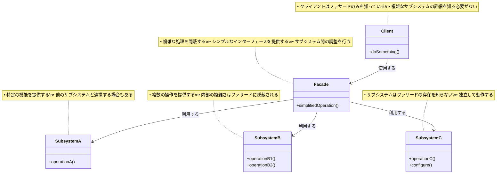

# Facade（ファサード）パターン

## 目的

複雑なサブシステムに対してシンプルなインターフェースを提供し、クライアントの利用を容易にするパターンです。

## 価値・解決する問題

- 複雑なサブシステムの利用を簡単にします
- サブシステムの詳細を隠蔽します
- 依存関係を最小限に抑えます
- システムの結合度を下げます
- 既存システムのリファクタリングを容易にします

## 概要・特徴

### 概要

Facadeパターンは、複雑なサブシステムに対してシンプルな統一インターフェースを提供することで、クライアントがサブシステムを容易に利用できるようにする設計パターンです。このパターンでは、複数のクラスやサブシステムの複雑な相互作用をファサードクラスによって抽象化し、クライアントから見えるインターフェースをシンプルにします。これにより、クライアントはサブシステムの内部構造や実装の詳細を知る必要がなくなり、使いやすくなります。特に、レガシーコードの改善、複雑なサードパーティライブラリのラッピング、システムの各レイヤー間のインターフェース設計などの場面で効果を発揮します。

### 特徴

#### シンプルなインターフェース提供

複雑なサブシステムに対して、単純化された統一的なインターフェースを提供します。これにより、クライアントは複数のサブシステムとの複雑な相互作用を意識せずに、単一のインターフェースを通じて必要な機能を利用できます。例えば、決済処理やメディア変換など、複数のステップや依存関係を持つ処理を、単一のメソッド呼び出しで実行できるようにします。

#### 複雑さの隠蔽

サブシステムの内部構造や実装の詳細をクライアントから隠蔽します。これにより、クライアントはサブシステムの複雑な仕組みを理解する必要がなく、シンプルなインターフェースだけを知っていれば良くなります。例えば、データベース操作やネットワーク通信などの複雑な処理を抽象化し、クライアントが直接それらの低レベルAPIを扱う必要をなくします。

#### 依存関係の管理

クライアントとサブシステム間の依存関係を管理・減少させます。クライアントはファサードのみに依存し、サブシステムの個々のコンポーネントに直接依存することがなくなります。これにより、サブシステムの変更がクライアントに与える影響を最小限に抑えることができます。例えば、サブシステムのコンポーネントが変更されても、ファサードのインターフェースを維持することで、クライアントコードを変更せずに済みます。

#### 結合度の低減

システム全体の結合度を低減します。ファサードを介してサブシステムとやり取りすることで、クライアントとサブシステム間の直接的な結びつきが少なくなります。これにより、システムの柔軟性や保守性が向上し、変更に強い設計が実現します。特に大規模なシステムでは、モジュール間の結合度を下げることで、システム全体の安定性が高まります。

#### 再利用性の向上

ファサードパターンは、複雑なサブシステムをシンプルなインターフェースで包むことで、そのサブシステムの再利用性を向上させます。クライアントはサブシステムの内部実装の詳細を知る必要がないため、様々なアプリケーションやコンテキストでサブシステムを容易に再利用できるようになります。例えば、画像処理ライブラリの場合、ファサードを通じて「画像をリサイズする」「フィルターを適用する」といったシンプルなインターフェースを提供することで、画像処理エンジンの複雑さを隠しながら、Webアプリケーション、デスクトップアプリケーション、モバイルアプリケーションなど異なるプラットフォームで同じ機能を再利用できます。また、マイクロサービスアーキテクチャにおいては、特定のドメイン機能をファサードとして提供することで、他のサービスからの利用を促進し、同じ機能の重複実装を防ぐことができます。これにより、開発効率の向上とコードの一貫性維持が実現します。

#### 段階的な移行の促進

ファサードパターンは、古いシステムから新しいシステムへの段階的な移行を促進します。レガシーシステムの前にファサードを配置することで、内部実装を徐々に改善しながら、外部インターフェースの互換性を維持することができます。例えば、古いモノリシックなバックエンドシステムをマイクロサービスアーキテクチャに移行する際、ファサードを導入してクライアントからの要求を適切なマイクロサービスに転送することで、クライアント側のコードを変更せずに内部アーキテクチャを刷新できます。また、古いデータベースシステムを新しいものに置き換える場合も、データアクセスファサードを使用することで、アプリケーションのビジネスロジックに影響を与えずに移行作業を進めることができます。この段階的な移行アプローチにより、リスクを最小限に抑えながらシステム近代化を実現できるため、大規模プロジェクトでの移行戦略として特に有効です。

### 概要図



## 類似パターンとの比較

- [Adapter (アダプター)](adapter.md): Facade は複雑なインターフェースをシンプルにし、これに対して Adapter は互換性のないインターフェースを変換します。
- [Mediator (メディエーター)](mediator.md): Facade はサブシステムへの一方向の通信を提供し、これに対して Mediator はオブジェクト間の双方向の通信を調整します。
- [Proxy (プロキシ)](proxy.md): Facade はインターフェースを簡素化し、これに対して Proxy はアクセス制御を提供します。

## 利用されているライブラリ／フレームワークの事例

- [jQuery](https://github.com/jquery/jquery): DOM操作の簡素化
- [Express.js](https://github.com/expressjs/express): HTTPサーバーの簡素化
- [Spring Framework](https://github.com/spring-projects/spring-framework): Javaエンタープライズ開発の簡素化

## 解説ページリンク

- [Refactoring Guru - Facade](https://refactoring.guru/design-patterns/facade)
- [Microsoft - Facade Pattern](https://docs.microsoft.com/en-us/previous-versions/msp-n-p/ee658117(v=pandp.10))
- [SourceMaking - Facade](https://sourcemaking.com/design_patterns/facade)

## コード例

### Before:

複雑なサブシステムを直接利用する実装

```typescript
// 複雑なサブシステムのクラス群
class VideoFile {
  private file: string;

  constructor(filename: string) {
    this.file = filename;
  }

  read(): string {
    return `動画ファイル ${this.file} を読み込みました`;
  }

  save(data: string): void {
    console.log(`動画ファイル ${this.file} を保存しました: ${data}`);
  }
}

class AudioMixer {
  private volume: number;

  constructor() {
    this.volume = 1.0;
  }

  setVolume(volume: number): void {
    this.volume = Math.max(0, Math.min(1, volume));
  }

  mix(audioData: string): string {
    return `音声をミックスしました (volume: ${this.volume}): ${audioData}`;
  }
}

class VideoEncoder {
  private quality: number;
  private format: string;

  constructor() {
    this.quality = 720;
    this.format = "mp4";
  }

  setQuality(quality: number): void {
    this.quality = quality;
  }

  setFormat(format: string): void {
    this.format = format;
  }

  encode(videoData: string): string {
    return `動画をエンコードしました (quality: ${this.quality}p, format: ${this.format}): ${videoData}`;
  }
}

class BitrateConverter {
  private bitrate: number;

  constructor() {
    this.bitrate = 1000;
  }

  setBitrate(bitrate: number): void {
    this.bitrate = bitrate;
  }

  convert(data: string): string {
    return `ビットレートを変換しました (${this.bitrate}kbps): ${data}`;
  }
}

class CodecFactory {
  extract(file: string): string {
    return `コーデックを抽出しました: ${file}`;
  }
}

// クライアントコード
function convertVideo(filename: string, format: string) {
  const file = new VideoFile(filename);
  const sourceVideo = file.read();

  const codecFactory = new CodecFactory();
  const sourceCodec = codecFactory.extract(filename);

  const bitrateConverter = new BitrateConverter();
  bitrateConverter.setBitrate(1500);
  const convertedVideo = bitrateConverter.convert(sourceCodec);

  const audioMixer = new AudioMixer();
  audioMixer.setVolume(0.8);
  const mixedAudio = audioMixer.mix(convertedVideo);

  const videoEncoder = new VideoEncoder();
  videoEncoder.setQuality(1080);
  videoEncoder.setFormat(format);
  const encodedVideo = videoEncoder.encode(mixedAudio);

  file.save(encodedVideo);
}

// 使用例
function example() {
  console.log("=== 動画変換の実行 ===");
  convertVideo("funny_cat_video.mp4", "avi");
}

example();
```

### After:

Facadeパターンを関数型プログラミングスタイルで適用した実装

```typescript
// 各サブシステムのインターフェース型定義
type VideoFileData = Readonly<{
  filename: string
  content?: string
}>

type AudioMixerOptions = Readonly<{
  volume: number
}>

type VideoEncoderOptions = Readonly<{
  quality: number
  format: string
}>

type BitrateOptions = Readonly<{
  bitrate: number
}>

// サブシステムの純粋関数群
const videoFileOps = {
  read: (data: VideoFileData): string => 
    `動画ファイル ${data.filename} を読み込みました`,
  
  save: (data: VideoFileData, content: string): void => {
    console.log(`動画ファイル ${data.filename} を保存しました: ${content}`)
  }
}

const audioMixerOps = {
  mix: (options: AudioMixerOptions, audioData: string): string => {
    const safeVolume = Math.max(0, Math.min(1, options.volume))
    return `音声をミックスしました (volume: ${safeVolume}): ${audioData}`
  }
}

const videoEncoderOps = {
  encode: (options: VideoEncoderOptions, videoData: string): string => 
    `動画をエンコードしました (quality: ${options.quality}p, format: ${options.format}): ${videoData}`
}

const bitrateOps = {
  convert: (options: BitrateOptions, data: string): string => 
    `ビットレートを変換しました (${options.bitrate}kbps): ${data}`
}

const codecOps = {
  extract: (filename: string): string => 
    `コーデックを抽出しました: ${filename}`
}

// Facadeの型定義
type VideoConversionOptions = Readonly<{
  format: string
  quality: number
  bitrate: number
  volume: number
}>

// デフォルトのオプション
const DEFAULT_OPTIONS: VideoConversionOptions = Object.freeze({
  format: 'mp4',
  quality: 1080,
  bitrate: 1500,
  volume: 0.8
})

// プリセット設定
const PRESETS: Readonly<Record<string, VideoConversionOptions>> = Object.freeze({
  web: Object.freeze({
    format: 'mp4',
    quality: 720,
    bitrate: 1000,
    volume: 1.0
  }),
  mobile: Object.freeze({
    format: 'mp4',
    quality: 480,
    bitrate: 800,
    volume: 1.0
  }),
  hd: Object.freeze({
    format: 'mp4',
    quality: 1080,
    bitrate: 2000,
    volume: 1.0
  }),
  '4k': Object.freeze({
    format: 'mp4',
    quality: 2160,
    bitrate: 4000,
    volume: 1.0
  })
})

// ファサード関数群
const videoConverterFacade = {
  // 動画変換の実行
  convert: (
    filename: string, 
    customOptions: Partial<VideoConversionOptions> = {}
  ): void => {
    // オプションのマージ
    const options: VideoConversionOptions = Object.freeze({
      ...DEFAULT_OPTIONS,
      ...customOptions
    })

    console.log('=== 動画変換の開始 ===')
    console.log(`入力ファイル: ${filename}`)
    console.log(`出力形式: ${options.format}`)

    try {
      // ファイルの読み込み
      const file: VideoFileData = { filename }
      const sourceVideo = videoFileOps.read(file)
      console.log(sourceVideo)

      // コーデックの抽出
      const sourceCodec = codecOps.extract(filename)
      console.log(sourceCodec)

      // ビットレートの変換
      const convertedVideo = bitrateOps.convert(
        { bitrate: options.bitrate }, 
        sourceCodec
      )
      console.log(convertedVideo)

      // 音声のミキシング
      const mixedAudio = audioMixerOps.mix(
        { volume: options.volume }, 
        convertedVideo
      )
      console.log(mixedAudio)

      // 動画のエンコード
      const encodedVideo = videoEncoderOps.encode(
        { 
          quality: options.quality, 
          format: options.format 
        }, 
        mixedAudio
      )
      console.log(encodedVideo)

      // 結果の保存
      videoFileOps.save(file, encodedVideo)

      console.log('=== 動画変換の完了 ===')
    } catch (error) {
      console.error('動画変換中にエラーが発生しました:', error)
      throw error
    }
  },

  // バッチ変換の実行
  convertBatch: (
    files: ReadonlyArray<string>, 
    customOptions: Partial<VideoConversionOptions> = {}
  ): void => {
    console.log(`=== バッチ変換の開始 (${files.length}ファイル) ===`)
    
    files.forEach((file, index) => {
      console.log(`\n[${index + 1}/${files.length}] ${file} の変換を開始`)
      try {
        videoConverterFacade.convert(file, customOptions)
      } catch (error) {
        console.error(`${file} の変換に失敗しました:`, error)
      }
    })

    console.log('\n=== バッチ変換の完了 ===')
  },

  // プリセットを使用した変換
  convertWithPreset: (
    filename: string, 
    preset: 'web' | 'mobile' | 'hd' | '4k'
  ): void => {
    console.log(`プリセット '${preset}' を使用して変換を開始`)
    videoConverterFacade.convert(filename, PRESETS[preset])
  }
}

// 使用例
const example = (): void => {
  // 基本的な変換
  console.log('\n1. 基本的な変換')
  videoConverterFacade.convert('funny_cat_video.mp4', { format: 'avi' })

  // カスタムオプションを使用した変換
  console.log('\n2. カスタムオプションを使用した変換')
  videoConverterFacade.convert('vacation_video.mov', {
    format: 'mp4',
    quality: 1440,
    bitrate: 2000,
    volume: 0.9
  })

  // プリセットを使用した変換
  console.log('\n3. プリセットを使用した変換')
  videoConverterFacade.convertWithPreset('conference_recording.webm', 'web')

  // バッチ変換
  console.log('\n4. バッチ変換')
  videoConverterFacade.convertBatch(
    [
      'video1.mp4',
      'video2.avi',
      'video3.mov'
    ],
    {
      format: 'mp4',
      quality: 1080
    }
  )
}

// 実行
example()