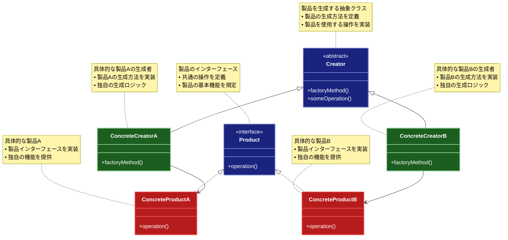

# Factory Method（ファクトリーメソッド）パターン

## 目的

オブジェクトの生成をサブクラスに委ねることで、生成するオブジェクトの型を柔軟に変更可能にするパターンです。

## 価値・解決する問題

- オブジェクト生成の柔軟性を向上させます
- 生成ロジックの集中管理を実現します
- コードの再利用性を高めます
- 拡張性を確保します
- 依存関係を緩和します

## 概要・特徴

### 概要

Factory Methodパターンは、オブジェクトの生成をインターフェースとして定義し、具体的な生成クラスの選択をサブクラスに委ねる設計パターンです。このパターンでは、オブジェクト作成のためのインターフェース（Factory Method）を定義しながら、どのクラスをインスタンス化するかの決定はサブクラスに任せます。これにより、製品の具体的な型に依存せずにコードを作成できます。

### 特徴

#### オブジェクト生成の抽象化
Factory Methodパターンの最も基本的な特徴は、オブジェクト生成の詳細をクラスの実装から分離し、抽象インターフェースを通じてオブジェクトを作成することです。これにより、クライアントコードは具象クラスに直接依存することなく、抽象インターフェースに依存するようになります。例えば、UIフレームワークでは、ボタンやテキストフィールドなどのUIコンポーネントをプラットフォーム固有の実装（Windows、macOS、Linuxなど）から独立して扱うことができます。クライアントコードは「ボタン」という抽象概念を使用し、実際にどのプラットフォーム向けのボタンが生成されるかは、実行時に使用されるファクトリーメソッドによって決定されます。これにより、アプリケーションロジックは特定のプラットフォームに依存せず、異なる環境で再利用可能になります。また、製品の実装が変更された場合でも、クライアントコードを修正する必要がなくなり、保守性が向上します。この抽象化により、開発チームは製品のインターフェースに集中することができ、実装の詳細は個別のチームに委ねることができるため、大規模プロジェクトでの協業が効率化されます。

#### 生成ロジックの分離
Factory Methodパターンは、製品の生成ロジックを製品の使用ロジックから明確に分離します。これは単一責任の原則（Single Responsibility Principle）を実践する効果的な方法です。例えば、データベース接続を管理するシステムでは、接続オブジェクトの生成ロジック（認証情報の検証、コネクションプールの管理、フェイルオーバーの処理など）が複雑になりがちですが、Factory Methodパターンを使用することで、この複雑な生成ロジックを専用のファクトリークラスにカプセル化できます。これにより、クライアントコードはデータベース接続の使用だけに集中でき、生成の複雑さから解放されます。また、ドキュメント処理システムでは、様々な形式（PDF、Word、HTML等）のドキュメント生成ロジックが異なりますが、Factory Methodパターンを使用することで、各形式の生成処理を個別のファクトリーに分離し、ドキュメント操作のコアロジックはドキュメントのインターフェースのみに依存させることができます。この分離により、生成ロジックの変更（例：新しい認証方式の追加やパフォーマンス最適化）が容易になり、また生成と使用のそれぞれのテストが独立して行えるようになるため、品質の向上にも寄与します。

#### 拡張性の確保
Factory Methodパターンの大きな利点は、既存のコードを変更することなく、新しい製品タイプを追加できる拡張性です。これはOpen-Closed原則（拡張に対しては開いていて、修正に対しては閉じている）を実現する手段となります。例えば、支払い処理システムでは、最初はクレジットカードと銀行振込の2つの支払い方法しかサポートしていなくても、後からPayPal、Apple Pay、暗号通貨など新しい支払い方法を、既存のコードを変更することなく追加できます。各支払い方法に対して新しい具象製品クラスとそれに対応するCreatorサブクラスを実装するだけで済みます。同様に、グラフィック処理ライブラリでは、新しい画像形式のサポートを追加する際に、既存の画像処理ロジックを変更せずに、新しい画像形式の読み込みと保存を担当するクラスを追加するだけで対応できます。この拡張性は特に長期的に維持されるシステムや、頻繁に新機能が追加されるプロダクトで重要です。変更の影響範囲が限定されるため、リグレッションのリスクが低減し、継続的な改善と機能拡張が容易になります。また、この特性はアジャイル開発にも適しており、段階的な機能追加や改善を支援します。

#### 依存関係の制御
Factory Methodパターンは依存性逆転の原則（Dependency Inversion Principle）を実装するための効果的な手段です。高レベルのモジュールが低レベルのモジュールに直接依存するのではなく、両者が抽象化に依存するようになります。例えば、ビジネスロジックレイヤーが直接データベースアクセスクラスを生成して使用するのではなく、データアクセスインターフェースとファクトリーメソッドを介して間接的に操作することで、特定のデータベース技術への依存を排除できます。これにより、テスト時にはモックデータソースを提供するファクトリーに置き換えることで、ユニットテストが容易になります。また、ロギングシステムでは、開発環境ではコンソール出力、テスト環境ではメモリ内ロガー、本番環境ではファイルやデータベースへのロギングと、環境に応じてログの出力先を変えたい場合があります。Factory Methodパターンを使用することで、ロガーの生成を抽象化し、環境設定によって適切なロガーを提供できます。この依存関係の制御により、システムの各コンポーネントは疎結合になり、変更の影響範囲が限定されます。また、異なるコンポーネントを独立して開発・テスト・デプロイできるようになるため、マイクロサービスアーキテクチャのような分散システムでも価値を発揮します。

#### インターフェースの統一
Factory Methodパターンは、様々な種類の製品を作成するための統一されたインターフェースを提供します。この一貫性のあるオブジェクト生成メカニズムにより、クライアントコードはオブジェクトの型に関わらず同じ方法でオブジェクトを要求でき、コードの可読性と保守性が大幅に向上します。例えば、ドキュメント編集アプリケーションでは、様々な形式のドキュメント（テキスト、スプレッドシート、プレゼンテーションなど）を開く必要がありますが、Factory Methodパターンを使用することで、`createDocument()`のような統一されたメソッドを通じて適切なドキュメントオブジェクトを取得できます。ファイル形式の違いにより内部処理は異なりますが、クライアントは常に同じパターンでドキュメントを取得できます。また、プラグインシステムでは、様々な外部コンポーネントを統一的なインターフェースを通じてロードし、システムに統合する必要がありますが、Factory Methodパターンを使用することで、各プラグインのロード方法が異なっていても、アプリケーションは一貫した方法でプラグインを要求できます。この統一されたインターフェースは開発者にとって学習コストを削減し、コードの理解を容易にします。また、新しい開発者がシステムに参加した際も、オブジェクト生成の一貫したパターンを理解するだけで、様々な種類のオブジェクト生成ロジックを理解できるようになります。さらに、テストの観点でも、モックオブジェクトやテスト用のスタブを提供するためのファクトリーを容易に実装でき、テスト可能性が向上します。

### 概要図



## 類似パターンとの比較

- [Abstract Factory (抽象ファクトリ)](abstract-factory.md): Factory Method は単一のオブジェクト生成に焦点を当て、これに対して Abstract Factory は関連するオブジェクト群の生成を扱います。
- [Builder (ビルダー)](builder.md): Factory Method はオブジェクト生成のカプセル化に焦点を当て、これに対して Builder は複雑なオブジェクトの段階的な構築に注力します。
- [Prototype (プロトタイプ)](prototype.md): Factory Method は新しいインスタンスの生成に焦点を当て、これに対して Prototype は既存のオブジェクトのクローン生成に注力します。

## 利用されているライブラリ／フレームワークの事例

- [Spring Framework](https://spring.io/): BeanFactory
- [Java Collections](https://docs.oracle.com/javase/8/docs/api/java/util/Collections.html): Collection.iterator()
- [Angular](https://angular.io/): ComponentFactoryResolver

## 解説ページリンク

- [Refactoring Guru - Factory Method Pattern](https://refactoring.guru/design-patterns/factory-method)
- [SourceMaking - Factory Method Pattern](https://sourcemaking.com/design_patterns/factory_method)
- [Design Patterns - Factory Method Pattern](https://www.oodesign.com/factory-method-pattern.html)

## コード例

### Before:

直接的なオブジェクト生成の実装

```typescript
enum PaymentType {
  CreditCard,
  PayPal,
  BankTransfer
}

class Payment {
  constructor(
    private amount: number,
    private type: PaymentType
  ) {}

  process(): void {
    switch (this.type) {
      case PaymentType.CreditCard:
        console.log(`クレジットカードで${this.amount}円を支払い`);
        break;
      case PaymentType.PayPal:
        console.log(`PayPalで${this.amount}円を支払い`);
        break;
      case PaymentType.BankTransfer:
        console.log(`銀行振込で${this.amount}円を支払い`);
        break;
    }
  }
}

// 使用例
const payment1 = new Payment(1000, PaymentType.CreditCard);
const payment2 = new Payment(2000, PaymentType.PayPal);

payment1.process();
payment2.process();
```

### After:

Factory Methodパターンを適用した実装

```typescript
// 支払い処理の抽象インターフェース
interface Payment {
  process(): void;
  validate(): boolean;
  getDescription(): string;
}

// 支払い処理のファクトリーインターフェース
interface PaymentFactory {
  createPayment(amount: number): Payment;
}

// クレジットカード支払いの実装
class CreditCardPayment implements Payment {
  constructor(
    private amount: number,
    private cardNumber: string,
    private expiryDate: string,
    private cvv: string
  ) {}

  process(): void {
    if (!this.validate()) {
      throw new Error("無効なクレジットカード情報です");
    }
    console.log(`クレジットカード(${this.maskCardNumber()})で${this.amount}円を支払い`);
  }

  validate(): boolean {
    return (
      this.cardNumber.length === 16 &&
      this.expiryDate.match(/^\d{2}\/\d{2}$/) !== null &&
      this.cvv.length === 3
    );
  }

  getDescription(): string {
    return `クレジットカード決済 (${this.maskCardNumber()})`;
  }

  private maskCardNumber(): string {
    return `****-****-****-${this.cardNumber.slice(-4)}`;
  }
}

// PayPal支払いの実装
class PayPalPayment implements Payment {
  constructor(
    private amount: number,
    private email: string
  ) {}

  process(): void {
    if (!this.validate()) {
      throw new Error("無効なPayPalアカウントです");
    }
    console.log(`PayPal(${this.email})で${this.amount}円を支払い`);
  }

  validate(): boolean {
    return this.email.includes("@");
  }

  getDescription(): string {
    return `PayPal決済 (${this.email})`;
  }
}

// 銀行振込支払いの実装
class BankTransferPayment implements Payment {
  constructor(
    private amount: number,
    private bankName: string,
    private accountNumber: string
  ) {}

  process(): void {
    if (!this.validate()) {
      throw new Error("無効な銀行口座情報です");
    }
    console.log(`${this.bankName}(口座番号: ${this.accountNumber})に${this.amount}円を振込`);
  }

  validate(): boolean {
    return this.bankName.length > 0 && this.accountNumber.length > 0;
  }

  getDescription(): string {
    return `銀行振込 (${this.bankName})`;
  }
}

// クレジットカード支払いのファクトリー
class CreditCardPaymentFactory implements PaymentFactory {
  constructor(
    private cardNumber: string,
    private expiryDate: string,
    private cvv: string
  ) {}

  createPayment(amount: number): Payment {
    return new CreditCardPayment(amount, this.cardNumber, this.expiryDate, this.cvv);
  }
}

// PayPal支払いのファクトリー
class PayPalPaymentFactory implements PaymentFactory {
  constructor(private email: string) {}

  createPayment(amount: number): Payment {
    return new PayPalPayment(amount, this.email);
  }
}

// 銀行振込支払いのファクトリー
class BankTransferPaymentFactory implements PaymentFactory {
  constructor(
    private bankName: string,
    private accountNumber: string
  ) {}

  createPayment(amount: number): Payment {
    return new BankTransferPayment(amount, this.bankName, this.accountNumber);
  }
}

// 支払い処理クラス
class PaymentProcessor {
  private factories: Map<string, PaymentFactory> = new Map();

  registerFactory(name: string, factory: PaymentFactory): void {
    this.factories.set(name, factory);
  }

  processPayment(amount: number, factoryName: string): void {
    const factory = this.factories.get(factoryName);
    if (!factory) {
      throw new Error(`未対応の支払い方法です: ${factoryName}`);
    }

    const payment = factory.createPayment(amount);
    console.log(`支払い方法: ${payment.getDescription()}`);
    payment.process();
  }
}

// 注文クラス
class Order {
  constructor(
    private items: { name: string; price: number }[],
    private processor: PaymentProcessor
  ) {}

  getTotalAmount(): number {
    return this.items.reduce((total, item) => total + item.price, 0);
  }

  checkout(paymentMethod: string): void {
    const total = this.getTotalAmount();
    console.log("\n=== 注文の詳細 ===");
    this.items.forEach(item => {
      console.log(`${item.name}: ${item.price}円`);
    });
    console.log(`合計: ${total}円`);

    this.processor.processPayment(total, paymentMethod);
  }
}

// 使用例
function example() {
  // 支払い処理の初期化
  const processor = new PaymentProcessor();

  // 各種支払い方法のファクトリーを登録
  processor.registerFactory(
    "credit-card",
    new CreditCardPaymentFactory("1234567890123456", "12/25", "123")
  );
  processor.registerFactory(
    "paypal",
    new PayPalPaymentFactory("user@example.com")
  );
  processor.registerFactory(
    "bank-transfer",
    new BankTransferPaymentFactory("サンプル銀行", "1234567")
  );

  // 注文の作成
  const order = new Order([
    { name: "商品A", price: 1000 },
    { name: "商品B", price: 2000 },
    { name: "商品C", price: 3000 }
  ], processor);

  try {
    // 各支払い方法でチェックアウト
    order.checkout("credit-card");
    order.checkout("paypal");
    order.checkout("bank-transfer");

    // 未対応の支払い方法
    order.checkout("bitcoin");
  } catch (error) {
    console.error("エラー:", error.message);
  }
}

example();

### 関数型プログラミングスタイルでのFactory Method実装:

```typescript
// 支払い情報の型定義
type PaymentDetails = Readonly<{
  amount: number
}>

// 各種支払い方法の型定義
type CreditCardDetails = PaymentDetails & Readonly<{
  cardNumber: string
  expiryDate: string
  cvv: string
}>

type PayPalDetails = PaymentDetails & Readonly<{
  email: string
}>

type BankTransferDetails = PaymentDetails & Readonly<{
  bankName: string
  accountNumber: string
}>

// 支払い処理の結果の型定義
type PaymentResult = Readonly<{
  success: boolean
  message: string
  transactionId?: string
  timestamp: Date
}>

// 支払い処理の関数型の定義
type PaymentProcessor<T extends PaymentDetails> = (details: T) => PaymentResult

// 各種支払い方法の処理関数
const processCreditCardPayment: PaymentProcessor<CreditCardDetails> = (
  details
) => {
  console.log(`クレジットカード(${maskCardNumber(details.cardNumber)})で${details.amount}円を支払い`)
  
  // カード情報のバリデーション
  const isValid = 
    details.cardNumber.length === 16 &&
    /^\d{2}\/\d{2}$/.test(details.expiryDate) &&
    details.cvv.length === 3
  
  if (!isValid) {
    return {
      success: false,
      message: '無効なクレジットカード情報です',
      timestamp: new Date()
    }
  }
  
  // 実際の処理（ここでは成功を模倣）
  return {
    success: true,
    message: '決済が完了しました',
    transactionId: `cc-${Date.now()}-${Math.floor(Math.random() * 1000)}`,
    timestamp: new Date()
  }
}

const processPayPalPayment: PaymentProcessor<PayPalDetails> = (
  details
) => {
  console.log(`PayPal(${details.email})で${details.amount}円を支払い`)
  
  // メールアドレスのバリデーション
  if (!details.email.includes('@')) {
    return {
      success: false,
      message: '無効なメールアドレスです',
      timestamp: new Date()
    }
  }
  
  // 実際の処理（ここでは成功を模倣）
  return {
    success: true,
    message: 'PayPal決済が完了しました',
    transactionId: `pp-${Date.now()}-${Math.floor(Math.random() * 1000)}`,
    timestamp: new Date()
  }
}

const processBankTransferPayment: PaymentProcessor<BankTransferDetails> = (
  details
) => {
  console.log(`${details.bankName}(口座番号: ${details.accountNumber})に${details.amount}円を振込`)
  
  // 銀行情報のバリデーション
  if (!details.bankName || !details.accountNumber) {
    return {
      success: false,
      message: '無効な銀行情報です',
      timestamp: new Date()
    }
  }
  
  // 実際の処理（ここでは成功を模倣）
  return {
    success: true,
    message: '銀行振込の手続きが完了しました',
    transactionId: `bt-${Date.now()}-${Math.floor(Math.random() * 1000)}`,
    timestamp: new Date()
  }
}

// ユーティリティ関数
const maskCardNumber = (cardNumber: string): string => 
  `****-****-****-${cardNumber.slice(-4)}`

// ファクトリー関数（Factory Method パターンの関数型実装）
type PaymentMethod = 'credit-card' | 'paypal' | 'bank-transfer'

// 支払い方法に基づいて適切な処理関数を返すファクトリー関数
const createPaymentProcessor = (method: PaymentMethod) => {
  switch (method) {
    case 'credit-card':
      return (amount: number, cardNumber: string, expiryDate: string, cvv: string) => 
        processCreditCardPayment({ 
          amount, 
          cardNumber, 
          expiryDate, 
          cvv 
        })
    
    case 'paypal':
      return (amount: number, email: string) => 
        processPayPalPayment({ 
          amount, 
          email 
        })
    
    case 'bank-transfer':
      return (amount: number, bankName: string, accountNumber: string) => 
        processBankTransferPayment({ 
          amount, 
          bankName, 
          accountNumber 
        })
    
    default:
      throw new Error(`未対応の支払い方法です: ${method}`)
  }
}

// 注文の型定義
type OrderItem = Readonly<{
  name: string
  price: number
}>

type Order = Readonly<{
  items: ReadonlyArray<OrderItem>
}>

// 注文処理の関数
const calculateTotal = (order: Order): number => 
  order.items.reduce((total, item) => total + item.price, 0)

const displayOrderSummary = (order: Order): void => {
  console.log('\n=== 注文の詳細 ===')
  order.items.forEach(item => {
    console.log(`${item.name}: ${item.price}円`)
  })
  console.log(`合計: ${calculateTotal(order)}円`)
}

// 支払い処理を実行する関数
const processOrder = (
  order: Order, 
  paymentMethod: PaymentMethod, 
  paymentDetails: any
): PaymentResult => {
  displayOrderSummary(order)
  const amount = calculateTotal(order)
  
  try {
    const processor = createPaymentProcessor(paymentMethod)
    
    switch (paymentMethod) {
      case 'credit-card':
        return processor(
          amount, 
          paymentDetails.cardNumber, 
          paymentDetails.expiryDate, 
          paymentDetails.cvv
        )
      
      case 'paypal':
        return processor(
          amount, 
          paymentDetails.email
        )
      
      case 'bank-transfer':
        return processor(
          amount, 
          paymentDetails.bankName, 
          paymentDetails.accountNumber
        )
      
      default:
        throw new Error(`未対応の支払い方法です: ${paymentMethod}`)
    }
  } catch (error) {
    return {
      success: false,
      message: error.message,
      timestamp: new Date()
    }
  }
}

// 高度なファクトリー関数の実装（パラメータの型チェックを含む）
type PaymentHandlerMap<T> = {
  [K in PaymentMethod]: (details: any) => T
}

// 各支払い方法に対する処理をマップとして定義
const createTypeSafePaymentProcessor = <T>(handlers: PaymentHandlerMap<T>) => {
  return (method: PaymentMethod, details: any): T => {
    const handler = handlers[method]
    if (!handler) {
      throw new Error(`未対応の支払い方法です: ${method}`)
    }
    return handler(details)
  }
}

// 使用例
const functionalExample = (): void => {
  console.log('\n=== 関数型プログラミングスタイルでのFactory Methodパターン ===')
  
  // 注文の作成（イミュータブル）
  const order: Order = Object.freeze({
    items: Object.freeze([
      { name: '商品X', price: 1500 },
      { name: '商品Y', price: 2500 },
      { name: '商品Z', price: 3500 }
    ])
  })
  
  // クレジットカード決済
  console.log('\n--- クレジットカード決済 ---')
  const creditCardResult = processOrder(
    order,
    'credit-card',
    {
      cardNumber: '4111111111111111',
      expiryDate: '12/25',
      cvv: '123'
    }
  )
  console.log('結果:', creditCardResult)
  
  // PayPal決済
  console.log('\n--- PayPal決済 ---')
  const paypalResult = processOrder(
    order,
    'paypal',
    {
      email: 'customer@example.com'
    }
  )
  console.log('結果:', paypalResult)
  
  // 銀行振込
  console.log('\n--- 銀行振込 ---')
  const bankTransferResult = processOrder(
    order,
    'bank-transfer',
    {
      bankName: '機能銀行',
      accountNumber: '7654321'
    }
  )
  console.log('結果:', bankTransferResult)
  
  // エラーケース
  console.log('\n--- エラーケース ---')
  try {
    // 存在しない支払い方法
    const invalidResult = processOrder(
      order,
      'bitcoin' as PaymentMethod,
      {}
    )
    console.log('結果:', invalidResult)
  } catch (error) {
    console.error('エラー:', error.message)
  }
  
  // 高度なファクトリーの使用例
  console.log('\n--- 型安全なファクトリー関数の使用例 ---')
  
  const typeSafeProcessor = createTypeSafePaymentProcessor<PaymentResult>({
    'credit-card': (details) => processCreditCardPayment({
      amount: calculateTotal(order),
      cardNumber: details.cardNumber,
      expiryDate: details.expiryDate,
      cvv: details.cvv
    }),
    'paypal': (details) => processPayPalPayment({
      amount: calculateTotal(order),
      email: details.email
    }),
    'bank-transfer': (details) => processBankTransferPayment({
      amount: calculateTotal(order),
      bankName: details.bankName,
      accountNumber: details.accountNumber
    })
  })
  
  // 型安全なプロセッサの使用
  const typeSafeResult = typeSafeProcessor('credit-card', {
    cardNumber: '5555555555554444',
    expiryDate: '06/26',
    cvv: '321'
  })
  
  console.log('型安全な結果:', typeSafeResult)
}

functionalExample()