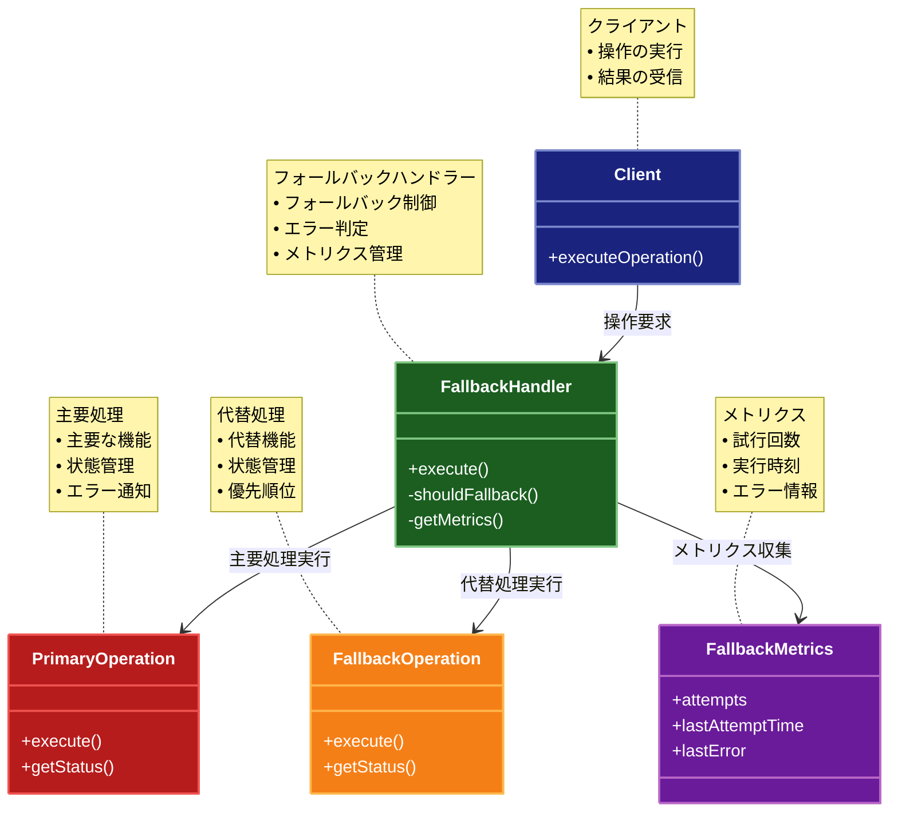

# Fallback（フォールバック）パターン

## 目的

主要な処理が失敗した場合に、代替の処理を実行することで、システムの可用性を維持するパターンです。

## 価値・解決する問題

- システムの可用性を向上させます
- 障害時の代替手段を提供します
- ユーザー体験を維持します
- 障害からの回復を容易にします
- サービスの継続性を確保します

## 概要・特徴

### 概要

Fallbackパターンは、主要な処理が失敗した場合に、代替の処理を実行する設計パターンです。これにより、システムの可用性を維持し、ユーザー体験を向上させます。

### 特徴

#### 代替処理の提供
フォールバックパターンの最も基本的な特徴は、主要な処理が失敗した場合に代替の処理経路を提供することです。これにより、システムの堅牢性と可用性が大幅に向上します。例えば、主要なデータベースが応答しない場合にキャッシュからデータを取得したり、外部APIが利用できない場合にローカルの静的データを使用したりすることができます。この代替処理は、結果の精度や鮮度が落ちることもありますが、完全な失敗よりもユーザーにとって良い体験を提供します。特に重要なのは、フォールバック処理をあらかじめ設計し、テストしておくことで、障害発生時に想定外の動作を防止できる点です。適切なフォールバックメカニズムを実装することで、一時的な障害がユーザー体験全体を損なうことを防ぎ、システムの信頼性を維持することができます。

#### 段階的なフォールバック
多くのフォールバック実装では、複数レベルの代替処理を段階的に試行することができます。これにより、より細かい粒度での回復戦略が可能になります。例えば、Webサービスでは、まず高速なキャッシュをチェックし、次にローカルデータベース、その後バックアップサーバー、最後に静的デフォルト値という順で試行することができます。このような階層化されたアプローチにより、最も状況に適した代替手段を順次試すことができ、可能な限り高品質のレスポンスを提供することができます。各フォールバックレベルはそれぞれ異なるトレードオフ（速度、一貫性、リソース使用量など）を持ち、システムの状態や要件に応じて最適な選択が可能になります。段階的なフォールバックは特に分散システムにおいて価値があり、ネットワーク分断などの部分的障害に対する回復力を高めます。

#### 優先順位付け
フォールバックパターンにおいて、代替処理には明確な優先順位が付けられます。通常、最も信頼性が高く、完全な機能を提供するオプションが最初に試行され、徐々に機能が限定されるオプションへと移行していきます。この優先順位付けはビジネス要件に基づいて行われ、重要な操作とそうでない操作を区別することが重要です。例えば、Eコマースサイトでは、商品の在庫確認よりも決済処理の方が高い優先順位を持ち、より堅牢なフォールバックメカニズムが実装されるべきです。また、優先順位は静的に固定されるだけでなく、システムの負荷やユーザーの重要度などの動的要因によって調整することも可能です。適切な優先順位付けにより、限られたリソースを最も重要な機能の維持に集中させることができ、障害時でも核となるビジネス機能を保護することができます。

#### 自動切り替え
フォールバックパターンの強力な特徴は、障害を検出して代替処理への切り替えを自動的に行う能力です。この自動化により、人間の介入なしに素早くエラーから回復することができ、ダウンタイムを最小限に抑えることができます。自動切り替えメカニズムは通常、タイムアウト、リトライ回数、エラー率などの閾値に基づいて実装され、一定の条件が満たされるとフォールバック処理が起動されます。また、主要なシステムが回復した際には、元の処理パスに自動的に戻すこともできます。このような自動化は特にクラウドネイティブアプリケーションやマイクロサービスアーキテクチャにおいて重要で、環境の変化に迅速に対応できるようになります。しかし、誤検知によって不必要にフォールバックが起動されないよう、適切な監視とアラートメカニズムも併せて実装することが重要です。

#### 柔軟な設定
効果的なフォールバックシステムでは、どのような状況でフォールバックを起動するか、どの代替処理を使用するかなどを柔軟に設定できることが重要です。この設定は、アプリケーションのコードを変更することなく、設定ファイルやダッシュボードを通じて変更できることが理想的です。例えば、タイムアウト値、リトライ回数、フォールバックの順序などをランタイムで調整できると、様々な障害シナリオに対応しやすくなります。また、A/Bテストのようにフォールバック戦略を段階的にロールアウトすることも可能になり、新しい戦略の効果を安全に検証できます。環境ごと（開発、テスト、本番など）に異なる設定を適用することも重要で、本番環境では保守的な設定を使用し、テスト環境ではより積極的にフォールバックをテストすることができます。このような柔軟性により、システムの運用チームは変化する要件や環境に迅速に対応することができます。

### 概要図



## 類似パターンとの比較

- [Circuit Breaker (サーキットブレーカー)](circuit-breaker.md): Fallback は代替処理による回復を行い、これに対して Circuit Breaker は障害検知による遮断を行います。
- [Retry (リトライ)](retry.md): Fallback は代替処理による回復を行い、これに対して Retry は再試行による回復を行います。
- [Bulkhead (バルクヘッド)](bulkhead.md): Fallback は代替処理による回復を行い、これに対して Bulkhead は分離による障害の局所化を行います。

## 利用されているライブラリ／フレームワークの事例

- [Resilience4j](https://resilience4j.readme.io/): Java用の障害耐性ライブラリ
- [Polly](https://github.com/App-vNext/Polly): .NET用の回復力パターンライブラリ
- [Hystrix](https://github.com/Netflix/Hystrix): Netflixの障害耐性ライブラリ

## 解説ページリンク

- [Microsoft Cloud Design Patterns: Circuit Breaker](https://docs.microsoft.com/en-us/azure/architecture/patterns/circuit-breaker)
- [Martin Fowler: Circuit Breaker](https://martinfowler.com/bliki/CircuitBreaker.html)
- [Implementing Fallback Pattern](https://docs.microsoft.com/en-us/azure/architecture/patterns/compensating-transaction)

## コード例

### Before:

フォールバック機能のない実装

```typescript
class UserService {
  private db: Map<string, any>;
  private networkFailureRate = 0.3; // 30%の確率でネットワークエラー

  constructor() {
    this.db = new Map([
      ["1", { id: "1", name: "John Doe", email: "john@example.com" }],
      ["2", { id: "2", name: "Jane Smith", email: "jane@example.com" }]
    ]);
  }

  async getUser(id: string): Promise<any> {
    // ネットワークエラーをシミュレート
    if (Math.random() < this.networkFailureRate) {
      throw new Error("Network error");
    }

    const user = this.db.get(id);
    if (!user) {
      throw new Error("User not found");
    }
    return user;
  }

  async updateUser(id: string, data: any): Promise<any> {
    // ネットワークエラーをシミュレート
    if (Math.random() < this.networkFailureRate) {
      throw new Error("Network error");
    }

    if (!this.db.has(id)) {
      throw new Error("User not found");
    }
    const updatedUser = { ...this.db.get(id), ...data };
    this.db.set(id, updatedUser);
    return updatedUser;
  }
}

// 使用例
async function example() {
  const service = new UserService();

  try {
    const user = await service.getUser("1");
    console.log("ユーザー取得:", user);

    const updatedUser = await service.updateUser("1", { name: "John Updated" });
    console.log("ユーザー更新:", updatedUser);
  } catch (error) {
    console.error("エラー:", error);
  }
}

example();
```

### After:

Fallbackパターンを適用した実装

```typescript
// フォールバックの設定
interface FallbackConfig {
  shouldFallback: (error: Error) => boolean; // フォールバックを実行するかどうかを判断
  maxFallbackAttempts: number;               // 最大フォールバック試行回数
}

// フォールバックの状態
interface FallbackMetrics {
  attempts: number;         // 試行回数
  lastAttemptTime: number; // 最後の試行時刻
  lastError?: Error;       // 最後のエラー
}

// フォールバックの実装
class Fallback {
  private metrics: FallbackMetrics;

  constructor(private config: FallbackConfig) {
    this.metrics = {
      attempts: 0,
      lastAttemptTime: 0
    };
  }

  // 処理を実行（必要に応じてフォールバック）
  async execute<T>(
    primary: () => Promise<T>,
    fallbacks: Array<() => Promise<T>>
  ): Promise<T> {
    this.metrics.attempts = 0;
    let lastError: Error | undefined;

    // まず主要な処理を試行
    try {
      return await primary();
    } catch (error) {
      if (error instanceof Error) {
        lastError = error;
        this.metrics.lastError = error;

        // フォールバックが必要かチェック
        if (!this.config.shouldFallback(error)) {
          throw error;
        }
      } else {
        throw error;
      }
    }

    // フォールバック処理を順番に試行
    for (const fallback of fallbacks) {
      if (this.metrics.attempts >= this.config.maxFallbackAttempts) {
        throw new Error(
          `最大フォールバック試行回数(${this.config.maxFallbackAttempts})に達しました: ${lastError?.message}`
        );
      }

      try {
        this.metrics.attempts++;
        this.metrics.lastAttemptTime = Date.now();
        console.log(`フォールバック試行 ${this.metrics.attempts}: ${lastError?.message}`);
        return await fallback();
      } catch (error) {
        if (error instanceof Error) {
          lastError = error;
          this.metrics.lastError = error;
        }
      }
    }

    // すべてのフォールバックが失敗した場合
    throw new Error(`すべてのフォールバックが失敗しました: ${lastError?.message}`);
  }

  // メトリクスを取得
  getMetrics(): FallbackMetrics {
    return { ...this.metrics };
  }
}

// ユーザーの型
interface User {
  id: string;
  name: string;
  email: string;
  updatedAt: number;
}

// データベースの実装
class Database {
  private db: Map<string, User>;
  private networkFailureRate = 0.3; // 30%の確率でネットワークエラー

  constructor() {
    this.db = new Map([
      ["1", {
        id: "1",
        name: "John Doe",
        email: "john@example.com",
        updatedAt: Date.now()
      }],
      ["2", {
        id: "2",
        name: "Jane Smith",
        email: "jane@example.com",
        updatedAt: Date.now()
      }]
    ]);
  }

  async read(id: string): Promise<User> {
    // ネットワークエラーをシミュレート
    if (Math.random() < this.networkFailureRate) {
      throw new Error("Network error");
    }

    // データベースアクセスを遅延させる
    await new Promise(resolve => setTimeout(resolve, 100));

    const user = this.db.get(id);
    if (!user) {
      throw new Error("User not found");
    }
    return user;
  }

  async write(id: string, user: User): Promise<void> {
    // ネットワークエラーをシミュレート
    if (Math.random() < this.networkFailureRate) {
      throw new Error("Network error");
    }

    // データベースアクセスを遅延させる
    await new Promise(resolve => setTimeout(resolve, 100));

    this.db.set(id, {
      ...user,
      updatedAt: Date.now()
    });
  }
}

// キャッシュの実装
class Cache {
  private cache: Map<string, { value: User; expiresAt: number }>;
  private ttl: number;

  constructor(ttl: number = 60 * 1000) { // デフォルトTTL: 1分
    this.cache = new Map();
    this.ttl = ttl;
  }

  get(key: string): User | undefined {
    const entry = this.cache.get(key);
    if (entry && Date.now() <= entry.expiresAt) {
      return entry.value;
    }
    return undefined;
  }

  set(key: string, value: User): void {
    this.cache.set(key, {
      value,
      expiresAt: Date.now() + this.ttl
    });
  }
}

// フォールバック機能を持つユーザーサービス
class FallbackUserService {
  private fallback: Fallback;
  private db: Database;
  private cache: Cache;

  constructor(config?: Partial<FallbackConfig>) {
    this.fallback = new Fallback({
      shouldFallback: (error: Error) => 
        error.message === "Network error" || error.message === "User not found",
      maxFallbackAttempts: 3,
      ...config
    });
    this.db = new Database();
    this.cache = new Cache();
  }

  // ユーザーを取得
  async getUser(id: string): Promise<User> {
    return await this.fallback.execute(
      // 主要な処理: データベースから取得
      async () => {
        const user = await this.db.read(id);
        // 成功したらキャッシュに保存
        this.cache.set(id, user);
        return user;
      },
      [
        // フォールバック1: キャッシュから取得
        async () => {
          const cachedUser = this.cache.get(id);
          if (cachedUser) {
            console.log("キャッシュからユーザーを取得");
            return cachedUser;
          }
          throw new Error("Cache miss");
        },
        // フォールバック2: デフォルトユーザーを返す
        async () => {
          console.log("デフォルトユーザーを返す");
          return {
            id,
            name: "Anonymous User",
            email: "anonymous@example.com",
            updatedAt: Date.now()
          };
        }
      ]
    );
  }

  // ユーザーを更新
  async updateUser(id: string, data: Partial<User>): Promise<User> {
    return await this.fallback.execute(
      // 主要な処理: データベースを更新
      async () => {
        const currentUser = await this.db.read(id);
        const updatedUser: User = {
          ...currentUser,
          ...data,
          id, // IDは変更不可
          updatedAt: Date.now()
        };
        await this.db.write(id, updatedUser);
        // 成功したらキャッシュも更新
        this.cache.set(id, updatedUser);
        return updatedUser;
      },
      [
        // フォールバック1: キャッシュのみ更新
        async () => {
          const cachedUser = this.cache.get(id);
          if (cachedUser) {
            console.log("キャッシュのみ更新（オフライン操作）");
            const updatedUser: User = {
              ...cachedUser,
              ...data,
              id, // IDは変更不可
              updatedAt: Date.now()
            };
            this.cache.set(id, updatedUser);
            return updatedUser;
          }
          throw new Error("Cache miss");
        },
        // フォールバック2: 更新をキューに入れる（実際の実装では永続化が必要）
        async () => {
          console.log("更新をキューに追加（後で同期）");
          const baseUser = await this.getUser(id);
          const updatedUser: User = {
            ...baseUser,
            ...data,
            id, // IDは変更不可
            updatedAt: Date.now()
          };
          // ここで更新をキューに追加する処理を実装
          return updatedUser;
        }
      ]
    );
  }

  // メトリクスを取得
  getMetrics(): FallbackMetrics {
    return this.fallback.getMetrics();
  }
}

// 使用例
async function example() {
  const service = new FallbackUserService({
    maxFallbackAttempts: 2
  });

  try {
    console.log("=== 1回目のユーザー取得（データベースアクセス） ===");
    const user1 = await service.getUser("1");
    console.log("ユーザー:", user1);
    console.log("メトリクス:", service.getMetrics());

    console.log("\n=== ユーザー更新（データベースアクセス） ===");
    const updatedUser = await service.updateUser("1", {
      name: "John Updated"
    });
    console.log("更新後のユーザー:", updatedUser);
    console.log("メトリクス:", service.getMetrics());

    console.log("\n=== 2回目のユーザー取得（キャッシュまたはデフォルト） ===");
    const user2 = await service.getUser("1");
    console.log("ユーザー:", user2);
    console.log("メトリクス:", service.getMetrics());

    console.log("\n=== 存在しないユーザーの取得（デフォルトにフォールバック） ===");
    const user3 = await service.getUser("999");
    console.log("ユーザー:", user3);
    console.log("メトリクス:", service.getMetrics());

  } catch (error) {
    console.error("エラー:", error);
    console.log("最終メトリクス:", service.getMetrics());
  }
}

// 実行
example();
```
