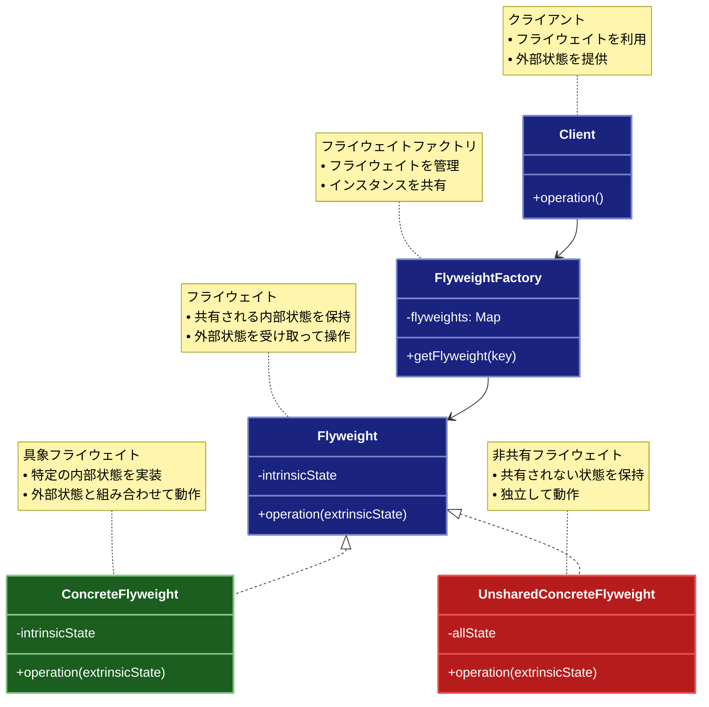

# Flyweight（フライウェイト）パターン

## 目的

多数のオブジェクトを効率的に扱うために、共通のデータを共有することで、メモリ使用量を削減するパターンです。

## 価値・解決する問題

- メモリ使用量を削減します
- オブジェクトの生成コストを削減します
- パフォーマンスを向上させます
- リソースの効率的な利用を実現します
- 大量のオブジェクトを扱う際のスケーラビリティを向上させます

## 概要・特徴

### 概要

Flyweightパターンは、多数のオブジェクトを扱う際に、それらの間で共通するデータを共有することで、メモリ使用量を最小限に抑える設計パターンです。このパターンでは、オブジェクトの状態を「内部状態」（共有可能）と「外部状態」（コンテキスト依存）に分離し、内部状態を持つオブジェクトを共有して再利用します。特に、テキストエディタでの文字表現、グラフィックシステムでの描画要素、ゲーム開発での環境オブジェクトなど、同様のオブジェクトが大量に必要とされる場面で効果を発揮します。

### 特徴

#### 状態の分離

オブジェクトの状態を「内部状態」と「外部状態」に明確に分離します。内部状態は複数のオブジェクト間で共有可能であり、変更されない情報（イミュータブル）です。一方、外部状態はオブジェクトごとに異なり、コンテキストに依存する情報です。例えば、テキストエディタでは、フォントの種類やサイズなどが内部状態、文字の位置や選択状態などが外部状態となります。この分離により、共通部分を効率的に共有し、メモリ使用量を大幅に削減できます。

#### 共有インスタンスの管理

フライウェイトファクトリを使用して、共有オブジェクト（フライウェイト）のインスタンスを一元管理します。ファクトリは、要求されたフライウェイトがすでに存在するかをチェックし、存在する場合は既存のインスタンスを返し、存在しない場合は新しいインスタンスを作成して保存します。これにより、同じ内部状態を持つオブジェクトが複数回作成されることを防ぎ、効率的なリソース管理が可能になります。例えば、ゲーム開発では、同じテクスチャや3Dモデルを持つ環境オブジェクトを複数回生成せず、共有インスタンスを参照することでメモリを節約できます。

#### メモリ効率の最適化

大量のオブジェクトを扱う際のメモリ使用量を劇的に削減します。特に、多くのオブジェクトが類似した特性を共有している場合に効果的です。例えば、ドキュメントエディタでは、同じフォントと書式を持つ何千もの文字に対して、それぞれ個別のオブジェクトを作成するのではなく、共通属性を持つフライウェイトオブジェクトを共有することで、メモリ使用量を数桁削減できる場合があります。また、キャッシュの効率も向上し、システム全体のパフォーマンスが改善されます。

#### 生成コストの削減

オブジェクトの生成コストを大幅に削減します。特に、初期化が複雑であったり、外部リソースを読み込んだりする必要があるオブジェクトの場合、生成コストが高くなりがちです。フライウェイトパターンを使用すると、こうしたコストのかかるオブジェクトを一度だけ生成し、それを必要なだけ再利用できます。例えば、3Dグラフィックスでは、複雑なテクスチャや高解像度のモデルの読み込みが一度で済むため、パフォーマンスが向上します。

#### スケーラビリティの向上

システムのスケーラビリティを向上させます。メモリ使用量が削減されるため、同じハードウェアリソースでより多くのオブジェクトを処理できるようになります。これは、モバイルデバイスやリソースが制限された環境で特に重要です。例えば、オンラインゲームでは、数千の同時接続ユーザーやゲーム内オブジェクトを効率的に管理するために、フライウェイトパターンが使用されることがあります。この最適化により、システムは成長に合わせてスケールしやすくなり、パフォーマンスのボトルネックが軽減されます。

### 概要図



## 類似パターンとの比較

- [Singleton (シングルトン)](singleton.md): Flyweight は共通データを共有し、これに対して Singleton はインスタンスを1つに制限します。
- [Object Pool (オブジェクトプール)](object-pool.md): Flyweight はデータを共有し、これに対して Object Pool はオブジェクトを再利用します。
- [Prototype (プロトタイプ)](prototype.md): Flyweight は共通データを共有し、これに対して Prototype はオブジェクトのクローンを作成します。

## 利用されているライブラリ／フレームワークの事例

- [React](https://github.com/facebook/react): 仮想DOMの実装
- [String Pool](https://docs.oracle.com/javase/8/docs/api/java/lang/String.html): Java文字列プール
- [Unity](https://github.com/Unity-Technologies/UnityCsReference): ゲームオブジェクトプール

## 解説ページリンク

- [Refactoring Guru - Flyweight](https://refactoring.guru/design-patterns/flyweight)
- [Microsoft - Flyweight Pattern](https://docs.microsoft.com/en-us/previous-versions/msp-n-p/ee658117(v=pandp.10))
- [SourceMaking - Flyweight](https://sourcemaking.com/design_patterns/flyweight)

## コード例

下記のコード例はテキストエディタの例で、同じフォーマットを持つ文字を効率よく管理する方法を示しています。

### Before:

共有可能なデータを共有せずに実装したアプローチです。このコードではすべての文字に対して個別のオブジェクトを作成し、それぞれが重複するデータ（フォント、サイズ、色）を保持しています。

```typescript
// テキストフォーマッタの実装
class TextCharacter {
  constructor(
    private char: string,
    private font: string,
    private size: number,
    private color: string,
    private position: { x: number; y: number }
  ) {}

  render(): void {
    console.log(
      `文字 '${this.char}' を描画: ` +
      `フォント=${this.font}, ` +
      `サイズ=${this.size}, ` +
      `色=${this.color}, ` +
      `位置=(${this.position.x}, ${this.position.y})`
    );
  }
}

// テキストエディタの実装
class TextEditor {
  private characters: TextCharacter[] = [];

  addCharacter(
    char: string,
    font: string,
    size: number,
    color: string,
    position: { x: number; y: number }
  ): void {
    const character = new TextCharacter(char, font, size, color, position);
    this.characters.push(character);
  }

  render(): void {
    this.characters.forEach(char => char.render());
  }
}

// 使用例
function example() {
  const editor = new TextEditor();

  // 大量のテキストを追加
  const text = "Hello, World! This is a test of the Flyweight pattern.";
  let x = 0;
  let y = 0;

  for (const char of text) {
    if (char === " ") {
      x += 10;
      continue;
    }
    if (char === "\n") {
      x = 0;
      y += 20;
      continue;
    }

    editor.addCharacter(
      char,
      "Arial",
      12,
      "black",
      { x: x, y: y }
    );
    x += 10;
  }

  // メモリ使用量を表示
  console.log(`作成された文字オブジェクト数: ${text.replace(/[\s\n]/g, "").length}`);

  // テキストを描画
  editor.render();
}

example();
```

### After:

Flyweightパターンを関数型プログラミングスタイルで適用した実装です。このアプローチでは以下の改善点があります：

1. **内部状態と外部状態の分離**：文字のスタイル情報（フォント、サイズ、色）を内部状態として共有し、位置情報を外部状態として個別に管理しています。

2. **フライウェイトファクトリ**：キャッシュを使用して同一の文字スタイルを共有するフライウェイトオブジェクトを効率的に管理します。

3. **イミュータブルなデータ構造**：すべてのオブジェクトを不変（Readonly）にすることで、状態の管理をより確実にしています。

4. **メモリ使用量の削減**：同じスタイルを持つ文字は同じフライウェイトオブジェクトを参照するため、メモリ使用量が大幅に削減されます。

5. **スタイルプリセット**：頻繁に使用されるスタイルを定数として定義し、コード全体で一貫して使用しています。

コード例の実行結果では、作成された文字の数と実際に作成されたフライウェイトオブジェクトの数を比較することで、メモリ使用量の削減効率を確認できます。

```typescript
// 文字スタイル（内部状態）の型定義
type CharacterStyle = Readonly<{
  font: string
  size: number
  color: string
}>

// フライウェイトオブジェクトの型定義
type CharacterFlyweight = Readonly<{
  char: string
  style: CharacterStyle
  render: (position: Readonly<Position>) => void
}>

// 位置の型定義
type Position = Readonly<{
  x: number
  y: number
}>

// 文字コンテキスト（外部状態）の型定義
type CharacterContext = Readonly<{
  flyweight: CharacterFlyweight
  position: Position
  render: () => void
}>

// フライウェイトファクトリの状態型
type FlyweightFactoryState = Readonly<{
  flyweights: ReadonlyMap<string, CharacterFlyweight>
  createdCount: number
}>

// フライウェイトファクトリの型定義
type CharacterFlyweightFactory = Readonly<{
  getFlyweight: (char: string, style: CharacterStyle) => CharacterFlyweight
  getState: () => FlyweightFactoryState
}>

// テキストエディタの状態型
type EditorState = Readonly<{
  characters: ReadonlyArray<CharacterContext>
  factory: CharacterFlyweightFactory
}>

// テキストエディタの型定義
type TextEditor = Readonly<{
  addCharacter: (char: string, style: CharacterStyle, position: Position) => TextEditor
  render: () => void
  getStats: () => void
  getState: () => EditorState
}>

// スタイルプリセット
const STYLE_PRESETS = Object.freeze({
  DEFAULT: Object.freeze({
    font: 'Arial',
    size: 12,
    color: 'black'
  }),
  
  HEADING: Object.freeze({
    font: 'Arial Bold',
    size: 16,
    color: 'navy'
  }),
  
  EMPHASIS: Object.freeze({
    font: 'Arial Italic',
    size: 12,
    color: 'darkred'
  }),
  
  CODE: Object.freeze({
    font: 'Courier New',
    size: 12,
    color: 'darkgreen'
  })
})

// フライウェイトを作成する関数
const createCharacterFlyweight = (
  char: string,
  style: CharacterStyle
): CharacterFlyweight => ({
  char,
  style,
  render: (position: Position): void => {
    console.log(
      `文字 '${char}' を描画: ` +
      `フォント=${style.font}, ` +
      `サイズ=${style.size}, ` +
      `色=${style.color}, ` +
      `位置=(${position.x}, ${position.y})`
    )
  }
})

// 文字コンテキストを作成する関数
const createCharacterContext = (
  flyweight: CharacterFlyweight,
  position: Position
): CharacterContext => ({
  flyweight,
  position,
  render: (): void => {
    flyweight.render(position)
  }
})

// キャッシュキーを生成する純粋関数
const createCacheKey = (char: string, style: CharacterStyle): string => 
  `${char}-${style.font}-${style.size}-${style.color}`

// フライウェイトファクトリを作成する関数
const createCharacterFlyweightFactory = (): CharacterFlyweightFactory => {
  // クロージャでプライベート状態を保持
  let state: FlyweightFactoryState = {
    flyweights: new Map<string, CharacterFlyweight>(),
    createdCount: 0
  }

  return {
    getFlyweight: (char: string, style: CharacterStyle): CharacterFlyweight => {
      const key = createCacheKey(char, style)
      
      // キャッシュされたフライウェイトを返すか、新しく作成
      if (!state.flyweights.has(key)) {
        // 新しいフライウェイトの作成（イミュータブル）
        const newFlyweight = createCharacterFlyweight(char, style)
        
        // 状態更新（イミュータブル）
        state = {
          flyweights: new Map([...state.flyweights, [key, newFlyweight]]),
          createdCount: state.createdCount + 1
        }
      }
      
      return state.flyweights.get(key)!
    },
    
    getState: (): FlyweightFactoryState => state
  }
}

// テキストエディタを作成する関数
const createTextEditor = (): TextEditor => {
  // クロージャで状態を保持
  let state: EditorState = {
    characters: [],
    factory: createCharacterFlyweightFactory()
  }
  
  return {
    addCharacter: (char: string, style: CharacterStyle, position: Position): TextEditor => {
      const flyweight = state.factory.getFlyweight(char, style)
      const context = createCharacterContext(flyweight, position)
      
      // 状態更新（イミュータブル）
      state = {
        ...state,
        characters: [...state.characters, context]
      }
      
      return createTextEditorWithState(state)
    },
    
    render: (): void => {
      console.log('=== テキストの描画 ===')
      state.characters.forEach(char => char.render())
    },
    
    getStats: (): void => {
      const factoryState = state.factory.getState()
      const charCount = state.characters.length
      const flyweightCount = factoryState.createdCount
      
      console.log('\n=== テキストエディタの統計 ===')
      console.log(`作成された文字コンテキスト数: ${charCount}`)
      console.log(`作成されたフライウェイト数: ${flyweightCount}`)
      console.log(`キャッシュされているフライウェイト数: ${factoryState.flyweights.size}`)
      
      if (charCount > 0) {
        const reductionRate = Math.round((1 - flyweightCount / charCount) * 100)
        console.log(`メモリ削減率: ${reductionRate}%`)
      }
    },
    
    getState: (): EditorState => state
  }
}

// 既存の状態からテキストエディタを作成するヘルパー関数
const createTextEditorWithState = (state: EditorState): TextEditor => {
  const editor = createTextEditor()
  return {
    ...editor,
    getState: () => state
  }
}

// テキストを追加するヘルパー関数
const addText = (
  editor: TextEditor, 
  text: string, 
  style: CharacterStyle, 
  initialX: number,
  initialY: number,
  spaceWidth: number,
  lineHeight: number
): TextEditor => {
  let x = initialX
  let y = initialY
  let result = editor
  
  // テキストの文字を1つずつ処理
  for (const char of text) {
    if (char === ' ') {
      x += spaceWidth
      continue
    }
    if (char === '\n') {
      x = initialX
      y += lineHeight
      continue
    }
    
    // 文字を追加（イミュータブル操作）
    result = result.addCharacter(char, style, { x, y })
    x += spaceWidth
  }
  
  return result
}

// 使用例
const example = (): void => {
  // 初期エディタの作成
  let editor = createTextEditor()
  
  // 見出しテキストの追加（イミュータブル）
  editor = addText(
    editor,
    'Flyweight Pattern Example\n',
    STYLE_PRESETS.HEADING,
    0, 0,
    12, 24
  )
  
  // 通常テキストの追加（イミュータブル）
  editor = addText(
    editor,
    'This is a demonstration of the Flyweight pattern.\n',
    STYLE_PRESETS.DEFAULT,
    0, 24,
    10, 20
  )
  
  // コードサンプルの追加（イミュータブル）
  editor = addText(
    editor,
    'const flyweight = factory.getFlyweight(char, style);\n',
    STYLE_PRESETS.CODE,
    0, 44,
    10, 20
  )
  
  // 強調テキストの追加（イミュータブル）
  editor = addText(
    editor,
    'Memory usage is significantly reduced!\n',
    STYLE_PRESETS.EMPHASIS,
    0, 64,
    10, 20
  )
  
  // テキストを描画（副作用）
  editor.render()
  
  // 統計情報を表示（副作用）
  editor.getStats()
}

// 実行
example()
```

この例でわかるように、Flyweightパターンを適用することで、大量の類似オブジェクトを効率的に管理し、メモリ使用量を劇的に削減できます。特に同じスタイルの文字が多数ある場合、重複する内部状態を共有することで、システム全体のパフォーマンスとスケーラビリティが向上します。