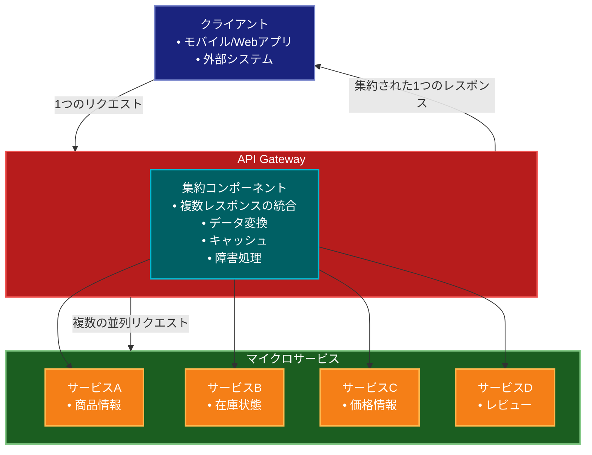

# Gateway Aggregation（ゲートウェイ集約）パターン

## 目的

複数のマイクロサービスからのデータを集約し、クライアントに単一のレスポンスとして提供することで、ネットワーク通信を最適化し、クライアントの実装を簡素化します。

## 価値・解決する問題

- ネットワーク通信の削減
- クライアント側の実装の簡素化
- バックエンドサービスの複雑性の隠蔽
- レイテンシの削減
- バックエンドサービスの独立性維持
- クライアントとサービス間の結合度の低減

## 概要・特徴

### 概要

Gateway Aggregationパターンは、複数のマイクロサービスからのレスポンスを集約し、単一のレスポンスとしてクライアントに返す設計パターンです。これにより、クライアントのネットワーク呼び出し回数を減らし、レイテンシを削減しながらバックエンドサービスの分離を維持します。

### 特徴

- 集約レイヤー
- 並列リクエスト
- フォーマット変換
- キャッシュ機能
- 部分的な障害の処理
- クロスカッティングコンサーン

### 概要図



## コード例

### Before:

```typescript
// クライアントが複数のサービスと直接通信
class ProductDetailsPage {
  async loadProductDetails(productId: string) {
    try {
      // 製品基本情報の取得
      const productResponse = await fetch(
        `http://product-service/products/${productId}`
      );
      const product = await productResponse.json();

      // 在庫情報の取得
      const inventoryResponse = await fetch(
        `http://inventory-service/stock/${productId}`
      );
      const inventory = await inventoryResponse.json();

      // レビュー情報の取得
      const reviewsResponse = await fetch(
        `http://review-service/reviews?productId=${productId}`
      );
      const reviews = await reviewsResponse.json();

      // 価格情報の取得
      const priceResponse = await fetch(
        `http://pricing-service/prices/${productId}`
      );
      const pricing = await priceResponse.json();

      // 推奨商品の取得
      const recommendationsResponse = await fetch(
        `http://recommendation-service/recommendations/${productId}`
      );
      const recommendations = await recommendationsResponse.json();

      // クライアント側でデータを組み合わせて表示
      this.displayProduct({
        ...product,
        stock: inventory.quantity,
        reviews: reviews.items,
        rating: this.calculateAverageRating(reviews.items),
        price: pricing.currentPrice,
        discount: pricing.discount,
        recommendations: recommendations.items
      });
    } catch (error) {
      console.error('Failed to load product details:', error);
      this.showError('製品情報の取得に失敗しました');
    }
  }
}
```

### After:

```typescript
// APIゲートウェイでの集約実装
@Controller('products')
class ProductAggregationController {
  constructor(
    private readonly productClient: ProductServiceClient,
    private readonly inventoryClient: InventoryServiceClient,
    private readonly reviewClient: ReviewServiceClient,
    private readonly pricingClient: PricingServiceClient,
    private readonly recommendationClient: RecommendationServiceClient,
    private readonly cacheManager: CacheManager
  ) {}

  @Get(':id/details')
  async getProductDetails(@Param('id') productId: string) {
    // キャッシュチェック
    const cacheKey = `product-details:${productId}`;
    const cachedData = await this.cacheManager.get(cacheKey);
    if (cachedData) {
      return cachedData;
    }

    try {
      // 並列でサービスを呼び出し
      const [product, inventory, reviews, pricing, recommendations] = await Promise.all([
        this.productClient.getProduct(productId),
        this.inventoryClient.getStock(productId),
        this.reviewClient.getReviews(productId),
        this.pricingClient.getPrice(productId),
        this.recommendationClient.getRecommendations(productId)
      ]);

      // レスポンスの組み立て
      const response = {
        id: product.id,
        name: product.name,
        description: product.description,
        category: product.category,
        brand: product.brand,
        stock: {
          available: inventory.quantity > 0,
          quantity: inventory.quantity,
          nextRestockDate: inventory.nextRestockDate
        },
        reviews: {
          items: reviews.items.map(review => ({
            rating: review.rating,
            comment: review.comment,
            author: review.userName,
            date: review.createdAt
          })),
          averageRating: this.calculateAverageRating(reviews.items),
          totalCount: reviews.totalCount
        },
        pricing: {
          currentPrice: pricing.currentPrice,
          originalPrice: pricing.originalPrice,
          discount: pricing.discount,
          discountPercentage: this.calculateDiscountPercentage(
            pricing.originalPrice,
            pricing.currentPrice
          ),
          currency: pricing.currency
        },
        recommendations: recommendations.items.map(item => ({
          id: item.id,
          name: item.name,
          thumbnail: item.imageUrl,
          price: item.price
        }))
      };

      // キャッシュの更新
      await this.cacheManager.set(cacheKey, response, {ttl: 300}); // 5分間キャッシュ

      return response;
    } catch (error) {
      // エラーハンドリングと部分的な応答
      return this.handleAggregationError(error, productId);
    }
  }

  private calculateAverageRating(reviews: Review[]): number {
    if (reviews.length === 0) return 0;
    const sum = reviews.reduce((acc, review) => acc + review.rating, 0);
    return Math.round((sum / reviews.length) * 10) / 10;
  }

  private calculateDiscountPercentage(original: number, current: number): number {
    if (original <= 0) return 0;
    return Math.round(((original - current) / original) * 100);
  }

  private async handleAggregationError(error: any, productId: string) {
    // エラーログの記録
    this.logger.error('Product aggregation failed', {
      productId,
      error: error.message,
      stack: error.stack
    });

    // サービスごとのフォールバック処理
    try {
      // 最低限必要な製品情報のみ取得
      const product = await this.productClient.getProduct(productId);
      
      return {
        id: product.id,
        name: product.name,
        description: product.description,
        error: {
          message: '一部の製品情報を取得できませんでした',
          details: this.getErrorDetails(error)
        }
      };
    } catch (criticalError) {
      throw new ServiceUnavailableException('製品情報を取得できません');
    }
  }

  private getErrorDetails(error: any): string[] {
    const details = [];
    if (error.services) {
      for (const [service, status] of Object.entries(error.services)) {
        if (status === 'failed') {
          details.push(`${service}の情報を取得できませんでした`);
        }
      }
    }
    return details;
  }
}

// サービスクライアントの実装例
class ProductServiceClient {
  constructor(
    private readonly httpClient: HttpClient,
    private readonly circuitBreaker: CircuitBreaker
  ) {}

  async getProduct(id: string): Promise<Product> {
    return this.circuitBreaker.execute(() =>
      this.httpClient.get(`http://product-service/products/${id}`)
    );
  }
}

// クライアントでの使用例
class ProductDetailsPage {
  async loadProductDetails(productId: string) {
    try {
      // 単一のAPIコールで全データを取得
      const response = await fetch(`/api/products/${productId}/details`);
      const data = await response.json();

      // 集約されたデータを直接使用
      this.displayProduct(data);
    } catch (error) {
      console.error('Failed to load product details:', error);
      this.showError(error.message || '製品情報の取得に失敗しました');
    }
  }
}

// モバイルクライアントでの使用例
class ProductDetailsScreen {
  async loadProductDetails(productId: string) {
    try {
      // 同じエンドポイントを使用
      const response = await fetch(`/api/products/${productId}/details`);
      const data = await response.json();

      // デバイスに応じた表示の最適化
      this.displayProduct({
        name: data.name,
        description: data.description,
        price: this.formatPrice(data.pricing),
        stock: this.formatStockStatus(data.stock),
        rating: data.reviews.averageRating,
        recommendations: data.recommendations.slice(0, 3) // 上位3件のみ表示
      });
    } catch (error) {
      this.showError('製品情報を読み込めません');
    }
  }
}

## 類似パターンとの比較

- [API Gateway（APIゲートウェイ）](gateway.md): Gateway Aggregationはデータの集約に特化し、API Gatewayはルーティングや認証など、より広範な機能を提供します。
- [Backends for Frontends（BFF）](bff.md): Gateway Aggregationは汎用的なデータ集約を行い、BFFは特定のクライアントに最適化されたAPIを提供します。
- [Facade（ファサード）](facade.md): Gateway Aggregationはマイクロサービス間のデータ集約に焦点を当て、Facadeはサブシステムの複雑性を隠蔽します。

## 利用されているライブラリ／フレームワークの事例

- [Apollo Federation](https://github.com/apollographql/federation): GraphQLを使用したサービス集約の実装
- [Spring Cloud Gateway](https://github.com/spring-cloud/spring-cloud-gateway): ゲートウェイ集約機能を提供
- [Kong Gateway](https://github.com/Kong/kong): プラグインを通じたAPIの集約機能を提供 

## 解説ページリンク

- [Microsoft - Gateway Aggregation pattern](https://learn.microsoft.com/ja-jp/azure/architecture/patterns/gateway-aggregation)  
  - クラウドアプリケーションにおけるゲートウェイ集約パターンの実装方法と、具体的なユースケースを詳しく解説しています。

- [Microservices.io - API Gateway pattern](https://microservices.io/patterns/apigateway.html)  
  - マイクロサービスアーキテクチャにおけるゲートウェイ集約の重要性と、実装のベストプラクティスを提供しています。

- [Kong - API Gateway Patterns](https://konghq.com/learning-center/api-gateway/patterns)  
  - API Gateway製品での実装例を交えながら、ゲートウェイ集約パターンの実践的な適用方法を解説しています。

- [AWS - API Gateway](https://aws.amazon.com/jp/api-gateway/patterns/)  
  - クラウド環境でのゲートウェイ集約パターンの実装例と、AWSサービスを使用した具体的な実現方法を提供しています。 