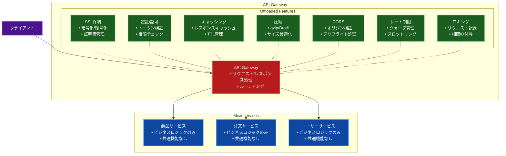

# Gateway Offloading（ゲートウェイオフローディング）パターン

## 目的

共通機能（SSL終端、認証、キャッシュ、圧縮、CORS、レート制限など）をAPIゲートウェイに委譲することで、マイクロサービスの実装を簡素化し、一貫した機能提供を実現します。

## 価値・解決する問題

- 共通機能の重複実装の防止
- セキュリティ機能の一元管理
- パフォーマンスの最適化
- マイクロサービスの実装の簡素化
- 運用管理の効率化
- リソース利用の最適化

## 概要・特徴

### 概要

Gateway Offloading パターンは、共通のクロスカッティングコンサーン（認証、CORS、SSL終端、キャッシュなど）をマイクロサービスから切り離し、APIゲートウェイに委譲するアーキテクチャパターンです。これにより、各マイクロサービスはビジネスロジックに集中できるようになります。

### 特徴

- 横断的関心事の一元管理: セキュリティ、認証、監視、ロギング、キャッシュなどの共通機能をゲートウェイに集約することで、これらの機能の実装と管理を一箇所で行うことができます。これにより、機能の重複実装を防ぎ、一貫したポリシーの適用が可能になります。また、セキュリティパッチやポリシー変更が必要な場合も、ゲートウェイのみを更新すれば済むため、保守性が向上します。

- マイクロサービスの実装簡素化: 各マイクロサービスはビジネスロジックの実装に集中でき、共通機能について考慮する必要がなくなります。これにより、開発者はドメイン特有の問題に焦点を当てることができ、開発速度と品質が向上します。また、サービスのコードベースがシンプルになることで、新しい開発者のオンボーディングも容易になります。

- 統一されたセキュリティポリシーの適用: 認証、認可、暗号化などのセキュリティ機能をゲートウェイレベルで一元管理することで、一貫したセキュリティポリシーをすべてのサービスに適用できます。これにより、セキュリティの脆弱性や設定ミスのリスクが減少し、システム全体のセキュリティレベルが向上します。

- 監視とロギングの集中化: すべてのトラフィックがゲートウェイを通過するため、システム全体の監視とロギングを一元的に実施できます。これにより、リクエストのトレーシング、エラー検出、パフォーマンス分析が容易になり、問題の迅速な特定と解決が可能になります。また、一元化されたログは、規制遵守やセキュリティ監査においても価値があります。

- スケーラビリティの向上: ゲートウェイは特定の機能（SSL終端、キャッシュなど）を処理するため、バックエンドサービスはこれらの処理負荷から解放されます。これにより、バックエンドサービスは自身のビジネスロジック処理に集中でき、リソースを効率的に使用できます。また、ゲートウェイとバックエンドサービスを独立してスケールできるため、柔軟なリソース割り当てが可能になります。

- パフォーマンス最適化: ゲートウェイでキャッシュ、圧縮、コンテンツ最適化などを実施することで、システム全体のパフォーマンスを向上させることができます。特に、キャッシュを活用することでバックエンドサービスへのリクエスト数を減らし、レスポンス時間を短縮できます。また、クライアントの地理的位置に基づいたルーティングやCDN統合も可能になり、グローバルなユーザー体験を向上させることができます。

### 概要図



## コード例

### Before:

```typescript
// 各マイクロサービスで共通機能を個別に実装
class ProductService {
  private readonly cache: Map<string, CacheEntry> = new Map();
  private readonly rateLimiter: RateLimiter;
  private readonly compressionMiddleware: CompressionMiddleware;
  private readonly corsMiddleware: CorsMiddleware;
  private readonly authMiddleware: AuthMiddleware;

  constructor() {
    this.rateLimiter = new RateLimiter({
      windowMs: 15 * 60 * 1000,
      max: 100
    });
    this.compressionMiddleware = new CompressionMiddleware();
    this.corsMiddleware = new CorsMiddleware({
      origin: ['https://example.com'],
      methods: ['GET', 'POST', 'PUT', 'DELETE'],
      allowedHeaders: ['Content-Type', 'Authorization']
    });
    this.authMiddleware = new AuthMiddleware({
      secret: process.env.JWT_SECRET
    });
  }

  @Route('GET', '/products/:id')
  async getProduct(req: Request, res: Response) {
    try {
      // CORS処理
      await this.corsMiddleware.handle(req, res);

      // レート制限のチェック
      await this.rateLimiter.checkRateLimit(req.ip);

      // 認証
      const user = await this.authMiddleware.authenticate(req);

      // キャッシュチェック
      const cacheKey = `product:${req.params.id}`;
      const cachedProduct = this.cache.get(cacheKey);
      if (cachedProduct && !this.isCacheExpired(cachedProduct)) {
        return this.compressionMiddleware.compress(res, cachedProduct.data);
      }

      // データベースからの取得
      const product = await this.productRepository.findById(req.params.id);
      if (!product) {
        return res.status(404).json({ error: 'Product not found' });
      }

      // キャッシュの更新
      this.cache.set(cacheKey, {
        data: product,
        timestamp: Date.now()
      });

      // レスポンスの圧縮と送信
      return this.compressionMiddleware.compress(res, product);
    } catch (error) {
      console.error('Error in getProduct:', error);
      return res.status(500).json({ error: 'Internal server error' });
    }
  }

  private isCacheExpired(entry: CacheEntry): boolean {
    return Date.now() - entry.timestamp > 5 * 60 * 1000; // 5分
  }
}

// 他のマイクロサービスでも同様の実装が必要
class OrderService {
  private readonly cache: Map<string, CacheEntry> = new Map();
  private readonly rateLimiter: RateLimiter;
  // ... 同様の共通機能の実装

  @Route('POST', '/orders')
  async createOrder(req: Request, res: Response) {
    // ... 同様の共通機能の処理
  }
}

class UserService {
  private readonly cache: Map<string, CacheEntry> = new Map();
  private readonly rateLimiter: RateLimiter;
  // ... 同様の共通機能の実装

  @Route('GET', '/users/:id')
  async getUser(req: Request, res: Response) {
    // ... 同様の共通機能の処理
  }
}
```

### After:

```typescript
// APIゲートウェイでの共通機能の実装
@Injectable()
class ApiGateway {
  constructor(
    private readonly cacheManager: CacheManager,
    private readonly rateLimiter: RateLimiter,
    private readonly authService: AuthenticationService,
    private readonly compressionService: CompressionService,
    private readonly corsService: CorsService,
    private readonly metricsService: MetricsService,
    private readonly logger: Logger
  ) {}

  @Middleware()
  async handleRequest(req: Request, res: Response, next: NextFunction) {
    const startTime = Date.now();
    const correlationId = uuid();

    try {
      // CORSの処理
      await this.corsService.handle(req, res);

      // レート制限のチェック
      await this.rateLimiter.checkLimit(req.ip);

      // 認証処理
      const authResult = await this.handleAuthentication(req);

      // キャッシュチェック
      const cachedResponse = await this.checkCache(req);
      if (cachedResponse) {
        return this.sendResponse(res, cachedResponse, correlationId);
      }

      // バックエンドサービスへのリクエスト
      const response = await this.forwardRequest(req, authResult);

      // キャッシュの更新
      await this.updateCache(req, response);

      // レスポンスの送信
      await this.sendResponse(res, response, correlationId);

      // メトリクスの記録
      this.metricsService.recordRequestMetrics({
        path: req.path,
        method: req.method,
        duration: Date.now() - startTime,
        status: response.status
      });
    } catch (error) {
      this.handleError(error, res, correlationId);
    } finally {
      this.logger.info('Request processed', {
        correlationId,
        path: req.path,
        method: req.method,
        duration: Date.now() - startTime
      });
    }
  }

  private async handleAuthentication(req: Request): Promise<AuthResult> {
    const token = this.extractToken(req);
    return this.authService.validateToken(token);
  }

  private async checkCache(req: Request): Promise<any> {
    if (!this.isCacheable(req.method)) {
      return null;
    }

    const cacheKey = this.generateCacheKey(req);
    return this.cacheManager.get(cacheKey);
  }

  private async updateCache(req: Request, response: any): Promise<void> {
    if (!this.isCacheable(req.method)) {
      return;
    }

    const cacheKey = this.generateCacheKey(req);
    await this.cacheManager.set(cacheKey, response, {
      ttl: this.getCacheTTL(req.path)
    });
  }

  private async sendResponse(
    res: Response,
    data: any,
    correlationId: string
  ): Promise<void> {
    // レスポンスヘッダーの設定
    res.setHeader('X-Correlation-ID', correlationId);
    res.setHeader('X-Response-Time', Date.now().toString());

    // 圧縮処理
    const compressed = await this.compressionService.compress(data);
    
    // レスポンスの送信
    res.status(data.status || 200).send(compressed);
  }

  private isCacheable(method: string): boolean {
    return ['GET', 'HEAD'].includes(method.toUpperCase());
  }

  private generateCacheKey(req: Request): string {
    return `${req.method}:${req.path}:${JSON.stringify(req.query)}`;
  }

  private getCacheTTL(path: string): number {
    const ttlConfig = {
      '/api/products': 300, // 5分
      '/api/categories': 600, // 10分
      '/api/users': 60 // 1分
    };
    return ttlConfig[path] || 180; // デフォルト3分
  }

  private handleError(error: any, res: Response, correlationId: string): void {
    this.logger.error('Request failed', {
      correlationId,
      error: error.message,
      stack: error.stack
    });

    const errorResponse = {
      error: this.getErrorType(error),
      message: error.message,
      correlationId
    };

    res.status(this.getErrorStatus(error)).json(errorResponse);
  }

  private getErrorType(error: any): string {
    if (error instanceof RateLimitExceededError) return 'Rate Limit Exceeded';
    if (error instanceof AuthenticationError) return 'Authentication Failed';
    if (error instanceof ValidationError) return 'Validation Failed';
    return 'Internal Server Error';
  }

  private getErrorStatus(error: any): number {
    if (error instanceof RateLimitExceededError) return 429;
    if (error instanceof AuthenticationError) return 401;
    if (error instanceof ValidationError) return 400;
    return 500;
  }
}

// シンプル化されたマイクロサービスの実装
@Controller('/products')
class ProductService {
  constructor(private readonly productRepository: ProductRepository) {}

  @Get('/:id')
  async getProduct(@Param('id') id: string): Promise<Product> {
    const product = await this.productRepository.findById(id);
    if (!product) {
      throw new NotFoundException('Product not found');
    }
    return product;
  }
}

@Controller('/orders')
class OrderService {
  constructor(private readonly orderRepository: OrderRepository) {}

  @Post()
  async createOrder(@Body() orderData: CreateOrderDto): Promise<Order> {
    return this.orderRepository.create(orderData);
  }
}

@Controller('/users')
class UserService {
  constructor(private readonly userRepository: UserRepository) {}

  @Get('/:id')
  async getUser(@Param('id') id: string): Promise<User> {
    const user = await this.userRepository.findById(id);
    if (!user) {
      throw new NotFoundException('User not found');
    }
    return user;
  }
}
```

## 類似パターンとの比較

- [Gateway Routing（ゲートウェイルーティング）](gateway-routing.md): Gateway Offloadingは共通機能の実装に焦点を当て、Gateway Routingはリクエストの転送に特化します。
- [Gateway Aggregation（ゲートウェイ集約）](gateway-aggregation.md): Gateway Offloadingは共通機能の実装を担い、Gateway Aggregationは複数のサービスからのレスポンスの集約を行います。
- [Backends for Frontends（BFF）](bff.md): Gateway Offloadingは共通機能の実装を提供し、BFFは特定のクライアントに最適化されたAPIを提供します。

## 利用されているライブラリ／フレームワークの事例

- [Kong](https://github.com/Kong/kong): プラグインベースのアーキテクチャで共通機能を提供
- [NGINX](https://github.com/nginx/nginx): SSL終端、圧縮、キャッシュなどの機能を提供
- [Envoy](https://github.com/envoyproxy/envoy): 高度な負荷分散、サーキットブレーカー、認証などの機能を提供

## 解説ページリンク

- [Microsoft - Gateway Offloading pattern](https://learn.microsoft.com/ja-jp/azure/architecture/patterns/gateway-offloading)  
  - クラウドアプリケーションにおけるゲートウェイオフローディングパターンの実装方法と、具体的なユースケースを詳しく解説しています。

- [NGINX - API Gateway Security](https://www.nginx.com/blog/microservices-reference-architecture-nginx-security-gateway/)  
  - NGINXを使用したセキュリティ機能のオフローディング実装と、実践的な設定例を提供しています。

- [Kong - Gateway Security](https://docs.konghq.com/gateway/latest/key-concepts/security/)  
  - Kongを使用したセキュリティ機能のオフローディングと、具体的な実装例を解説しています。

- [Cloudflare - API Gateway](https://developers.cloudflare.com/api-gateway/)  
  - Cloudflareを使用したエッジでの機能オフローディングと、グローバル展開での活用例を提供しています。 