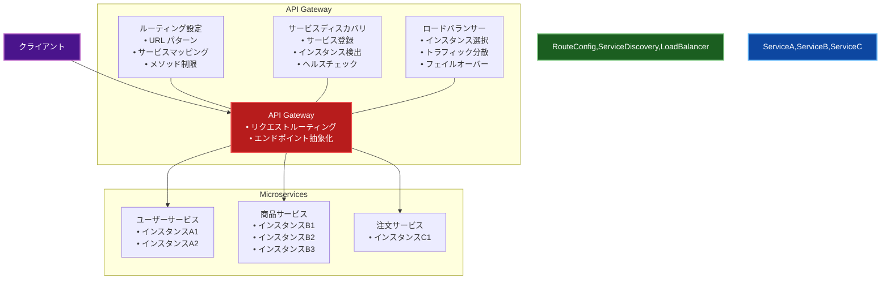

# Gateway Routing（ゲートウェイルーティング）パターン

## 目的

クライアントからのリクエストを適切なバックエンドサービスに転送し、ルーティング、プロトコル変換、認証などの共通機能を提供することで、マイクロサービスアーキテクチャの複雑性を管理します。

## 価値・解決する問題

- サービスディスカバリの簡素化
- クロスカッティングコンサーンの一元管理
- プロトコル変換の自動化
- セキュリティの一元管理
- クライアントとバックエンドの分離
- トラフィック管理の最適化

## 概要・特徴

### 概要

Gateway Routing パターンは、クライアントとマイクロサービス間に位置するゲートウェイを配置し、リクエストの適切なルーティングを行うアーキテクチャパターンです。このゲートウェイはサービスディスカバリと連携し、動的なルーティングテーブルを維持しながら、トラフィックを適切なサービスに振り分けます。

### 特徴

- 単一エントリポイントの提供
- 動的ルーティングとロードバランシング
- サービスインスタンスの抽象化
- プロトコル変換機能
- ヘルスチェックとサーキットブレーキング
- バージョン管理とトラフィック分割
- ルーティングベースの認証/認可

### 概要図



## コード例

### Before:

```typescript
// クライアントが直接各サービスと通信
class ServiceClient {
  private readonly serviceRegistry = {
    users: 'http://user-service:8081',
    orders: 'http://order-service:8082',
    products: 'http://product-service:8083',
    payments: 'http://payment-service:8084'
  };

  private readonly authToken: string;

  constructor(authToken: string) {
    this.authToken = authToken;
  }

  async callService(serviceName: string, path: string, method: string, data?: any) {
    const baseUrl = this.serviceRegistry[serviceName];
    if (!baseUrl) {
      throw new Error(`Unknown service: ${serviceName}`);
    }

    const response = await fetch(`${baseUrl}${path}`, {
      method,
      headers: {
        'Content-Type': 'application/json',
        'Authorization': `Bearer ${this.authToken}`
      },
      body: data ? JSON.stringify(data) : undefined
    });

    if (!response.ok) {
      throw new Error(`Service call failed: ${response.statusText}`);
    }

    return response.json();
  }
}

// クライアントでの使用例
class OrderManagement {
  private client: ServiceClient;

  constructor(authToken: string) {
    this.client = new ServiceClient(authToken);
  }

  async createOrder(userId: string, products: string[]) {
    // ユーザー情報の取得
    const user = await this.client.callService('users', `/users/${userId}`, 'GET');

    // 製品情報の取得
    const productDetails = await Promise.all(
      products.map(productId =>
        this.client.callService('products', `/products/${productId}`, 'GET')
      )
    );

    // 注文の作成
    const order = await this.client.callService('orders', '/orders', 'POST', {
      userId,
      products: productDetails,
      shippingAddress: user.address
    });

    // 支払い処理
    await this.client.callService('payments', '/payments', 'POST', {
      orderId: order.id,
      amount: order.totalAmount,
      userId
    });

    return order;
  }
}
```

### After:

```typescript
// APIゲートウェイの実装
@Injectable()
class ApiGateway {
  constructor(
    private readonly configService: ConfigService,
    private readonly loadBalancer: LoadBalancer,
    private readonly authService: AuthenticationService,
    private readonly rateLimiter: RateLimiter,
    private readonly circuitBreaker: CircuitBreaker,
    private readonly logger: Logger
  ) {}

  @Middleware()
  async handleRequest(req: Request, res: Response, next: NextFunction) {
    const startTime = Date.now();
    const correlationId = uuid();

    try {
      // レート制限のチェック
      await this.rateLimiter.checkLimit(req.ip);

      // 認証トークンの検証
      const token = this.extractToken(req);
      const authResult = await this.authService.validateToken(token);

      // ルーティング設定の取得
      const route = await this.getRouteConfig(req.path);
      if (!route) {
        throw new NotFoundException('Route not found');
      }

      // サービスインスタンスの選択
      const serviceInstance = await this.loadBalancer.selectInstance(route.serviceName);

      // リクエストの転送
      const response = await this.circuitBreaker.execute(route.serviceName, () =>
        this.forwardRequest({
          method: req.method,
          url: `${serviceInstance.url}${route.path}`,
          headers: this.buildHeaders(req, authResult, correlationId),
          body: req.body,
          timeout: route.timeout
        })
      );

      // レスポンスの送信
      res.status(response.status).json(response.data);

      // メトリクスの記録
      this.recordMetrics(route.serviceName, Date.now() - startTime, response.status);
    } catch (error) {
      this.handleError(error, res, correlationId);
    } finally {
      // アクセスログの記録
      this.logger.info('Request processed', {
        correlationId,
        path: req.path,
        method: req.method,
        duration: Date.now() - startTime
      });
    }
  }

  private extractToken(req: Request): string {
    const authHeader = req.headers.authorization;
    if (!authHeader || !authHeader.startsWith('Bearer ')) {
      throw new UnauthorizedException('Missing or invalid token');
    }
    return authHeader.substring(7);
  }

  private async getRouteConfig(path: string): Promise<RouteConfig> {
    const routes = await this.configService.get<RouteConfig[]>('routes');
    return routes.find(route => this.matchRoute(route.pattern, path));
  }

  private matchRoute(pattern: string, path: string): boolean {
    const regexPattern = pattern
      .replace(/\{([^}]+)\}/g, '([^/]+)')
      .replace(/\//g, '\\/');
    return new RegExp(`^${regexPattern}$`).test(path);
  }

  private buildHeaders(
    req: Request,
    authResult: AuthResult,
    correlationId: string
  ): Record<string, string> {
    return {
      'Content-Type': 'application/json',
      'X-Correlation-ID': correlationId,
      'X-User-ID': authResult.userId,
      'X-User-Roles': authResult.roles.join(','),
      'X-Original-IP': req.ip,
      ...this.filterForwardedHeaders(req.headers)
    };
  }

  private filterForwardedHeaders(headers: Record<string, string>): Record<string, string> {
    const allowedHeaders = ['accept', 'accept-language', 'user-agent'];
    return Object.fromEntries(
      Object.entries(headers)
        .filter(([key]) => allowedHeaders.includes(key.toLowerCase()))
    );
  }

  private handleError(error: any, res: Response, correlationId: string) {
    this.logger.error('Request failed', {
      correlationId,
      error: error.message,
      stack: error.stack
    });

    if (error instanceof UnauthorizedException) {
      res.status(401).json({
        error: 'Unauthorized',
        message: error.message,
        correlationId
      });
    } else if (error instanceof NotFoundException) {
      res.status(404).json({
        error: 'Not Found',
        message: error.message,
        correlationId
      });
    } else if (error instanceof CircuitBreakerError) {
      res.status(503).json({
        error: 'Service Unavailable',
        message: 'Service is temporarily unavailable',
        correlationId
      });
    } else {
      res.status(500).json({
        error: 'Internal Server Error',
        message: 'An unexpected error occurred',
        correlationId
      });
    }
  }

  private recordMetrics(
    serviceName: string,
    duration: number,
    statusCode: number
  ) {
    this.metrics.recordRequestDuration(serviceName, duration);
    this.metrics.incrementStatusCodeCount(serviceName, statusCode);
  }
}

// ルーティング設定の例
const routeConfig: RouteConfig[] = [
  {
    pattern: '/api/users/{id}',
    serviceName: 'user-service',
    path: '/users/{id}',
    methods: ['GET', 'PUT', 'DELETE'],
    timeout: 5000,
    authentication: true,
    rateLimit: {
      windowMs: 60000,
      max: 100
    }
  },
  {
    pattern: '/api/orders',
    serviceName: 'order-service',
    path: '/orders',
    methods: ['GET', 'POST'],
    timeout: 10000,
    authentication: true,
    rateLimit: {
      windowMs: 60000,
      max: 50
    }
  },
  {
    pattern: '/api/products/{id}/reviews',
    serviceName: 'review-service',
    path: '/reviews/product/{id}',
    methods: ['GET'],
    timeout: 3000,
    authentication: false,
    rateLimit: {
      windowMs: 60000,
      max: 200
    }
  }
];

// クライアントでの使用例
class OrderManagement {
  private readonly apiBaseUrl: string;

  constructor(private readonly authToken: string) {
    this.apiBaseUrl = 'http://api-gateway';
  }

  async createOrder(userId: string, products: string[]) {
    try {
      // 単一のゲートウェイを通じてすべてのサービスにアクセス
      const response = await fetch(`${this.apiBaseUrl}/api/orders`, {
        method: 'POST',
        headers: {
          'Content-Type': 'application/json',
          'Authorization': `Bearer ${this.authToken}`
        },
        body: JSON.stringify({
          userId,
          products
        })
      });

      if (!response.ok) {
        throw new Error(`Order creation failed: ${response.statusText}`);
      }

      return response.json();
    } catch (error) {
      console.error('Failed to create order:', error);
      throw error;
    }
  }
}

// サービスディスカバリの実装例
class LoadBalancer {
  constructor(
    private readonly serviceRegistry: ServiceRegistry,
    private readonly healthChecker: HealthChecker
  ) {}

  async selectInstance(serviceName: string): Promise<ServiceInstance> {
    // 利用可能なインスタンスの取得
    const instances = await this.serviceRegistry.getInstances(serviceName);
    const healthyInstances = await this.filterHealthyInstances(instances);

    if (healthyInstances.length === 0) {
      throw new Error(`No healthy instances available for ${serviceName}`);
    }

    // ラウンドロビンまたは他の戦略でインスタンスを選択
    return this.roundRobin(healthyInstances);
  }

  private async filterHealthyInstances(
    instances: ServiceInstance[]
  ): Promise<ServiceInstance[]> {
    const healthChecks = instances.map(instance =>
      this.healthChecker.isHealthy(instance)
    );
    const results = await Promise.all(healthChecks);
    return instances.filter((_, index) => results[index]);
  }

  private roundRobin(instances: ServiceInstance[]): ServiceInstance {
    const instance = instances[this.currentIndex % instances.length];
    this.currentIndex = (this.currentIndex + 1) % instances.length;
    return instance;
  }
}
```

## 類似パターンとの比較

- [Gateway Aggregation（ゲートウェイ集約）](gateway-aggregation.md): Gateway Routingはリクエストの転送に焦点を当て、Gateway Aggregationは複数のサービスからのレスポンスの集約を行います。
- [Gateway Offloading（ゲートウェイオフローディング）](gateway-offloading.md): Gateway Routingはルーティングに特化し、Gateway Offloadingは共通機能の実装を担います。
- [Backends for Frontends（BFF）](bff.md): Gateway Routingは汎用的なルーティングを提供し、BFFは特定のクライアントに最適化されたAPIを提供します。

## 利用されているライブラリ／フレームワークの事例

- [Traefik](https://github.com/traefik/traefik): 動的なルーティング設定とサービスディスカバリを提供
- [NGINX](https://github.com/nginx/nginx): 高性能なリバースプロキシとルーティング機能を提供
- [Spring Cloud Gateway](https://github.com/spring-cloud/spring-cloud-gateway): 宣言的なルーティング設定とフィルタリング機能を提供 

## 解説ページリンク

- [Microsoft - Gateway Routing pattern](https://learn.microsoft.com/ja-jp/azure/architecture/patterns/gateway-routing)  
  - クラウドアプリケーションにおけるゲートウェイルーティングパターンの実装方法と、具体的なユースケースを詳しく解説しています。

- [NGINX - API Gateway Pattern](https://www.nginx.com/blog/microservices-api-gateway-pattern/)  
  - NGINXを使用したゲートウェイルーティングの実装方法と、マイクロサービスアーキテクチャでの活用例を提供しています。

- [Kong - API Gateway Routing](https://docs.konghq.com/gateway/latest/key-concepts/routing/)  
  - Kongを使用したルーティング設定の詳細と、実践的な実装例を解説しています。

- [AWS - API Gateway Routing](https://docs.aws.amazon.com/apigateway/latest/developerguide/api-gateway-api-routing.html)  
  - AWSのAPI Gatewayを使用したルーティング設定と、具体的な実装例を提供しています。 