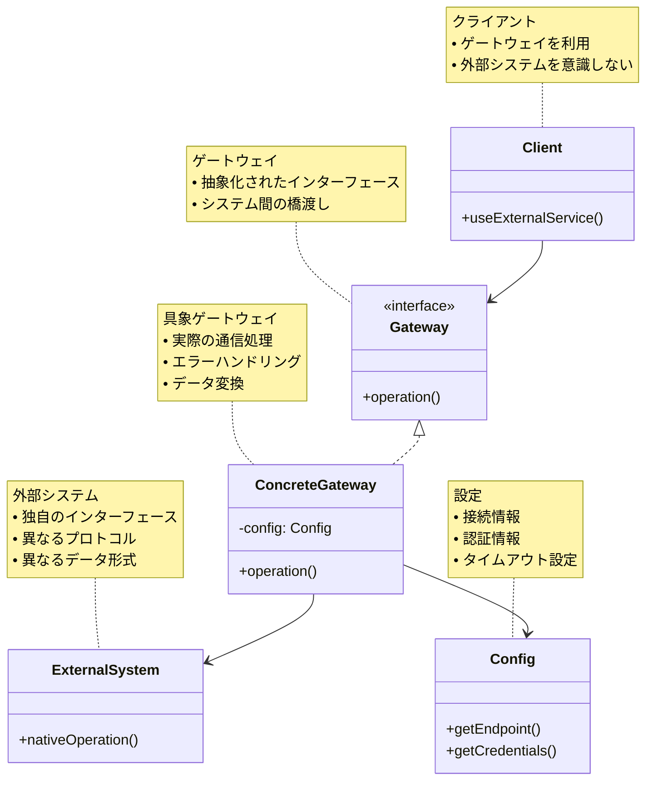

# Gateway（ゲートウェイ）パターン

## 目的

外部システムやリソースへのアクセスを抽象化し、アプリケーションのドメインロジックから分離することで、システム間の結合度を低減し、保守性と再利用性を向上させます。

## 価値・解決する問題

- 外部システムとの依存関係の分離
- インターフェースの抽象化
- システム間の結合度の低減
- テスト容易性の向上
- 外部システムの変更に対する影響の局所化
- クロスカッティングコンサーンの集中管理

## 概要・特徴

### 概要

ゲートウェイパターンは、外部システムやリソースへのアクセスを抽象化するインターフェースを提供し、アプリケーションのドメインロジックから外部システムとの通信の詳細を隠蔽します。これにより、アプリケーションは外部システムの具体的な実装に依存することなく、抽象化されたインターフェースを通じて必要な機能を利用できます。

### 特徴

#### インターフェースの抽象化
- 外部システムへのアクセスを統一的なインターフェースで提供
- システム固有のAPIや通信プロトコルの詳細を隠蔽
- クライアントコードの簡素化と保守性の向上

#### 依存関係の管理
- 外部システムとの依存関係を一箇所に集中
- システム変更の影響を局所化
- バージョン管理や互換性の維持が容易

#### クロスカッティングコンサーン
- 認証・認可
- ロギング
- エラーハンドリング
- レート制限
- キャッシュ管理
- 監視・メトリクス収集

#### 変換とマッピング
- データ形式の変換
- オブジェクトマッピング
- プロトコル変換
- エラー変換

### 概要図



## 類似パターンとの比較

- [Adapter (アダプター)](adapter.md): ゲートウェイは外部システムとの通信を抽象化し、アダプターは既存のインターフェースを新しいインターフェースに適合させます。
- [Facade (ファサード)](facade.md): ゲートウェイは外部システムとの通信に特化し、ファサードは内部サブシステムの複雑さを隠蔽します。
- [Proxy (プロキシ)](proxy.md): ゲートウェイは外部システムとの通信を抽象化し、プロキシはオブジェクトへのアクセスを制御します。
- [Anti-Corruption Layer (腐敗防止層)](anti-corruption-layer.md): ゲートウェイは単純な通信の抽象化に焦点を当て、腐敗防止層はドメインモデルの保護に重点を置きます。

## 利用されているライブラリ／フレームワークの事例

- [Spring Cloud Gateway](https://github.com/spring-cloud/spring-cloud-gateway): マイクロサービスのルーティングとフィルタリング
- [Apollo Gateway](https://github.com/apollographql/apollo-server/tree/main/packages/gateway): GraphQLゲートウェイ
- [Kong Gateway](https://github.com/Kong/kong): APIゲートウェイ
- [Express Gateway](https://github.com/ExpressGateway/express-gateway): Node.js APIゲートウェイ

## 解説ページリンク

- [Martin Fowler - Gateway](https://martinfowler.com/eaaCatalog/gateway.html)
- [Microsoft - Gateway Pattern](https://docs.microsoft.com/en-us/azure/architecture/patterns/gateway-routing)
- [Patterns of Enterprise Application Architecture - Gateway](https://www.enterpriseintegrationpatterns.com/patterns/messaging/MessagingGateway.html)
- [API Gateway Pattern](https://microservices.io/patterns/apigateway.html)

## コード例

### Before:

外部サービスに直接依存する実装

```typescript
// 支払い処理を行うクラス
class PaymentProcessor {
  async processPayment(orderId: string, amount: number, cardDetails: {
    number: string;
    expiry: string;
    cvv: string;
  }): Promise<boolean> {
    // 外部の決済サービスに直接依存
    const response = await fetch('https://payment-service.com/api/v1/process', {
      method: 'POST',
      headers: {
        'Content-Type': 'application/json',
        'Authorization': 'Bearer ' + process.env.PAYMENT_API_KEY
      },
      body: JSON.stringify({
        order_id: orderId,
        amount: amount,
        card: {
          number: cardDetails.number,
          expiry: cardDetails.expiry,
          cvv: cardDetails.cvv
        }
      })
    });

    if (!response.ok) {
      throw new Error(`Payment failed: ${response.statusText}`);
    }

    const result = await response.json();
    return result.success;
  }

  async refundPayment(paymentId: string): Promise<boolean> {
    const response = await fetch(`https://payment-service.com/api/v1/refund/${paymentId}`, {
      method: 'POST',
      headers: {
        'Authorization': 'Bearer ' + process.env.PAYMENT_API_KEY
      }
    });

    if (!response.ok) {
      throw new Error(`Refund failed: ${response.statusText}`);
    }

    const result = await response.json();
    return result.success;
  }
}

// 在庫管理を行うクラス
class InventoryManager {
  async checkStock(productId: string): Promise<number> {
    // 外部の在庫管理サービスに直接依存
    const response = await fetch(`https://inventory-service.com/api/v1/stock/${productId}`, {
      headers: {
        'Authorization': 'Bearer ' + process.env.INVENTORY_API_KEY
      }
    });

    if (!response.ok) {
      throw new Error(`Stock check failed: ${response.statusText}`);
    }

    const result = await response.json();
    return result.quantity;
  }

  async updateStock(productId: string, quantity: number): Promise<void> {
    const response = await fetch(`https://inventory-service.com/api/v1/stock/${productId}`, {
      method: 'PUT',
      headers: {
        'Content-Type': 'application/json',
        'Authorization': 'Bearer ' + process.env.INVENTORY_API_KEY
      },
      body: JSON.stringify({ quantity })
    });

    if (!response.ok) {
      throw new Error(`Stock update failed: ${response.statusText}`);
    }
  }
}

// 注文処理を行うクラス
class OrderProcessor {
  private paymentProcessor: PaymentProcessor;
  private inventoryManager: InventoryManager;

  constructor() {
    this.paymentProcessor = new PaymentProcessor();
    this.inventoryManager = new InventoryManager();
  }

  async processOrder(order: {
    id: string;
    items: Array<{ productId: string; quantity: number }>;
    totalAmount: number;
    paymentDetails: {
      cardNumber: string;
      expiry: string;
      cvv: string;
    };
  }): Promise<void> {
    try {
      // 在庫チェック
      for (const item of order.items) {
        const stock = await this.inventoryManager.checkStock(item.productId);
        if (stock < item.quantity) {
          throw new Error(`Insufficient stock for product ${item.productId}`);
        }
      }

      // 支払い処理
      const paymentSuccess = await this.paymentProcessor.processPayment(
        order.id,
        order.totalAmount,
        {
          number: order.paymentDetails.cardNumber,
          expiry: order.paymentDetails.expiry,
          cvv: order.paymentDetails.cvv
        }
      );

      if (!paymentSuccess) {
        throw new Error('Payment failed');
      }

      // 在庫更新
      for (const item of order.items) {
        await this.inventoryManager.updateStock(
          item.productId,
          item.quantity
        );
      }
    } catch (error) {
      // エラーが発生した場合、支払いをキャンセル
      await this.paymentProcessor.refundPayment(order.id);
      throw error;
    }
  }
}

// 使用例
async function example() {
  const orderProcessor = new OrderProcessor();

  try {
    await orderProcessor.processOrder({
      id: 'order-123',
      items: [
        { productId: 'product-1', quantity: 2 },
        { productId: 'product-2', quantity: 1 }
      ],
      totalAmount: 5000,
      paymentDetails: {
        cardNumber: '4111111111111111',
        expiry: '12/25',
        cvv: '123'
      }
    });
    console.log('Order processed successfully');
  } catch (error) {
    console.error('Order processing failed:', error);
  }
}
```

### After:

ゲートウェイパターンを適用した実装

```typescript
// 支払いゲートウェイのインターフェース
interface PaymentGateway {
  processPayment(orderId: string, amount: number, cardDetails: PaymentDetails): Promise<PaymentResult>;
  refundPayment(paymentId: string): Promise<RefundResult>;
}

// 在庫管理ゲートウェイのインターフェース
interface InventoryGateway {
  checkStock(productId: string): Promise<StockLevel>;
  updateStock(productId: string, quantity: number): Promise<void>;
}

// 共通の型定義
interface PaymentDetails {
  number: string;
  expiry: string;
  cvv: string;
}

interface PaymentResult {
  success: boolean;
  transactionId: string;
  errorMessage?: string;
}

interface RefundResult {
  success: boolean;
  errorMessage?: string;
}

interface StockLevel {
  quantity: number;
  reserved: number;
  available: number;
}

// エラー定義
class PaymentError extends Error {
  constructor(message: string) {
    super(message);
    this.name = 'PaymentError';
  }
}

class InventoryError extends Error {
  constructor(message: string) {
    super(message);
    this.name = 'InventoryError';
  }
}

// 支払いゲートウェイの実装
class StripePaymentGateway implements PaymentGateway {
  private readonly apiKey: string;
  private readonly apiEndpoint: string;

  constructor(config: { apiKey: string; apiEndpoint: string }) {
    this.apiKey = config.apiKey;
    this.apiEndpoint = config.apiEndpoint;
  }

  async processPayment(
    orderId: string,
    amount: number,
    cardDetails: PaymentDetails
  ): Promise<PaymentResult> {
    try {
      const response = await fetch(`${this.apiEndpoint}/process`, {
        method: 'POST',
        headers: {
          'Content-Type': 'application/json',
          'Authorization': `Bearer ${this.apiKey}`
        },
        body: JSON.stringify({
          order_id: orderId,
          amount: amount,
          card: {
            number: cardDetails.number,
            expiry: cardDetails.expiry,
            cvv: cardDetails.cvv
          }
        })
      });

      if (!response.ok) {
        throw new Error(`Payment request failed: ${response.statusText}`);
      }

      const result = await response.json();
      return {
        success: result.success,
        transactionId: result.transaction_id,
        errorMessage: result.error_message
      };
    } catch (error) {
      throw new PaymentError(`Payment processing failed: ${error.message}`);
    }
  }

  async refundPayment(paymentId: string): Promise<RefundResult> {
    try {
      const response = await fetch(`${this.apiEndpoint}/refund/${paymentId}`, {
        method: 'POST',
        headers: {
          'Authorization': `Bearer ${this.apiKey}`
        }
      });

      if (!response.ok) {
        throw new Error(`Refund request failed: ${response.statusText}`);
      }

      const result = await response.json();
      return {
        success: result.success,
        errorMessage: result.error_message
      };
    } catch (error) {
      throw new PaymentError(`Refund processing failed: ${error.message}`);
    }
  }
}

// 在庫管理ゲートウェイの実装
class WarehouseInventoryGateway implements InventoryGateway {
  private readonly apiKey: string;
  private readonly apiEndpoint: string;

  constructor(config: { apiKey: string; apiEndpoint: string }) {
    this.apiKey = config.apiKey;
    this.apiEndpoint = config.apiEndpoint;
  }

  async checkStock(productId: string): Promise<StockLevel> {
    try {
      const response = await fetch(`${this.apiEndpoint}/stock/${productId}`, {
        headers: {
          'Authorization': `Bearer ${this.apiKey}`
        }
      });

      if (!response.ok) {
        throw new Error(`Stock check failed: ${response.statusText}`);
      }

      const result = await response.json();
      return {
        quantity: result.quantity,
        reserved: result.reserved,
        available: result.quantity - result.reserved
      };
    } catch (error) {
      throw new InventoryError(`Stock check failed: ${error.message}`);
    }
  }

  async updateStock(productId: string, quantity: number): Promise<void> {
    try {
      const response = await fetch(`${this.apiEndpoint}/stock/${productId}`, {
        method: 'PUT',
        headers: {
          'Content-Type': 'application/json',
          'Authorization': `Bearer ${this.apiKey}`
        },
        body: JSON.stringify({ quantity })
      });

      if (!response.ok) {
        throw new Error(`Stock update failed: ${response.statusText}`);
      }
    } catch (error) {
      throw new InventoryError(`Stock update failed: ${error.message}`);
    }
  }
}

// 注文処理サービス
class OrderService {
  private paymentGateway: PaymentGateway;
  private inventoryGateway: InventoryGateway;

  constructor(paymentGateway: PaymentGateway, inventoryGateway: InventoryGateway) {
    this.paymentGateway = paymentGateway;
    this.inventoryGateway = inventoryGateway;
  }

  async processOrder(order: {
    id: string;
    items: Array<{ productId: string; quantity: number }>;
    totalAmount: number;
    paymentDetails: PaymentDetails;
  }): Promise<void> {
    let paymentResult: PaymentResult | undefined;

    try {
      // 在庫チェック
      for (const item of order.items) {
        const stock = await this.inventoryGateway.checkStock(item.productId);
        if (stock.available < item.quantity) {
          throw new Error(
            `Insufficient stock for product ${item.productId}: requested ${item.quantity}, available ${stock.available}`
          );
        }
      }

      // 支払い処理
      paymentResult = await this.paymentGateway.processPayment(
        order.id,
        order.totalAmount,
        order.paymentDetails
      );

      if (!paymentResult.success) {
        throw new Error(paymentResult.errorMessage || 'Payment failed');
      }

      // 在庫更新
      for (const item of order.items) {
        await this.inventoryGateway.updateStock(
          item.productId,
          -item.quantity // 在庫を減らす
        );
      }
    } catch (error) {
      // エラーが発生した場合、支払いをキャンセル
      if (paymentResult?.success) {
        await this.paymentGateway.refundPayment(paymentResult.transactionId);
      }
      throw error;
    }
  }
}

// 設定管理
class Config {
  static getPaymentConfig() {
    return {
      apiKey: process.env.PAYMENT_API_KEY || '',
      apiEndpoint: process.env.PAYMENT_API_ENDPOINT || 'https://payment-service.com/api/v1'
    };
  }

  static getInventoryConfig() {
    return {
      apiKey: process.env.INVENTORY_API_KEY || '',
      apiEndpoint: process.env.INVENTORY_API_ENDPOINT || 'https://inventory-service.com/api/v1'
    };
  }
}

// 使用例
async function example() {
  // ゲートウェイの初期化
  const paymentGateway = new StripePaymentGateway(Config.getPaymentConfig());
  const inventoryGateway = new WarehouseInventoryGateway(Config.getInventoryConfig());

  // サービスの初期化
  const orderService = new OrderService(paymentGateway, inventoryGateway);

  try {
    // 注文処理
    await orderService.processOrder({
      id: 'order-123',
      items: [
        { productId: 'product-1', quantity: 2 },
        { productId: 'product-2', quantity: 1 }
      ],
      totalAmount: 5000,
      paymentDetails: {
        number: '4111111111111111',
        expiry: '12/25',
        cvv: '123'
      }
    });
    console.log('Order processed successfully');
  } catch (error) {
    if (error instanceof PaymentError) {
      console.error('Payment processing failed:', error.message);
    } else if (error instanceof InventoryError) {
      console.error('Inventory operation failed:', error.message);
    } else {
      console.error('Order processing failed:', error);
    }
  }
}
``` 