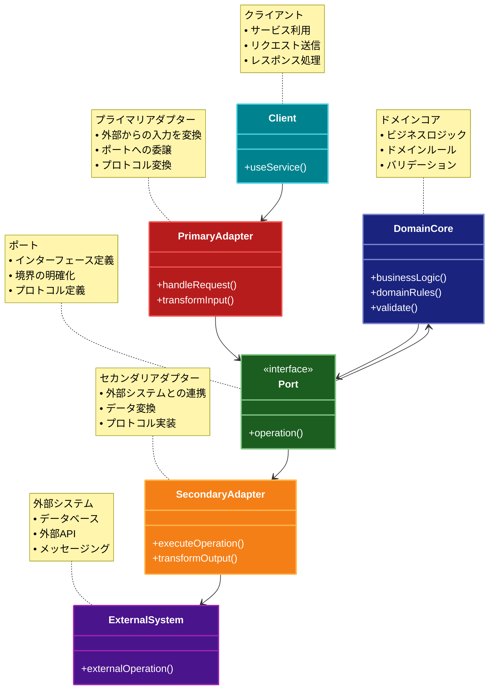

# Hexagonal Architecture（ヘキサゴナルアーキテクチャ）

## 目的

アプリケーションのビジネスロジックを外部の依存関係から分離し、ポートとアダプターを使用して柔軟な接続を実現することで、テスト容易性と保守性を向上させます。

## 解説ページリンク

- [Alistair Cockburn - Hexagonal Architecture](https://alistair.cockburn.us/hexagonal-architecture/)  
  - ヘキサゴナルアーキテクチャの考案者による解説で、基本概念と設計原則を詳しく説明しています。

- [Netflix - Hexagonal Architecture](https://netflixtechblog.com/ready-for-changes-with-hexagonal-architecture-b315ec967749)  
  - Netflixにおけるヘキサゴナルアーキテクチャの実践例と、大規模システムでの適用方法を解説しています。

- [Microsoft - Ports and Adapters Pattern](https://learn.microsoft.com/ja-jp/azure/architecture/patterns/ports-and-adapters)  
  - クラウドアプリケーションにおけるポートとアダプターパターンの実装方法と、具体的なユースケースを提供しています。

- [ThoughtWorks - Hexagonal Architecture](https://www.thoughtworks.com/insights/blog/architecture/demystifying-hexagonal-architecture)  
  - 実践的な視点からヘキサゴナルアーキテクチャの利点と実装方法を解説しています。

## 価値・解決する問題

- ビジネスロジックの独立性確保
- 外部依存の抽象化
- テスト容易性の向上
- 技術的な実装の交換容易性
- システムの柔軟性向上

## 概要・特徴

### 概要

ヘキサゴナルアーキテクチャは、アプリケーションのコアを中心に置き、外部との通信をポートとアダプターを通じて行う設計パターンです。これにより、ビジネスロジックを外部依存から完全に分離し、システムの柔軟性を高めます。

### 特徴

#### ポートによる依存関係の抽象化
ヘキサゴナルアーキテクチャでは、アプリケーションコアと外部要素の間のインターフェースとして「ポート」を定義します。ポートはコアが外部と通信するための抽象的なゲートウェイとして機能し、具体的な実装の詳細をコアから隠蔽します。これにより、アプリケーションコアは特定の技術や実装に依存することなく、純粋なビジネスロジックに集中できます。ポートはインターフェースまたは抽象クラスとして表現され、コアが必要とする機能や、コアが提供する機能を明確に定義します。この抽象化により、システムの結合度が低下し、拡張性や保守性が向上します。

#### アダプターによる外部システムとの接続
「アダプター」はポートの実装を提供し、アプリケーションコアと外部システム（データベース、UI、Webサービスなど）を接続します。各アダプターは特定の技術や外部システムに対応し、それらとアプリケーションコアの間の変換を担当します。例えば、データベースアダプターはSQLクエリとドメインオブジェクトの変換を行い、UIアダプターはユーザー入力をコアが理解できる形式に変換します。アダプターの実装はポートのインターフェースに従うため、コアに影響を与えずに複数のアダプターを交換または追加することが可能です。この設計により、システムは技術的な変更に対して堅牢になり、柔軟な拡張が容易になります。

#### ビジネスロジックの完全な分離
ヘキサゴナルアーキテクチャの中心にはビジネスロジックが配置され、外部依存から完全に分離されます。これにより、ビジネスロジックはフレームワーク、データベース、UI、外部サービスなどの具体的な実装詳細から保護されます。コアはドメインモデル、ビジネスルール、アプリケーションサービスなど、システムの本質的な部分のみを含み、技術的な懸念事項からは切り離されています。この明確な境界により、ビジネスロジックの理解、開発、テストが容易になり、長期的な保守性が向上します。また、ビジネスロジックが技術的な実装から独立しているため、ビジネス要件の変化やシステムの進化に柔軟に対応できます。

#### 双方向のポート定義
ヘキサゴナルアーキテクチャでは、「入力ポート」と「出力ポート」の2種類のポートを定義します。入力ポートはアプリケーションコアが外部から呼び出される際のインターフェースを提供し、ユーザーやシステムからのリクエストを処理します。一方、出力ポートはコアが外部システムやサービスを利用するためのインターフェースを定義します。この双方向のポート設計により、アプリケーションコアは入力と出力の両方で外部依存から分離され、「依存性逆転の原則」が適用されます。つまり、コアは詳細（具体的な実装）に依存するのではなく、詳細がコアの定義した抽象（ポート）に依存するようになります。この設計により、システムのモジュール性が向上し、変更の影響範囲が限定されます。

#### テストの容易性
ヘキサゴナルアーキテクチャは、テスト駆動開発（TDD）やビヘイビア駆動開発（BDD）などのテスト手法との親和性が高く、テスト容易性を大幅に向上させます。アプリケーションコアはポートを通じて外部と通信するため、テスト時にはモックやスタブといったテストダブルを使用して外部依存を置き換えることができます。これにより、外部システム（データベース、Webサービスなど）に依存せずにコアをテストできるようになり、テストの実行速度が向上し、テスト環境のセットアップが簡素化されます。また、ポートとアダプターの分離により、それぞれを独立してテストできるため、高いテストカバレッジと信頼性の高いテストスイートを構築しやすくなります。

### 概要図



## 類似パターンとの比較

- [レイヤードアーキテクチャ](layered-architecture.md): ヘキサゴナルアーキテクチャはポートとアダプターを使用して柔軟な依存関係を実現しますが、レイヤードアーキテクチャは層の依存関係を一方向に制限します。
- [クリーンアーキテクチャ](clean-architecture.md): ヘキサゴナルアーキテクチャはポートとアダプターによる分離を重視しますが、クリーンアーキテクチャは依存関係の方向性とユースケース中心の設計を重視します。
- [オニオンアーキテクチャ](onion-architecture.md): ヘキサゴナルアーキテクチャはポートとアダプターによる分離を重視しますが、オニオンアーキテクチャはドメイン層を中心とした同心円状の依存関係を持ちます。

## 利用されているライブラリ／フレームワークの事例

- [Spring Framework](https://github.com/spring-projects/spring-framework): ポートとアダプターパターンを採用可能なフレームワーク
- [Nest.js](https://github.com/nestjs/nest): TypeScriptベースのフレームワークでヘキサゴナルアーキテクチャを採用可能
- [Symfony](https://github.com/symfony/symfony): PHPフレームワークでヘキサゴナルアーキテクチャを採用可能

## コード例

### Before:

```typescript
// 外部依存が直接結合した実装
class OrderService {
  private database: Database;
  private paymentGateway: PaymentGateway;
  private emailService: EmailService;

  async createOrder(orderData: OrderData): Promise<Order> {
    // データベースに直接アクセス
    const user = await this.database.query(
      'SELECT * FROM users WHERE id = ?',
      [orderData.userId]
    );

    if (!user) {
      throw new Error('User not found');
    }

    // 支払い処理を直接実行
    const paymentResult = await this.paymentGateway.processPayment({
      amount: orderData.amount,
      cardToken: orderData.cardToken
    });

    if (!paymentResult.success) {
      throw new Error('Payment failed');
    }

    // 注文をデータベースに保存
    const order = await this.database.query(
      'INSERT INTO orders (user_id, amount, status) VALUES (?, ?, ?)',
      [orderData.userId, orderData.amount, 'completed']
    );

    // メール送信を直接実行
    await this.emailService.sendOrderConfirmation(
      user.email,
      order.id,
      orderData.amount
    );

    return order;
  }
}
```

### After:

```typescript
// アプリケーションコア（ドメイン層）
interface Order {
  id: string;
  userId: string;
  amount: number;
  status: OrderStatus;
  createdAt: Date;
}

// プライマリポート（入力ポート）
interface OrderUseCase {
  createOrder(orderData: OrderData): Promise<Order>;
}

// セカンダリポート（出力ポート）
interface UserRepository {
  findById(userId: string): Promise<User | null>;
}

interface OrderRepository {
  save(order: Order): Promise<Order>;
}

interface PaymentPort {
  process(amount: number, cardToken: string): Promise<PaymentResult>;
}

interface NotificationPort {
  sendOrderConfirmation(order: Order, user: User): Promise<void>;
}

// アプリケーションコアの実装
class OrderService implements OrderUseCase {
  constructor(
    private userRepository: UserRepository,
    private orderRepository: OrderRepository,
    private paymentPort: PaymentPort,
    private notificationPort: NotificationPort
  ) {}

  async createOrder(orderData: OrderData): Promise<Order> {
    // ユーザーの取得
    const user = await this.userRepository.findById(orderData.userId);
    if (!user) {
      throw new DomainError('User not found');
    }

    // 支払い処理
    const paymentResult = await this.paymentPort.process(
      orderData.amount,
      orderData.cardToken
    );

    if (!paymentResult.success) {
      throw new DomainError('Payment failed');
    }

    // 注文の作成
    const order: Order = {
      id: crypto.randomUUID(),
      userId: user.id,
      amount: orderData.amount,
      status: 'completed',
      createdAt: new Date()
    };

    // 注文の保存
    const savedOrder = await this.orderRepository.save(order);

    // 通知の送信
    await this.notificationPort.sendOrderConfirmation(savedOrder, user);

    return savedOrder;
  }
}

// プライマリアダプター（入力アダプター）
class OrderController {
  constructor(private orderUseCase: OrderUseCase) {}

  async handleCreateOrder(req: Request, res: Response): Promise<void> {
    try {
      const orderData = this.validateRequest(req.body);
      const order = await this.orderUseCase.createOrder(orderData);
      res.status(201).json(order);
    } catch (error) {
      this.handleError(error, res);
    }
  }

  private validateRequest(body: any): OrderData {
    // リクエストのバリデーション
    if (!body.userId || !body.amount || !body.cardToken) {
      throw new ValidationError('Invalid order data');
    }
    return body as OrderData;
  }
}

// セカンダリアダプター（出力アダプター）
class SQLUserRepository implements UserRepository {
  constructor(private database: Database) {}

  async findById(userId: string): Promise<User | null> {
    const result = await this.database.query(
      'SELECT * FROM users WHERE id = ?',
      [userId]
    );
    return result ? this.mapToUser(result) : null;
  }

  private mapToUser(data: any): User {
    return {
      id: data.id,
      email: data.email,
      name: data.name
    };
  }
}

class SQLOrderRepository implements OrderRepository {
  constructor(private database: Database) {}

  async save(order: Order): Promise<Order> {
    await this.database.query(
      'INSERT INTO orders (id, user_id, amount, status, created_at) VALUES (?, ?, ?, ?, ?)',
      [order.id, order.userId, order.amount, order.status, order.createdAt]
    );
    return order;
  }
}

class StripePaymentAdapter implements PaymentPort {
  constructor(private stripeClient: Stripe) {}

  async process(amount: number, cardToken: string): Promise<PaymentResult> {
    try {
      const paymentIntent = await this.stripeClient.paymentIntents.create({
        amount,
        currency: 'usd',
        payment_method: cardToken,
        confirm: true
      });
      return { success: true, transactionId: paymentIntent.id };
    } catch (error) {
      return { success: false, error: error.message };
    }
  }
}

class EmailNotificationAdapter implements NotificationPort {
  constructor(private emailService: EmailService) {}

  async sendOrderConfirmation(order: Order, user: User): Promise<void> {
    await this.emailService.send({
      to: user.email,
      subject: `Order Confirmation #${order.id}`,
      template: 'order-confirmation',
      data: {
        orderNumber: order.id,
        amount: order.amount,
        userName: user.name
      }
    });
  }
}

// 依存関係の設定
const database = new Database();
const stripeClient = new Stripe(process.env.STRIPE_KEY);
const emailService = new EmailService();

const userRepository = new SQLUserRepository(database);
const orderRepository = new SQLOrderRepository(database);
const paymentAdapter = new StripePaymentAdapter(stripeClient);
const notificationAdapter = new EmailNotificationAdapter(emailService);

const orderService = new OrderService(
  userRepository,
  orderRepository,
  paymentAdapter,
  notificationAdapter
);

const orderController = new OrderController(orderService);
```
