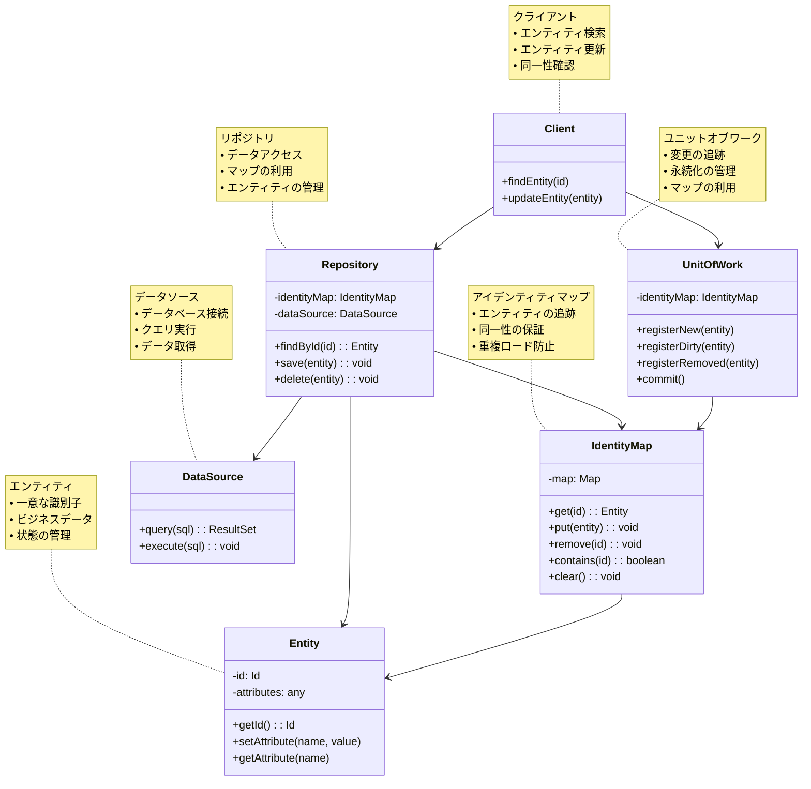

# Identity Map (アイデンティティマップ)

## 目的

同一のエンティティインスタンスが複数回ロードされるのを防ぎ、メモリ内で一度だけロードされたエンティティを追跡することで、一貫性を保持しパフォーマンスを向上させます。

## 価値・解決する問題

- 同一エンティティの重複ロード防止
- データの一貫性確保
- メモリ使用量の最適化
- データベースアクセス回数の削減
- オブジェクト同一性の保証

## 概要・特徴

### 概要

Identity Mapパターンは、データベースから取得したエンティティをメモリ内でマッピングし、同一エンティティが複数回ロードされることを防ぐデータアクセスパターンです。エンティティの識別子（ID）をキーとして、対応するエンティティインスタンスを追跡することで、同じIDのエンティティが要求された場合に、データベースからの再取得ではなく、既にメモリ上に存在するインスタンスを返します。

### 特徴

#### 一意性の保証
同一エンティティは常に同一のインスタンスとして扱われます。これにより、同じIDのエンティティが複数のインスタンスとして存在することを防ぎ、オブジェクトの同一性を保証します。

#### キャッシュメカニズム
インメモリキャッシュとして機能し、データベースアクセスを最適化します。一度ロードされたエンティティは次回以降のアクセス時にキャッシュから取得されるため、パフォーマンスが向上します。

#### トランザクション境界
多くの場合、単一のトランザクション内で有効に機能します。トランザクション範囲内でオブジェクトの同一性を保証し、トランザクションが完了すると通常はクリアされます。

#### リポジトリとの統合
Repositoryパターンと組み合わせて使用されることが多く、データアクセス層の一部として実装されます。リポジトリがエンティティを取得する際にIdentity Mapをチェックし、既存のインスタンスを返します。

#### Unit of Workとの連携
変更追跡機能と連携して動作し、エンティティの状態管理を支援します。Unit of Workがエンティティの変更を追跡する一方、Identity Mapはエンティティの同一性を保証します。

#### 整合性確保
同一エンティティに対する複数の変更が互いに上書きされるのを防止します。すべての操作が同じインスタンスに対して行われるため、データの一貫性が保たれます。

#### 同一性比較の単純化
オブジェクト参照の比較だけで同一性を判断可能になります。通常の等価性比較（IDフィールドの比較など）ではなく、単純な参照比較（===）で同一性を確認できます。

### 概要図



## 類似パターンとの比較

- [Unit of Work (ユニットオブワーク)](unit-of-work.md): Identity Mapがエンティティの同一性を管理するのに対し、Unit of Workはエンティティの変更を追跡し一括コミットします。両者はしばしば組み合わせて使用されます。
- [Repository (リポジトリ)](repository.md): Repositoryはデータアクセスを抽象化し、Identity Mapは多くの場合Repositoryの内部に実装されます。
- [Cache (キャッシュ)](cache-aside.md): Identity Mapは特殊なキャッシュの一種ですが、エンティティの同一性に特化しています。

## 利用されているライブラリ／フレームワークの事例

- [Hibernate](https://github.com/hibernate/hibernate-orm): Sessionオブジェクト内でIdentity Mapを実装
- [Entity Framework](https://github.com/dotnet/efcore): DbContextが内部的にIdentity Mapパターンを使用
- [SQLAlchemy](https://github.com/sqlalchemy/sqlalchemy): Sessionオブジェクトが自動的にIdentity Mapを管理
- [TypeORM](https://github.com/typeorm/typeorm): EntityManagerが内部的にIdentity Mapを実装

## 解説ページリンク

- [P of EAA: Identity Map - Martin Fowler](https://martinfowler.com/eaaCatalog/identityMap.html)
- [Identity Map Pattern in Domain Driven Design](https://www.dofactory.com/net/identity-map-design-pattern)
- [Understanding Identity Map in ORM context](https://vladmihalcea.com/a-beginners-guide-to-jpa-hibernate-entity-state-transitions/)
- [Identity Map implementations in ORMs](https://blog.sapiensworks.com/post/2014/06/02/The-Identity-Map-Pattern.aspx)

## コード例

### Before:

同一エンティティを複数回ロードしてしまう実装

```typescript
class UserRepository {
  private dataSource: DataSource;

  constructor(dataSource: DataSource) {
    this.dataSource = dataSource;
  }

  async findById(id: number): Promise<User> {
    // 毎回データベースからロードするため、同じIDに対して異なるインスタンスが作成される可能性がある
    const userData = await this.dataSource.query(
      'SELECT * FROM users WHERE id = ?',
      [id]
    );
    
    if (!userData || userData.length === 0) {
      throw new Error(`User with id ${id} not found`);
    }
    
    // 毎回新しいインスタンスを作成
    return new User(
      userData[0].id,
      userData[0].name,
      userData[0].email,
      userData[0].role
    );
  }

  async save(user: User): Promise<void> {
    await this.dataSource.execute(
      'UPDATE users SET name = ?, email = ?, role = ? WHERE id = ?',
      [user.name, user.email, user.role, user.id]
    );
  }
}

// クライアントコード
async function processUser(userId: number, repo: UserRepository): Promise<void> {
  // 同じユーザーを2回ロード（2つの異なるインスタンスになる）
  const user1 = await repo.findById(userId);
  const user2 = await repo.findById(userId);
  
  // 異なるインスタンスなので、同一性が保証されない
  console.log(user1 === user2); // false
  
  // 一方のインスタンスを更新
  user1.name = 'Updated Name';
  await repo.save(user1);
  
  // もう一方のインスタンスはまだ古い状態
  console.log(user2.name); // 更新前の名前
}
```

### After:

Identity Mapパターンを使用した実装

```typescript
// エンティティクラス
class User {
  constructor(
    public readonly id: number,
    public name: string,
    public email: string,
    public role: string
  ) {}
}

// Identity Mapの実装
class IdentityMap {
  private entities: Map<number, User> = new Map();

  get(id: number): User | undefined {
    return this.entities.get(id);
  }

  put(entity: User): void {
    this.entities.set(entity.id, entity);
  }

  remove(id: number): void {
    this.entities.delete(id);
  }

  contains(id: number): boolean {
    return this.entities.has(id);
  }

  clear(): void {
    this.entities.clear();
  }
}

// Identity Mapを使用したリポジトリ
class UserRepository {
  private dataSource: DataSource;
  private identityMap: IdentityMap;

  constructor(dataSource: DataSource, identityMap: IdentityMap) {
    this.dataSource = dataSource;
    this.identityMap = identityMap;
  }

  async findById(id: number): Promise<User> {
    // まずIdentity Mapをチェック
    const cachedUser = this.identityMap.get(id);
    if (cachedUser) {
      console.log(`User ${id} found in identity map`);
      return cachedUser;
    }

    // キャッシュにない場合はデータベースからロード
    console.log(`Loading User ${id} from database`);
    const userData = await this.dataSource.query(
      'SELECT * FROM users WHERE id = ?',
      [id]
    );
    
    if (!userData || userData.length === 0) {
      throw new Error(`User with id ${id} not found`);
    }
    
    // 新しいインスタンスを作成
    const user = new User(
      userData[0].id,
      userData[0].name,
      userData[0].email,
      userData[0].role
    );
    
    // Identity Mapに保存
    this.identityMap.put(user);
    
    return user;
  }

  async save(user: User): Promise<void> {
    await this.dataSource.execute(
      'UPDATE users SET name = ?, email = ?, role = ? WHERE id = ?',
      [user.name, user.email, user.role, user.id]
    );
    
    // 更新されたエンティティをIdentity Mapに反映
    this.identityMap.put(user);
  }
}

// Unit of Workと組み合わせた実装
class UnitOfWork {
  private dataSource: DataSource;
  private identityMap: IdentityMap;
  private dirtyEntities: Set<User> = new Set();
  private newEntities: Set<User> = new Set();
  private removedEntities: Set<User> = new Set();
  
  constructor(dataSource: DataSource) {
    this.dataSource = dataSource;
    this.identityMap = new IdentityMap();
  }
  
  getUserRepository(): UserRepository {
    return new UserRepository(this.dataSource, this.identityMap);
  }
  
  registerNew(user: User): void {
    this.newEntities.add(user);
    this.identityMap.put(user);
  }
  
  registerDirty(user: User): void {
    this.dirtyEntities.add(user);
  }
  
  registerRemoved(user: User): void {
    this.removedEntities.add(user);
    this.identityMap.remove(user.id);
  }
  
  async commit(): Promise<void> {
    try {
      await this.dataSource.beginTransaction();
      
      // 新規エンティティの挿入
      for (const entity of this.newEntities) {
        await this.dataSource.execute(
          'INSERT INTO users (id, name, email, role) VALUES (?, ?, ?, ?)',
          [entity.id, entity.name, entity.email, entity.role]
        );
      }
      
      // 変更されたエンティティの更新
      for (const entity of this.dirtyEntities) {
        await this.dataSource.execute(
          'UPDATE users SET name = ?, email = ?, role = ? WHERE id = ?',
          [entity.name, entity.email, entity.role, entity.id]
        );
      }
      
      // 削除されたエンティティの削除
      for (const entity of this.removedEntities) {
        await this.dataSource.execute(
          'DELETE FROM users WHERE id = ?',
          [entity.id]
        );
      }
      
      await this.dataSource.commitTransaction();
      
      // 変更トラッキングセットをクリア
      this.newEntities.clear();
      this.dirtyEntities.clear();
      this.removedEntities.clear();
    } catch (error) {
      await this.dataSource.rollbackTransaction();
      throw error;
    }
  }
}

// クライアントコード
async function processUserWithIdentityMap(
  userId: number, 
  unitOfWork: UnitOfWork
): Promise<void> {
  const userRepo = unitOfWork.getUserRepository();
  
  // 同じユーザーを2回ロード（同一のインスタンスが返される）
  const user1 = await userRepo.findById(userId);
  const user2 = await userRepo.findById(userId);
  
  // 同一のインスタンスであることが保証される
  console.log(user1 === user2); // true
  
  // インスタンスを更新
  user1.name = 'Updated Name';
  unitOfWork.registerDirty(user1);
  
  // 同じインスタンスを参照しているので、user2も更新される
  console.log(user2.name); // 'Updated Name'
  
  // 変更を保存
  await unitOfWork.commit();
} 