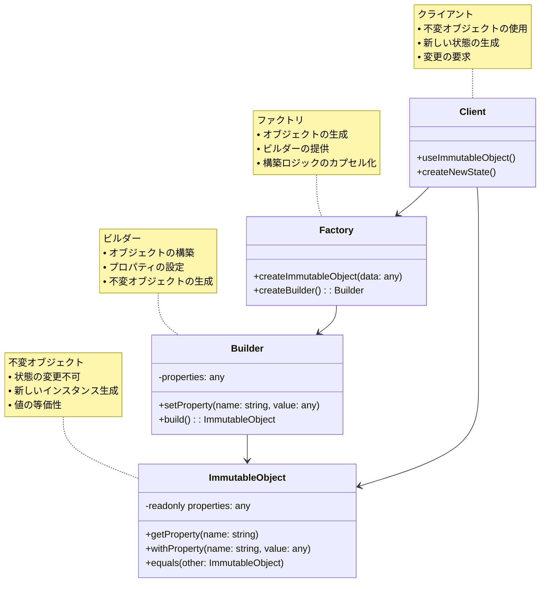

# Immutable（不変）パターン

## 目的

オブジェクトの状態を変更不可にし、新しい状態が必要な場合は新しいオブジェクトを生成するパターンです。

## 価値・解決する問題

- スレッドセーフな実装
- 予測可能な動作
- 副作用の排除
- デバッグの容易さ
- 並行処理の安全性

## 概要・特徴

### 概要

Immutableパターンは、オブジェクトの状態を変更不可（イミュータブル）にし、状態の変更が必要な場合は新しいオブジェクトを生成する設計パターンです。これにより、オブジェクトの状態が予測可能になり、並行処理時の安全性が向上します。

### 特徴

#### 不変性の保証
- 状態の変更を防止
- スレッドセーフな実装
- 予測可能な動作
- 副作用の排除

#### 新しいオブジェクトの生成
- 状態変更時に新しいインスタンスを生成
- 元のオブジェクトは変更不可
- 変更履歴の追跡が容易
- スナップショットの作成が容易

#### 効率的な実装
- 構造共有によるメモリ効率
- 変更の伝播の最適化
- 不要なコピーの回避
- パフォーマンスの考慮

#### デバッグの容易さ
- 状態の追跡が容易
- 変更の影響範囲が明確
- テストの容易さ
- バグの特定が容易

### 概要図



## 類似パターンとの比較

- [Value Object (値オブジェクト)](value-object.md): 不変性は値オブジェクトの重要な特徴の一つですが、値オブジェクトは値の等価性に焦点を当てています。
- [Builder (ビルダー)](builder.md): 不変オブジェクトの構築にビルダーパターンを使用することが多いですが、ビルダーは複雑なオブジェクトの構築に焦点を当てています。
- [Factory Method (ファクトリメソッド)](factory-method.md): 不変オブジェクトの生成にファクトリメソッドを使用することが多いですが、ファクトリメソッドはオブジェクトの生成に焦点を当てています。
- [Prototype (プロトタイプ)](prototype.md): 不変オブジェクトのコピーにプロトタイプパターンを使用することが多いですが、プロトタイプはオブジェクトの複製に焦点を当てています。

## 利用されているライブラリ／フレームワークの事例

- [Immutable.js](https://github.com/immutable-js/immutable-js): JavaScriptの不変データ構造
- [Immer](https://github.com/immerjs/immer): 不変な状態更新
- [Redux Toolkit](https://github.com/reduxjs/redux-toolkit): Reduxの不変な状態管理
- [MobX-State-Tree](https://github.com/mobxjs/mobx-state-tree): 不変な状態ツリー

## 解説ページリンク

- [Martin Fowler - Immutable Object](https://martinfowler.com/bliki/ValueObject.html)
- [Microsoft - Immutable Pattern](https://docs.microsoft.com/en-us/dotnet/standard/collections/thread-safe/immutable-collections)
- [JavaScript.info - Immutable Objects](https://javascript.info/object-copy)
- [Redux - Immutable Update Patterns](https://redux.js.org/usage/structuring-reducers/immutable-update-patterns)

## コード例

### Before:

可変な状態を持つ実装

```typescript
// 可変な状態を持つクラス
class User {
  private name: string;
  private age: number;
  private preferences: Map<string, any>;

  constructor(name: string, age: number) {
    this.name = name;
    this.age = age;
    this.preferences = new Map();
  }

  setName(name: string): void {
    this.name = name;
  }

  setAge(age: number): void {
    this.age = age;
  }

  addPreference(key: string, value: any): void {
    this.preferences.set(key, value);
  }

  removePreference(key: string): void {
    this.preferences.delete(key);
  }

  getName(): string {
    return this.name;
  }

  getAge(): number {
    return this.age;
  }

  getPreferences(): Map<string, any> {
    return this.preferences;
  }
}

// ユーザー管理サービス
class UserService {
  private users: Map<string, User> = new Map();

  createUser(id: string, name: string, age: number): User {
    const user = new User(name, age);
    this.users.set(id, user);
    return user;
  }

  updateUserName(id: string, newName: string): void {
    const user = this.users.get(id);
    if (!user) {
      throw new Error(`User ${id} not found`);
    }
    user.setName(newName);
  }

  updateUserAge(id: string, newAge: number): void {
    const user = this.users.get(id);
    if (!user) {
      throw new Error(`User ${id} not found`);
    }
    user.setAge(newAge);
  }

  addUserPreference(id: string, key: string, value: any): void {
    const user = this.users.get(id);
    if (!user) {
      throw new Error(`User ${id} not found`);
    }
    user.addPreference(key, value);
  }

  removeUserPreference(id: string, key: string): void {
    const user = this.users.get(id);
    if (!user) {
      throw new Error(`User ${id} not found`);
    }
    user.removePreference(key);
  }

  getUser(id: string): User | undefined {
    return this.users.get(id);
  }
}

// 使用例
function example() {
  const userService = new UserService();

  // ユーザーの作成
  const userId = 'user-1';
  const user = userService.createUser(userId, 'John Doe', 30);

  // ユーザー情報の更新
  userService.updateUserName(userId, 'Jane Doe');
  userService.updateUserAge(userId, 31);

  // ユーザーの設定を追加
  userService.addUserPreference(userId, 'theme', 'dark');
  userService.addUserPreference(userId, 'language', 'en');

  // 取得したユーザーオブジェクトの状態を直接変更可能
  const retrievedUser = userService.getUser(userId);
  if (retrievedUser) {
    retrievedUser.setName('Bob Doe'); // 直接状態を変更可能
  }
}
```

### After:

不変パターンを適用した実装

```typescript
// 不変なユーザークラス
class ImmutableUser {
  constructor(
    private readonly name: string,
    private readonly age: number,
    private readonly preferences: ReadonlyMap<string, any>
  ) {}

  getName(): string {
    return this.name;
  }

  getAge(): number {
    return this.age;
  }

  getPreferences(): ReadonlyMap<string, any> {
    return this.preferences;
  }

  withName(name: string): ImmutableUser {
    return new ImmutableUser(name, this.age, this.preferences);
  }

  withAge(age: number): ImmutableUser {
    return new ImmutableUser(this.name, age, this.preferences);
  }

  withPreference(key: string, value: any): ImmutableUser {
    const newPreferences = new Map(this.preferences);
    newPreferences.set(key, value);
    return new ImmutableUser(this.name, this.age, newPreferences);
  }

  withoutPreference(key: string): ImmutableUser {
    const newPreferences = new Map(this.preferences);
    newPreferences.delete(key);
    return new ImmutableUser(this.name, this.age, newPreferences);
  }

  equals(other: ImmutableUser): boolean {
    if (this === other) return true;
    if (!(other instanceof ImmutableUser)) return false;

    return (
      this.name === other.name &&
      this.age === other.age &&
      this.areMapsEqual(this.preferences, other.preferences)
    );
  }

  private areMapsEqual(
    map1: ReadonlyMap<string, any>,
    map2: ReadonlyMap<string, any>
  ): boolean {
    if (map1.size !== map2.size) return false;
    for (const [key, value] of map1) {
      if (!map2.has(key) || map2.get(key) !== value) return false;
    }
    return true;
  }
}

// ユーザービルダー
class UserBuilder {
  private name: string = '';
  private age: number = 0;
  private preferences: Map<string, any> = new Map();

  setName(name: string): UserBuilder {
    this.name = name;
    return this;
  }

  setAge(age: number): UserBuilder {
    this.age = age;
    return this;
  }

  addPreference(key: string, value: any): UserBuilder {
    this.preferences.set(key, value);
    return this;
  }

  build(): ImmutableUser {
    return new ImmutableUser(this.name, this.age, this.preferences);
  }
}

// ユーザー管理サービス
class UserService {
  private users: Map<string, ImmutableUser> = new Map();

  createUser(id: string, name: string, age: number): ImmutableUser {
    const user = new UserBuilder()
      .setName(name)
      .setAge(age)
      .build();
    this.users.set(id, user);
    return user;
  }

  updateUserName(id: string, newName: string): ImmutableUser {
    const user = this.users.get(id);
    if (!user) {
      throw new Error(`User ${id} not found`);
    }
    const updatedUser = user.withName(newName);
    this.users.set(id, updatedUser);
    return updatedUser;
  }

  updateUserAge(id: string, newAge: number): ImmutableUser {
    const user = this.users.get(id);
    if (!user) {
      throw new Error(`User ${id} not found`);
    }
    const updatedUser = user.withAge(newAge);
    this.users.set(id, updatedUser);
    return updatedUser;
  }

  addUserPreference(id: string, key: string, value: any): ImmutableUser {
    const user = this.users.get(id);
    if (!user) {
      throw new Error(`User ${id} not found`);
    }
    const updatedUser = user.withPreference(key, value);
    this.users.set(id, updatedUser);
    return updatedUser;
  }

  removeUserPreference(id: string, key: string): ImmutableUser {
    const user = this.users.get(id);
    if (!user) {
      throw new Error(`User ${id} not found`);
    }
    const updatedUser = user.withoutPreference(key);
    this.users.set(id, updatedUser);
    return updatedUser;
  }

  getUser(id: string): ImmutableUser | undefined {
    return this.users.get(id);
  }
}

// 使用例
function example() {
  const userService = new UserService();

  // ユーザーの作成
  const userId = 'user-1';
  const user = userService.createUser(userId, 'John Doe', 30);

  // ユーザー情報の更新（新しいインスタンスが返される）
  const updatedUser = userService.updateUserName(userId, 'Jane Doe');
  const finalUser = userService.updateUserAge(userId, 31);

  // ユーザーの設定を追加（新しいインスタンスが返される）
  const userWithTheme = userService.addUserPreference(userId, 'theme', 'dark');
  const userWithLanguage = userService.addUserPreference(userId, 'language', 'en');

  // 取得したユーザーオブジェクトは不変
  const retrievedUser = userService.getUser(userId);
  if (retrievedUser) {
    // 状態を変更しようとすると新しいインスタンスが返される
    const renamedUser = retrievedUser.withName('Bob Doe');
    console.log('Original user name:', retrievedUser.getName());
    console.log('New user name:', renamedUser.getName());
  }

  // 値の等価性の比較
  const user1 = new ImmutableUser('John', 30, new Map());
  const user2 = new ImmutableUser('John', 30, new Map());
  console.log('Users are equal:', user1.equals(user2));
}