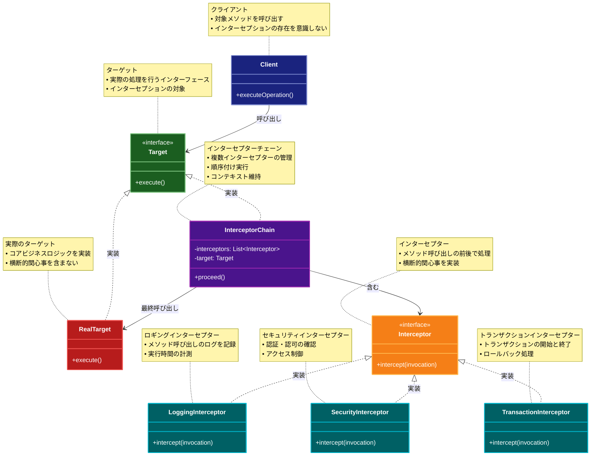

# Interceptor (インターセプター)

## 目的

メソッド呼び出しの前後に処理を挿入し、横断的な関心事（ロギング、認証、トランザクション管理など）を分離します。これにより、コアロジックとインフラストラクチャ的な処理を分離し、アプリケーションの保守性と拡張性を向上させます。

## 価値・解決する問題

- 横断的な関心事の分離と再利用
- メソッド呼び出しの前後処理を柔軟に追加
- アスペクト指向プログラミングの実現
- コアロジックの純粋性を保持
- 動的な振る舞いの追加
- デバッグとモニタリングの容易化
- テスト容易性の向上（モック/スタブの挿入）
- パフォーマンス計測の実装

## 概要・特徴

### 概要

Interceptorパターンは、メソッド呼び出しの前後に処理を挿入するための設計パターンです。このパターンを使用することで、ロギング、認証、トランザクション管理などの横断的な関心事を、コアロジックから分離して実装できます。特にフレームワークやミドルウェアの実装で広く使用されています。

### 特徴

- メソッド呼び出しの制御: 呼び出しの前後で処理を実行
- 透過的な処理: 元のメソッドを変更せずに機能を追加
- 動的な適用: 実行時に処理を追加・削除可能
- 関心事の分離: インフラストラクチャ的な処理を分離
- チェーン化: 複数のインターセプターを連鎖的に適用
- コンテキスト共有: 前後の処理でコンテキストを共有
- エラー処理: 例外ハンドリングと処理の中断
- 条件付き実行: 特定の条件下でのみ処理を実行

### 概要図



## 類似パターンとの比較

- [Middleware (ミドルウェア)](middleware.md): Interceptorはメソッド呼び出しの前後処理に注力し、これに対してMiddlewareはリクエスト処理の拡張に焦点を当てています。
- [Decorator (デコレーター)](decorator.md): Interceptorはメソッド呼び出しの制御に注力し、これに対してDecoratorはオブジェクトの機能拡張に焦点を当てています。
- [Proxy (プロキシ)](proxy.md): Interceptorはメソッド呼び出しの前後処理に注力し、これに対してProxyはオブジェクトへのアクセス制御に焦点を当てています。
- [Chain of Responsibility (責任の連鎖)](chain-of-responsibility.md): Interceptorはメソッド呼び出しの制御に注力し、これに対してChain of Responsibilityは処理の委譲に焦点を当てています。

## 利用されているライブラリ／フレームワークの事例

- [Spring AOP](https://docs.spring.io/spring-framework/docs/current/reference/html/core.html#aop): アスペクト指向プログラミング
- [NestJS Interceptors](https://docs.nestjs.com/interceptors): HTTPリクエスト/レスポンスの制御
- [Angular HTTP Interceptors](https://angular.io/guide/http#intercepting-requests-and-responses): HTTPリクエストの制御
- [Hibernate Interceptors](https://docs.jboss.org/hibernate/orm/5.4/userguide/html_single/Hibernate_User_Guide.html#events): エンティティの永続化制御

## 解説ページリンク

- [Baeldung - Intercepting Filter Pattern](https://www.baeldung.com/intercepting-filter-pattern-in-java)
- [Microsoft - Interceptor Pattern](https://docs.microsoft.com/aspnet/core/mvc/controllers/filters)
- [NestJS - Interceptors](https://docs.nestjs.com/interceptors)
- [Angular - HTTP Interceptors](https://angular.io/guide/http#intercepting-requests-and-responses)

## コード例

### Before:

単一のクラスで全ての処理を行う実装

```typescript
interface User {
  id: string;
  name: string;
  role: string;
}

class UserService {
  private users: Map<string, User> = new Map();

  async getUser(id: string): Promise<User> {
    console.log(`ユーザー取得開始: ${id}`);
    const startTime = Date.now();

    try {
      // 認証チェック
      if (!this.isAuthenticated()) {
        throw new Error("認証されていません");
      }

      // 権限チェック
      if (!this.hasPermission("read")) {
        throw new Error("権限がありません");
      }

      // キャッシュチェック
      const cachedUser = await this.checkCache(id);
      if (cachedUser) {
        return cachedUser;
      }

      // データベースからユーザーを取得
      const user = this.users.get(id);
      if (!user) {
        throw new Error("ユーザーが見つかりません");
      }

      // キャッシュを更新
      await this.updateCache(id, user);

      // ログ出力
      const endTime = Date.now();
      console.log(`ユーザー取得完了: ${id}, 処理時間: ${endTime - startTime}ms`);

      return user;
    } catch (error) {
      console.error("ユーザー取得エラー:", error);
      throw error;
    }
  }

  async createUser(user: User): Promise<void> {
    console.log(`ユーザー作成開始: ${user.id}`);
    const startTime = Date.now();

    try {
      // 認証チェック
      if (!this.isAuthenticated()) {
        throw new Error("認証されていません");
      }

      // 権限チェック
      if (!this.hasPermission("write")) {
        throw new Error("権限がありません");
      }

      // バリデーション
      if (!this.validateUser(user)) {
        throw new Error("無効なユーザーデータです");
      }

      // データベースにユーザーを保存
      this.users.set(user.id, user);

      // キャッシュを無効化
      await this.invalidateCache(user.id);

      // ログ出力
      const endTime = Date.now();
      console.log(`ユーザー作成完了: ${user.id}, 処理時間: ${endTime - startTime}ms`);
    } catch (error) {
      console.error("ユーザー作成エラー:", error);
      throw error;
    }
  }

  private isAuthenticated(): boolean {
    // 認証チェックの実装
    return true;
  }

  private hasPermission(action: string): boolean {
    // 権限チェックの実装
    return true;
  }

  private validateUser(user: User): boolean {
    // バリデーションの実装
    return true;
  }

  private async checkCache(id: string): Promise<User | null> {
    // キャッシュチェックの実装
    return null;
  }

  private async updateCache(id: string, user: User): Promise<void> {
    // キャッシュ更新の実装
  }

  private async invalidateCache(id: string): Promise<void> {
    // キャッシュ無効化の実装
  }
}

// 使用例
async function example() {
  const service = new UserService();
  const user: User = {
    id: "1",
    name: "John Doe",
    role: "user"
  };

  try {
    await service.createUser(user);
    const retrievedUser = await service.getUser(user.id);
    console.log("取得したユーザー:", retrievedUser);
  } catch (error) {
    console.error("エラー:", error);
  }
}

example();
```

### After:

Interceptor パターンを利用した実装

```typescript
interface User {
  id: string;
  name: string;
  role: string;
}

// メソッド呼び出しのコンテキスト
interface MethodContext {
  target: any;
  methodName: string;
  args: any[];
  result?: any;
  error?: Error;
  startTime?: number;
  endTime?: number;
  metadata: Map<string, any>;
}

// インターセプターのインターフェース
interface Interceptor {
  beforeMethod?(context: MethodContext): Promise<void>;
  afterMethod?(context: MethodContext): Promise<void>;
  onError?(context: MethodContext): Promise<void>;
}

// インターセプター実装の基底クラス
abstract class BaseInterceptor implements Interceptor {
  async beforeMethod?(context: MethodContext): Promise<void>;
  async afterMethod?(context: MethodContext): Promise<void>;
  async onError?(context: MethodContext): Promise<void>;
}

// ロギングインターセプター
class LoggingInterceptor extends BaseInterceptor {
  async beforeMethod(context: MethodContext): Promise<void> {
    context.startTime = Date.now();
    console.log(`${context.methodName}の実行開始:`, {
      args: context.args,
      timestamp: new Date(context.startTime).toISOString()
    });
  }

  async afterMethod(context: MethodContext): Promise<void> {
    context.endTime = Date.now();
    const duration = context.endTime - (context.startTime || 0);
    console.log(`${context.methodName}の実行完了:`, {
      duration: `${duration}ms`,
      result: context.result
    });
  }

  async onError(context: MethodContext): Promise<void> {
    console.error(`${context.methodName}でエラー発生:`, context.error);
  }
}

// 認証インターセプター
class AuthenticationInterceptor extends BaseInterceptor {
  async beforeMethod(context: MethodContext): Promise<void> {
    if (!this.isAuthenticated()) {
      throw new Error("認証されていません");
    }
  }

  private isAuthenticated(): boolean {
    // 認証チェックの実装
    return true;
  }
}

// 権限チェックインターセプター
class AuthorizationInterceptor extends BaseInterceptor {
  async beforeMethod(context: MethodContext): Promise<void> {
    const requiredPermission = this.getRequiredPermission(context.methodName);
    if (!this.hasPermission(requiredPermission)) {
      throw new Error(`権限がありません: ${requiredPermission}`);
    }
  }

  private getRequiredPermission(methodName: string): string {
    // メソッド名から必要な権限を判定
    return methodName.startsWith("get") ? "read" : "write";
  }

  private hasPermission(permission: string): boolean {
    // 権限チェックの実装
    return true;
  }
}

// キャッシュインターセプター
class CacheInterceptor extends BaseInterceptor {
  private cache: Map<string, any> = new Map();

  async beforeMethod(context: MethodContext): Promise<void> {
    if (context.methodName === "getUser") {
      const userId = context.args[0];
      const cached = this.cache.get(userId);
      if (cached) {
        context.result = cached;
        context.metadata.set("cacheHit", true);
        throw new Error("CACHE_HIT"); // 処理を中断してキャッシュを返す
      }
    }
  }

  async afterMethod(context: MethodContext): Promise<void> {
    if (context.methodName === "getUser" && context.result) {
      const userId = context.args[0];
      this.cache.set(userId, context.result);
    } else if (context.methodName === "createUser") {
      const user = context.args[0];
      this.cache.delete(user.id);
    }
  }
}

// パフォーマンス計測インターセプター
class PerformanceInterceptor extends BaseInterceptor {
  private measurements: Array<{
    method: string;
    duration: number;
    timestamp: string;
  }> = [];

  async beforeMethod(context: MethodContext): Promise<void> {
    context.startTime = Date.now();
  }

  async afterMethod(context: MethodContext): Promise<void> {
    context.endTime = Date.now();
    const duration = context.endTime - (context.startTime || 0);
    
    this.measurements.push({
      method: context.methodName,
      duration,
      timestamp: new Date().toISOString()
    });

    if (duration > 1000) { // 1秒以上かかった処理を警告
      console.warn(`パフォーマンス警告: ${context.methodName}の実行に${duration}ms要しました`);
    }
  }

  getMeasurements(): Array<{
    method: string;
    duration: number;
    timestamp: string;
  }> {
    return [...this.measurements];
  }
}

// インターセプター適用のためのデコレータファクトリ
function withInterceptors(...interceptors: Interceptor[]) {
  return function (target: any, methodName: string, descriptor: PropertyDescriptor) {
    const originalMethod = descriptor.value;

    descriptor.value = async function (...args: any[]) {
      const context: MethodContext = {
        target: this,
        methodName,
        args,
        metadata: new Map()
      };

      try {
        // beforeMethod の実行
        for (const interceptor of interceptors) {
          if (interceptor.beforeMethod) {
            try {
              await interceptor.beforeMethod(context);
            } catch (error) {
              if (error.message === "CACHE_HIT") {
                return context.result; // キャッシュヒットの場合は即座に返す
              }
              throw error;
            }
          }
        }

        // 元のメソッドの実行
        context.result = await originalMethod.apply(this, args);

        // afterMethod の実行
        for (const interceptor of interceptors.reverse()) {
          if (interceptor.afterMethod) {
            await interceptor.afterMethod(context);
          }
        }

        return context.result;
      } catch (error) {
        context.error = error;

        // onError の実行
        for (const interceptor of interceptors) {
          if (interceptor.onError) {
            await interceptor.onError(context);
          }
        }

        throw error;
      }
    };

    return descriptor;
  };
}

// インターセプターを適用したUserService
class UserService {
  private users: Map<string, User> = new Map();

  @withInterceptors(
    new LoggingInterceptor(),
    new AuthenticationInterceptor(),
    new AuthorizationInterceptor(),
    new CacheInterceptor(),
    new PerformanceInterceptor()
  )
  async getUser(id: string): Promise<User> {
    const user = this.users.get(id);
    if (!user) {
      throw new Error("ユーザーが見つかりません");
    }
    return user;
  }

  @withInterceptors(
    new LoggingInterceptor(),
    new AuthenticationInterceptor(),
    new AuthorizationInterceptor(),
    new CacheInterceptor(),
    new PerformanceInterceptor()
  )
  async createUser(user: User): Promise<void> {
    if (!this.validateUser(user)) {
      throw new Error("無効なユーザーデータです");
    }
    this.users.set(user.id, user);
  }

  private validateUser(user: User): boolean {
    return !!(user.id && user.name && user.role);
  }
}

// 使用例
async function example() {
  const service = new UserService();
  const user: User = {
    id: "1",
    name: "John Doe",
    role: "user"
  };

  try {
    console.log("=== ユーザー作成 ===");
    await service.createUser(user);

    console.log("\n=== ユーザー取得（1回目: キャッシュミス） ===");
    const firstGet = await service.getUser(user.id);
    console.log("取得したユーザー:", firstGet);

    console.log("\n=== ユーザー取得（2回目: キャッシュヒット） ===");
    const secondGet = await service.getUser(user.id);
    console.log("取得したユーザー:", secondGet);

    console.log("\n=== 存在しないユーザーの取得 ===");
    await service.getUser("999");
  } catch (error) {
    console.error("\nエラー発生:", error);
  }
}

example();
``` 