# Interceptor (インターセプター)

## 目的

メソッド呼び出しの前後に処理を挿入し、横断的な関心事（ロギング、認証、トランザクション管理など）を分離します。これにより、コアロジックとインフラストラクチャ的な処理を分離し、アプリケーションの保守性と拡張性を向上させます。

## 価値・解決する問題

- 横断的な関心事の分離と再利用
- メソッド呼び出しの前後処理を柔軟に追加
- アスペクト指向プログラミングの実現
- コアロジックの純粋性を保持
- 動的な振る舞いの追加
- デバッグとモニタリングの容易化
- テスト容易性の向上（モック/スタブの挿入）
- パフォーマンス計測の実装

## 概要・特徴

### 概要

Interceptorパターンは、メソッド呼び出しの前後に処理を挿入するための設計パターンです。このパターンを使用することで、ロギング、認証、トランザクション管理などの横断的な関心事を、コアロジックから分離して実装できます。特にフレームワークやミドルウェアの実装で広く使用されています。

### 特徴

#### メソッド呼び出しの制御
Interceptorパターンの中核的な特徴は、ターゲットメソッドの呼び出し前後に追加の処理を制御できることです。これにより、ターゲットメソッドの実行フローを拡張または変更することができます。具体的には、メソッド呼び出し前（pre-processing）では、入力パラメータの検証、変換、認証チェックなどを行い、メソッド呼び出し後（post-processing）では、戻り値の加工、メトリクスの記録、リソースのクリーンアップなどを実行できます。例えば、データベースアクセスメソッドの前後にトランザクション管理のロジックを挿入したり、リモートサービス呼び出しの前後にタイミング測定コードを配置したりすることが可能です。このメソッド呼び出しの制御機能により、核となるビジネスロジックに手を加えることなく、様々な付加的な処理を組み込むことができます。これは特に、既存のコードベースに対して新しい要件（監査、セキュリティ、パフォーマンスモニタリングなど）を追加する場合に非常に有用です。また、開発者はメソッドの実行を完全に制御できるため、条件によっては元のメソッド呼び出しをバイパスしたり、キャンセルしたりすることも可能です。

#### 透過的な処理
Interceptorパターンの重要な利点は、ターゲットとなるコンポーネントやクライアントのコードを変更することなく機能を追加できる透過性です。インターセプターは通常、プロキシオブジェクトや動的なラッパーとして実装され、元のターゲットと同じインターフェースを提供します。クライアントコードは、インターセプターが存在することを意識せずに、通常通りターゲットオブジェクトを使用することができます。例えば、既存のサービスクラスにロギング機能を追加する場合、サービスクラス自体やそれを使用するクライアントコードを変更する必要はなく、サービスクラスをラップするインターセプターを導入するだけで済みます。この透過性により、オープン/クローズドの原則（Open/Closed Principle）が効果的に実現され、既存のコードを修正せずに機能を拡張できます。これはレガシーシステムの保守や進化において特に価値があります。また、テスト環境では実際の実装をモックやスタブに置き換えるインターセプターを使用することで、単体テストが容易になります。この透過的な処理機能により、コードベースの安定性を保ちながら、新しい要件や変更に適応することができます。

#### 動的な適用
Interceptorパターンの強力な特徴の一つは、実行時に動的にインターセプターを追加、削除、または構成できることです。静的なコード変更や再コンパイルを必要とせずに、システムの振る舞いを動的に変更できます。この機能は通常、依存性注入フレームワーク、アスペクト指向プログラミング、またはリフレクションメカニズムを通じて実現されます。例えば、アプリケーションの設定に基づいて特定の環境（開発、テスト、本番）で異なるインターセプターを有効にしたり、特定のユーザーロールや実行コンテキストに応じてセキュリティインターセプターを選択的に適用したりすることができます。また、アプリケーションが実行中でも、管理インターフェースを通じてデバッグ用のインターセプターを一時的に有効にするなど、システムの動作を調整することが可能です。この動的な性質により、アプリケーションはより適応性が高く、様々な運用要件に対応できるようになります。特に、マイクロサービスアーキテクチャやクラウドネイティブ環境では、この動的構成能力が重要な利点となり、運用の柔軟性と効率性を高めます。

#### 関心事の分離
Interceptorパターンは、クロスカッティングコンサーン（横断的関心事）をビジネスロジックから明確に分離することを可能にします。認証、認可、ロギング、トランザクション管理、キャッシュ、エラーハンドリングなどのインフラストラクチャ的な関心事は、アプリケーションの様々な部分に適用される可能性がありますが、コアのビジネスロジックとは概念的に別のものです。インターセプターを使用することで、これらの関心事を個別のモジュールとして実装し、必要な場所で適用することができます。例えば、セキュリティインターセプターは認証と認可のロジックをカプセル化し、ロギングインターセプターはログ記録の詳細を処理します。この分離により、コードの各部分は単一の責任に集中でき（単一責任の原則）、全体的なシステムの保守性と理解しやすさが向上します。また、特定の関心事に関連するコードが一箇所に集約されるため、これらの機能の変更や拡張が容易になります。例えば、ロギング要件が変更された場合、ロギングインターセプターのみを更新すれば良く、アプリケーション全体のビジネスロジックに散在するロギングコードを修正する必要はありません。この関心事の分離は、特に大規模なエンタープライズアプリケーションにおいて、コードの複雑性を管理し、長期的な保守性を確保するために重要です。

#### チェーン化
Interceptorパターンの重要な機能の一つは、複数のインターセプターを連鎖的に適用する能力です。これにより、個々のインターセプターがそれぞれ特定の機能に集中しながら、全体として複雑な処理パイプラインを構築することができます。このチェーン（または責任の連鎖）では、各インターセプターが順番に処理を実行し、次のインターセプターに制御を渡します。例えば、HTTP要求のハンドリングでは、認証インターセプター、ロギングインターセプター、レート制限インターセプター、キャッシュインターセプターが順番に実行され、最終的にターゲットハンドラーが呼び出されることがあります。このチェーンは通常、特定の順序で構成され、前のインターセプターの出力が次のインターセプターの入力となります。チェーンの実行中、任意のインターセプターがチェーンの処理を中断し、元のクライアントにレスポンスを返すこともできます（例えば、認証に失敗した場合など）。このチェーン化のアプローチにより、インターセプターのモジュール性と再利用性が高まり、異なるアプリケーションコンテキストで様々なインターセプターの組み合わせを使用できるようになります。また、新しい要件が生じた場合、既存のチェーンに新しいインターセプターを追加するだけで対応できるため、システムの拡張性が向上します。多くのフレームワーク（Spring、Jakarta EE、ASP.NET Coreなど）では、このインターセプターチェーンの概念が中核的な機能として実装されています。

#### コンテキスト共有
インターセプターチェーン内での情報や状態の共有を可能にするコンテキスト機能は、Interceptorパターンの重要な側面です。このコンテキストは、インターセプターの前処理から後処理までの間、さらには異なるインターセプター間でデータを伝播するための仕組みを提供します。例えば、認証インターセプターが検証したユーザー情報を、後続の認可インターセプターやビジネスロジックで利用できるようにコンテキストに格納します。また、タイミングインターセプターは前処理で開始時間を記録し、後処理でその時間を取得して処理時間を計算することができます。このコンテキスト共有メカニズムは通常、リクエストスコープのオブジェクト、スレッドローカルストレージ、または明示的に渡されるコンテキストオブジェクトとして実装されます。例えば、Webアプリケーションでは、HttpServletRequestオブジェクトが属性を保存するためのコンテキストとして機能することがあります。コンテキスト共有により、インターセプター間の緩やかな結合が実現され、各インターセプターは他のインターセプターの実装詳細を知らなくても、共通のコンテキストを通じて協調して動作することができます。これは特に複雑な処理フローを持つエンタープライズアプリケーションにおいて、様々なコンポーネント間でのデータの受け渡しと状態管理を簡素化します。

#### エラー処理
Interceptorパターンにおけるエラー処理は、アプリケーション全体の堅牢性と一貫性を確保するための重要な機能です。インターセプターは、ターゲットメソッドやチェーン内の他のインターセプターから発生する例外をキャッチして処理することができます。これにより、集中化された例外処理ロジックを実装し、アプリケーション全体で一貫したエラーレスポンスを提供することが可能になります。例えば、グローバル例外インターセプターは、未処理の例外をキャッチして適切なログ記録を行い、クライアントに理解しやすいエラーメッセージを返すことができます。また、特定の例外タイプに基づいて異なる処理（リトライロジックの実行、フォールバック結果の提供、トランザクションのロールバックなど）を適用することも可能です。エラー処理インターセプターは、アプリケーションのエラー処理戦略を一元化することで、個々のビジネスメソッドがエラー処理の詳細で煩雑になるのを防ぎ、コアロジックを簡潔に保つことができます。さらに、開発環境と本番環境で異なるエラー処理動作を実装することも容易になります（例えば、開発環境では詳細なスタックトレースを提供し、本番環境ではユーザーフレンドリーなメッセージのみを表示するなど）。このように、インターセプターベースのエラー処理は、アプリケーションの品質と保守性を向上させる重要な手段となります。

#### 条件付き実行
Interceptorパターンの洗練された機能の一つは、特定の条件が満たされた場合にのみインターセプターを実行する能力です。すべてのメソッド呼び出しやリクエストに対してインターセプターを適用するのではなく、コンテキスト、メタデータ、実行時の状態などに基づいて選択的に適用することができます。この条件付き実行は、アノテーション、設定、または動的なルールエンジンを通じて実現されることが一般的です。例えば、特定のアノテーションが付けられたメソッドにのみセキュリティインターセプターを適用したり、特定のユーザーロールを持つリクエストにのみ監査インターセプターを適用したりすることができます。また、システムの負荷状態やリソース使用率に基づいて、デバッグやモニタリングインターセプターの有効化/無効化を動的に制御することも可能です。この条件付き実行メカニズムにより、不必要な処理オーバーヘッドを避けながら、必要な場所でのみインターセプターの機能を活用することができます。特に高パフォーマンスが要求されるシステムでは、この選択的適用により、インターセプターの利点を享受しつつ、パフォーマンスへの影響を最小限に抑えることができます。また、フィーチャーフラグやA/Bテスト機能と組み合わせることで、特定のユーザーグループに対してのみ新しいインターセプター機能をロールアウトするなど、より洗練された運用戦略が可能になります。

### 概要図

```mermaid
classDiagram
    class Client {
        +executeOperation()
    }
    note for Client "クライアント
• 対象メソッドを呼び出す
• インターセプションの存在を意識しない"

    class Target {
        <<interface>>
        +execute()
    }
    note for Target "ターゲット
• 実際の処理を行うインターフェース
• インターセプションの対象"

    class RealTarget {
        +execute()
    }
    note for RealTarget "実際のターゲット
• コアビジネスロジックを実装
• 横断的関心事を含まない"

    class Interceptor {
        <<interface>>
        +intercept(invocation)
    }
    note for Interceptor "インターセプター
• メソッド呼び出しの前後で処理
• 横断的関心事を実装"

    class LoggingInterceptor {
        +intercept(invocation)
    }
    note for LoggingInterceptor "ロギングインターセプター
• メソッド呼び出しのログを記録
• 実行時間の計測"

    class SecurityInterceptor {
        +intercept(invocation)
    }
    note for SecurityInterceptor "セキュリティインターセプター
• 認証・認可の確認
• アクセス制御"

    class TransactionInterceptor {
        +intercept(invocation)
    }
    note for TransactionInterceptor "トランザクションインターセプター
• トランザクションの開始と終了
• ロールバック処理"

    class InterceptorChain {
        -interceptors: List~Interceptor~
        -target: Target
        +proceed()
    }
    note for InterceptorChain "インターセプターチェーン
• 複数インターセプターの管理
• 順序付け実行
• コンテキスト維持"

    Client --> Target : 呼び出し
    Target <|.. RealTarget : 実装
    Target <|.. InterceptorChain : 実装
    InterceptorChain --> Interceptor : 含む
    Interceptor <|.. LoggingInterceptor : 実装
    Interceptor <|.. SecurityInterceptor : 実装
    Interceptor <|.. TransactionInterceptor : 実装
    InterceptorChain --> RealTarget : 最終呼び出し

    %% スタイル定義
    style Client fill:#1a237e,stroke:#7986cb,stroke-width:2px,color:#ffffff
    style Target fill:#1b5e20,stroke:#81c784,stroke-width:2px,color:#ffffff
    style RealTarget fill:#b71c1c,stroke:#ef5350,stroke-width:2px,color:#ffffff
    style Interceptor fill:#f57f17,stroke:#ffb74d,stroke-width:2px,color:#ffffff
    style InterceptorChain fill:#4a148c,stroke:#9c27b0,stroke-width:2px,color:#ffffff
    style LoggingInterceptor fill:#006064,stroke:#00bcd4,stroke-width:2px,color:#ffffff
    style SecurityInterceptor fill:#006064,stroke:#00bcd4,stroke-width:2px,color:#ffffff
    style TransactionInterceptor fill:#006064,stroke:#00bcd4,stroke-width:2px,color:#ffffff
```



## 類似パターンとの比較

- [Middleware (ミドルウェア)](middleware.md): Interceptorはメソッド呼び出しの前後処理に注力し、これに対してMiddlewareはリクエスト処理の拡張に焦点を当てています。
- [Decorator (デコレーター)](decorator.md): Interceptorはメソッド呼び出しの制御に注力し、これに対してDecoratorはオブジェクトの機能拡張に焦点を当てています。
- [Proxy (プロキシ)](proxy.md): Interceptorはメソッド呼び出しの前後処理に注力し、これに対してProxyはオブジェクトへのアクセス制御に焦点を当てています。
- [Chain of Responsibility (責任の連鎖)](chain-of-responsibility.md): Interceptorはメソッド呼び出しの制御に注力し、これに対してChain of Responsibilityは処理の委譲に焦点を当てています。

## 利用されているライブラリ／フレームワークの事例

- [Spring AOP](https://docs.spring.io/spring-framework/docs/current/reference/html/core.html#aop): アスペクト指向プログラミング
- [NestJS Interceptors](https://docs.nestjs.com/interceptors): HTTPリクエスト/レスポンスの制御
- [Angular HTTP Interceptors](https://angular.io/guide/http#intercepting-requests-and-responses): HTTPリクエストの制御
- [Hibernate Interceptors](https://docs.jboss.org/hibernate/orm/5.4/userguide/html_single/Hibernate_User_Guide.html#events): エンティティの永続化制御

## 解説ページリンク

- [Baeldung - Intercepting Filter Pattern](https://www.baeldung.com/intercepting-filter-pattern-in-java)
- [Microsoft - Interceptor Pattern](https://docs.microsoft.com/aspnet/core/mvc/controllers/filters)
- [NestJS - Interceptors](https://docs.nestjs.com/interceptors)
- [Angular - HTTP Interceptors](https://angular.io/guide/http#intercepting-requests-and-responses)

## コード例

### Before:

単一のクラスで全ての処理を行う実装

```typescript
interface User {
  id: string;
  name: string;
  role: string;
}

class UserService {
  private users: Map<string, User> = new Map();

  async getUser(id: string): Promise<User> {
    console.log(`ユーザー取得開始: ${id}`);
    const startTime = Date.now();

    try {
      // 認証チェック
      if (!this.isAuthenticated()) {
        throw new Error("認証されていません");
      }

      // 権限チェック
      if (!this.hasPermission("read")) {
        throw new Error("権限がありません");
      }

      // キャッシュチェック
      const cachedUser = await this.checkCache(id);
      if (cachedUser) {
        return cachedUser;
      }

      // データベースからユーザーを取得
      const user = this.users.get(id);
      if (!user) {
        throw new Error("ユーザーが見つかりません");
      }

      // キャッシュを更新
      await this.updateCache(id, user);

      // ログ出力
      const endTime = Date.now();
      console.log(`ユーザー取得完了: ${id}, 処理時間: ${endTime - startTime}ms`);

      return user;
    } catch (error) {
      console.error("ユーザー取得エラー:", error);
      throw error;
    }
  }

  async createUser(user: User): Promise<void> {
    console.log(`ユーザー作成開始: ${user.id}`);
    const startTime = Date.now();

    try {
      // 認証チェック
      if (!this.isAuthenticated()) {
        throw new Error("認証されていません");
      }

      // 権限チェック
      if (!this.hasPermission("write")) {
        throw new Error("権限がありません");
      }

      // バリデーション
      if (!this.validateUser(user)) {
        throw new Error("無効なユーザーデータです");
      }

      // データベースにユーザーを保存
      this.users.set(user.id, user);

      // キャッシュを無効化
      await this.invalidateCache(user.id);

      // ログ出力
      const endTime = Date.now();
      console.log(`ユーザー作成完了: ${user.id}, 処理時間: ${endTime - startTime}ms`);
    } catch (error) {
      console.error("ユーザー作成エラー:", error);
      throw error;
    }
  }

  private isAuthenticated(): boolean {
    // 認証チェックの実装
    return true;
  }

  private hasPermission(action: string): boolean {
    // 権限チェックの実装
    return true;
  }

  private validateUser(user: User): boolean {
    // バリデーションの実装
    return true;
  }

  private async checkCache(id: string): Promise<User | null> {
    // キャッシュチェックの実装
    return null;
  }

  private async updateCache(id: string, user: User): Promise<void> {
    // キャッシュ更新の実装
  }

  private async invalidateCache(id: string): Promise<void> {
    // キャッシュ無効化の実装
  }
}

// 使用例
async function example() {
  const service = new UserService();
  const user: User = {
    id: "1",
    name: "John Doe",
    role: "user"
  };

  try {
    await service.createUser(user);
    const retrievedUser = await service.getUser(user.id);
    console.log("取得したユーザー:", retrievedUser);
  } catch (error) {
    console.error("エラー:", error);
  }
}

example();
```

### After:

Interceptor パターンを利用した実装

```typescript
interface User {
  id: string;
  name: string;
  role: string;
}

// メソッド呼び出しのコンテキスト
interface MethodContext {
  target: any;
  methodName: string;
  args: any[];
  result?: any;
  error?: Error;
  startTime?: number;
  endTime?: number;
  metadata: Map<string, any>;
}

// インターセプターのインターフェース
interface Interceptor {
  beforeMethod?(context: MethodContext): Promise<void>;
  afterMethod?(context: MethodContext): Promise<void>;
  onError?(context: MethodContext): Promise<void>;
}

// インターセプター実装の基底クラス
abstract class BaseInterceptor implements Interceptor {
  async beforeMethod?(context: MethodContext): Promise<void>;
  async afterMethod?(context: MethodContext): Promise<void>;
  async onError?(context: MethodContext): Promise<void>;
}

// ロギングインターセプター
class LoggingInterceptor extends BaseInterceptor {
  async beforeMethod(context: MethodContext): Promise<void> {
    context.startTime = Date.now();
    console.log(`${context.methodName}の実行開始:`, {
      args: context.args,
      timestamp: new Date(context.startTime).toISOString()
    });
  }

  async afterMethod(context: MethodContext): Promise<void> {
    context.endTime = Date.now();
    const duration = context.endTime - (context.startTime || 0);
    console.log(`${context.methodName}の実行完了:`, {
      duration: `${duration}ms`,
      result: context.result
    });
  }

  async onError(context: MethodContext): Promise<void> {
    console.error(`${context.methodName}でエラー発生:`, context.error);
  }
}

// 認証インターセプター
class AuthenticationInterceptor extends BaseInterceptor {
  async beforeMethod(context: MethodContext): Promise<void> {
    if (!this.isAuthenticated()) {
      throw new Error("認証されていません");
    }
  }

  private isAuthenticated(): boolean {
    // 認証チェックの実装
    return true;
  }
}

// 権限チェックインターセプター
class AuthorizationInterceptor extends BaseInterceptor {
  async beforeMethod(context: MethodContext): Promise<void> {
    const requiredPermission = this.getRequiredPermission(context.methodName);
    if (!this.hasPermission(requiredPermission)) {
      throw new Error(`権限がありません: ${requiredPermission}`);
    }
  }

  private getRequiredPermission(methodName: string): string {
    // メソッド名から必要な権限を判定
    return methodName.startsWith("get") ? "read" : "write";
  }

  private hasPermission(permission: string): boolean {
    // 権限チェックの実装
    return true;
  }
}

// キャッシュインターセプター
class CacheInterceptor extends BaseInterceptor {
  private cache: Map<string, any> = new Map();

  async beforeMethod(context: MethodContext): Promise<void> {
    if (context.methodName === "getUser") {
      const userId = context.args[0];
      const cached = this.cache.get(userId);
      if (cached) {
        context.result = cached;
        context.metadata.set("cacheHit", true);
        throw new Error("CACHE_HIT"); // 処理を中断してキャッシュを返す
      }
    }
  }

  async afterMethod(context: MethodContext): Promise<void> {
    if (context.methodName === "getUser" && context.result) {
      const userId = context.args[0];
      this.cache.set(userId, context.result);
    } else if (context.methodName === "createUser") {
      const user = context.args[0];
      this.cache.delete(user.id);
    }
  }
}

// パフォーマンス計測インターセプター
class PerformanceInterceptor extends BaseInterceptor {
  private measurements: Array<{
    method: string;
    duration: number;
    timestamp: string;
  }> = [];

  async beforeMethod(context: MethodContext): Promise<void> {
    context.startTime = Date.now();
  }

  async afterMethod(context: MethodContext): Promise<void> {
    context.endTime = Date.now();
    const duration = context.endTime - (context.startTime || 0);
    
    this.measurements.push({
      method: context.methodName,
      duration,
      timestamp: new Date().toISOString()
    });

    if (duration > 1000) { // 1秒以上かかった処理を警告
      console.warn(`パフォーマンス警告: ${context.methodName}の実行に${duration}ms要しました`);
    }
  }

  getMeasurements(): Array<{
    method: string;
    duration: number;
    timestamp: string;
  }> {
    return [...this.measurements];
  }
}

// インターセプター適用のためのデコレータファクトリ
function withInterceptors(...interceptors: Interceptor[]) {
  return function (target: any, methodName: string, descriptor: PropertyDescriptor) {
    const originalMethod = descriptor.value;

    descriptor.value = async function (...args: any[]) {
      const context: MethodContext = {
        target: this,
        methodName,
        args,
        metadata: new Map()
      };

      try {
        // beforeMethod の実行
        for (const interceptor of interceptors) {
          if (interceptor.beforeMethod) {
            try {
              await interceptor.beforeMethod(context);
            } catch (error) {
              if (error.message === "CACHE_HIT") {
                return context.result; // キャッシュヒットの場合は即座に返す
              }
              throw error;
            }
          }
        }

        // 元のメソッドの実行
        context.result = await originalMethod.apply(this, args);

        // afterMethod の実行
        for (const interceptor of interceptors.reverse()) {
          if (interceptor.afterMethod) {
            await interceptor.afterMethod(context);
          }
        }

        return context.result;
      } catch (error) {
        context.error = error;

        // onError の実行
        for (const interceptor of interceptors) {
          if (interceptor.onError) {
            await interceptor.onError(context);
          }
        }

        throw error;
      }
    };

    return descriptor;
  };
}

// インターセプターを適用したUserService
class UserService {
  private users: Map<string, User> = new Map();

  @withInterceptors(
    new LoggingInterceptor(),
    new AuthenticationInterceptor(),
    new AuthorizationInterceptor(),
    new CacheInterceptor(),
    new PerformanceInterceptor()
  )
  async getUser(id: string): Promise<User> {
    const user = this.users.get(id);
    if (!user) {
      throw new Error("ユーザーが見つかりません");
    }
    return user;
  }

  @withInterceptors(
    new LoggingInterceptor(),
    new AuthenticationInterceptor(),
    new AuthorizationInterceptor(),
    new CacheInterceptor(),
    new PerformanceInterceptor()
  )
  async createUser(user: User): Promise<void> {
    if (!this.validateUser(user)) {
      throw new Error("無効なユーザーデータです");
    }
    this.users.set(user.id, user);
  }

  private validateUser(user: User): boolean {
    return !!(user.id && user.name && user.role);
  }
}

// 使用例
async function example() {
  const service = new UserService();
  const user: User = {
    id: "1",
    name: "John Doe",
    role: "user"
  };

  try {
    console.log("=== ユーザー作成 ===");
    await service.createUser(user);

    console.log("\n=== ユーザー取得（1回目: キャッシュミス） ===");
    const firstGet = await service.getUser(user.id);
    console.log("取得したユーザー:", firstGet);

    console.log("\n=== ユーザー取得（2回目: キャッシュヒット） ===");
    const secondGet = await service.getUser(user.id);
    console.log("取得したユーザー:", secondGet);

    console.log("\n=== 存在しないユーザーの取得 ===");
    await service.getUser("999");
  } catch (error) {
    console.error("\nエラー発生:", error);
  }
}

example();
``` 