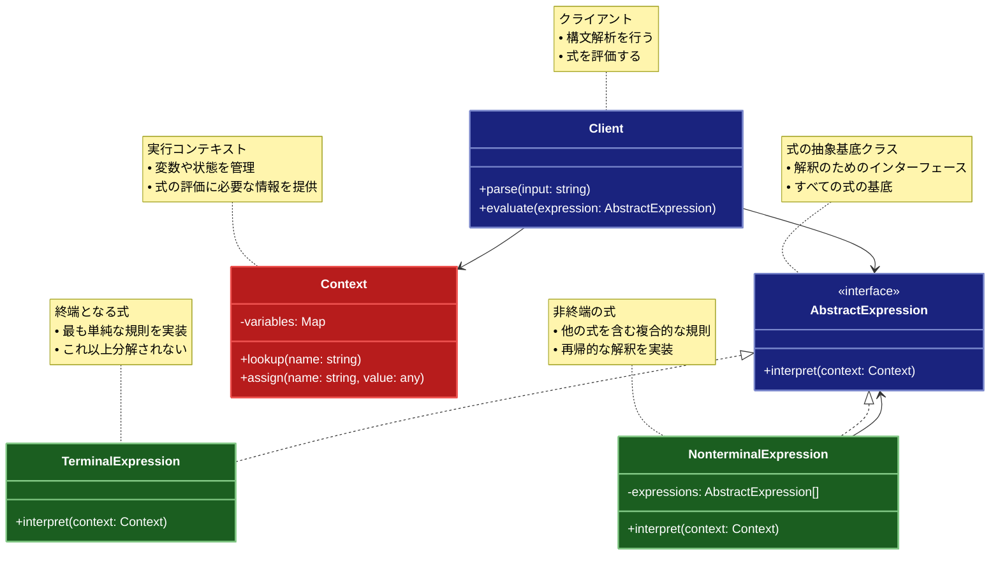

# Interpreter（インタープリター）パターン

## 目的

特定の言語の文法を解釈し、その言語で書かれた文を評価・実行するためのパターンです。

## 価値・解決する問題

- 文法規則をクラスとして表現できます
- 新しい文法規則の追加が容易です
- 言語の解釈と実行を分離できます
- 文法の変更に柔軟に対応できます
- 複雑な処理を単純な要素に分解できます

## 概要・特徴

### 概要

Interpreterパターンは、特定の言語の文法規則をクラス階層として表現し、その言語で書かれた文を解釈・実行する設計パターンです。このパターンでは、言語の各文法規則を表現するためのクラスを定義し、それらを組み合わせることで構文木を構築します。その後、構文木を走査しながら各ノードを評価することで、文の意味を解釈・実行します。

### 特徴

#### 文法規則のクラス表現

言語の文法規則をクラス階層として表現することで、各規則を明確に分離し、体系的に管理できます。各文法規則は抽象表現クラスのサブクラスとして実装され、それぞれが特定の規則の解釈方法を定義します。例えば、数式言語の場合、「数値」「演算子」「括弧式」などの各要素がクラスとして表現されます。これにより、言語の文法構造がコード上でも明確に表現され、規則の追加や変更が容易になります。また、文法規則の複雑な相互関係も、クラス間の関係として明示的にモデル化できます。

#### 再帰的な構造

Interpreterパターンは再帰的な性質を持っており、複雑な式を単純な式の組み合わせとして表現できます。非終端表現（NonterminalExpression）は他の表現を内部に持ち、それらを組み合わせて解釈します。例えば、プログラミング言語における「if文」は条件式と、真の場合と偽の場合の2つのコードブロックを持つ非終端表現として実装できます。この再帰的な構造により、単純な基本要素から複雑な言語構造を構築することが可能になり、言語の表現力を高めることができます。また、再帰的な処理により、深くネストした構造も効率的に処理できます。

#### 文法の拡張性

新しい文法規則を追加する際に、既存のコードを変更することなく、新しい表現クラスを追加するだけで済みます。これにより、言語機能を段階的に拡張できます。例えば、計算機アプリケーションに、基本の四則演算に加えて、三角関数や対数などの高度な数学関数を後から追加することが容易になります。この拡張性は、開放/閉鎖原則（OCP）に準拠しており、既存の機能を壊すことなく新機能を追加できるため、言語の進化や要件の変更に柔軟に対応できます。

#### 実行コンテキストの管理

インタープリターパターンではコンテキストオブジェクトを使用して、解釈プロセス中の状態（変数、関数定義など）を管理します。このコンテキストは式の評価に必要な情報を保持し、式間で共有されます。例えば、スクリプト言語の実行環境では、コンテキストに変数のスコープや関数テーブルなどが含まれます。コンテキストを通じて情報を共有することで、式の評価が互いに影響を与え合うことが可能になり、状態を持つ言語の実装が可能になります。また、コンテキストを分離することで、同じ文法を異なる環境で再利用することもできます。

#### 構文解析の分離

インタープリターパターンでは、通常、構文解析（パース）と解釈（評価）のフェーズを分離します。まず構文解析器が入力テキストを解析して構文木を構築し、その後、インタープリターが構文木を評価します。この分離により、それぞれの責任が明確になり、保守性が向上します。例えば、JSONパーサーでは、JSON文字列の構文解析と実際のデータ構造への変換が分離されます。この分離により、構文解析のアルゴリズムを変更しても解釈部分に影響を与えず、またその逆も可能です。これにより、言語処理の各段階を独立して最適化したり改良したりすることができます。

### 概要図



## 類似パターンとの比較

- [Composite (コンポジット)](composite.md): Interpreter は文法規則を階層構造で表現し、これに対して Composite は一般的なオブジェクトの階層構造を扱います。
- [Visitor (ビジター)](visitor.md): Interpreter は文法規則を解釈し、これに対して Visitor は構造を巡回して処理を行います。
- [Command (コマンド)](command.md): Interpreter は文法規則を解釈し、これに対して Command は処理をカプセル化します。

## 利用されているライブラリ／フレームワークの事例

- [ANTLR](https://github.com/antlr/antlr4): 構文解析ツール
- [Jison](https://github.com/zaach/jison): JavaScriptパーサージェネレーター
- [PEG.js](https://github.com/pegjs/pegjs): パーサージェネレーター

## 解説ページリンク

- [Refactoring Guru - Interpreter](https://refactoring.guru/design-patterns/interpreter)
- [Microsoft - Interpreter Pattern](https://docs.microsoft.com/en-us/previous-versions/msp-n-p/ee658117(v=pandp.10))
- [SourceMaking - Interpreter](https://sourcemaking.com/design_patterns/interpreter)

## コード例

### Before:

文法規則を直接処理する実装

```typescript
// 数式を計算する関数
function evaluateExpression(expression: string): number {
  // 空白を削除
  expression = expression.replace(/\s+/g, "");

  // 単純な四則演算のみをサポート
  let result = 0;
  let currentNumber = "";
  let currentOperator = "+";

  for (let i = 0; i < expression.length; i++) {
    const char = expression[i];

    if (char >= "0" && char <= "9") {
      currentNumber += char;
    } else if (["+", "-", "*", "/"].includes(char)) {
      if (currentNumber !== "") {
        switch (currentOperator) {
          case "+":
            result += parseInt(currentNumber);
            break;
          case "-":
            result -= parseInt(currentNumber);
            break;
          case "*":
            result *= parseInt(currentNumber);
            break;
          case "/":
            result /= parseInt(currentNumber);
            break;
        }
        currentNumber = "";
      }
      currentOperator = char;
    }
  }

  // 最後の数字を処理
  if (currentNumber !== "") {
    switch (currentOperator) {
      case "+":
        result += parseInt(currentNumber);
        break;
      case "-":
        result -= parseInt(currentNumber);
        break;
      case "*":
        result *= parseInt(currentNumber);
        break;
      case "/":
        result /= parseInt(currentNumber);
        break;
    }
  }

  return result;
}

// 使用例
function example() {
  const expressions = [
    "1 + 2",
    "3 - 1",
    "2 * 3",
    "6 / 2",
    "1 + 2 * 3",
  ];

  expressions.forEach(expr => {
    console.log(`式: ${expr}`);
    console.log(`結果: ${evaluateExpression(expr)}`);
    console.log();
  });
}

example();
```

### After:

Interpreterパターンを適用した実装

```typescript
// 式を表す抽象クラス
abstract class Expression {
  abstract interpret(context: Context): number;
  abstract toString(): string;
}

// 数値を表すクラス
class NumberExpression extends Expression {
  constructor(private value: number) {
    super();
  }

  interpret(context: Context): number {
    return this.value;
  }

  toString(): string {
    return this.value.toString();
  }
}

// 加算を表すクラス
class AddExpression extends Expression {
  constructor(
    private left: Expression,
    private right: Expression
  ) {
    super();
  }

  interpret(context: Context): number {
    return this.left.interpret(context) + this.right.interpret(context);
  }

  toString(): string {
    return `(${this.left.toString()} + ${this.right.toString()})`;
  }
}

// 減算を表すクラス
class SubtractExpression extends Expression {
  constructor(
    private left: Expression,
    private right: Expression
  ) {
    super();
  }

  interpret(context: Context): number {
    return this.left.interpret(context) - this.right.interpret(context);
  }

  toString(): string {
    return `(${this.left.toString()} - ${this.right.toString()})`;
  }
}

// 乗算を表すクラス
class MultiplyExpression extends Expression {
  constructor(
    private left: Expression,
    private right: Expression
  ) {
    super();
  }

  interpret(context: Context): number {
    return this.left.interpret(context) * this.right.interpret(context);
  }

  toString(): string {
    return `(${this.left.toString()} * ${this.right.toString()})`;
  }
}

// 除算を表すクラス
class DivideExpression extends Expression {
  constructor(
    private left: Expression,
    private right: Expression
  ) {
    super();
  }

  interpret(context: Context): number {
    const rightValue = this.right.interpret(context);
    if (rightValue === 0) {
      throw new Error("0で除算することはできません");
    }
    return this.left.interpret(context) / rightValue;
  }

  toString(): string {
    return `(${this.left.toString()} / ${this.right.toString()})`;
  }
}

// 変数を表すクラス
class VariableExpression extends Expression {
  constructor(private name: string) {
    super();
  }

  interpret(context: Context): number {
    const value = context.getVariable(this.name);
    if (value === undefined) {
      throw new Error(`変数 '${this.name}' が定義されていません`);
    }
    return value;
  }

  toString(): string {
    return this.name;
  }
}

// 文脈を表すクラス
class Context {
  private variables: Map<string, number> = new Map();

  setVariable(name: string, value: number): void {
    this.variables.set(name, value);
  }

  getVariable(name: string): number | undefined {
    return this.variables.get(name);
  }
}

// パーサークラス
class Parser {
  private tokens: string[] = [];
  private position: number = 0;

  parse(expression: string): Expression {
    // 式をトークンに分割
    this.tokens = expression
      .replace(/\s+/g, "")
      .split(/([\+\-\*\/\(\)])/)
      .filter(token => token.length > 0);
    this.position = 0;

    return this.parseExpression();
  }

  private parseExpression(): Expression {
    let left = this.parseTerm();

    while (this.position < this.tokens.length) {
      const operator = this.tokens[this.position];
      if (operator !== "+" && operator !== "-") {
        break;
      }
      this.position++;

      const right = this.parseTerm();
      if (operator === "+") {
        left = new AddExpression(left, right);
      } else {
        left = new SubtractExpression(left, right);
      }
    }

    return left;
  }

  private parseTerm(): Expression {
    let left = this.parseFactor();

    while (this.position < this.tokens.length) {
      const operator = this.tokens[this.position];
      if (operator !== "*" && operator !== "/") {
        break;
      }
      this.position++;

      const right = this.parseFactor();
      if (operator === "*") {
        left = new MultiplyExpression(left, right);
      } else {
        left = new DivideExpression(left, right);
      }
    }

    return left;
  }

  private parseFactor(): Expression {
    const token = this.tokens[this.position++];

    if (token === "(") {
      const expression = this.parseExpression();
      if (this.tokens[this.position++] !== ")") {
        throw new Error("閉じ括弧がありません");
      }
      return expression;
    }

    if (token.match(/^[0-9]+$/)) {
      return new NumberExpression(parseInt(token));
    }

    if (token.match(/^[a-zA-Z_][a-zA-Z0-9_]*$/)) {
      return new VariableExpression(token);
    }

    throw new Error(`不正なトークンです: ${token}`);
  }
}

// 使用例
function example() {
  const parser = new Parser();
  const context = new Context();

  // 変数の設定
  context.setVariable("x", 5);
  context.setVariable("y", 3);

  // テスト用の式
  const expressions = [
    "1 + 2",
    "3 - 1",
    "2 * 3",
    "6 / 2",
    "1 + 2 * 3",
    "(1 + 2) * 3",
    "x + y",
    "x * y + 2",
    "(x + 1) * (y - 1)"
  ];

  expressions.forEach(expr => {
    try {
      console.log("=== 式の評価 ===");
      console.log(`入力式: ${expr}`);
      
      const ast = parser.parse(expr);
      console.log(`構文木: ${ast.toString()}`);
      
      const result = ast.interpret(context);
      console.log(`評価結果: ${result}`);
      console.log();
    } catch (error) {
      console.error(`エラー: ${error.message}`);
      console.log();
    }
  });

  // エラーケースのテスト
  console.log("=== エラーケースのテスト ===");
  
  try {
    const invalidExpr = "1 + * 2";
    console.log(`不正な式: ${invalidExpr}`);
    parser.parse(invalidExpr);
  } catch (error) {
    console.error(`エラー: ${error.message}`);
  }

  try {
    const divByZero = "1 / 0";
    console.log(`\n0除算: ${divByZero}`);
    const ast = parser.parse(divByZero);
    ast.interpret(context);
  } catch (error) {
    console.error(`エラー: ${error.message}`);
  }

  try {
    const undefinedVar = "a + b";
    console.log(`\n未定義変数: ${undefinedVar}`);
    const ast = parser.parse(undefinedVar);
    ast.interpret(context);
  } catch (error) {
    console.error(`エラー: ${error.message}`);
  }
}

example();

// 関数型プログラミングスタイルによるInterpreterパターンの実装

// 式の型定義
type ExpressionType = 
  | { type: 'number'; value: number }
  | { type: 'variable'; name: string }
  | { type: 'add'; left: Expression; right: Expression }
  | { type: 'subtract'; left: Expression; right: Expression }
  | { type: 'multiply'; left: Expression; right: Expression }
  | { type: 'divide'; left: Expression; right: Expression };

type Expression = ExpressionType;

// コンテキスト（変数マップ）
type Context = ReadonlyMap<string, number>;

// 式の解釈関数
const interpret = (expr: Expression, context: Context): number => {
  switch (expr.type) {
    case 'number':
      return expr.value;
      
    case 'variable':
      const value = context.get(expr.name);
      if (value === undefined) {
        throw new Error(`変数 '${expr.name}' が定義されていません`);
      }
      return value;
      
    case 'add':
      return interpret(expr.left, context) + interpret(expr.right, context);
      
    case 'subtract':
      return interpret(expr.left, context) - interpret(expr.right, context);
      
    case 'multiply':
      return interpret(expr.left, context) * interpret(expr.right, context);
      
    case 'divide':
      const divisor = interpret(expr.right, context);
      if (divisor === 0) {
        throw new Error('0で除算することはできません');
      }
      return interpret(expr.left, context) / divisor;
  }
};

// 式をわかりやすく文字列に変換する関数
const expressionToString = (expr: Expression): string => {
  switch (expr.type) {
    case 'number':
      return expr.value.toString();
      
    case 'variable':
      return expr.name;
      
    case 'add':
      return `(${expressionToString(expr.left)} + ${expressionToString(expr.right)})`;
      
    case 'subtract':
      return `(${expressionToString(expr.left)} - ${expressionToString(expr.right)})`;
      
    case 'multiply':
      return `(${expressionToString(expr.left)} * ${expressionToString(expr.right)})`;
      
    case 'divide':
      return `(${expressionToString(expr.left)} / ${expressionToString(expr.right)})`;
  }
};

// 式ビルダー関数（式の生成を簡素化）
const number = (value: number): Expression => ({ type: 'number', value });
const variable = (name: string): Expression => ({ type: 'variable', name });
const add = (left: Expression, right: Expression): Expression => ({ type: 'add', left, right });
const subtract = (left: Expression, right: Expression): Expression => ({ type: 'subtract', left, right });
const multiply = (left: Expression, right: Expression): Expression => ({ type: 'multiply', left, right });
const divide = (left: Expression, right: Expression): Expression => ({ type: 'divide', left, right });

// トークンの型定義
type Token = 
  | { type: 'number'; value: number }
  | { type: 'variable'; name: string }
  | { type: 'operator'; value: '+' | '-' | '*' | '/' }
  | { type: 'parenthesis'; value: '(' | ')' };

// 文字列をトークンに分割する関数
const tokenize = (input: string): Token[] => {
  // 空白を削除し、基本的なトークンに分割
  const tokenStrings = input
    .replace(/\s+/g, '')
    .split(/([\+\-\*\/\(\)])/)
    .filter(token => token.length > 0);
  
  // 文字列トークンをトークンオブジェクトに変換
  return tokenStrings.map(str => {
    if (str.match(/^[0-9]+$/)) {
      return { type: 'number', value: parseInt(str, 10) };
    } else if (str.match(/^[a-zA-Z_][a-zA-Z0-9_]*$/)) {
      return { type: 'variable', name: str };
    } else if (['+', '-', '*', '/'].includes(str)) {
      return { type: 'operator', value: str as '+' | '-' | '*' | '/' };
    } else if (['(', ')'].includes(str)) {
      return { type: 'parenthesis', value: str as '(' | ')' };
    } else {
      throw new Error(`不正なトークンです: ${str}`);
    }
  });
};

// 再帰的降下構文解析を使った純粋関数パーサー
const parse = (input: string): Expression => {
  const tokens = tokenize(input);
  let position = 0;
  
  // 現在のトークンを取得
  const peek = (): Token | undefined => tokens[position];
  
  // 次のトークンに進む
  const consume = (): Token => {
    if (position >= tokens.length) {
      throw new Error('予期せぬ入力の終わりです');
    }
    return tokens[position++];
  };
  
  // 式の解析
  const parseExpression = (): Expression => {
    let left = parseTerm();
    
    while (position < tokens.length) {
      const token = peek();
      if (!token || token.type !== 'operator' || (token.value !== '+' && token.value !== '-')) {
        break;
      }
      
      const operator = consume() as { type: 'operator'; value: '+' | '-' };
      const right = parseTerm();
      
      if (operator.value === '+') {
        left = add(left, right);
      } else {
        left = subtract(left, right);
      }
    }
    
    return left;
  };
  
  // 項の解析
  const parseTerm = (): Expression => {
    let left = parseFactor();
    
    while (position < tokens.length) {
      const token = peek();
      if (!token || token.type !== 'operator' || (token.value !== '*' && token.value !== '/')) {
        break;
      }
      
      const operator = consume() as { type: 'operator'; value: '*' | '/' };
      const right = parseFactor();
      
      if (operator.value === '*') {
        left = multiply(left, right);
      } else {
        left = divide(left, right);
      }
    }
    
    return left;
  };
  
  // 因子の解析
  const parseFactor = (): Expression => {
    const token = consume();
    
    if (token.type === 'parenthesis' && token.value === '(') {
      const expr = parseExpression();
      const closingToken = consume();
      
      if (closingToken.type !== 'parenthesis' || closingToken.value !== ')') {
        throw new Error('閉じ括弧がありません');
      }
      
      return expr;
    }
    
    if (token.type === 'number') {
      return number(token.value);
    }
    
    if (token.type === 'variable') {
      return variable(token.name);
    }
    
    throw new Error(`予期せぬトークンです: ${JSON.stringify(token)}`);
  };
  
  const result = parseExpression();
  
  if (position < tokens.length) {
    throw new Error(`解析が完了しましたが、まだトークンが残っています: ${JSON.stringify(tokens.slice(position))}`);
  }
  
  return result;
};

// コンテキストを生成または拡張する関数
const createContext = (variables?: Record<string, number>): Context => {
  return new Map(Object.entries(variables || {}));
};

// コンテキストに変数を追加する関数
const extendContext = (context: Context, name: string, value: number): Context => {
  const newContext = new Map(context);
  newContext.set(name, value);
  return newContext;
};

// コンテキストから変数を削除する関数
const removeFromContext = (context: Context, name: string): Context => {
  const newContext = new Map(context);
  newContext.delete(name);
  return newContext;
};

// 式の評価エンジン
const evaluator = {
  parse,
  interpret,
  toString: expressionToString,
  createContext,
  extendContext,
  removeFromContext
};

// 関数型アプローチの使用例
function functionalExample() {
  console.log('\n=== 関数型プログラミングスタイルによるInterpreterパターンの実装 ===');
  
  // コンテキストの作成
  const context = evaluator.createContext({
    x: 5,
    y: 3
  });
  
  // テスト用の式
  const expressions = [
    '1 + 2',
    '3 - 1',
    '2 * 3',
    '6 / 2',
    '1 + 2 * 3',
    '(1 + 2) * 3',
    'x + y',
    'x * y + 2',
    '(x + 1) * (y - 1)'
  ];
  
  // 式の評価
  expressions.forEach(exprString => {
    try {
      console.log('=== 式の評価 ===');
      console.log(`入力式: ${exprString}`);
      
      // 構文解析
      const expr = evaluator.parse(exprString);
      console.log(`構文木: ${evaluator.toString(expr)}`);
      
      // 評価
      const result = evaluator.interpret(expr, context);
      console.log(`評価結果: ${result}`);
      console.log();
    } catch (error) {
      console.error(`エラー: ${error.message}`);
      console.log();
    }
  });
  
  // エラーケースのテスト
  console.log('=== エラーケースのテスト ===');
  
  // 不正な式
  try {
    const invalidExpr = '1 + * 2';
    console.log(`不正な式: ${invalidExpr}`);
    evaluator.parse(invalidExpr);
  } catch (error) {
    console.error(`エラー: ${error.message}`);
  }
  
  // 0による除算
  try {
    const divByZero = '1 / 0';
    console.log(`\n0除算: ${divByZero}`);
    const expr = evaluator.parse(divByZero);
    evaluator.interpret(expr, context);
  } catch (error) {
    console.error(`エラー: ${error.message}`);
  }
  
  // 未定義変数
  try {
    const undefinedVar = 'a + b';
    console.log(`\n未定義変数: ${undefinedVar}`);
    const expr = evaluator.parse(undefinedVar);
    evaluator.interpret(expr, context);
  } catch (error) {
    console.error(`エラー: ${error.message}`);
  }
  
  // 関数型アプローチの特徴: イミュータビリティと合成性の実証
  console.log('\n=== 関数型アプローチの特徴 ===');
  
  // 変数を追加したコンテキストを作成
  const extendedContext = evaluator.extendContext(context, 'z', 10);
  console.log('拡張されたコンテキスト: z = 10 を追加');
  
  // 元のコンテキストは変更されていない
  console.log('元のコンテキストでの x + y + z の評価:');
  try {
    const expr = evaluator.parse('x + y + z');
    evaluator.interpret(expr, context);
  } catch (error) {
    console.error(`エラー: ${error.message}`);
  }
  
  // 拡張されたコンテキストでは z が利用可能
  console.log('\n拡張されたコンテキストでの x + y + z の評価:');
  try {
    const expr = evaluator.parse('x + y + z');
    const result = evaluator.interpret(expr, extendedContext);
    console.log(`結果: ${result}`);
  } catch (error) {
    console.error(`エラー: ${error.message}`);
  }
  
  // 式の合成
  console.log('\n式の合成:');
  const expr1 = evaluator.parse('x + y');
  const expr2 = evaluator.parse('a * b');
  
  // 二つの式を合成して新しい式を作成
  const composedExpr = add(expr1, multiply(variable('z'), expr2));
  
  // 合成式の文字列表現
  console.log(`合成式: ${evaluator.toString(composedExpr)}`);
  
  // 必要な変数を含むコンテキストを作成
  const fullContext = evaluator.createContext({
    x: 5, y: 3, z: 10, a: 2, b: 4
  });
  
  // 合成式を評価
  const composedResult = evaluator.interpret(composedExpr, fullContext);
  console.log(`合成式の評価結果: ${composedResult}`);
}

functionalExample();
```
