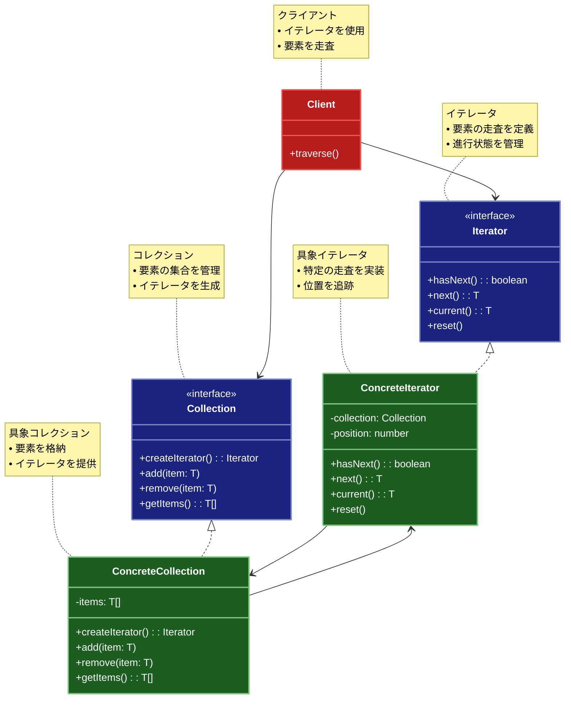

# Iterator（イテレーター）パターン

## 目的

コレクションの内部構造を隠蔽しながら、その要素に順次アクセスする方法を提供するパターンです。

## 価値・解決する問題

- コレクションの実装を隠蔽できます
- 複数の走査方法を提供できます
- 統一的なインターフェースでアクセスできます
- 走査のアルゴリズムを分離できます
- メモリ効率の良い走査が可能です

## 概要・特徴

### 概要

Iteratorパターンは、コレクションの内部構造を公開せずに、その要素に順次アクセスする手段を提供する設計パターンです。このパターンでは、コレクションとその走査ロジックを分離し、コレクションの実装に依存せずに要素にアクセスするための統一されたインターフェースを定義します。これにより、異なる種類のコレクションであっても同じ方法で走査でき、クライアントコードはコレクションの内部構造を知る必要がなくなります。配列、リスト、ツリー、グラフなど様々なデータ構造を一貫した方法で処理するために広く使用されています。

### 特徴

#### 実装の隠蔽

コレクションの内部構造や実装詳細を隠蔽し、クライアントはイテレーターインターフェースを通じてのみ要素にアクセスします。これにより、コレクションの実装が変更されても、クライアントコードに影響を与えることなく修正できます。例えば、配列からリンクリストへの実装変更や、ハッシュマップからツリーマップへの変更などが、クライアントコードに影響を与えずに行えます。これはカプセル化の原則を強化し、システムの柔軟性と保守性を向上させます。

#### 複数の走査方法

同じコレクションに対して異なる走査方法（順方向、逆方向、フィルタリング付きなど）を複数提供できます。各走査方法は別々のイテレーターとして実装され、必要に応じて選択できます。例えば、ツリー構造に対して深さ優先探索と幅優先探索のイテレーターを提供したり、データベースの結果セットに対して様々なソート順やフィルター条件を適用したイテレーターを提供したりできます。この柔軟性により、同じデータに対して異なる視点からのアクセスが可能になります。

#### 統一的なアクセス

異なる種類のコレクション（配列、リスト、ツリー、グラフなど）に対して、統一されたインターフェースを通じてアクセスできます。これにより、クライアントコードはコレクションの種類を意識せずに、同じ方法で要素にアクセスできるようになります。例えば、`hasNext()`と`next()`のような共通メソッドを使って、様々なデータ構造を走査できます。この統一性はコードの再利用性を高め、新しいコレクション型の追加を容易にします。

#### アルゴリズムの分離

走査のアルゴリズムをコレクションの実装から分離することで、単一責任の原則に従った設計が可能になります。コレクションクラスはデータの保存と管理に集中し、イテレータークラスは走査アルゴリズムに集中します。例えば、複雑なツリー走査アルゴリズムをツリー構造自体から分離することで、ツリーの実装がシンプルになり、様々な走査方法を独立して実装・テストできます。この分離により、コードの保守性と拡張性が向上します。

#### メモリ効率

Iteratorパターンは、特に大きなデータセットや無限シーケンスを処理する際にメモリ効率を向上させることができます。データ全体をメモリにロードする代わりに、必要に応じて次の要素だけを取得する「遅延評価（lazy evaluation）」が可能になります。例えば、大規模なデータベースのクエリ結果をページング処理する場合、一度にすべての結果をメモリに読み込むのではなく、次のページが要求されたときにだけデータをロードするイテレーターを実装できます。また、ファイルシステムの走査や、ストリーミングデータの処理などでも、イテレーターを使用することで必要なときにだけデータを読み込み、メモリ使用量を最小限に抑えることができます。特に、ビッグデータやIoTのようなリソース制約のある環境では、このメモリ効率の向上は重要な利点となります。さらに、無限シーケンス（たとえばフィボナッチ数列や乱数のストリーム）を表現する場合でも、イテレーターを使えば実際に使用される要素だけを生成できるため、理論上は無限のデータセットも扱うことが可能になります。

#### 並行処理の制御

Iteratorパターンは複数のイテレーターを同時に使用することで、同じコレクションに対する並行処理を制御できます。各イテレーターは独自の状態（現在の位置など）を保持するため、複数のクライアントが同じコレクションを同時に走査しても互いに干渉しません。例えば、Webアプリケーションでは複数のユーザーが同じデータセットにアクセスする場合、各ユーザーセッションに専用のイテレーターを提供することで、一貫性のある独立した走査が可能になります。また、マルチスレッドプログラミングにおいても、共有コレクションに対して各スレッドが独自のイテレーターを持つことで、スレッド間の競合を減らしながら並列処理を実現できます。さらに、プロデューサー・コンシューマーモデルのようなシナリオでは、複数のコンシューマーが独立したイテレーターを使って共有キューから項目を消費することができます。このように、イテレーターは複数の処理フローが同じデータ構造に安全にアクセスするための効果的なメカニズムを提供します。

### 概要図



## 類似パターンとの比較

- [Visitor (ビジター)](visitor.md): Iterator は要素への順次アクセスを提供し、これに対して Visitor は要素に対する操作を分離します。
- [Composite (コンポジット)](composite.md): Iterator は要素へのアクセス方法を提供し、これに対して Composite は階層構造を扱います。
- [Observer (オブザーバー)](observer.md): Iterator は要素への順次アクセスを提供し、これに対して Observer は要素の変更通知を扱います。

## 利用されているライブラリ／フレームワークの事例

- [Java Collections](https://docs.oracle.com/javase/8/docs/api/java/util/Iterator.html): コレクションフレームワーク
- [C++ STL](https://en.cppreference.com/w/cpp/iterator): 標準テンプレートライブラリ
- [Python Iterators](https://docs.python.org/3/library/stdtypes.html#iterator-types): イテレータプロトコル

## 解説ページリンク

- [Refactoring Guru - Iterator](https://refactoring.guru/design-patterns/iterator)
- [Microsoft - Iterator Pattern](https://docs.microsoft.com/en-us/previous-versions/msp-n-p/ee658117(v=pandp.10))
- [SourceMaking - Iterator](https://sourcemaking.com/design_patterns/iterator)

## コード例

### Before:

コレクションの内部構造に依存した実装

```typescript
// 本のクラス
class Book {
  constructor(
    private title: string,
    private author: string,
    private isbn: string,
    private price: number
  ) {}

  getTitle(): string {
    return this.title;
  }

  getAuthor(): string {
    return this.author;
  }

  getIsbn(): string {
    return this.isbn;
  }

  getPrice(): number {
    return this.price;
  }
}

// 本棚クラス
class Bookshelf {
  private books: Book[] = [];

  addBook(book: Book): void {
    this.books.push(book);
  }

  getBooks(): Book[] {
    return this.books;
  }

  getBookCount(): number {
    return this.books.length;
  }
}

// 使用例
function example() {
  const bookshelf = new Bookshelf();

  // 本を追加
  bookshelf.addBook(new Book("デザインパターン入門", "山田太郎", "978-4-123456-78-9", 3200));
  bookshelf.addBook(new Book("アルゴリズムとデータ構造", "鈴木一郎", "978-4-234567-89-0", 2800));
  bookshelf.addBook(new Book("Webアプリケーション開発", "佐藤花子", "978-4-345678-90-1", 3500));

  // 本の一覧を表示
  console.log("=== 本の一覧 ===");
  const books = bookshelf.getBooks();
  for (let i = 0; i < books.length; i++) {
    const book = books[i];
    console.log(`${i + 1}. ${book.getTitle()} - ${book.getAuthor()}`);
    console.log(`   ISBN: ${book.getIsbn()}`);
    console.log(`   価格: ${book.getPrice()}円\n`);
  }
}

example();
```

### After:

Iteratorパターンを関数型プログラミングスタイルで適用した実装

```typescript
// 本の型定義（イミュータブル）
type Book = Readonly<{
  title: string
  author: string
  isbn: string
  price: number
  publishedYear: number
  category: string
}>

// イテレータの型定義
type Iterator<T> = {
  // 次の要素があるかを返す
  hasNext: () => boolean
  // 次の要素を返し、イテレータを進める
  next: () => T | undefined
  // 現在の要素を返す
  current: () => T | undefined
  // 初期状態に戻す
  rewind: () => Iterator<T>
}

// イテレーション結果の型定義
type IterationResult<T, R> = {
  result: R
  lastIterator: Iterator<T>
}

// イテレータ生成関数の型定義
type IteratorFactory<T> = {
  fromArray: (items: ReadonlyArray<T>) => Iterator<T>
  reverse: (items: ReadonlyArray<T>) => Iterator<T>
  filter: (items: ReadonlyArray<T>, predicate: (item: T) => boolean) => Iterator<T>
}

// 本棚の型定義
type Bookshelf = {
  books: ReadonlyArray<Book>
  addBook: (book: Book) => Bookshelf
  iterators: IteratorFactory<Book>
}

// イテレータをアレイから作成する関数
const createArrayIterator = <T>(items: ReadonlyArray<T>): Iterator<T> => {
  // イテレータの状態（クロージャで保持）
  let currentIndex = 0
  
  return {
    hasNext: () => currentIndex < items.length,
    
    next: () => {
      if (currentIndex < items.length) {
        const item = items[currentIndex]
        currentIndex++
        return item
      }
      return undefined
    },
    
    current: () => 
      currentIndex < items.length ? items[currentIndex] : undefined,
    
    rewind: () => createArrayIterator(items) // 新しいイテレータを返す
  }
}

// 逆順イテレータを作成する関数
const createReverseIterator = <T>(items: ReadonlyArray<T>): Iterator<T> => {
  // 逆順のインデックスを初期化
  let currentIndex = items.length - 1
  
  return {
    hasNext: () => currentIndex >= 0,
    
    next: () => {
      if (currentIndex >= 0) {
        const item = items[currentIndex]
        currentIndex--
        return item
      }
      return undefined
    },
    
    current: () => 
      currentIndex >= 0 ? items[currentIndex] : undefined,
    
    rewind: () => createReverseIterator(items) // 新しいイテレータを返す
  }
}

// フィルターイテレータを作成する関数
const createFilterIterator = <T>(
  items: ReadonlyArray<T>, 
  predicate: (item: T) => boolean
): Iterator<T> => {
  // フィルタリングされた項目のインデックスを計算
  const filteredIndices = items
    .map((item, index) => predicate(item) ? index : -1)
    .filter(index => index !== -1)
  
  let currentFilteredIndex = 0
  
  return {
    hasNext: () => currentFilteredIndex < filteredIndices.length,
    
    next: () => {
      if (currentFilteredIndex < filteredIndices.length) {
        const item = items[filteredIndices[currentFilteredIndex]]
        currentFilteredIndex++
        return item
      }
      return undefined
    },
    
    current: () => 
      currentFilteredIndex < filteredIndices.length 
        ? items[filteredIndices[currentFilteredIndex]] 
        : undefined,
    
    rewind: () => createFilterIterator(items, predicate) // 新しいイテレータを返す
  }
}

// イテレータファクトリの作成
const createIteratorFactory = <T>(): IteratorFactory<T> => ({
  fromArray: (items: ReadonlyArray<T>) => createArrayIterator(items),
  reverse: (items: ReadonlyArray<T>) => createReverseIterator(items),
  filter: (items: ReadonlyArray<T>, predicate: (item: T) => boolean) => 
    createFilterIterator(items, predicate)
})

// 本棚を作成する関数
const createBookshelf = (): Bookshelf => ({
  books: [],
  
  addBook: (book: Book): Bookshelf => ({
    books: [...createBookshelf().books, book],
    addBook: createBookshelf().addBook,
    iterators: createBookshelf().iterators
  }),
  
  iterators: createIteratorFactory<Book>()
})

// イテレータを使用して項目を処理する関数
const processWithIterator = <T, R>(
  iterator: Iterator<T>,
  processor: (item: T) => void,
  initialResult: R,
  accumulator: (currentResult: R, item: T) => R
): IterationResult<T, R> => {
  let result = initialResult
  
  while (iterator.hasNext()) {
    const item = iterator.next()
    if (item !== undefined) {
      processor(item)
      result = accumulator(result, item)
    }
  }
  
  return { result, lastIterator: iterator }
}

// 本の表示関数
const displayBook = (book: Book): void => {
  console.log(`タイトル: ${book.title}`)
  console.log(`著者: ${book.author}`)
  console.log(`ISBN: ${book.isbn}`)
  console.log(`価格: ${book.price}円`)
  console.log(`出版年: ${book.publishedYear}年`)
  console.log(`カテゴリ: ${book.category}\n`)
}

// 使用例
const example = (): void => {
  // 本棚の作成
  const books: ReadonlyArray<Book> = [
    {
      title: 'デザインパターン入門',
      author: '山田太郎',
      isbn: '978-4-123456-78-9',
      price: 3200,
      publishedYear: 2020,
      category: 'プログラミング'
    },
    {
      title: 'アルゴリズムとデータ構造',
      author: '鈴木一郎',
      isbn: '978-4-234567-89-0',
      price: 2800,
      publishedYear: 2019,
      category: 'プログラミング'
    },
    {
      title: 'Webアプリケーション開発',
      author: '佐藤花子',
      isbn: '978-4-345678-90-1',
      price: 3500,
      publishedYear: 2021,
      category: 'Web開発'
    },
    {
      title: '機械学習入門',
      author: '田中次郎',
      isbn: '978-4-456789-01-2',
      price: 4000,
      publishedYear: 2021,
      category: 'AI'
    },
    {
      title: 'データベース設計の基礎',
      author: '高橋三郎',
      isbn: '978-4-567890-12-3',
      price: 3800,
      publishedYear: 2020,
      category: 'データベース'
    }
  ]
  
  // イテレータファクトリの作成
  const iteratorFactory = createIteratorFactory<Book>()
  
  // 通常の順序で本を表示
  console.log('=== 通常の順序で本を表示 ===')
  const normalIterator = iteratorFactory.fromArray(books)
  processWithIterator(
    normalIterator,
    displayBook,
    0,
    count => count + 1
  )
  
  // 逆順で本を表示
  console.log('=== 逆順で本を表示 ===')
  const reverseIterator = iteratorFactory.reverse(books)
  processWithIterator(
    reverseIterator,
    displayBook,
    0,
    count => count + 1
  )
  
  // プログラミング関連の本のみを表示
  console.log('=== プログラミング関連の本のみを表示 ===')
  const programmingIterator = iteratorFactory.filter(
    books,
    book => book.category === 'プログラミング'
  )
  processWithIterator(
    programmingIterator,
    displayBook,
    0,
    count => count + 1
  )
  
  // 2021年以降に出版された本のみを表示
  console.log('=== 2021年以降に出版された本のみを表示 ===')
  const recentBooksIterator = iteratorFactory.filter(
    books,
    book => book.publishedYear >= 2021
  )
  processWithIterator(
    recentBooksIterator,
    displayBook,
    0,
    count => count + 1
  )
  
  // 3500円以上の本のみを表示
  console.log('=== 3500円以上の本のみを表示 ===')
  const expensiveBooksIterator = iteratorFactory.filter(
    books,
    book => book.price >= 3500
  )
  const expensiveResult = processWithIterator(
    expensiveBooksIterator,
    displayBook,
    { count: 0, totalPrice: 0 },
    (result, book) => ({
      count: result.count + 1,
      totalPrice: result.totalPrice + book.price
    })
  )
  
  console.log(`高額な本の数: ${expensiveResult.result.count}`)
  console.log(`高額な本の合計金額: ${expensiveResult.result.totalPrice}円\n`)
  
  // 関数型アプローチを使用した代替手段
  console.log('=== 関数型アプローチによる走査 ===')
  
  // filterとmapを使用した方法
  console.log('プログラミング関連の本:')
  books
    .filter(book => book.category === 'プログラミング')
    .forEach(displayBook)
  
  // reduceを使用した集計
  const totalPrice = books.reduce((sum, book) => sum + book.price, 0)
  console.log(`すべての本の合計金額: ${totalPrice}円`)
  
  // 複数の操作をチェーンする
  const recentExpensiveBooks = books
    .filter(book => book.publishedYear >= 2021)
    .filter(book => book.price >= 3500)
  
  console.log('2021年以降の高額な本:')
  recentExpensiveBooks.forEach(displayBook)
  
  console.log(`該当する本の数: ${recentExpensiveBooks.length}`)
}

// 実行
example()