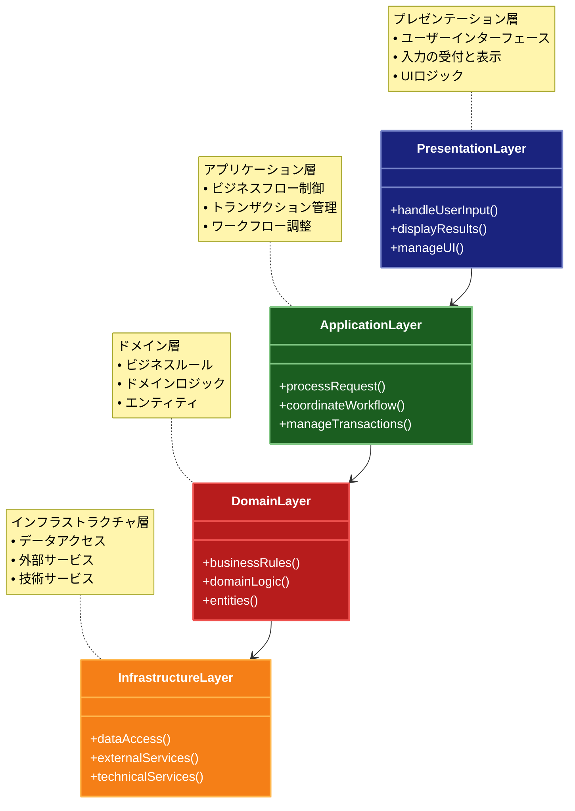

# Layered Architecture（レイヤードアーキテクチャ）

## 目的

アプリケーションを複数の論理的な層に分割し、各層の責務を明確に定義することで、保守性、テスト容易性、および再利用性を向上させます。

## 解説ページリンク

- [Microsoft - N-tier architecture style](https://learn.microsoft.com/ja-jp/azure/architecture/guide/architecture-styles/n-tier)  
  - エンタープライズアプリケーションにおけるレイヤードアーキテクチャの実装方法と、各層の責務を詳しく解説しています。

- [Martin Fowler - LayeredArchitecture](https://martinfowler.com/bliki/PresentationDomainDataLayering.html)  
  - レイヤードアーキテクチャの基本概念と、プレゼンテーション・ドメイン・データの分離について説明しています。

- [Spring Framework - Architecture](https://docs.spring.io/spring-framework/reference/overview.html#overview-modules)  
  - Spring Frameworkを例に、実践的なレイヤードアーキテクチャの実装方法を提供しています。

- [Domain-Driven Design - Layered Architecture](https://www.domainlanguage.com/ddd/reference/)  
  - ドメイン駆動設計におけるレイヤードアーキテクチャの位置づけと、実装アプローチを解説しています。

## 価値・解決する問題

- 関心事の分離による保守性の向上
- 層ごとの独立した開発とテストの実現
- 依存関係の明確化
- コードの再利用性の向上
- システムの理解容易性の向上

## 概要・特徴

### 概要

レイヤードアーキテクチャは、アプリケーションを複数の水平方向の層に分割し、各層に明確な責務を割り当てる設計パターンです。一般的に、上位層は下位層に依存し、下位層は上位層を知りません。この階層構造により、関心事の分離が促進され、コードの保守性と再利用性が向上します。

### 特徴

#### 明確な層の責務分担
レイヤードアーキテクチャでは、各層が特定の責務を担当し、その境界が明確に定義されています。一般的な構成では、プレゼンテーション層（UI）、アプリケーション層（ビジネスプロセス）、ドメイン層（ビジネスルール）、インフラストラクチャ層（データアクセス、外部サービス）に分けられます。この明確な分離により、各層は自身の責務に集中でき、変更の影響範囲が限定されます。例えば、UIの変更はプレゼンテーション層のみに影響し、データベースの変更はインフラストラクチャ層のみに影響します。この責務の分離は、コードの理解しやすさや保守性を向上させ、開発者が特定の層に集中して作業できるようにします。

#### 上から下への依存方向
レイヤードアーキテクチャの基本原則として、依存関係は上位層から下位層への一方向のみとなります。上位層は下位層のサービスを利用しますが、下位層は上位層を直接参照しません。例えば、アプリケーション層はドメイン層のエンティティやサービスを利用しますが、ドメイン層はアプリケーション層の存在を知りません。この一方向の依存関係により、下位層は上位層から独立して変更や再利用が可能になります。また、この構造はテストの容易性も向上させ、下位層のモックやスタブを作成して上位層をテストすることが容易になります。ただし、この原則が厳格に適用されない「緩やかなレイヤリング」も存在し、パフォーマンスやプラグマティズムのために層をバイパスすることも許容される場合があります。

#### スケーラブルな開発プロセス
レイヤードアーキテクチャは、複数の開発チームが並行して作業することを可能にします。各層は独立しているため、異なるチームが異なる層を担当して並行開発を行うことができます。例えば、UIチームはプレゼンテーション層に、バックエンドチームはアプリケーション層とドメイン層に、データベースチームはインフラストラクチャ層に集中することができます。この並行開発により、大規模なアプリケーション開発でのボトルネックが減少し、開発速度が向上します。また、各層のインターフェースが明確に定義されていれば、モックやスタブを使用して他の層の完成を待たずに開発やテストを進めることができます。

#### 技術的な柔軟性
各層は独立しているため、特定の技術的な実装を比較的容易に変更または置き換えることができます。例えば、インフラストラクチャ層でのデータベース技術の変更（MySQLからPostgreSQLへの切り替えなど）は、他の層に影響を与えることなく行えます。同様に、プレゼンテーション層のUIフレームワークを変更しても、ビジネスロジックは影響を受けません。この柔軟性により、技術的な負債の管理が容易になり、新しい技術を採用する際のリスクが低減します。また、既存のシステムを段階的にモダナイズする際にも、層ごとに更新を行うことでリスクを分散させることができます。

#### 水平方向のスケーラビリティ
レイヤードアーキテクチャは、各層を独立してスケールすることが可能です。例えば、高負荷のアプリケーションでは、プレゼンテーション層を複数のWebサーバーにデプロイし、データベース層をレプリケーションやシャーディングで分散させることができます。この水平方向のスケーラビリティにより、システム全体のパフォーマンスとリソース利用効率が向上します。また、マイクロサービスアーキテクチャと組み合わせることで、特定の機能やサービスごとにレイヤード構造を持つ小さなサービスを構築し、さらなるスケーラビリティを実現することも可能です。

### 概要図



## コード例

### Before:

```typescript
// すべての処理が混在した実装
class ProductManager {
  async handleProductCreation(req: Request, res: Response) {
    try {
      // バリデーション、ビジネスロジック、データアクセスが混在
      const {name, price, categoryId} = req.body;

      if (!name || price <= 0 || !categoryId) {
        res.status(400).json({error: "Invalid input"});
        return;
      }

      // データベースアクセスが直接記述
      const category = await prisma.category.findUnique({
        where: {id: categoryId},
      });

      if (!category) {
        res.status(404).json({error: "Category not found"});
        return;
      }

      const product = await prisma.product.create({
        data: {
          name,
          price,
          categoryId,
        },
      });

      // 通知処理も直接記述
      await sendgrid.send({
        to: "admin@example.com",
        subject: "New Product Created",
        text: `Product ${name} has been created`,
      });

      res.json(product);
    } catch (error) {
      res.status(500).json({error: "Internal server error"});
    }
  }
}
```

### After:

```typescript
// プレゼンテーション層（UI/API層）
class ProductController {
  constructor(private productService: ProductService) {}

  async createProduct(req: Request, res: Response) {
    try {
      const dto = new CreateProductDTO(req.body);
      const result = await this.productService.createProduct(dto);
      res.status(201).json(result);
    } catch (error) {
      if (error instanceof ValidationError) {
        res.status(400).json({error: error.message});
      } else if (error instanceof NotFoundError) {
        res.status(404).json({error: error.message});
      } else {
        res.status(500).json({error: "Internal server error"});
      }
    }
  }
}

// アプリケーション層（ビジネスロジック）
class ProductService {
  constructor(
    private productRepository: ProductRepository,
    private categoryRepository: CategoryRepository,
    private notificationService: NotificationService,
    private validator: ProductValidator
  ) {}

  async createProduct(dto: CreateProductDTO): Promise<Product> {
    // 入力検証
    this.validator.validate(dto);

    // カテゴリの存在確認
    const category = await this.categoryRepository.findById(dto.categoryId);
    if (!category) {
      throw new NotFoundError("Category not found");
    }

    // 製品の作成
    const product = new Product({
      name: dto.name,
      price: dto.price,
      categoryId: dto.categoryId,
    });

    // 永続化
    const savedProduct = await this.productRepository.save(product);

    // 通知
    await this.notificationService.notifyProductCreation(savedProduct);

    return savedProduct;
  }
}

// ドメイン層（ビジネスエンティティとルール）
class Product {
  constructor(
    private props: {
      id?: string;
      name: string;
      price: number;
      categoryId: string;
    }
  ) {
    if (props.price <= 0) {
      throw new ValidationError("Price must be positive");
    }
  }

  get id(): string {
    return this.props.id;
  }
  get name(): string {
    return this.props.name;
  }
  get price(): number {
    return this.props.price;
  }
  get categoryId(): string {
    return this.props.categoryId;
  }
}

class ProductValidator {
  validate(dto: CreateProductDTO): void {
    if (!dto.name) {
      throw new ValidationError("Name is required");
    }
    if (dto.price <= 0) {
      throw new ValidationError("Price must be positive");
    }
    if (!dto.categoryId) {
      throw new ValidationError("Category ID is required");
    }
  }
}

// インフラストラクチャ層（データアクセス、外部サービス）
class PrismaProductRepository implements ProductRepository {
  async save(product: Product): Promise<Product> {
    const savedData = await prisma.product.create({
      data: {
        name: product.name,
        price: product.price,
        categoryId: product.categoryId,
      },
    });
    return new Product(savedData);
  }
}

class PrismaCategoryRepository implements CategoryRepository {
  async findById(id: string): Promise<Category | null> {
    const category = await prisma.category.findUnique({
      where: {id},
    });
    return category ? new Category(category) : null;
  }
}

class SendGridNotificationService implements NotificationService {
  async notifyProductCreation(product: Product): Promise<void> {
    await sendgrid.send({
      to: "admin@example.com",
      subject: "New Product Created",
      text: `Product ${product.name} has been created`,
    });
  }
}

// 依存性の注入設定
const productRepository = new PrismaProductRepository();
const categoryRepository = new PrismaCategoryRepository();
const notificationService = new SendGridNotificationService();
const validator = new ProductValidator();
const productService = new ProductService(
  productRepository,
  categoryRepository,
  notificationService,
  validator
);
const productController = new ProductController(productService);
```

## 類似パターンとの比較

- [Clean Architecture（クリーンアーキテクチャ）](clean-architecture.md): Layered Architecture は単純な階層構造を持ち、Clean Architecture は依存関係の方向を明確に制御します。
- [Hexagonal Architecture（ヘキサゴナルアーキテクチャ）](hexagonal-architecture.md): Layered Architecture は階層的な依存関係を定義し、Hexagonal Architecture は外部との境界を明確に定義します。
- [Onion Architecture（オニオンアーキテクチャ）](onion-architecture.md): Layered Architecture は上位から下位への依存を許容し、Onion Architecture は依存関係を内側に向けることを強制します。

## 利用されているライブラリ／フレームワークの事例

- [Express.js](https://github.com/expressjs/express): ミドルウェア層を活用したレイヤー構造を提供
- [Spring Framework](https://github.com/spring-projects/spring-framework): 伝統的な 3 層/4 層アーキテクチャの実装を支援
- [Django](https://github.com/django/django): MVT（Model-View-Template）パターンを通じたレイヤー構造を実現
