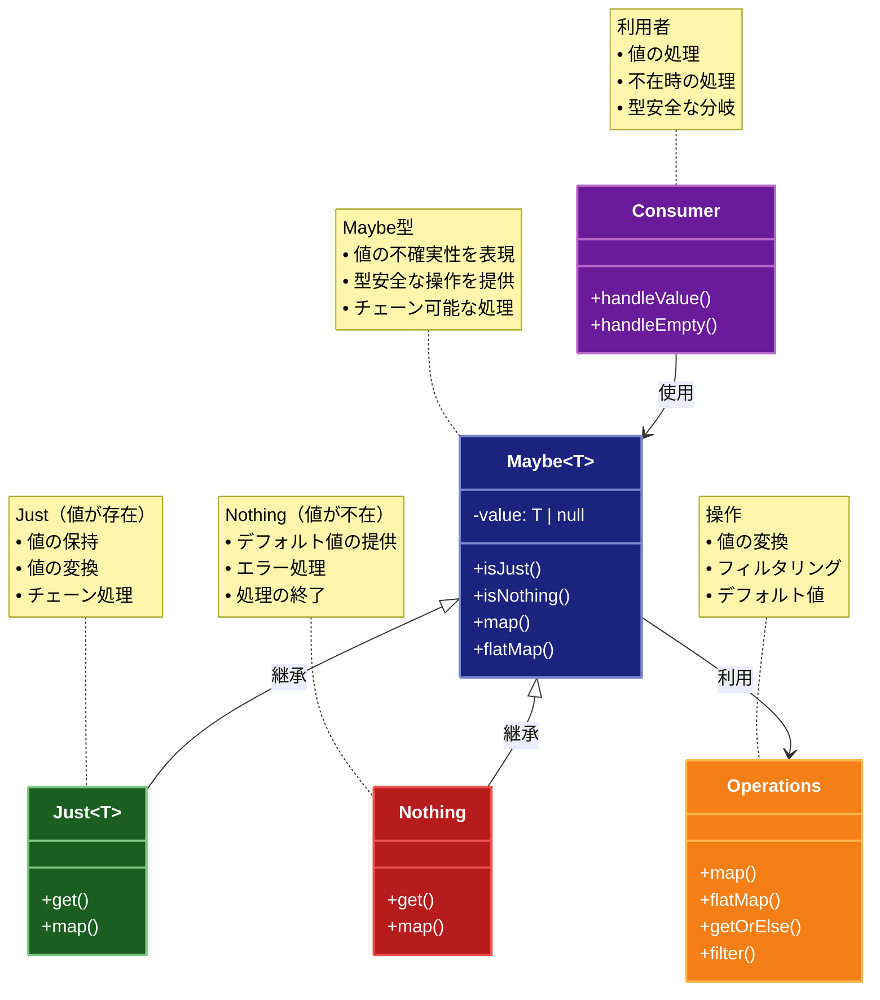

# Maybe（メイビー）パターン

## 目的

値の不確実性を型安全に扱い、エラーの可能性を明示的に表現するパターンです。

## 価値・解決する問題

- 不確実な値を型安全に扱います
- エラー処理を簡潔に記述できます
- 副作用を制御します
- コードの可読性を向上させます
- 実行時エラーを防ぎます

## 概要・特徴

### 概要

Maybeパターンは、値が存在するかもしれないし、存在しないかもしれない状態を表現し、その状態に応じた処理を安全に行えるようにする設計パターンです。

### 特徴

#### 型安全性の保証
Maybeパターンの最も重要な特徴は、不確かな値の存在を型システムによって安全に扱える点です。従来の方法では `null` や `undefined` チェックが必要で、これらのチェックを忘れるとランタイムエラーが発生する可能性がありましたが、Maybeパターンではそのようなミスを型レベルで防止できます。例えば、TypeScriptでは `Maybe<User>` 型の値を使用する際に、必ず値の存在確認が必要であることが型システムによって強制されます。これにより、「オブジェクトが null である可能性がある」という情報が型の一部となり、開発者はその事実を無視できなくなります。この型安全性は特に大規模なアプリケーションや複数の開発者が協業するプロジェクトで価値を発揮し、バグの早期発見とコードの品質向上に貢献します。また、静的型チェックにより、IDEのコード補完やリファクタリング機能も効果的に働くようになり、開発効率も向上します。

#### 関数型プログラミング
Maybeパターンは関数型プログラミングのパラダイムに根ざしており、値の変換や操作を純粋関数のチェーンとして表現します。この関数型アプローチにより、コードの可読性と再利用性が向上し、テストも容易になります。例えば、`map`、`flatMap`、`filter`などの高階関数を使用して値の変換や条件付き処理を宣言的に記述できます。これらの操作はMaybeモナドの文脈内で行われるため、値が存在しない場合（Nothing）も安全に扱えます。関数型アプローチの利点は、状態の変更に依存せず、関数の入力と出力の関係が明確になることで、予測可能性が高まることです。また、関数のチェーンによって処理の流れを一連の変換として表現できるため、命令型プログラミングに比べてロジックが明確になり、副作用や状態変更によるバグを減らせます。この特徴は特に複雑なビジネスロジックや非同期処理を扱う場合に強力です。

#### エラー処理の統合
Maybeパターンは、値の不在を表現する標準的な方法を提供することで、エラー処理をコードの自然な一部として統合します。従来のtry-catchブロックやエラーコードの返却と異なり、Maybe型を使用すると失敗の可能性を持つ操作の結果をより一貫した方法で扱えます。たとえば、データベースからのユーザー検索、設定値の取得、オプションのパラメータ処理など、結果が存在しない可能性のある様々な操作を同じパターンで扱うことができます。これにより、特殊なケースごとに異なるエラー処理ロジックを実装する必要がなくなり、コードの一貫性が高まります。また、エラーの伝播も自然に行われ、一連の操作の中で一つでも失敗があれば、チェーン全体がNothingを返すようになります。この「早期脱出」機能により、ネストしたif文や複数のエラーチェックが不要になり、コードの簡潔さと可読性が向上します。

#### チェーン可能な操作
Maybeパターンの実用的な特徴として、複数の操作を連続してチェーンできる能力があります。これにより、値が存在する場合にのみ実行される一連の変換や検証を簡潔に表現できます。例えば、ユーザーIDから始まり、ユーザーを検索し、そのユーザーの住所を取得し、さらに郵便番号を抽出するという一連の操作を、各ステップで値の存在を明示的にチェックすることなく記述できます。これは特に、データの変換や抽出が複数のステップを経る場合に役立ちます。また、チェーン内の任意の時点で条件によるフィルタリングを適用することも可能です。このチェーン操作のアプローチにより、複雑なビジネスロジックも明確で読みやすいコードとして表現でき、「鉄道指向プログラミング」と呼ばれる、線形的な処理フローを維持するプログラミングスタイルを実現します。値の存在チェックが分散することなくチェーンの前提として扱われるため、ビジネスロジックがより明確になります。

#### 副作用の制御
Maybeパターンは、値の操作と副作用（ログ出力、状態変更、外部APIコールなど）を明確に分離するのに役立ちます。値の変換は純粋関数で行われ、副作用は最終的な値の取り出し時や特定のフックポイントでのみ実行されるよう設計できます。例えば、`orElse`や`match`のようなメソッドを使用して、値が存在する場合と存在しない場合で異なるアクションを実行できます。この分離により、プログラムのロジック部分は純粋関数として保ち、テスト容易性を維持しつつ、必要な副作用は制御された方法で導入できます。また、副作用の実行タイミングを明示的に制御できるため、パフォーマンスの最適化（例：遅延評価）や、トランザクション的な操作（すべての計算が成功した場合にのみ副作用を実行）などの高度なパターンも実装できます。このアプローチはリアクティブプログラミングやイベント駆動アーキテクチャとも相性が良く、非同期処理のフローをより管理しやすくします。

### 概要図



## 類似パターンとの比較

- [Optional (オプショナル)](optional.md): Maybe は値の不確実性を扱い、これに対して Optional は値の存在を扱います。
- [Result (リザルト)](result.md): Maybe は値の不確実性を扱い、これに対して Result は成功/失敗を扱います。
- [Null Object (ヌルオブジェクト)](null-object.md): Maybe は値の不確実性を扱い、これに対して Null Object はデフォルトの振る舞いを提供します。

## 利用されているライブラリ／フレームワークの事例

- [Haskell Maybe](https://hackage.haskell.org/package/base-4.14.0.0/docs/Data-Maybe.html): Haskellの標準ライブラリ
- [Scala Option](https://www.scala-lang.org/api/current/scala/Option.html): ScalaのOption型
- [fp-ts Maybe](https://gcanti.github.io/fp-ts/modules/Maybe.ts.html): TypeScriptの関数型プログラミングライブラリ

## 解説ページリンク

- [Haskell Maybe Tutorial](https://www.schoolofhaskell.com/school/starting-with-haskell/basics-of-haskell/3-pure-functions-laziness-io#maybe)
- [Scala Option Documentation](https://www.scala-lang.org/api/current/scala/Option.html)
- [fp-ts Documentation](https://gcanti.github.io/fp-ts/)

## コード例

### Before:

直接的なnullチェックを行う実装

```typescript
type UserData = {
  name: string;
  age: number | null;
  email: string | null;
};

class UserService {
  getUser(id: string): UserData | null {
    // ユーザーデータの取得をシミュレート
    if (id === "1") {
      return {
        name: "John Doe",
        age: 30,
        email: "john@example.com"
      };
    }
    return null;
  }

  getUserAge(id: string): number | null {
    const user = this.getUser(id);
    if (user === null) return null;
    return user.age;
  }

  getUserEmail(id: string): string | null {
    const user = this.getUser(id);
    if (user === null) return null;
    return user.email;
  }
}
```

### After:

Maybeパターンを適用した実装

```typescript
// Maybeモナドの実装
class Maybe<T> {
  private constructor(private readonly value: T | null | undefined) {}

  // Just（値が存在する）
  static just<T>(value: T): Maybe<T> {
    if (value === null || value === undefined) {
      throw new Error("Just cannot contain null or undefined");
    }
    return new Maybe(value);
  }

  // Nothing（値が存在しない）
  static nothing<T>(): Maybe<T> {
    return new Maybe<T>(null);
  }

  // 値からMaybeを生成
  static from<T>(value: T | null | undefined): Maybe<T> {
    return value === null || value === undefined
      ? Maybe.nothing<T>()
      : Maybe.just(value);
  }

  // 値が存在するかチェック
  isJust(): boolean {
    return this.value !== null && this.value !== undefined;
  }

  // 値が存在しないかチェック
  isNothing(): boolean {
    return !this.isJust();
  }

  // 値を取得（存在しない場合は例外）
  get(): T {
    if (this.isNothing()) {
      throw new Error("Cannot extract value from Nothing");
    }
    return this.value!;
  }

  // 値を取得（存在しない場合はデフォルト値）
  getOrElse(defaultValue: T): T {
    return this.isJust() ? this.value! : defaultValue;
  }

  // 値を変換
  map<U>(f: (value: T) => U): Maybe<U> {
    return this.isJust()
      ? Maybe.from(f(this.value!))
      : Maybe.nothing<U>();
  }

  // Maybeを返す関数を適用
  flatMap<U>(f: (value: T) => Maybe<U>): Maybe<U> {
    return this.isJust()
      ? f(this.value!)
      : Maybe.nothing<U>();
  }

  // 条件を満たす場合のみ値を保持
  filter(predicate: (value: T) => boolean): Maybe<T> {
    return this.isJust() && predicate(this.value!)
      ? this
      : Maybe.nothing<T>();
  }

  // 値が存在する場合に処理を実行
  ifJust(f: (value: T) => void): Maybe<T> {
    if (this.isJust()) {
      f(this.value!);
    }
    return this;
  }

  // 値が存在しない場合に処理を実行
  ifNothing(f: () => void): Maybe<T> {
    if (this.isNothing()) {
      f();
    }
    return this;
  }

  // 文字列表現を取得
  toString(): string {
    return this.isJust()
      ? `Just(${this.value})`
      : "Nothing";
  }
}

// ユーザー関連の型定義
interface User {
  id: string;
  name: string;
  age?: number;
  email?: string;
  preferences?: {
    theme?: string;
    language?: string;
    notifications?: boolean;
  };
}

// ユーザーサービスの実装
class UserService {
  private users: Map<string, User>;

  constructor() {
    // サンプルデータの初期化
    this.users = new Map([
      ["1", {
        id: "1",
        name: "John Doe",
        age: 30,
        email: "john@example.com",
        preferences: {
          theme: "dark",
          language: "en",
          notifications: true
        }
      }],
      ["2", {
        id: "2",
        name: "Jane Smith",
        age: 25,
        preferences: {
          theme: "light"
        }
      }],
      ["3", {
        id: "3",
        name: "Bob Johnson"
      }]
    ]);
  }

  // ユーザーを取得
  findUser(id: string): Maybe<User> {
    return Maybe.from(this.users.get(id));
  }

  // ユーザーの年齢を取得
  findUserAge(id: string): Maybe<number> {
    return this.findUser(id)
      .flatMap(user => Maybe.from(user.age));
  }

  // ユーザーのメールアドレスを取得
  findUserEmail(id: string): Maybe<string> {
    return this.findUser(id)
      .flatMap(user => Maybe.from(user.email));
  }

  // ユーザーの設定を取得
  findUserPreferences(id: string): Maybe<User["preferences"]> {
    return this.findUser(id)
      .flatMap(user => Maybe.from(user.preferences));
  }

  // ユーザーの言語設定を取得
  findUserLanguage(id: string): Maybe<string> {
    return this.findUserPreferences(id)
      .flatMap(prefs => Maybe.from(prefs.language));
  }

  // メールアドレスのドメインを取得
  findUserEmailDomain(id: string): Maybe<string> {
    return this.findUserEmail(id)
      .flatMap(email => {
        const parts = email.split("@");
        return parts.length === 2
          ? Maybe.just(parts[1])
          : Maybe.nothing<string>();
      });
  }

  // ユーザー情報の表示
  printUserInfo(id: string): void {
    const user = this.findUser(id);

    console.log(`\n=== ユーザー情報 (ID: ${id}) ===`);

    user
      .map(u => u.name)
      .ifJust(name => console.log(`名前: ${name}`))
      .ifNothing(() => console.log("名前: 不明"));

    this.findUserAge(id)
      .ifJust(age => console.log(`年齢: ${age}歳`))
      .ifNothing(() => console.log("年齢: 不明"));

    this.findUserEmail(id)
      .ifJust(email => console.log(`メール: ${email}`))
      .ifNothing(() => console.log("メール: 未設定"));

    this.findUserEmailDomain(id)
      .ifJust(domain => console.log(`メールドメイン: ${domain}`))
      .ifNothing(() => console.log("メールドメイン: 不明"));

    this.findUserPreferences(id)
      .ifJust(prefs => {
        console.log("設定:");
        console.log(`  テーマ: ${prefs.theme || "デフォルト"}`);
        console.log(`  言語: ${prefs.language || "デフォルト"}`);
        console.log(`  通知: ${prefs.notifications === undefined ? "デフォルト" : prefs.notifications ? "有効" : "無効"}`);
      })
      .ifNothing(() => console.log("設定: 未設定"));
  }

  // ユーザーの年齢に基づく処理
  processUserAge(id: string): string {
    return this.findUserAge(id)
      .filter(age => age >= 18)
      .map(age => {
        if (age < 20) return "ティーンエイジャー";
        if (age < 30) return "20代";
        if (age < 40) return "30代";
        return "40代以上";
      })
      .getOrElse("年齢不明または未成年");
  }

  // メール通知の送信可否を判定
  canSendEmailNotification(id: string): boolean {
    return this.findUserEmail(id)
      .flatMap(() => this.findUserPreferences(id))
      .map(prefs => prefs.notifications ?? true)
      .getOrElse(false);
  }
}

// 使用例
function example() {
  const service = new UserService();

  // 各ユーザーの情報を表示
  ["1", "2", "3", "4"].forEach(id => {
    service.printUserInfo(id);
  });

  console.log("\n=== 年齢に基づく処理 ===");
  ["1", "2", "3"].forEach(id => {
    console.log(`ユーザー${id}: ${service.processUserAge(id)}`);
  });

  console.log("\n=== メール通知の送信可否 ===");
  ["1", "2", "3"].forEach(id => {
    console.log(`ユーザー${id}: ${service.canSendEmailNotification(id) ? "送信可能" : "送信不可"}`);
  });
}

example();
```
