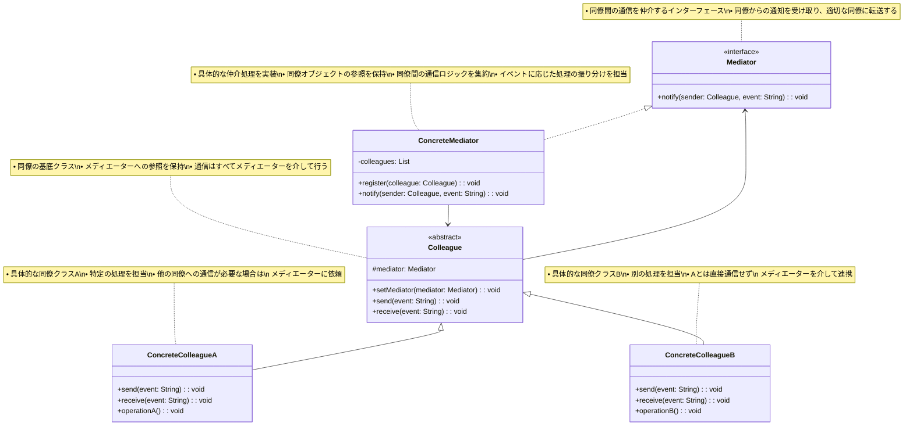

# Mediator（メディエーター）パターン

## 目的

オブジェクト間の相互作用をカプセル化し、オブジェクト間の結合度を低くするパターンです。

## 価値・解決する問題

- オブジェクト間の結合度を低減できます
- 相互作用を一元管理できます
- オブジェクトの再利用性が向上します
- 相互作用のロジックを分離できます
- システムの保守性が向上します

## 概要・特徴

### 概要

Mediatorパターンは、オブジェクト間の通信を仲介役のオブジェクトに集中させることで、オブジェクト間の直接的な依存関係を減らす設計パターンです。このパターンでは、複数のオブジェクト（同僚：Colleague）が互いに直接通信するのではなく、全ての通信がメディエーターを介して行われます。これにより、各オブジェクトはメディエーターのみを知っていればよく、他のオブジェクトの存在を意識する必要がなくなります。特に複雑な相互作用を持つシステムや、コンポーネント間の依存関係を最小化したい場合に有効です。

### 特徴

#### 結合度の低減

オブジェクト同士が直接通信せず、メディエーターを介して通信することで、オブジェクト間の結合度が大幅に低減されます。これにより、各オブジェクトは他のオブジェクトの詳細を知る必要がなくなり、独立性が高まります。例えば、UIコンポーネント間の相互作用や、サブシステム間の連携などで、直接的な依存関係を避けることができます。

#### 通信の一元管理

全ての通信がメディエーターを通じて行われるため、システム内の相互作用が一箇所で管理されます。これにより、通信ロジックの変更が容易になり、通信経路の追跡や監視が簡単になります。また、新しい通信ルールの追加やデバッグも容易になるため、システムの拡張性が向上します。

#### 再利用性の向上

オブジェクトの相互作用ロジックがメディエーターに集約されることで、個々のオブジェクトはより純粋な責務に集中できるようになります。これによりオブジェクトの再利用性が高まり、他のコンテキストでも同じオブジェクトを使用できる可能性が増します。特にUIコンポーネントや独立したサービスなど、様々な場面で再利用したいコンポーネントに効果的です。

#### ロジックの分離

相互作用のロジックがメディエーターに分離されることで、各オブジェクトはその本来の責務に集中できます。これは単一責任の原則に沿った設計を促進し、コードの可読性と保守性を向上させます。ビジネスロジックと通信ロジックの分離により、テストも容易になります。

#### 保守性の向上

Mediatorパターンは、システムの保守性を大幅に向上させます。オブジェクト間の相互作用が一箇所に集約されるため、システムの動作を変更する必要がある場合、主にメディエーターを修正するだけで済みます。例えば、フライト予約システムでは、予約、支払い、通知などの複数のコンポーネント間の連携をメディエーターが担当します。予約フローを変更する場合、各コンポーネントを個別に修正するのではなく、メディエーターの連携ロジックを更新するだけで対応できます。また、オブジェクト間の直接的な依存関係が少ないため、一部のコンポーネントを変更しても他への影響が最小限に抑えられます。これは特に長期的なメンテナンスが必要な大規模システムや、頻繁に要件が変更されるプロジェクトで重要な利点です。さらに、新しい開発者がシステムを理解する際も、相互作用の全体像がメディエーターに集約されているため、学習曲線が緩やかになります。

#### 複雑性の集中

Mediatorパターンの主な課題の一つは、複雑性がメディエーターに集中する傾向があることです。システムが成長するにつれて、メディエーターはすべての相互作用を処理するため、肥大化し「神クラス」になりやすくなります。例えば、多数のUIコンポーネントを持つ複雑なダッシュボードアプリケーションでは、すべてのコンポーネント間の相互作用をメディエーターが管理するため、メディエーターのコードは非常に複雑になる可能性があります。この問題に対処するためには、大きなメディエーターを機能ごとに分割したり、階層的なメディエーター構造を導入したりする戦略が必要です。例えば、マイクロサービスアーキテクチャでは、各ドメイン内でのサービス間連携に特化したメディエーターを複数設計することで、単一のメディエーターへの過度な依存を避けられます。また、メディエーターの内部実装には、状態パターンやコマンドパターンなどの他のデザインパターンを組み合わせることで、複雑性を管理することも有効です。

### 概要図



## 類似パターンとの比較

- [Observer (オブザーバー)](observer.md): Mediator は多対多の通信を仲介し、これに対して Observer は一対多の通信を扱います。
- [Facade (ファサード)](facade.md): Mediator は双方向の通信を仲介し、これに対して Facade は一方向のインターフェースを提供します。
- [Command (コマンド)](command.md): Mediator は通信を仲介し、これに対して Command は処理をカプセル化します。

## 利用されているライブラリ／フレームワークの事例

- [Redux](https://github.com/reduxjs/redux): 状態管理
- [SignalR](https://github.com/SignalR/SignalR): リアルタイム通信
- [RxJS](https://github.com/ReactiveX/rxjs): イベント処理

## 解説ページリンク

- [Refactoring Guru - Mediator](https://refactoring.guru/design-patterns/mediator)
- [Microsoft - Mediator Pattern](https://docs.microsoft.com/en-us/previous-versions/msp-n-p/ee658117(v=pandp.10))
- [SourceMaking - Mediator](https://sourcemaking.com/design_patterns/mediator)

## コード例

### Before:

オブジェクト間が直接通信する実装

```typescript
// チャットユーザークラス
class ChatUser {
  constructor(
    private name: string,
    private friends: ChatUser[] = []
  ) {}

  getName(): string {
    return this.name;
  }

  addFriend(friend: ChatUser): void {
    if (!this.friends.includes(friend)) {
      this.friends.push(friend);
      friend.addFriend(this);
    }
  }

  sendMessage(message: string, to: ChatUser): void {
    console.log(`${this.name} -> ${to.getName()}: ${message}`);
    to.receiveMessage(message, this);
  }

  sendGroupMessage(message: string): void {
    console.log(`${this.name} -> All: ${message}`);
    this.friends.forEach(friend => {
      friend.receiveMessage(message, this);
    });
  }

  receiveMessage(message: string, from: ChatUser): void {
    console.log(`${this.name} received from ${from.getName()}: ${message}`);
  }
}

// 使用例
function example() {
  // ユーザーの作成
  const alice = new ChatUser("Alice");
  const bob = new ChatUser("Bob");
  const charlie = new ChatUser("Charlie");

  // 友達関係の設定
  alice.addFriend(bob);
  alice.addFriend(charlie);
  bob.addFriend(charlie);

  // メッセージの送信
  console.log("=== 個別メッセージ ===");
  alice.sendMessage("こんにちは、Bob!", bob);
  bob.sendMessage("こんにちは、Alice!", alice);

  console.log("\n=== グループメッセージ ===");
  alice.sendGroupMessage("みなさん、こんにちは!");
}

example();
```

### After:

Mediatorパターンを関数型プログラミングスタイルで適用した実装

```typescript
// 型定義
type UserStatus = 'online' | 'offline' | 'away'
type UserId = string

// ユーザーの型定義（イミュータブル）
type User = Readonly<{
  id: UserId
  name: string
  type: 'regular' | 'admin'
  status: UserStatus
  blockedUsers: ReadonlySet<UserId>
}>

// メッセージの型定義（イミュータブル）
type Message = Readonly<{
  id: string
  content: string
  fromId: UserId
  toId?: UserId // 特定のユーザー宛かブロードキャストか
  timestamp: Date
  isAdminMessage: boolean
}>

// チャットルームの状態型（イミュータブル）
type ChatRoomState = Readonly<{
  users: ReadonlyMap<UserId, User>
  messages: ReadonlyArray<Message>
  // ユーザーごとのメッセージ履歴
  messageHistories: ReadonlyMap<UserId, ReadonlyArray<Message>>
}>

// イベントの型定義
type ChatEvent = 
  | { type: 'USER_JOINED'; user: User }
  | { type: 'USER_LEFT'; userId: UserId }
  | { type: 'STATUS_CHANGED'; userId: UserId; status: UserStatus }
  | { type: 'USER_BLOCKED'; blockerId: UserId; blockedId: UserId }
  | { type: 'USER_UNBLOCKED'; unblockerId: UserId; unblockedId: UserId }
  | { type: 'MESSAGE_SENT'; message: Message }

// イベントリスナーの型定義
type EventListener = (event: ChatEvent) => void

// メディエーター（チャットサービス）の型定義
type ChatService = Readonly<{
  // 状態の取得（読み取り専用）
  getState: () => ChatRoomState
  
  // イベントの購読管理
  subscribe: (listener: EventListener) => () => void
  
  // アクション
  createUser: (name: string, type: 'regular' | 'admin') => User
  removeUser: (userId: UserId) => void
  changeStatus: (userId: UserId, status: UserStatus) => void
  blockUser: (blockerId: UserId, blockedId: UserId) => void
  unblockUser: (unblockerId: UserId, unblockedId: UserId) => void
  sendMessage: (fromId: UserId, content: string, toId?: UserId) => void
  
  // ユーティリティ
  getActiveUsers: () => ReadonlyArray<User>
  getUserMessageHistory: (userId: UserId) => ReadonlyArray<Message>
  getMessageLog: () => ReadonlyArray<Message>
}>

// UUID生成ユーティリティ
const generateId = (): string => 
  Math.random().toString(36).substring(2, 15) + 
  Math.random().toString(36).substring(2, 15)

// イミュータブルな状態更新ユーティリティ
const updateMap = <K, V>(
  map: ReadonlyMap<K, V>,
  key: K,
  value: V
): ReadonlyMap<K, V> => {
  const newMap = new Map(map)
  newMap.set(key, value)
  return newMap
}

const deleteFromMap = <K, V>(
  map: ReadonlyMap<K, V>,
  key: K
): ReadonlyMap<K, V> => {
  const newMap = new Map(map)
  newMap.delete(key)
  return newMap
}

const updateSet = <T>(
  set: ReadonlySet<T>,
  value: T,
  add: boolean
): ReadonlySet<T> => {
  const newSet = new Set(set)
  if (add) {
    newSet.add(value)
  } else {
    newSet.delete(value)
  }
  return newSet
}

// チャットサービス（メディエーター）の作成
const createChatService = (): ChatService => {
  // 初期状態
  let state: ChatRoomState = {
    users: new Map<UserId, User>(),
    messages: [],
    messageHistories: new Map<UserId, ReadonlyArray<Message>>()
  }
  
  // イベントリスナー
  const listeners: EventListener[] = []
  
  // イベントの発行（副作用）
  const dispatch = (event: ChatEvent): void => {
    console.log('イベント:', event.type)
    
    // 状態更新
    state = reduceState(state, event)
    
    // リスナーに通知
    listeners.forEach(listener => listener(event))
  }
  
  // 状態更新の純粋関数
  const reduceState = (state: ChatRoomState, event: ChatEvent): ChatRoomState => {
    switch (event.type) {
      case 'USER_JOINED':
        return {
          ...state,
          users: updateMap(state.users, event.user.id, event.user),
          messageHistories: updateMap(state.messageHistories, event.user.id, [])
        }
        
      case 'USER_LEFT':
        return {
          ...state,
          users: deleteFromMap(state.users, event.userId)
        }
        
      case 'STATUS_CHANGED': {
        const user = state.users.get(event.userId)
        if (!user) return state
        
        return {
          ...state,
          users: updateMap(
            state.users,
            event.userId,
            { ...user, status: event.status }
          )
        }
      }
        
      case 'USER_BLOCKED': {
        const blocker = state.users.get(event.blockerId)
        if (!blocker) return state
        
        return {
          ...state,
          users: updateMap(
            state.users,
            event.blockerId,
            {
              ...blocker,
              blockedUsers: updateSet(blocker.blockedUsers, event.blockedId, true)
            }
          )
        }
      }
        
      case 'USER_UNBLOCKED': {
        const unblocker = state.users.get(event.unblockerId)
        if (!unblocker) return state
        
        return {
          ...state,
          users: updateMap(
            state.users,
            event.unblockerId,
            {
              ...unblocker,
              blockedUsers: updateSet(unblocker.blockedUsers, event.unblockedId, false)
            }
          )
        }
      }
        
      case 'MESSAGE_SENT': {
        const { message } = event
        const newMessages = [...state.messages, message]
        
        // すべてのユーザーのメッセージ履歴を更新
        let newMessageHistories = state.messageHistories
        
        if (message.toId) {
          // 個別メッセージの場合は送信者と受信者の履歴のみ更新
          const senderHistory = [...(state.messageHistories.get(message.fromId) || []), message]
          const receiverHistory = [...(state.messageHistories.get(message.toId) || []), message]
          
          newMessageHistories = updateMap(newMessageHistories, message.fromId, senderHistory)
          newMessageHistories = updateMap(newMessageHistories, message.toId, receiverHistory)
        } else {
          // ブロードキャストメッセージの場合は全ユーザーの履歴を更新
          state.users.forEach((_, userId) => {
            const userHistory = [...(state.messageHistories.get(userId) || [])]
            
            // 自分宛のメッセージまたは自分が送信したメッセージのみ履歴に追加
            if (userId === message.fromId || !message.toId) {
              userHistory.push(message)
              newMessageHistories = updateMap(newMessageHistories, userId, userHistory)
            }
          })
        }
        
        return {
          ...state,
          messages: newMessages,
          messageHistories: newMessageHistories
        }
      }
        
      default:
        return state
    }
  }
  
  // メディエーターのパブリックAPI
  return {
    getState: () => state,
    
    subscribe: (listener: EventListener): (() => void) => {
      listeners.push(listener)
      // 購読解除関数を返す
      return () => {
        const index = listeners.indexOf(listener)
        if (index > -1) {
          listeners.splice(index, 1)
        }
      }
    },
    
    createUser: (name: string, type: 'regular' | 'admin'): User => {
      const user: User = {
        id: generateId(),
        name,
        type,
        status: 'offline',
        blockedUsers: new Set<UserId>()
      }
      
      dispatch({ type: 'USER_JOINED', user })
      return user
    },
    
    removeUser: (userId: UserId): void => {
      dispatch({ type: 'USER_LEFT', userId })
    },
    
    changeStatus: (userId: UserId, status: UserStatus): void => {
      const user = state.users.get(userId)
      if (user) {
        dispatch({ type: 'STATUS_CHANGED', userId, status })
        console.log(`${user.name}のステータスが${status}に変更されました`)
      }
    },
    
    blockUser: (blockerId: UserId, blockedId: UserId): void => {
      const blocker = state.users.get(blockerId)
      const blocked = state.users.get(blockedId)
      
      if (blocker && blocked) {
        dispatch({ type: 'USER_BLOCKED', blockerId, blockedId })
        console.log(`${blocker.name}が${blocked.name}をブロックしました`)
      }
    },
    
    unblockUser: (unblockerId: UserId, unblockedId: UserId): void => {
      const unblocker = state.users.get(unblockerId)
      const unblocked = state.users.get(unblockedId)
      
      if (unblocker && unblocked) {
        dispatch({ type: 'USER_UNBLOCKED', unblockerId, unblockedId })
        console.log(`${unblocker.name}が${unblocked.name}のブロックを解除しました`)
      }
    },
    
    sendMessage: (fromId: UserId, content: string, toId?: UserId): void => {
      const sender = state.users.get(fromId)
      const receiver = toId ? state.users.get(toId) : undefined
      
      if (!sender) return
      
      // 送信者がオフラインの場合
      if (sender.status === 'offline') {
        console.log(`${sender.name}はオフラインのためメッセージを送信できません`)
        return
      }
      
      // 特定のユーザー宛でブロックされている場合
      if (receiver && receiver.blockedUsers.has(fromId)) {
        console.log(`${receiver.name}にブロックされているためメッセージを送信できません`)
        return
      }
      
      // 管理者メッセージかどうか
      const isAdminMessage = sender.type === 'admin'
      const adminPrefix = isAdminMessage ? '[管理者メッセージ] ' : ''
      
      const message: Message = {
        id: generateId(),
        content: adminPrefix + content,
        fromId,
        toId,
        timestamp: new Date(),
        isAdminMessage
      }
      
      dispatch({ type: 'MESSAGE_SENT', message })
      
      // メッセージの表示ロジック（副作用）
      const receiverName = receiver ? receiver.name : 'All'
      console.log(`${sender.name} -> ${receiverName}: ${message.content}`)
      
      // 受信者にメッセージを表示
      if (receiver) {
        if (receiver.status === 'offline') {
          console.log(`${receiver.name}はオフラインのためメッセージを受信できません`)
          return
        }
        
        if (receiver.blockedUsers.has(fromId)) {
          console.log(`${receiver.name}は${sender.name}からのメッセージをブロックしています`)
          return
        }
        
        const receiverPrefix = receiver.type === 'admin' ? '[管理者] ' : ''
        console.log(`${receiverPrefix}${receiver.name}が${sender.name}からメッセージを受信: ${message.content}`)
      } else {
        // ブロードキャストの場合は全員に送信
        Array.from(state.users.values())
          .filter(user => user.id !== fromId && user.status !== 'offline' && !user.blockedUsers.has(fromId))
          .forEach(user => {
            const userPrefix = user.type === 'admin' ? '[管理者] ' : ''
            console.log(`${userPrefix}${user.name}が${sender.name}からメッセージを受信: ${message.content}`)
          })
      }
    },
    
    getActiveUsers: (): ReadonlyArray<User> => 
      Array.from(state.users.values())
        .filter(user => user.status !== 'offline'),
    
    getUserMessageHistory: (userId: UserId): ReadonlyArray<Message> => 
      state.messageHistories.get(userId) || [],
    
    getMessageLog: (): ReadonlyArray<Message> => state.messages
  }
}

// ユーザーごとの操作関数
const createUserActions = (chatService: ChatService, userId: UserId) => {
  const user = chatService.getState().users.get(userId)
  if (!user) throw new Error('ユーザーが見つかりません')
  
  return {
    sendMessage: (content: string, toId?: UserId): void => {
      chatService.sendMessage(userId, content, toId)
    },
    
    broadcastMessage: (content: string): void => {
      chatService.sendMessage(userId, content)
    },
    
    changeStatus: (status: UserStatus): void => {
      chatService.changeStatus(userId, status)
    },
    
    blockUser: (blockedId: UserId): void => {
      chatService.blockUser(userId, blockedId)
    },
    
    unblockUser: (unblockedId: UserId): void => {
      chatService.unblockUser(userId, unblockedId)
    },
    
    leave: (): void => {
      chatService.removeUser(userId)
    },
    
    showMessageHistory: (): void => {
      const history = chatService.getUserMessageHistory(userId)
      console.log(`\n=== ${user.name}のメッセージ履歴 ===`)
      
      if (history.length === 0) {
        console.log('履歴はありません')
        return
      }
      
      history.forEach(message => {
        const fromUser = chatService.getState().users.get(message.fromId)
        const fromName = fromUser ? fromUser.name : 'Unknown'
        
        if (message.toId) {
          const toUser = chatService.getState().users.get(message.toId)
          const toName = toUser ? toUser.name : 'Unknown'
          console.log(`${message.timestamp.toLocaleString()} - ${fromName} -> ${toName}: ${message.content}`)
        } else {
          console.log(`${message.timestamp.toLocaleString()} - ${fromName} -> All: ${message.content}`)
        }
      })
    },
    
    // 管理者のみの操作
    removeUser: (targetUserId: UserId): void => {
      if (user.type !== 'admin') {
        console.log('この操作は管理者のみ実行できます')
        return
      }
      
      const targetUser = chatService.getState().users.get(targetUserId)
      if (targetUser) {
        chatService.removeUser(targetUserId)
        console.log(`[管理者] ${user.name}が${targetUser.name}を退出させました`)
      }
    }
  }
}

// チャットルームのユーティリティ関数
const createChatRoomUtils = (chatService: ChatService) => ({
  showActiveUsers: (): void => {
    const activeUsers = chatService.getActiveUsers()
    
    console.log('\n=== アクティブユーザー ===')
    if (activeUsers.length === 0) {
      console.log('アクティブなユーザーはいません')
      return
    }
    
    activeUsers.forEach(user => {
      console.log(`${user.name} (${user.type}, ${user.status})`)
    })
  },
  
  showMessageLog: (): void => {
    const messages = chatService.getMessageLog()
    
    console.log('\n=== チャットルームのメッセージログ ===')
    if (messages.length === 0) {
      console.log('メッセージはありません')
      return
    }
    
    messages.forEach(message => {
      const fromUser = chatService.getState().users.get(message.fromId)
      const fromName = fromUser ? fromUser.name : 'Unknown'
      
      if (message.toId) {
        const toUser = chatService.getState().users.get(message.toId)
        const toName = toUser ? toUser.name : 'Unknown'
        console.log(`${message.timestamp.toLocaleString()} - ${fromName} -> ${toName}: ${message.content}`)
      } else {
        console.log(`${message.timestamp.toLocaleString()} - ${fromName} -> All: ${message.content}`)
      }
    })
  }
})

// 使用例
const example = (): void => {
  // チャットサービス（メディエーター）の作成
  const chatService = createChatService()
  
  // イベントリスナーの登録（ロギング用）
  chatService.subscribe(event => {
    if (event.type === 'MESSAGE_SENT') {
      // メッセージイベントは別途ロギングするので除外
      return
    }
    console.log(`イベント発生: ${event.type}`)
  })
  
  // ユーザーの作成
  const alice = chatService.createUser('Alice', 'regular')
  const bob = chatService.createUser('Bob', 'regular')
  const charlie = chatService.createUser('Charlie', 'regular')
  const admin = chatService.createUser('Admin', 'admin')
  
  // ユーザーのアクション作成
  const aliceActions = createUserActions(chatService, alice.id)
  const bobActions = createUserActions(chatService, bob.id)
  const charlieActions = createUserActions(chatService, charlie.id)
  const adminActions = createUserActions(chatService, admin.id)
  
  // チャットルームのユーティリティ
  const chatRoomUtils = createChatRoomUtils(chatService)
  
  // ユーザーのステータス設定
  aliceActions.changeStatus('online')
  bobActions.changeStatus('online')
  charlieActions.changeStatus('away')
  adminActions.changeStatus('online')
  
  // アクティブユーザーの表示
  chatRoomUtils.showActiveUsers()
  
  // 個別メッセージのやり取り
  console.log('\n=== 個別メッセージ ===')
  aliceActions.sendMessage('こんにちは、Bob!', bob.id)
  bobActions.sendMessage('こんにちは、Alice!', alice.id)
  
  // ブロードキャストメッセージ
  console.log('\n=== ブロードキャストメッセージ ===')
  aliceActions.broadcastMessage('みなさん、こんにちは!')
  
  // 管理者メッセージ
  console.log('\n=== 管理者メッセージ ===')
  adminActions.broadcastMessage('システムメンテナンスのお知らせ')
  adminActions.sendMessage('個別の通知です', alice.id)
  
  // ブロック機能のテスト
  console.log('\n=== ブロック機能のテスト ===')
  bobActions.blockUser(charlie.id)
  charlieActions.sendMessage('やぁ、Bob!', bob.id)
  bobActions.unblockUser(charlie.id)
  charlieActions.sendMessage('ブロック解除後のメッセージ', bob.id)
  
  // オフラインユーザーのテスト
  console.log('\n=== オフラインユーザーのテスト ===')
  charlieActions.changeStatus('offline')
  aliceActions.sendMessage('Charlie、いますか?', charlie.id)
  
  // ユーザーの強制退出
  console.log('\n=== ユーザーの強制退出 ===')
  adminActions.removeUser(bob.id)
  aliceActions.sendMessage('Bob、見えますか?', bob.id)
  
  // メッセージ履歴の表示
  aliceActions.showMessageHistory()
  
  // チャットルームのログ表示
  chatRoomUtils.showMessageLog()
}

// 実行
example()
```
